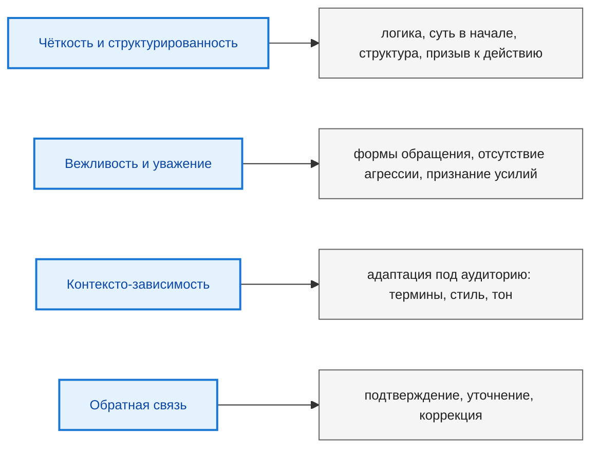

---
tags:
  - all
  - required
  - beginner
title: Цифровая коммуникация
description: "Современная профессиональная и личная жизнь неразрывно связана с постоянным обменом информацией."
related:
  - title: "Эффективный поиск в интернете"
    doc: encyclopedia/1-basics/1-21-poisk-informatsii/3
  - title: "Потребительская грамотность в цифровой среде"
    doc: encyclopedia/1-basics/1-28-marketing-i-rasprostranenie/3
  - title: "Поисковые системы"
    doc: encyclopedia/1-basics/1-21-poisk-informatsii/1
  - title: "Государство и цифровая экономика"
    doc: encyclopedia/1-basics/1-29-gosudarstvo-i-biznes/1
---

# Цифровая коммуникация

<div class="article-tags">
  <span class="tag tag-required">ОБЯЗАТЕЛЬНО</span>
  <span class="tag tag-beginner">ДЛЯ НОВИЧКОВ</span>
</div>

<span class="complexity-badge">Всем</span>

---

## Цифровая коммуникация

### Основные принципы эффективной коммуникации

Эффективная коммуникация основана на четырёх фундаментальных принципах, применимых ко всем каналам — как устным, так и письменным:

1. **Чёткость и структурированность**  
   Сообщение должно быть логически организовано, избегать двусмысленностей и избыточности. Особенно в письменной форме важно выделять суть (часто — в первом абзаце), разделять идеи на абзацы, использовать списки или заголовки при необходимости и завершать сообщение чётким указанием ожидаемого действия.

2. **Вежливость и уважение**  
   Вежливость — проявление профессиональной этики. Она выражается в использовании принятых форм обращения, избегании агрессивных конструкций (включая CAPS LOCK или пассивно-агрессивные формулировки), а также в признании времени и усилий собеседника. Фразы "спасибо", "пожалуйста", "добрый день" или "доброго дня" формируют базовую атмосферу уважения.

3. **Контексто-зависимость**  
   Коммуникация должна адаптироваться под аудиторию. Технические термины уместны в переписке между разработчиками, но не в обращении к клиенту без технического бэкграунда. Уровень формальности, сложность языка и даже эмоциональная окраска должны соответствовать роли собеседника, цели взаимодействия и корпоративной культуре.

4. **Обратная связь и подтверждение**  
   Односторонняя передача информации не гарантирует её понимания. Эффективная коммуникация включает в себя подтверждение получения сообщения, уточнение деталей при необходимости и готовность скорректировать формулировки, если возникло недопонимание.



---

### Эмоциональный тон и семантика знаков препинания

Особую роль в цифровой переписке играет *тон* — эмоциональная окраска сообщения, которую передают пунктуация, эмодзи (в умеренном количестве), скобки и структура фраз. Эти элементы компенсируют отсутствие невербальных сигналов и часто несут больше смысла, чем само содержание.

Рассмотрим примеры:

- "привет" — нейтральное, но безличное приветствие, может восприниматься как сухое или поспешное.  
- "привет)" — добавление скобки вносит элемент неформальности и дружелюбия; скобка выступает как аналог улыбки, хотя и менее выразительный, чем классический смайлик.  
- "да." — завершённое, но закрытое и отстранённое утверждение. Возможна интерпретация как неохотное согласие или завершение диалога.  
- "да))" — эмоционально тёплое, дружелюбное подтверждение, демонстрирующее готовность к продолжению взаимодействия.

Аналогично различаются формы выражения благодарности:

- "спс" — сленг, уместный только в неформальной переписке между равными; в деловой среде может быть воспринят как пренебрежение.  
- "спасибо" — нейтральная, вежливая форма.  
- "Спасибо." — с точкой — выглядит официально и сдержанно, иногда — холодно.  
- "спасибо))" — тёплая, неформальная форма, подчёркивающая позитивное отношение.  
- "спасибочки" — уменьшительно-ласкательная форма, допустимая в личном общении или внутри дружеского коллектива, но неуместная в деловой переписке с руководством или внешними партнёрами.

Эмодзи, в свою очередь, требуют особой осторожности. Реакция 👍 в ответ на просьбу или информацию может быть воспринята как минимально достаточная, без эмоционального вовлечения — "холодная" реакция. В то же время, избыток эмодзи и стикеров в рабочей переписке снижает воспринимаемую серьёзность автора и может отвлекать от сути.

Следует отметить, что некоторые формы, ранее считавшиеся универсальными (например, ":)" или "=)"), утратили актуальность в части корпоративных сред. В других командах они по-прежнему нормальны — ориентируйтесь на **договорённости команды**, а не на "единственно верный" стиль.

> Нормы тона (эмодзи, сленг, "спс") **не универсальны**: в переписке с заказчиком и руководством обычно безопаснее нейтрально-вежливый стиль; внутри долгоживущей команды допустимы более тёплые формы, если это принято явно.

---

### Каналы коммуникации

Современные профессионалы используют несколько основных каналов общения: мгновенные мессенджеры (Slack, Telegram, Microsoft Teams и др.), электронная почта, голосовые и видеозвонки, а также очные встречи. Каждый из них имеет свои особенности, которые диктуют формат и содержание сообщения.

```mermaid
%%{init: {
  "theme": "default",
  "themeVariables": {
    "fontSize": "13px",
    "fontFamily": "Segoe UI, Tahoma, sans-serif"
  }
}}%%

flowchart LR
    classDef channel fill:#e8f5e9,stroke:#2e7d32,stroke-width:2px,color:#1b5e20;
    classDef trait fill:#f5f5f5,stroke:#616161,stroke-width:1px,color:#212121;

    M["💬 Мессенджеры"]:::channel
    E["📧 Эл. почта"]:::channel

    M --> T1["Оперативность + Интерактивность"]:::trait
    M --> T2["Структурированность (избегать фрагментов)"]:::trait
    M --> T3["Эмоциональная тёплота в рамках нормы"]:::trait

    E --> T4["Завершённость (самодостаточное письмо)"]:::trait
    E --> T5["Формальность по аудитории (от "Здравствуйте" до подписи)"]:::trait
    E --> T6["Call to Action в конце"]:::trait

    class T1,T2,T3,T4,T5,T6 trait
```

**Мессенджеры** предназначены для оперативного, краткого и часто неформального обмена. Их преимущество — скорость и интерактивность. Однако именно из-за этого возникает соблазн писать фрагментами, отправляя по одному предложению в каждом сообщении. Такой подход создаёт когнитивную нагрузку у получателя: ему приходится собирать смысл из обрывков, отслеживать контекст в реальном времени и постоянно переключаться между задачами. Более эффективной практикой является формулировка мысли целиком — даже если она состоит из нескольких абзацев. Структурированное сообщение с чёткой логикой и разделением на смысловые блоки упрощает восприятие и ускоряет ответ.

В то же время в мессенджерах допустима и даже желательна определённая эмоциональная тёплота — при условии, что она соответствует культуре команды и уровню отношений. Здесь уместны лёгкие эмодзи (в умеренном количестве), скобки, разговорные обороты, но не переход в "клоунаду" — переизбыток шуток, мемов, стикеров или сленга нарушает профессиональную дистанцию и снижает авторитет.

**Электронная почта**, напротив, является инструментом для развернутой, завершённой и документированной коммуникации. Письмо должно быть самодостаточным: содержать приветствие, суть запроса или информации в первом абзаце, необходимые детали, аргументы или контекст — во втором, и чёткий призыв к действию (Call to Action) — в завершении. Идеально — уложиться в одно письмо, избегая цепочек уточнений и "дописываний". Это уважение к времени получателя и признак продуманного подхода.

Формальность письма зависит от адресата. При обращении к незнакомому человеку, руководителю или внешнему партнёру требуется соблюдение стандартов деловой переписки: полное приветствие ("Уважаемый Иван Иванович", "Добрый день"), грамматическая корректность, отсутствие сленга и уменьшительно-ласкательных форм, чёткая подпись с указанием должности и контактных данных. Фразы вроде "Приветствую!" или "Доброго времени суток!" не являются ошибкой, но считаются устаревшими или излишне многословными — они размывают фокус сообщения. Лучше использовать прямые и проверенные формулы: "Добрый день", "Здравствуйте".

---

### Временные рамки и уважение к границам

Рабочая переписка должна происходить в рамках рабочего времени. Отправка сообщений в ночное время, в выходные или праздничные дни создаёт у получателя ощущение давления, даже если отправитель не ожидает немедленного ответа. Это нарушает границы между профессиональной и личной жизнью и может привести к эмоциональному выгоранию. Многие корпоративные мессенджеры позволяют отложить отправку сообщения до начала рабочего дня — эта функция должна использоваться систематически.

Исключение составляют аварийные ситуации, но и в этом случае важно чётко обозначить уровень срочности и обосновать необходимость немедленного вмешательства.

---

### Формат и технические ограничения

**Длинные** аудио- и видеосообщения в текстовых каналах (без резюме в тексте) обычно неудобны: их сложнее искать, цитировать и обрабатывать асинхронно. Текст можно прочитать за секунды, пролистать и переслать коллеге.

**Короткие голосовые** (до ~90 секунд) с текстовым дублем сути допустимы в командах, где это согласовано — например, быстрое уточнение с интонацией. Подробные правила — в главе [Видеовстречи и голосовые звонки](/encyclopedia/1-basics/1-22-kommunikatsiya-i-obschenie/4) (раздел "Этикет звонков").

Для демонстрации бага или UI почти всегда лучше скриншот/скринкаст **плюс** одна строка: что ожидали, что получили, ссылка на задачу.

---

#### Шаблон сообщения в рабочем чате

```
Контекст: staging, задача PROJ-142
Проблема: POST /api/orders → 500, trace-id a1b2c3
Ожидание: 201 и id заказа
Прошу: посмотреть до 18:00 МСК / или указать, кто возьмёт
```

Слабый вариант той же ситуации: "привет, там опять падает, глянь когда сможешь".

---

### Этические и стилистические запреты

В деловой коммуникации недопустимы:

- **Обсценная лексика и жаргон** — даже в шутку. Они создают ассоциацию с непрофессионализмом.
- **Панибратство** — особенно при общении с руководством, клиентами или коллегами из других отделов. Фамильярность без взаимного согласия воспринимается как нарушение границ.
- **Переход на личность** — критика должна быть адресована действиям или решениям, а не человеку.
- **CAPS LOCK**, спамерские заголовки ("СРОЧНО!!!", "!!!ВАЖНО!!!"), чрезмерное использование восклицательных знаков — всё это создаёт ощущение давления или истерики. Подробнее — [глава 7: CAPSLOCK, T9 и форумные сигналы](/encyclopedia/1-basics/1-22-kommunikatsiya-i-obschenie/7).
- **Канцеляризмы без необходимости** — длинные пассивные конструкции, бюрократические формулировки ("в целях обеспечения выполнения мероприятий...") затрудняют понимание и делают текст безжизненным.

В то же время холодный, чрезмерно формальный стиль тоже не всегда эффективен. Юридические документы требуют строгости и недвусмысленности, но в повседневной переписке такой подход может вызвать отторжение. Доброжелательный, но профессиональный тон — "тёплый формальный" — создаёт баланс между уважением и открытостью.

---

### Отношения внутри коллектива

С коллегами, особенно в долгосрочных проектах, допустим более гибкий стиль общения. Он может включать лёгкую иронию, неформальные обращения, обсуждение нерабочих тем — но только при наличии взаимного согласия и соответствия корпоративной культуре. Если цель — поддерживать исключительно профессиональные отношения, достаточно придерживаться нейтрально-вежливого тона. Если же необходимо укрепить командный дух или снизить напряжение — уместно использовать более тёплые формулировки, проявлять эмпатию, благодарить за помощь, интересоваться мнением.

Важно помнить: стиль общения — это выражение личности и инструмент управления взаимодействием. Каждое сообщение формирует образ отправителя, влияет на скорость и качество ответа, а в долгосрочной перспективе — на репутацию и доверие.

---

### Культурные и лингвистические контексты

В глобализированной среде, особенно в IT-индустрии, коммуникация часто происходит между участниками из разных стран, регионов и культурных традиций. Это требует языковой компетентности и межкультурной осведомлённости. Например, в англоязычной переписке допустим более прямой стиль: "Could you please send the report by Friday?" — без излишних вежливых вводных конструкций. В то же время в русскоязычной, особенно в иерархических структурах, подобная прямолинейность может быть воспринята как грубость. Здесь уместно: "Не могли бы вы, пожалуйста, направить отчёт к пятнице?".

Аналогично различается восприятие эмодзи, времени ответа, структуры письма и даже подписи. В некоторых культурах (например, в Японии или Южной Корее) длительное вступление и выражение уважения к статусу адресата считаются обязательными, тогда как в скандинавских странах ценится максимальная лаконичность и отсутствие формальностей. Даже внутри одного языкового пространства — например, между Россией, Украиной и Казахстаном — могут различаться нормы вежливости и стилистики.

Поэтому при международной переписке рекомендуется придерживаться нейтрально-универсального стиля: избегать идиом, сленга, региональных выражений, писать короткими предложениями, использовать пассивную вежливость ("Буду признателен за...", "Если возможно..."), а также уточнять у коллег предпочтительный формат общения.

---

### Работа с конфликтами и недопониманием

Письменная коммуникация особенно уязвима к возникновению конфликтов, поскольку отсутствует возможность немедленной коррекции через интонацию или жест. Недопонимание легко перерастает в обиду, особенно если сообщение написано в состоянии стресса или спешки.

При возникновении напряжённой ситуации в переписке действует простое правило: **никогда не отвечать немедленно**. Целесообразно сделать паузу, перечитать своё сообщение с позиции получателя и при необходимости переписать его, исключив оценочные суждения и эмоциональные формулировки. Вместо "Вы снова прислали нерабочий код" — "В текущей версии возникает ошибка X; прошу уточнить логику обработки Y".

Если конфликт уже возник, лучше перейти на устный формат (звонок или встреча), где можно выразить позицию без риска многократного прочтения и неверной интерпретации. После устного обсуждения полезно зафиксировать договорённости письменно — кратко, нейтрально, без повторения эмоциональных формулировок.

---

### Грамотность как элемент профессионализма

Орфографическая и пунктуационная грамотность — инструмент ясности. Ошибки отвлекают внимание, создают впечатление небрежности и могут искажать смысл. В профессиональной среде, особенно в технических дисциплинах, где точность формулировок критична, даже небольшая ошибка (например, пропущенная запятая в условном предложении) может привести к ложному пониманию.

Более того, грамотность — это форма уважения к собеседнику. Писать "спс", "ща", "нада" или "без разницы" в рабочей переписке — значит требовать от другого человека дополнительных усилий по расшифровке смысла. Это особенно важно в многоуровневых коммуникациях: технический специалист может понять сленг, но его руководитель, юрист или заказчик — нет.

Автокоррекция и грамматические проверки (например, LanguageTool, Grammarly или встроенные средства редакторов) должны использоваться как стандартная часть рабочего процесса.

---

### Автоматизация и шаблоны

Широкое использование шаблонов, ботов и автоматических ответов (например, в поддержке или при приёме заявок) повышает эффективность, но несёт риски обезличивания. Фразы вроде "Ваш запрос принят в работу" без указания срока, ответственного лица или дальнейших шагов вызывают раздражение. Хороший автоматический ответ всегда содержит:

- чёткое подтверждение получения;
- ожидаемый временной горизонт ответа;
- контактное лицо или канал для уточнений;
- при необходимости — инструкцию по дальнейшим действиям.

То же касается и шаблонных писем. Даже при использовании заготовки важно адаптировать её под конкретного получателя: упомянуть имя, проект, предыдущее взаимодействие. Полностью безличные письма снижают вовлечённость и вероятность ответа.

---

### Мини-чеклист перед отправкой сообщения

- Понятно, что произошло и чего вы ждёте от получателя.
- Есть контекст: среда, срок, ссылка на задачу или документ.
- Тон сообщения нейтрально-вежливый и без лишнего давления.
- Текст можно прочитать за 20–40 секунд без потери смысла.
- При необходимости добавлены факты и артефакты: скриншот, лог, trace-id.

Этот короткий фильтр снижает число уточнений и помогает держать коммуникацию предсказуемой.

---

### Практические кейсы

#### Кейс 1 — эскалация инцидента

Хороший формат сообщения:

- что сломалось и где;
- влияние на пользователей;
- что уже проверено;
- кто нужен для следующего шага и к какому времени.

Так команда быстрее переходит от обсуждения к действиям.

---

#### Кейс 2 — сложный фидбек коллеге

Рабочая структура:

1. Факт и контекст.
2. Наблюдаемое влияние.
3. Конкретное предложение по исправлению.
4. Подтверждение готовности помочь.

Эта схема удерживает профессиональный тон и снижает риск эскалации конфликта.

---

{/* sidebar-collections */}

---

## В подборках

Статья входит в тематические маршруты из меню **Подборки** и блока "С чего начать?" на главной. Соседние шаги того же маршрута:

**Цифровая грамотность** — [Эффективный поиск в интернете](/encyclopedia/1-basics/1-21-poisk-informatsii/3), [Потребительская грамотность в цифровой среде](/encyclopedia/1-basics/1-28-marketing-i-rasprostranenie/3), [Поисковые системы](/encyclopedia/1-basics/1-21-poisk-informatsii/1), [Государство и цифровая экономика](/encyclopedia/1-basics/1-29-gosudarstvo-i-biznes/1), [Родительский контроль](/encyclopedia/1-basics/1-12-sovety-dlya-novichka/111), [Основы бизнеса для IT-специалиста](/encyclopedia/1-basics/1-29-gosudarstvo-i-biznes/112).

{/* /sidebar-collections */}

---
