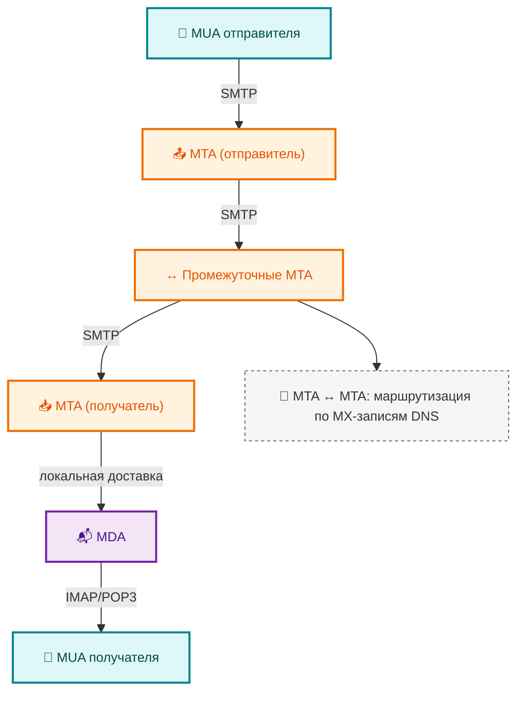
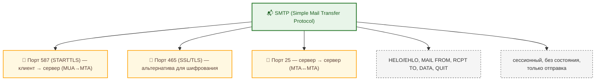
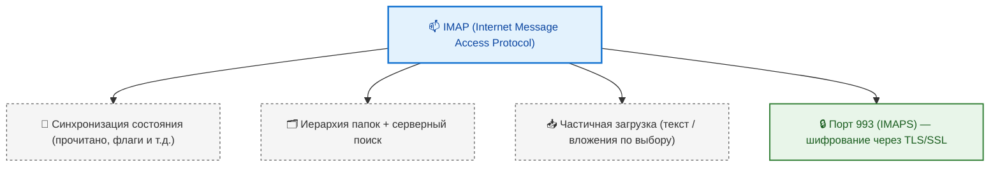
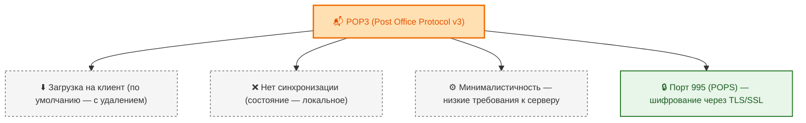
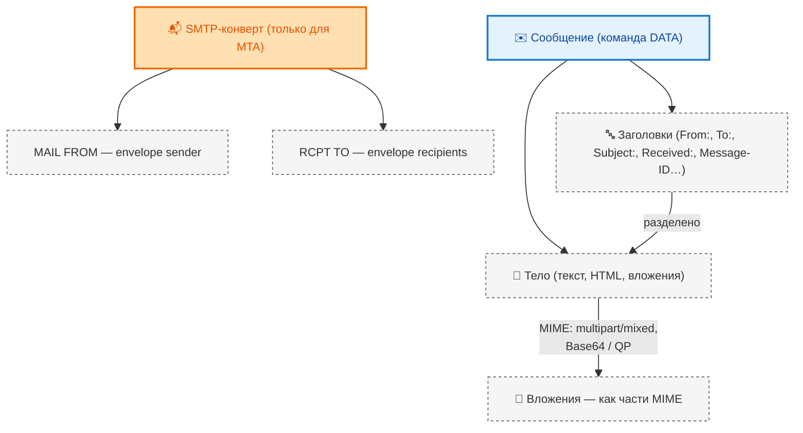
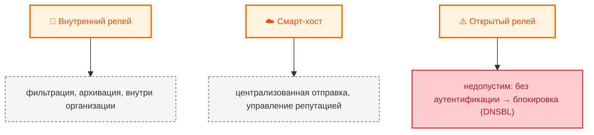
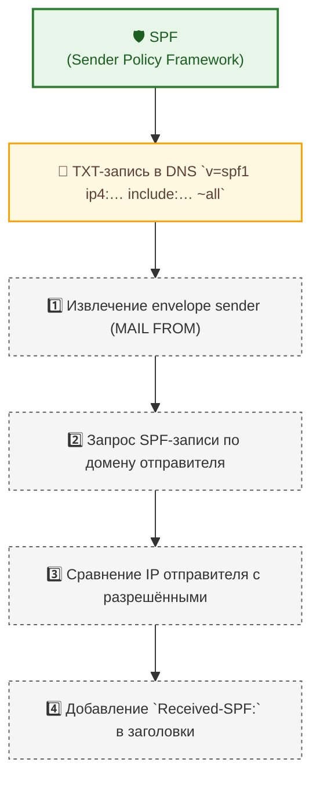
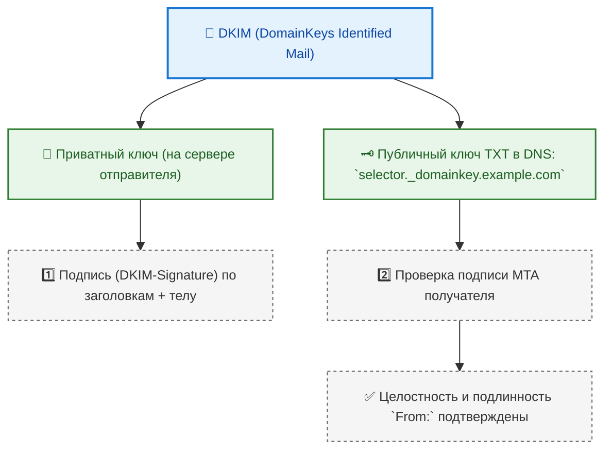
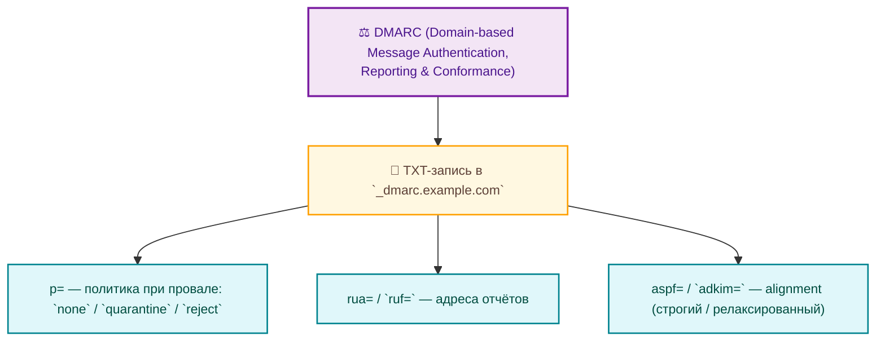
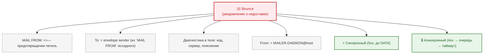

---
tags:
  - all
  - required
  - beginner
title: Электронная почта
description: "Электронная почта — это одна из старейших и наиболее устойчивых служб в составе глобальных компьютерных сетей."
related:
  - title: "Текст — о разделе"
    doc: encyclopedia/1-basics/1-15-tekst/intro
  - title: "Цифровые формы и анкеты"
    doc: encyclopedia/1-basics/1-22-kommunikatsiya-i-obschenie/6
  - title: "Документация"
    doc: encyclopedia/7-project/7-08-tehnicheskoe-pismo/1001
  - title: "Устройство и надёжность паролей"
    doc: encyclopedia/2-system-network/2-08-osnovy-informatsionnoy-bezopasnosti/114
---

import OutlookMailPlay from '@site/src/components/OutlookMailPlay.jsx';

# Электронная почта

<div class="article-tags">
  <span class="tag tag-required">ОБЯЗАТЕЛЬНО</span>
  <span class="tag tag-beginner">ДЛЯ НОВИЧКОВ</span>
</div>

<span class="complexity-badge">Всем</span>

## Электронная почта

### Что такое электронная почта?

**Электронная почта** — это одна из старейших и наиболее устойчивых служб в составе глобальных компьютерных сетей. В отличие от мгновенных мессенджеров, электронная почта изначально проектировалась как надёжный, асинхронный, стандартизированный и масштабируемый механизм обмена сообщениями между независимыми участниками, не предполагающий постоянного присутствия обеих сторон в сети одновременно. 

Эта особенность определила её доминирующую роль в профессиональной, административной, академической и юридически значимой коммуникации: письмо, отправленное по электронной почте и доставленное в соответствии с принятой практикой и техническими стандартами, по умолчанию рассматривается как официальный документ, подтверждающий факт передачи информации.

*Электронная почта* (или *e-mail*, *email*) — это **распределённая система**, включающая в себя стандарты адресации, правила маршрутизации, методы хранения и доставки, а также соглашения о формате сообщений. 

Система функционирует на принципах взаимодействия независимо управляемых доменов — каждый из которых может определять собственные политики безопасности, хранения и доступа, но при этом обязуется соблюдать базовые протоколы для обеспечения совместимости с другими участниками глобальной сети. Именно эта комбинация децентрализации и стандартизации сделала электронную почту устойчивой к технологическим и организационным изменениям на протяжении более полувека.

---

### Историческое развитие

Первые реализации обмена сообщениями между пользователями появились в рамках многопользовательских операционных систем. В 1965 году в системе CTSS (Compatible Time-Sharing System) в Массачусетском технологическом институте была реализована утилита `mail`, позволявшая пользователям одного компьютера оставлять текстовые сообщения друг другу в специальных файлах в домашних каталогах. Это была аналогия с физической «внутренней почтой»: сообщение не покидало пределов одного узла, но уже использовалась терминология — «отправитель», «получатель», «прочитано/непрочитано».

Следующим шагом стало расширение этой модели на несколько взаимосвязанных компьютеров. В сетях типа UUCP (Unix-to-Unix Copy Protocol), активно использовавшихся в 1970–1980-х, письма пересылались по заранее определённым маршрутам: адрес письма включал цепочку промежуточных узлов, например `host1!host2!user@target`, где каждый восклицательный знак обозначал этап передачи. Такая схема требовала от отправителя знания топологии сети и была неустойчива к изменениям в конфигурации.

Прорыв произошёл в 1971 году, когда Рэй Томлинсон, работавший над ARPANET — предшественницей современного Интернета, — внёс два принципиальных нововведения. Во-первых, он использовал символ `@` как разделитель между именем пользователя и именем машины, введя формат `user@host`. Во-вторых, он адаптировал существующую утилиту `mail` для работы через сеть, обеспечив передачу писем между независимыми компьютерами без участия оператора. Этот момент считается началом электронной почты в современном понимании.

Полноценная глобальная почтовая система стала возможна с появлением DNS — распределённой иерархической базы имён, которая позволила заменить прямую адресацию по IP-адресам или маршрутизируемым цепочкам на логическую структуру доменов. Вместо указания конкретного хоста, получатель стал определяться по домену — `user@example.com`. Сервер, отвечающий за приём почты этого домена, указывается отдельно с помощью записи MX (Mail eXchanger) в DNS, что обеспечило гибкость: физический сервер может меняться, IP-адрес может быть динамическим, но пользователи продолжают использовать тот же адрес.

Эта эволюция трансформировала электронную почту из локального инструмента в инфраструктурную службу, аналогичную телефонной сети: любой пользователь с корректно настроенным почтовым ящиком может связаться с любым другим, без предварительных соглашений и без знания внутренней структуры чужой системы.

---

### Базовая архитектура

Работа электронной почты строится на взаимодействии трёх основных компонентов, каждый из которых соответствует определённой роли в цепи доставки:

- **MUA (Mail User Agent)** — агент пользователя, то есть любое программное средство, с помощью которого человек создаёт, редактирует и отправляет письма, а также просматривает и удаляет полученные. К MUA относятся как классические настольные приложения (Microsoft Outlook, Mozilla Thunderbird), так и веб-интерфейсы (Gmail, Яндекс.Почта), и мобильные приложения. MUA не занимается непосредственной маршрутизацией — он передаёт исходящее письмо на сервер отправителя.

- **MTA (Mail Transfer Agent)** — агент пересылки, ответственный за транзит писем от одного сервера к другому. MTA принимает сообщения от MUA или от другого MTA, анализирует адрес получателя, определяет, кому следует передать письмо дальше, и отправляет его по протоколу SMTP. В цепи доставки может участвовать несколько MTA: отправляющий сервер, возможно, промежуточный релей (например, корпоративный шлюз фильтрации), затем сервер получателя. Известные реализации MTA: Postfix, Exim, Sendmail, Microsoft Exchange Transport Service.

- **MDA (Mail Delivery Agent)** — агент доставки, который принимает письмо от последнего MTA в цепочке и помещает его в почтовый ящик конкретного пользователя. MDA отвечает за локальную маршрутизацию внутри домена: если в `user@example.com` `example.com` — это собственный домен сервера, MDA проверит существование учётной записи `user`, определит, в какую папку поместить письмо (например, «Входящие» или «Спам»), и выполнит запись. MDA может быть интегрирован в MTA (как в случае с Dovecot, который часто работает в паре с Postfix), либо представлять собой отдельную подсистему.



Эти три компонента образуют конвейер:  
**MUA → MTA (отправителя) → [промежуточные MTA] → MTA (получателя) → MDA → MUA (получателя)**.

Границы между MTA и MDA могут быть условными, особенно в монолитных системах вроде Microsoft Exchange или Zimbra, где одно приложение совмещает функции транспорта, доставки и хранения. Однако концептуально разделение сохраняется — даже внутри Exchange транспортная подсистема (Transport Service) логически отделена от подсистемы хранения (Mailbox Database).

<OutlookMailPlay />

---

### Протоколы

Для реализации описанной выше архитектуры используются три основных протокола, каждый из которых решает свою задачу:

#### SMTP

**SMTP (Simple Mail Transfer Protocol)** — протокол *отправки*. Он работает на прикладном уровне стека TCP/IP и по умолчанию использует TCP-порт 25. Однако из-за широкого распространения спама и требований безопасности, сегодня стандартной практикой является использование **портов 587 (с STARTTLS)** или **465 (с SSL/TLS)** для клиент-серверного взаимодействия, когда MUA отправляет письмо на MTA. Порт 25, как правило, зарезервирован для сервер-серверной пересылки между MTA.



SMTP — это протокол сессионного типа: клиент устанавливает соединение, проходит аутентификацию (если требуется), передаёт метаданные письма (адрес отправителя, список получателей), затем само тело сообщения и завершает сессию. Ключевые команды SMTP — `HELO`/`EHLO`, `MAIL FROM`, `RCPT TO`, `DATA` (передача тела письма), `QUIT`. SMTP не предусматривает возможности получения писем, не поддерживает работу с папками и не хранит состояние — каждая сессия независима.

Пример упрощённой сессии (текстовый протокол, ответы сервера сокращены):

```
C: EHLO client.example.com
S: 250-client.example.com
C: MAIL FROM:<bounce@example.com>
S: 250 OK
C: RCPT TO:<user@recipient.com>
S: 250 OK
C: DATA
S: 354 End data with <CR><LF>.<CR><LF>
C: From: sender@example.com
C: To: user@recipient.com
C: Subject: Test
C:
C: Hello.
C: .
S: 250 OK: queued
C: QUIT
```

Адреса в `MAIL FROM` / `RCPT TO` — это *SMTP-конверт*; строки `From:` / `To:` внутри `DATA` — заголовки для пользователя. Они могут не совпадать (рассылки, CRM, пересылки).

#### IMAP

**IMAP (Internet Message Access Protocol)** — протокол *доступа к почте на сервере*. Он предназначен для сценариев, где письма хранятся централизованно, а клиенты (MUA) лишь отображают их содержимое и выполняют управляющие действия. IMAP сохраняет полную синхронизацию: если пользователь прочитал письмо на смартфоне, оно будет отмечено как прочитанное и в веб-интерфейсе, и в настольном клиенте. IMAP поддерживает иерархическую структуру папок, флаги («прочитано», «важно», «ответить»), поиск на стороне сервера, выборочную загрузку частей сообщения (например, только текста, без вложений). Это позволяет эффективно работать даже при медленном соединении. Шифрование достигается через порт 993 (IMAPS).



#### POP3

**POP3 (Post Office Protocol, версия 3)** — более старый протокол *загрузки почты на клиент*. В классическом режиме POP3 предполагает скачивание всех новых писем на локальное устройство с последующим удалением с сервера (хотя существует опция «оставить копию на сервере»). POP3 не поддерживает синхронизацию состояния между устройствами: прочтённое на одном устройстве письмо останется непрочитанным на другом. Он прост, минималистичен и требует меньше ресурсов от сервера — но в условиях многоплатформенной работы пользователей этот подход утратил актуальность. POP3 по-прежнему применяется в узкоспециализированных системах, встраиваемых устройствах или при необходимости полной локализации данных. Шифрование — через порт 995 (POPS).



Выбор между IMAP и POP3 — это **архитектурный** вопрос. IMAP отражает модель *почтового терминала*, где сервер выступает в роли интерактивного хранилища; POP3 — модель *почтового ящика*, где сервер лишь временно удерживает корреспонденцию до её забора. Современные веб-почтовые сервисы (Gmail, Outlook.com) используют внутреннюю реализацию, близкую к IMAP, даже если клиент использует веб-интерфейс: все действия пользователя логируются, синхронизируются и сохраняются на сервере.

---

### Структура электронного письма

Электронное письмо состоит из двух логически разделённых частей: **SMTP-конверта** и **самого сообщения**.

**SMTP-конверт** — это служебные параметры, используемые *только* на этапе передачи письма по цепочке MTA. Они не являются частью тела письма и, как правило, недоступны конечному пользователю в обычном режиме просмотра. В конверт входят:

- `MAIL FROM` — адрес отправителя, используемый для уведомлений о недоставке (так называемый *envelope sender*). Именно этот адрес проверяется при валидации SPF, и именно на него приходит уведомление в случае ошибки. Он может не совпадать с полем `From:` в заголовке письма — например, при рассылке через почтовый сервис или в CRM-системах.
- `RCPT TO` — один или несколько адресов получателей (*envelope recipients*). Именно этот список определяет, куда MTA будет доставлять письмо. Поля `To:`, `Cc:` и `Bcc:` в теле письма формируются уже MUA и *копируются* в `RCPT TO`, но серверы не обязаны сверять их соответствие.



После установки параметров конверта MTA передаёт **тело сообщения**, начинающееся с команды `DATA`. Это тело состоит из:

1. **Заголовков (headers)** — строк в формате `Имя: Значение`, завершающихся двоеточием и разделённых переводом строки. Заголовки содержат как информацию для пользователя (например, `From:`, `To:`, `Subject:`), так и служебные метаданные, добавляемые каждым MTA на пути (заголовок `Received:`). Заголовки строго регламентированы RFC: `Message-ID` обеспечивает уникальную идентификацию, `In-Reply-To` и `References` связывают письма в цепочки, `Date:` фиксирует момент отправки, `Content-Type:` определяет MIME-тип тела.

2. **Тела сообщения (body)** — собственно содержимое: текст, HTML, вложения. Тело отделяется от заголовков **одной пустой строкой**. Для передачи не-ASCII символов и бинарных данных используется кодирование MIME (Base64 или Quoted-Printable), которое преобразует произвольные данные в 7-битный ASCII-совместимый формат. Вложения представляются как отдельные части (parts) многочастного сообщения с типом `multipart/mixed` или `multipart/alternative`.

Данный формат позволяет сохранять полную обратную совместимость: даже если MUA не поддерживает HTML или вложения, он сможет отобразить текстовую часть письма, игнорируя остальное.

---

## DNS, маршрутизация, аутентификация отправителя и обработка ошибок

Работа электронной почты невозможна без инфраструктуры доменных имён — DNS. Именно DNS обеспечивает декомпозицию глобального пространства адресов на управляемые домены и позволяет независимым операторам взаимодействовать без предварительного согласования маршрутов. Ключевую роль в этом играют общие записи типа `A` и `AAAA`, и специализированные ресурсные записи, предназначенные исключительно для почты.

### MX-записи

Когда MTA получает письмо, адресованное, например, `user@example.com`, он не пытается установить соединение напрямую с хостом `example.com`. Вместо этого он выполняет DNS-запрос типа **MX (Mail eXchanger)** для домена `example.com`. Ответ содержит одну или несколько записей, каждая из которых состоит из:

- **приоритета** (целое число, чем меньше — тем выше приоритет);
- **доменного имени** почтового сервера (например, `mx1.example.com`).

Приоритет определяет порядок попыток доставки: MTA сначала обращается к серверу с наименьшим значением приоритета. Если соединение не удаётся (например, сервер недоступен или отклоняет соединение), MTA переходит к следующему по приоритету MX-записи. Это обеспечивает отказоустойчивость: организация может развернуть несколько географически распределённых серверов и определить чёткий порядок резервирования.

MX-записи *должны* содержать доменные имена, а не IP-адреса. После получения имени сервера MTA дополнительно выполняет запрос типа `A` (для IPv4) или `AAAA` (для IPv6), чтобы определить его IP-адрес. Такая двухуровневая адресация позволяет оператору менять физические серверы без изменения MX-записей — достаточно обновить `A`-запись соответствующего хоста.

Если MX-записи для домена отсутствуют, стандарт (RFC 5321) предписывает MTA выполнить *резервный* запрос типа `A` для самого домена (в нашем примере — для `example.com`) и использовать полученный IP-адрес как адрес почтового сервера. Однако такая практика считается устаревшей и не рекомендуется: отсутствие MX-записи часто воспринимается антиспам-системами как признак непрофессиональной или неполной настройки домена, что может привести к повышению спам-рейтинга писем.

---

### Релеи и smart host

В реальных сетях доставка письма редко происходит напрямую от MTA отправителя к MTA получателя. Между ними могут находиться промежуточные серверы — **релеи** (relays). Релей — это MTA, который принимает письмо для передачи его дальше по цепочке.



Различают несколько типов релеев:

- **Внутренние релеи** — серверы в пределах одной организации, используемые, например, для централизованной фильтрации спама, антивирусной проверки или архивации. Пользовательские MUA направляют письма на внутренний релей, а тот уже взаимодействует с внешним миром.

- **Смарт-хост (smart host)** — внешний релей, на который делегируется вся исходящая почта. Это типично для провайдеров или корпоративных сетей с ограничениями на исходящий трафик на порт 25: все MTA внутри сети передают почту одному смарт-хосту, который уже доставляет её получателям. Такая схема упрощает управление, улучшает репутацию (все письма исходят с одного IP), и позволяет централизовать политики безопасности.

- **Открытые релеи** — серверы, принимающие и пересылающие почту от *любого* отправителя *к любому* получателю без аутентификации. Исторически такие серверы существовали, но в условиях массового спама их наличие стало критической уязвимостью: злоумышленники использовали открытые релеи для анонимной рассылки. Сегодня большинство серверов настроены на строгую проверку: разрешена пересылка только для авторизованных пользователей (по IP или по учётным данным). Наличие открытого релея почти мгновенно приводит к внесению IP-адреса сервера в публичные чёрные списки (DNSBL), что блокирует всю исходящую почту.

---

### Аутентификация отправителя

Одна из фундаментальных уязвимостей ранней электронной почты — отсутствие встроенной проверки подлинности отправителя. Поле `From:` в заголовке письма формируется MUA и может содержать любой адрес, даже не принадлежащий отправителю. Это позволило широкое распространение фишинга, подделки уведомлений и рассылок от имени доверенных доменов.

Для устранения этой проблемы были разработаны три взаимодополняющих стандарта, работающих на уровне DNS и заголовков писем:

#### SPF (Sender Policy Framework)

SPF позволяет владельцу домена опубликовать список IP-адресов и доменных имён, с которых *разрешено* отправлять почту от имени этого домена. Соответствующая политика публикуется в DNS как **TXT-запись** для домена (например, `example.com`), содержащая директивы вроде:

```
v=spf1 ip4:192.0.2.0/24 include:_spf.google.com ~all
```

Это означает: разрешена отправка с IPv4-подсети `192.0.2.0/24`, а также с серверов, перечисленных в SPF-записи `_spf.google.com` (например, если используется Gmail как исходящий сервер); письма с других источников следует рассматривать как *подозрительные* (`~all` — soft fail), но не отклонять.

Когда MTA получателя принимает письмо, он:

1. извлекает домен из *envelope sender* (`MAIL FROM`);
2. запрашивает SPF-запись этого домена;
3. сравнивает IP-адрес отправившего MTA с перечисленными в политике;
4. добавляет в заголовки письма результат проверки (`Received-SPF:`).



SPF защищает именно *envelope sender*, а не заголовочный `From:`, что важно при использовании пересылок или рассылок через сторонние сервисы.

#### DKIM (DomainKeys Identified Mail)

DKIM решает другую задачу — подтверждение *целостности содержимого* и подлинности домена в поле `From:`. Он работает на основе асимметричной криптографии.

Процесс:

1. На сервере отправителя генерируется пара ключей: *приватный* (хранится в секрете) и *публичный* (публикуется в DNS как TXT-запись в поддомене, например, `selector._domainkey.example.com`).
2. При отправке письмо дополняется цифровой подписью (`DKIM-Signature`), вычисляемой от выбранных заголовков и части тела с использованием приватного ключа.
3. Получатель, получив письмо, извлекает `selector` и домен из заголовка `DKIM-Signature`, запрашивает публичный ключ из DNS и проверяет подпись.



Если проверка успешна, это гарантирует:  
— письмо действительно отправлено с сервера, имеющего доступ к приватному ключу домена;  
— содержимое письма не было изменено в пути.

DKIM работает на уровне *заголовочного* `From:`, что делает его особенно полезным для защиты от подмены в фишинге.

#### DMARC (Domain-based Message Authentication, Reporting & Conformance)

DMARC *организует взаимодействие* SPF и DKIM. Он позволяет владельцу домена:

- задать, какие политики применять, если письмо *не прошло* SPF и/или DKIM (`none` — ничего не делать, `quarantine` — поместить в спам, `reject` — отклонить);
- указать адреса, на которые получатели должны направлять агрегированные отчёты о проверках (что помогает выявлять утечки, неправильные настройки и попытки подделки);
- определить, как соотносить домен в `From:` с доменами, проверяемыми SPF и DKIM (опция *alignment* — строгая или релаксированная).



Политика DMARC также публикуется как TXT-запись в специальном поддомене: `_dmarc.example.com`.

Наличие корректно настроенных SPF, DKIM и DMARC — сегодня обязательное условие для обеспечения доставки в основные почтовые сервисы. Отсутствие этих записей почти гарантирует попадание писем в спам или полный отказ в приёме.

---

### Обработка ошибок

SMTP — протокол с *гарантированной доставкой на уровень сервера*, но не до конечного пользователя. Если MTA не может доставить письмо (например, получатель не существует, почтовый ящик переполнен, или сервер получателя временно недоступен), он обязан сформировать уведомление — **bounce-сообщение** (или *сообщение о недоставке*).

Стандарт (RFC 5321) предписывает, чтобы bounce-сообщение:

- имело пустой `MAIL FROM:` (`<>`), чтобы избежать бесконечных циклов (если bounce сам не может быть доставлен — он просто отбрасывается);
- в поле `To:` указывал адрес из `MAIL FROM` исходного письма;
- содержало в теле диагностику: код ошибки, имя сервера, текст пояснения;
- в заголовке `From:` использовало адрес вида `MAILER-DAEMON@hostname`.

Существуют два типа bounce:

- **Синхронный (immediate)** — генерируется немедленно, если ошибка обнаружена на этапе приёма (например, несуществующий пользователь). Сервер получателя отвечает кодом `5xx` (постоянная ошибка) ещё до завершения передачи тела (`DATA`).
- **Асинхронный (delayed)** — генерируется, если ошибка возникает позже: сервер временно недоступен (`4xx` — временная ошибка), и MTA отправителя помещает письмо в очередь повторной отправки. Стандарт предписывает экспоненциальную задержку между попытками (например: 15 мин, 30 мин, 1 час, 2 часа…), с максимальным сроком удержания в очереди до 4–5 суток. По истечении этого срока формируется отложенное bounce.



Важно: bounce приходит *на envelope sender*, а не на адрес из заголовка `From:`. Поэтому при автоматических рассылках (например, из CRM) критически важно использовать корректный `MAIL FROM` (часто — специальный адрес вроде `noreply+bounce@example.com`), чтобы ошибки доставки можно было автоматически обрабатывать.

---

### Виртуальные домены и алиасы

Современные почтовые системы редко привязывают учётные записи к реальным пользователям операционной системы. Вместо этого используется **виртуальная адресация**:

- **Виртуальный домен** — домен, обслуживаемый сервером, но не соответствующий его собственному имени хоста. Один сервер может обслуживать десятки или сотни доменов, каждый со своей MX-записью, указывающей на этот сервер.
- **Виртуальный пользователь** — почтовый ящик, не имеющий одноимённой учётной записи в системе. Сопоставление `user@domain` с физическим расположением писем осуществляется через внутренние базы (SQL, LDAP) или конфигурационные файлы.
- **Алиасы и пересылки** — механизм маршрутизации входящей почты без создания физического ящика. Например, адрес `support@example.com` может быть настроен на пересылку на `user1@example.com, user2@example.com`, а `ceo@example.com` — на пересылку на внешний адрес `ceo@gmail.com`. Алиасы могут включать маски (`*@example.com` → `catch-all@example.com`) и сложные правила (в зависимости от темы, отправителя или содержимого).

Такая гибкость позволяет создавать сложные схемы: рассылки, отделы, ролевые адреса («бухгалтерия», «приёмная»), временные адреса для маркетинговых кампаний — без изменения базовой инфраструктуры.

---

## Безопасность, корпоративные системы, рассылки и эволюция почтовых технологий

### Транспортная безопасность

Протокол SMTP изначально разрабатывался как текстовый и незашифрованный. Перехват трафика позволял легко прочитать содержимое писем, а также данные аутентификации (логин/пароль). Для устранения этой уязвимости была введена поддержка шифрования на уровне транспортного соединения — через **TLS (Transport Layer Security)**.

Существуют два основных режима:

- **SMTPS (SMTP Secure)** — неофициальное название для SMTP поверх SSL/TLS на выделенном порту **465**. Соединение устанавливается в зашифрованном виде с самого начала. Этот режим исторически использовался в Gmail и до сих пор поддерживается большинством клиентов.

- **STARTTLS** — официальный стандарт (RFC 3207), при котором соединение начинается в открытом виде на порту **587** (или 25), но после команды `EHLO` сервер объявляет поддержку `STARTTLS`, клиент инициирует обмен ключами, и *всё последующее взаимодействие* (включая аутентификацию и передачу письма) шифруется. Это позволяет одному порту обслуживать как старые, так и современные клиенты.

Важно: **TLS защищает только соединение между двумя MTA**, а не весь путь письма. Если цепь доставки включает три сервера (отправитель → релей → получатель), письмо будет зашифровано на участке 1→2 и 2→3, но сервер-релей получает его в открытом виде. Это называется * Opportunistic Encryption* — шифрование настолько надёжно, насколько надёжны промежу­точные узлы. TLS не защищает от компрометации самого почтового сервера, но эффективно блокирует пассивный перехват в публичных сетях (Wi-Fi, провайдерские каналы).

Аналогичные механизмы применяются и для протоколов получения:  
— IMAPS (порт 993) и POP3S (порт 995) — шифрование с первого байта;  
— IMAP/POP3 + STARTTLS (порты 143/110) — опциональное шифрование после инициации.

Современные почтовые сервисы (Gmail, Outlook.com, Яндекс) требуют TLS для всех клиентских подключений и отклоняют незашифрованные соединения.

---

### Защита содержимого — S/MIME и OpenPGP

Для обеспечения **сквозной конфиденциальности и целостности** — когда письмо зашифровано на стороне отправителя и расшифровывается только получателем — используются стандарты, работающие на уровне *содержимого*.

#### S/MIME (Secure/Multipurpose Internet Mail Extensions)

S/MIME основан на инфраструктуре открытых ключей (PKI). Отправитель и получатель обмениваются **сертификатами X.509**, выданными удостоверяющими центрами (УЦ). Сертификат содержит открытый ключ и подпись УЦ, подтверждающую его подлинность.

При отправке письма:

1. Генерируется случайный симметричный ключ (например, AES-256);
2. Тело письма шифруется этим ключом;
3. Симметричный ключ шифруется *открытым ключом получателя*;
4. Зашифрованный ключ и зашифрованное тело объединяются в MIME-контейнер с типом `application/pkcs7-mime`.

Если письмо адресовано нескольким получателям, симметричный ключ шифруется отдельно каждым из их открытых ключей. Отправитель также может зашифровать копию ключа своим собственным открытым ключом — чтобы иметь возможность прочитать своё же письмо из папки «Отправленные».

S/MIME также поддерживает **цифровую подпись**: хеш тела письма шифруется приватным ключом отправителя, что гарантирует неотказуемость и целостность. Почтовые клиенты (Outlook, Apple Mail, Thunderbird) имеют встроенный интерфейс для управления сертификатами и подписей.

Ограничения S/MIME: зависимость от централизованных УЦ, сложность управления жизненным циклом сертификатов (срок действия, отзыв), отсутствие поддержки в большинстве веб-интерфейсов.

#### OpenPGP (RFC 4880) и GnuPG

OpenPGP — децентрализованная альтернатива, использующая модель *web of trust* («паутина доверия»). Вместо УЦ пользователи самостоятельно подписывают открытые ключи друг друга, подтверждая их подлинность. Самая известная реализация — **GnuPG (GPG)**.

Формат сообщения и принцип шифрования аналогичны S/MIME: симметричное шифрование тела + асимметричное шифрование ключа. Различия — в формате ключей (ASCII-armored блоки вида `-----BEGIN PGP MESSAGE-----`), в способе распространения ключей (ключи хранятся в публичных ключевых серверах) и в отсутствии обязательной иерархии.

OpenPGP широко используется в Linux-сообществе, в журналистской практике и в системах с высокими требованиями к децентрализации. Интеграция с почтовыми клиентами осуществляется через плагины (Enigmail для Thunderbird). Однако массовому внедрению мешают: отсутствие встроенной поддержки в корпоративных клиентах, сложность для конечного пользователя, несовместимость с мобильными устройствами без специальных приложений.

Оба стандарта требуют, чтобы участники заранее обменялись открытыми ключами. Без этого шифрование невозможно — система не предусматривает «первого безопасного контакта» (в отличие от Signal или WhatsApp). Поэтому сквозное шифрование остаётся инструментом для узких сценариев: юридическая переписка, журналистские расследования, передача высокочувствительных данных.

---

### Корпоративные почтовые системы

Хотя принципы электронной почты универсальны, в корпоративной среде доминируют интегрированные решения, объединяющие почту, календарь, контакты, задачи и совместную работу. Наиболее распространённым из них является **Microsoft Exchange Server** — платформа, сочетающая почтовый транспорт (MTA), систему хранения (MDA), клиентские протоколы и API.

#### Архитектура Exchange

Современный Exchange (начиная с версии 2013) построен по принципу *разделения ролей*:

- **Mailbox Server** — хранит почтовые ящики (в базах данных Exchange Database — EDB), обрабатывает IMAP/POP3, управляет календарями и контактами;
- **Client Access Server (CAS)** — в более новых версиях роль упразднена, её функции интегрированы в Mailbox Server; ранее обеспечивал проксирование запросов от клиентов (Outlook, мобильные устройства);
- **Transport Service** — реализует MTA-функции (SMTP), включая маршрутизацию, правила транспорта, антивирусную/антиспам-фильтрацию (через интеграцию с Microsoft Defender for Office 365).

Все серверы в организации объединены в **DAG (Database Availability Group)** — механизм зеркалирования баз данных в реальном времени с автоматическим переключением при отказе.

#### Протоколы доступа

Exchange поддерживает стандартные IMAP/POP3/SMTP, но его ключевое преимущество — собственные протоколы:

- **MAPI/RPC** — исторический протокол для настольного Outlook (устаревает);
- **MAPI over HTTP** — современный протокол для Outlook, обеспечивающий устойчивость к переподключениям и лучшую диагностику;
- **ActiveSync** — протокол для мобильных устройств (iOS, Android), обеспечивающий двустороннюю синхронизацию почты, календаря, контактов, задач и политик безопасности (удалённое стирание, требования к паролю);
- **EWS (Exchange Web Services)** — REST-like SOAP API поверх HTTPS, позволяющий сторонним приложениям (CRM, ERP, BI-системы) читать и изменять почту, создавать встречи, получать уведомления. Например, при создании сделки в 1С может автоматически генерироваться задача в календаре менеджера через EWS.

#### Облачный переход

С ростом облачных решений локальные развёртывания Exchange уступают место **Exchange Online** — компоненту Microsoft 365. Это полностью управляемый сервис, где Microsoft берёт на себя обновления, масштабирование, резервирование и соответствие требованиям (GDPR, HIPAA и др.). Для организаций это означает отказ от эксплуатации серверов, но и от прямого контроля над конфигурацией.

---

### Почтовые рассылки и группы переписки

Электронная почта поддерживает персональную и массовую коммуникацию. Две ключевые модели:

#### Рассылки (mailing lists)

Адрес рассылки (например, `newsletter@company.com`) технически является *алиасом*, сопоставленным с базой подписчиков. При поступлении письма система:

1. проверяет, разрешено ли отправителю писать в рассылку (например, только модераторы);
2. при необходимости — утверждает письмо вручную;
3. генерирует отдельное письмо для каждого подписчика (с `To:` → `subscriber@domain` и `From:` → `newsletter@company.com`);
4. добавляет служебные заголовки (`List-Id:`, `List-Unsubscribe:`);
5. включает ссылку на отписку (требование закона, например, CAN-SPAM Act).

Системы управления рассылками (GNU Mailman, Sympa, Listmonk) автоматизируют подписку/отписку, архивацию, обработку bounce, модерацию и статистику доставки.

#### Группы переписки (discussion lists)

Это разновидность рассылки, где *любой подписчик* может отправить письмо на адрес группы, и оно будет доставлено *всем остальным*. Такие группы используются для технических сообществ, стандартов (например, рабочие группы IETF), open-source проектов. В отличие от традиционных форумов, они сохраняют асинхронность и работают через привычный почтовый интерфейс. Цепочки обсуждений (`In-Reply-To`, `References`) позволяют клиентам строить древовидные ветки — что эффективнее линейной ленты при параллельных дискуссиях.

---

### Борьба со спамом

Спам — системная угроза, подрывающая доверие к почтовой системе. Защита строится на нескольких слоях:

#### Репутационные фильтры

Серверы проверяют IP-адрес отправителя по публичным **DNSBL (DNS-based Blackhole Lists)** — например, Spamhaus, SORBS, Barracuda. Если IP находится в чёрном списке, письмо отклоняется или помещается в карантин. Обратные списки (**DNSWL**) повышают доверие к известным почтовым сервисам (Google, Microsoft).

#### Контент-анализ

Почтовые шлюзы (SpamAssassin, rspamd, встроенные движки Gmail/Outlook) оценивают письмо по сотням признаков:

- подозрительные ключевые слова («бесплатно», «срочно», «выигрыш»);
- спрятанный текст (цвет шрифта = цвет фона);
- подозрительные URL (сокращённые, ведущие в фишинговые домены);
- несоответствие между `From:` и `Reply-To:`;
- отсутствие или некорректность SPF/DKIM/DMARC;
- вложения с макросами (`.docm`, `.xlsm`) или скриптами.

Каждый признак получает вес; суммарный балл сравнивается с порогом — письмо либо пропускается, либо метится как спам, либо блокируется.

#### Greylisting

Техника временного отказа: при первом обращении от неизвестного MTA сервер отвечает кодом `451` («повторите позже»). Легитимные MTA (согласно RFC) повторят отправку через некоторое время (обычно 15–30 мин), а спам-боты — нет. Greylisting эффективно блокирует до 90% спама при минимальной нагрузке, но вносит задержку в доставку новых отправителей.

#### Обратная связь и машинное обучение

Крупные провайдеры (Gmail, Outlook) собирают данные о действиях пользователей: если письмо от `sender@domain` регулярно помечается как спам — репутация этого домена снижается автоматически. Это замкнутый цикл: чем чаще письма попадают в спам, тем выше вероятность, что следующие будут туда же.

---

## Подключение почтового ящика в Microsoft Outlook (ручная настройка)

### Подготовка данных

Перед запуском Outlook необходимо собрать точные параметры подключения. Их предоставляет почтовый провайдер или системный администратор. Потребуются:

- **Адрес электронной почты** (например, `user@example.com`);
- **Пароль** для входа в веб-интерфейс;
- **Тип входа** — стандартный пароль или **пароль приложения**.  
  Если к учётной записи включена двухфакторная аутентификация (2FA) — как в Gmail, Outlook.com, Яндексе — стандартный пароль *не подойдёт*. Требуется создать специальный **пароль приложения** в настройках безопасности аккаунта. Он генерируется один раз, состоит из 16 цифр (Gmail) или произвольной строки (Яндекс), и действует только для клиентов, не поддерживающих OAuth2.  
  *Контрольная точка*: вы получили именно *пароль приложения*, а не основной пароль. Сохраните его — он не отображается повторно.

- **Серверные параметры**:
  - **SMTP-сервер** (исходящая почта): доменное имя (например, `smtp.gmail.com`, `smtp.yandex.ru`, `mail.example.com`);
  - **IMAP- или POP3-сервер** (входящая почта): например, `imap.gmail.com` (IMAP) или `pop.yandex.ru` (POP3);
  - **Порты и тип шифрования**:
    - Для IMAP: порт **993** с **SSL/TLS** (рекомендуется) или порт **143** с **STARTTLS**;
    - Для POP3: порт **995** с **SSL/TLS** или порт **110** с **STARTTLS**;
    - Для SMTP: порт **465** с **SSL/TLS** или порт **587** с **STARTTLS**.  
      *Важно*: порт **25** почти везде блокируется провайдерами и не поддерживается Outlook по умолчанию.
  - **Требуется ли аутентификация для SMTP** — почти всегда **да**, с теми же учётными данными, что и для IMAP/POP3.

*Контрольная точка*: вы сверили параметры с официальной документацией провайдера (например, [Gmail SMTP settings](https://support.google.com/mail/answer/7126229), [Яндекс — настройка почтовых программ](https://yandex.ru/support/mail/mail-clients.html)).

---

### Запуск мастера настройки в Outlook

1. Откройте Outlook. Если это первый запуск — появится окно «Добро пожаловать»; если почтовые аккаунты уже есть — перейдите:  
   **Файл → Добавить учётную запись**.

2. В поле «Адрес электронной почты» введите полный email (например, `user@example.com`).  
   *Не нажимайте «Подключиться»* — это запустит автоматическое обнаружение, которое часто завершается ошибкой при нестандартных настройках.

3. Снимите флажок **«Автоматически настраивать параметры»** (в Outlook 2016–2021) или нажмите **«Подключиться вручную»** → **«Далее»** (в Microsoft 365).

4. Выберите тип учётной записи:  
   — **IMAP** — если требуется синхронизация между устройствами (рекомендуется);  
   — **POP3** — если почта должна храниться только локально.  
   Нажмите **«Далее»**.

---

### Ввод параметров сервера

Появится форма с полями:

- **Имя пользователя** — *полный email-адрес* (`user@example.com`), а не только логин. Некоторые серверы (особенно корпоративные) требуют именно такую форму.
- **Пароль** — введите пароль приложения (если используется) или основной пароль (если 2FA отключена).
- **Сервер входящей почты (IMAP или POP3)** — введите точное доменное имя (например, `imap.example.com`). Не используйте `localhost`, IP-адреса или имена вроде `mail`.
- **Сервер исходящей почты (SMTP)** — введите точное доменное имя (например, `smtp.example.com`). Даже если IMAP и SMTP физически работают на одном сервере — укажите корректные имена.

Нажмите **«Дополнительные параметры…»** (или **«Другие параметры…»**).

---

### Настройка портов и шифрования

В открывшемся окне перейдите на вкладку **«Исходящий сервер»**:

- Установите флажок **«Требуется аутентификация»**;
- Выберите **«Использовать те же настройки, что и для входящего сервера»** (если ваш сервер поддерживает это — большинство современных так и делают).

Перейдите на вкладку **«Дополнительно»**:

- **Тип сервера входящей почты**: убедитесь, что выбрано IMAP или POP3 (в зависимости от шага 2).
- **Порт входящей почты**: укажите 993 (IMAP + SSL) или 995 (POP3 + SSL).  
  Если используется STARTTLS — 143 (IMAP) или 110 (POP3), но тогда в поле **«Тип шифрования соединения»** выберите **STARTTLS**, а не SSL.
- **Порт исходящей почты**: 465 (SSL) или 587 (STARTTLS).  
  *Критическая ошибка*: указание порта 465 с типом «STARTTLS» или порта 587 с «SSL» — соединение не установится.
- **Тип шифрования для исходящего сервера**: должен соответствовать выбранному порту (SSL для 465, STARTTLS для 587).
- **Оставить копию сообщений на сервере** (только для POP3): если нужно, чтобы письма оставались на сервере после скачивания — установите этот флажок. Для IMAP он недоступен (почта всегда на сервере).

Нажмите **«ОК»**, затем **«Далее»**.

---

### Тестирование и устранение ошибок

Outlook попытается установить соединение с обоими серверами.

- Если оба теста успешны — появится сообщение «Учётная запись настроена». Нажмите **«Готово»**.
- Если возникает ошибка — основные причины:
  - **0x800CCC0E / 0x800CCC0F** — ошибка аутентификации: проверьте email, пароль, тип входа (пароль приложения?), включена ли IMAP/POP3 в настройках провайдера (в Gmail и Яндексе эти протоколы *отключены по умолчанию* — нужно включить вручную).
  - **0x800CCC0B** — ошибка SSL/TLS: проверьте соответствие порта и типа шифрования; убедитесь, что системное время корректно (некорректное время ломает TLS-рукопожатие).
  - **0x800CCC19** — таймаут соединения: сервер недоступен, порт заблокирован брандмауэром или провайдером (особенно порт 25).
  - **Ошибка сертификата** — если используется самоподписанный сертификат (в корпоративных средах), Outlook запросит подтверждение. Можно принять сертификат, но для безопасности лучше использовать Let’s Encrypt или коммерческий сертификат.

*Контрольная точка*: входящие письма отображаются в папке «Входящие», исходящие — в «Отправленные». Попробуйте отправить тестовое письмо самому себе.

{/* sidebar-collections */}
## В подборках

Статья входит в тематические маршруты из меню **Подборки** и блока «С чего начать?» на главной. Соседние шаги того же маршрута:

**Офисная грамотность** — [Текст — о разделе](/encyclopedia/1-basics/1-15-tekst/intro), [Цифровые формы и анкеты](/encyclopedia/1-basics/1-22-kommunikatsiya-i-obschenie/6), [Документация](/encyclopedia/7-project/7-08-tehnicheskoe-pismo/1001), [Устройство и надёжность паролей](/encyclopedia/2-system-network/2-08-osnovy-informatsionnoy-bezopasnosti/114), [Офисные пакеты](/encyclopedia/1-basics/1-11-soft-ryadovogo-polzovatelya/51), [Архитектура десктопных приложений](/encyclopedia/4-code-dev/4-11-desktopnye-prilozheniya/1).

{/* /sidebar-collections */}

---
