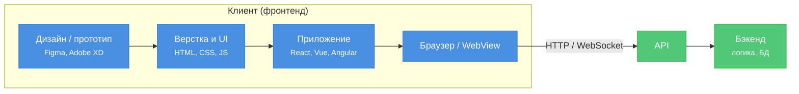

---
tags:
  - analytic
  - developer
  - architector
  - required
  - beginner
title: Фронтенд
description: >-
  Клиентская часть приложения: HTML, CSS, JavaScript, фреймворки, работа с API.
  Node.js используется как среда сборки (Vite, Webpack), но не является частью
  клиентской логики в браузере.
---

import WebAppArchitecturePlay from '@site/src/components/WebAppArchitecturePlay.jsx';

# Фронтенд

<div class="article-tags">
  <span class="tag tag-required">ОБЯЗАТЕЛЬНО</span>
  <span class="tag tag-beginner">ДЛЯ НОВИЧКОВ</span>
</div>

<span class="complexity-badge">Разработчику</span>
<span class="complexity-badge">Аналитику</span>
<span class="complexity-badge">Архитектору</span>

---

## Что такое фронтенд

<WebAppArchitecturePlay />

Часть темы по фронтенду и бэкенду мы уже затрагивали, в общих чертах. Прежде чем перейти к "внутренностям", важно зафиксировать термины: **фронт / бэк** и **full-stack** (разработчик, который закрывает обе стороны).

**Фронтенд (frontend)** — всё, что выполняется **на стороне клиента**: браузер, WebView в мобильном приложении, оболочка Electron на десктопе. Это не только "красивая картинка", а ещё и **логика интерфейса**: обработка кликов, маршруты, запросы к API, кэш на клиенте, доступность, безопасность в пределах браузера.

**Бэкенд (backend)** — серверная часть: бизнес-правила, базы данных, интеграции, авторизация. Пользователь её не видит, но без неё форма "Отправить" никуда не денется. Подробнее: [Бэкенд](./2.md).

Роли **пересекаются**, но не совпадают:

| Роль | Фокус |
|------|--------|
| UX/UI-дизайнер | сценарии, прототипы, визуальная система |
| Верстальщик | макет → HTML/CSS, пиксель в пиксель |
| Frontend-инженер | компоненты, состояние, API, сборка, тесты |

Веб-приложений много, поэтому фронтенд кажется "везде" — но это не значит, что он сводится к Figma: дизайн — **первая ступень** цепочки, а не синоним профессии.



**Клиентская часть** отдаётся пользователю: HTML, CSS, JavaScript-бандлы. В DevTools → Network видно запросы к API; в Elements — разметку. У минифицированного SPA "исходник" в браузере не равен репозиторию — это собранный артефакт после `npm run build`.

С фронтенда часто **удобно начать обучение** (быстрый визуальный результат), но глубина быстро растёт: асинхронность, состояние, CORS, a11y, производительность. См. также [типы веб-приложений](./8.md) — от выбора MPA/SPA/SSR зависит и деплой.

---

### Как выкладывают фронтенд (не только "залить файлы")

| Сценарий | Что деплоится | Типичный шаг |
|----------|----------------|--------------|
| Статический сайт / лендинг | HTML, CSS, картинки | CDN или хостинг статики |
| SPA (React, Vue…) | папка `dist/` после сборки | CDN + настройка fallback на `index.html` |
| SSR / гибрид (Next, Nuxt) | Node-сервер или serverless | контейнер, платформа с рантаймом |

Для SPA недостаточно "скопировать файлы по FTP": нужны переменные окружения (`API_URL`), согласование CORS с бэкендом и иногда отдельный **BFF** — см. [типы веб-приложений](./8.md).

★ **Веб-дизайн** – сфера работы с визуальной частью сайта – цвета, шрифты, расположение элементов. 

При работе с дизайном часто прибегают к прототипированию, и буквально, дизайн – это проект. Поэтому, для постройки дизайна используются такие инструменты, как Figma, Adobe XD, Sketch. 

Веб-дизайн руководствуется принципами:
	- контраст (чёткое разделение элементов);
	- иерархия (важное бросается в глаза);
	- юзабилити (удобно использовать).

Веб-дизайн — это процесс проектирования внешнего вида веб-сайта. Он охватывает выбор цветов, шрифтов, расположения элементов, анимации и других визуальных компонентов. Главная цель веб-дизайна — сделать сайт функциональным, удобным для пользователей.

*Контраст* помогает выделить важные элементы на странице и сделать их заметными. Например, использование ярких цветов для кнопок "Купить" или "Зарегистрироваться" делает их более привлекательными для пользователей.

*Цвета* влияют на восприятие сайта и эмоциональное состояние пользователя. Например, синий цвет ассоциируется с доверием, а красный — с энергией и действием. Это целая наука, дизайнеры подтвердят.

*Иерархия* определяет, как элементы располагаются на странице, чтобы пользователь мог быстро найти самую важную информацию.

**Юзабилити** — это ключевой принцип, который делает сайт удобным для пользователей. Хороший дизайн должен быть интуитивно понятным, без необходимости объяснений.

Современный дизайн часто использует минималистичный подход, чтобы избежать перегруженности интерфейса, что, наверное, вы уже и сами заметили - сейчас уже уходят от лишних элементов. Ранее ими загромождали страницу, чтобы показать технологичность, но со временем технологии изменились. Это - минимализм.

**Адаптивность** подразумевает, что сайт должен корректно отображаться на всех устройствах: компьютерах, планшетах и смартфонах. Это достигается за счёт гибкого дизайна, который подстраивается под размер экрана.

Кстати, отдельно следует выделить шрифт. Выбор шрифтов играет важную роль в восприятии текста. Слишком мелкий или сложный шрифт может затруднить чтение.

*Figma* — это облачный инструмент для совместной работы над дизайном. Он позволяет создавать прототипы, макеты и интерфейсы. Одна из его главных особенностей — возможность работы в реальном времени с командой. Это бесплатное и кроссплатформенное решение.

*Adobe XD* — это инструмент для создания прототипов и интерактивных макетов. Он интегрируется с другими продуктами Adobe, такими как Photoshop и Illustrator. Прокаченное, профессиональное решение с поддержкой анимаций, простотой экспорта.

*Sketch* — это популярный инструмент среди дизайнеров, особенно в macOS-экосистеме. Он используется для создания макетов и интерфейсов. Вообще, кстати говоря, многие дизайнеры в принципе предпочитают macOS, и это связано, вероятно, с фокусом самой операционной системы на дизайн.

*Canva* — это упрощённый инструмент для создания дизайна, который подходит для новичков, и содержит готовые шаблоны.

Можно, конечно, использовать и нейросети для дизайна…но это не совсем профессионально. Как макет или шаблон - можно. Но веб-дизайн более сложная наука.

---

★ **Верстка** — это процесс преобразования дизайна в рабочий код с использованием HTML, CSS и JavaScript. Цель верстки — обеспечить точное соответствие макету, адаптивность и доступность сайта.

*HTML (HyperText Markup Language)* отвечает за структуру контента. Он определяет, где будут размещены заголовки, текст, изображения и другие элементы.

*CSS (Cascading Style Sheets)* отвечает за внешний вид элементов: цвета, шрифты, отступы, анимации и многое другое.

*JavaScript* добавляет интерактивность: анимации, выпадающие меню, модальные окна и другие динамические элементы.

*Адаптивная верстка* обеспечивает корректное отображение сайта на всех устройствах. Для этого используются медиа-запросы (media queries) в CSS.

*Доступность* означает, что сайт должен быть удобен для всех пользователей, включая людей с ограниченными возможностями. Например, семантические теги HTML (`<header>`, `<footer>`, `<main>`) и атрибут `alt` у изображений.

Минимальный пример разметки с семантикой и доступностью:

```html
<!DOCTYPE html>
<html lang="ru">
  <head>
    <meta charset="utf-8" />
    <title>Каталог</title>
    <link rel="stylesheet" href="styles.css" />
  </head>
  <body>
    <header><h1>Магазин</h1></header>
    <main>
      <article>
        <h2>Товар</h2>
        
        <button type="button" id="buy-btn">Купить</button>
      </article>
    </main>
    <footer><p>© 2026</p></footer>
    <script src="app.js"></script>
  </body>
</html>
```

Адаптивность в CSS — через медиа-запросы, Flexbox или Grid:

```css
.card {
  display: grid;
  gap: 1rem;
}

@media (min-width: 768px) {
  .card {
    grid-template-columns: 1fr 2fr;
  }
}
```

Перед созданием финального дизайна часто создаётся прототип — упрощённая модель сайта, которая показывает расположение элементов и их взаимодействие. Прототипы могут быть статическими или интерактивными. В Figma как раз создаются такие прототипы.

Инструментами для верстки являются редакторы кода:

- Visual Studio Code (VS Code);
- Sublime Text;
- CodePen.

Кроме этого, стоит выделить *Bootstrap* — это фреймворк для создания адаптивных сайтов. Он предоставляет готовые компоненты и сетку для быстрой верстки. Это ускоряет процесс разработки, множество готовых решений.

И кстати, если уж речь пошла о фреймворках…

---

### Фронтенд-фреймворки

Современная фронтенд-разработка редко ограничивается чистым HTML, CSS и JavaScript. Для повышения производительности, поддерживаемости и масштабируемости применяются фреймворки и библиотеки, которые управляют состоянием интерфейса, обеспечивают реактивность и упрощают архитектуру приложения.

Наиболее распространённые инструменты в этой области:

**React** — декларативная JavaScript-библиотека, разработанная Meta (ранее Facebook). Основана на концепции компонентов: независимых, переиспользуемых частей пользовательского интерфейса. React использует виртуальный DOM для оптимизации рендеринга и поддерживает хуки — механизм управления состоянием и побочными эффектами внутри функциональных компонентов. Роутинг реализуется с помощью сторонних библиотек, таких как React Router. React не навязывает архитектуру приложения и часто используется в составе более крупных стеков (например, Next.js). Карта тем и маршрут обучения — в разделе [JavaScript: React](/encyclopedia/5-languages/5-01-javascript/27#карта-тем-react); пошаговый старт — [первая программа на React](/encyclopedia/5-languages/5-01-javascript/272).

**Vue.js** — прогрессивный фреймворк, допускающий постепенное внедрение. Ядро отвечает только за слой представления, при этом дополнительные функции (роутинг, управление состоянием) подключаются опционально (Vue Router, Pinia/Vuex). Vue поддерживает реактивную систему привязки данных и директивы — специальные атрибуты, управляющие поведением DOM-элементов (например, условный рендеринг или итерации). Архитектура Vue ближе к классической MVVM, но допускает гибкость в проектировании.

**Angular** — полноценный фреймворк от Google, построенный на TypeScript. Следует архитектуре компонентов с чётким разделением на модули, сервисы, компоненты и директивы. Включает встроенные механизмы для работы с HTTP, реактивными потоками (RxJS), внедрением зависимостей и двусторонней привязкой данных. Angular ориентирован на разработку крупных корпоративных приложений и требует более высокого порога входа по сравнению с React и Vue.

Эти инструменты не исключают друг друга по функциональности, но различаются по подходу к архитектуре, экосистеме и требованиям к проекту. Выбор зависит от масштаба приложения, команды, требований к типизации и жизненного цикла разработки.

Для сборки и локальной разработки фронтенд-приложений часто используется Node.js как среда выполнения инструментов сборки (Webpack, Vite и др.), хотя сам Node.js не является частью клиентской логики. Типичный цикл: исходники → `npm run build` → каталог `dist/` → выкладка на CDN или в контейнер (для SSR).

Упрощённый **компонент** (идея React/Vue — один UI-блок с данными и обработчиком):

```javascript
function ProductCard({ title, price, onBuy }) {
  return (
    <article className="card">
      <h2>{title}</h2>
      <p>{price} ₽</p>
      <button type="button" onClick={() => onBuy(title)}>
        Купить
      </button>
    </article>
  );
}
```

---

### Запрос к API с клиента

Фронтенд получает данные с бэкенда по HTTP. Пример на современном `fetch`:

```javascript
async function loadProfile() {
  const response = await fetch('/api/profile', {
    method: 'GET',
    credentials: 'include', // если сессия в cookie
    headers: { Accept: 'application/json' },
  });

  if (response.status === 401) {
    window.location.href = '/login';
    return;
  }
  if (!response.ok) {
    throw new Error(`Ошибка ${response.status}`);
  }

  const data = await response.json();
  document.querySelector('#user-name').textContent = data.name;
}
```

**CORS (Cross-Origin Resource Sharing)** — правило браузера: скрипт с `https://app.example` не может читать ответ с `https://api.other`, пока сервер API не ответит заголовками `Access-Control-Allow-Origin` (и при preflight — не разрешит метод и заголовки). Настраивается на **бэкенде или прокси**. Подробнее: [HTTP и API](/encyclopedia/2-system-network/2-09-osnovy-integratsionnogo-vzaimodeystviya/117).

Более детальное изучение JavaScript и TypeScript — в разделах энциклопедии по языкам.

---

### Архитектурная роль фронтенда

Фронтенд — всегда *клиентская сторона* приложения. Она не хранит данные в долгосрочной перспективе и не принимает окончательных решений по бизнес-логике. Её задача — визуализировать состояние системы и обеспечивать двусторонний канал взаимодействия:
- от пользователя → к серверу (ввод данных, действия, команды);
- от сервера → к пользователю (результаты, уведомления, статусы).

Ключевая особенность: **одно и то же серверное API может обслуживать множество фронтендов** — веб-приложение, мобильное (React Native, Flutter), десктопное (Electron), даже CLI-клиент или IoT-панель. Это демонстрирует принцип разделения ответственности: сервер управляет *данными и логикой*, клиент — *восприятием и интеракцией*.

Все современные веб-фронтенды построены поверх **HTTP/HTTPS**, который, в свою очередь, является протоколом *без состояния* (stateless). Сервер не сохраняет контекст между запросами: каждый запрос должен содержать всю необходимую информацию для его обработки.

> **Пример.** Вы зашли на сайт, ввели логин/пароль, получили токен — и сделали следующий запрос к `/api/profile`. Сервер не "помнит", что вы уже авторизовались. Он проверяет токен *в этом самом запросе*.

Для поддержания аутентификации, сессий и персонализации используются следующие механизмы на клиенте:

| Механизм | Где хранится | Куда отправляется | Срок жизни | Типичное применение |
|----------|--------------|--------------------|-------------|----------------------|
| **Cookies** | В браузере (HTTP-only или JS-доступные) | Автоматически при каждом HTTP-запросе к домену (если `SameSite`, `Secure`, `Path` позволяют) | Управляется сервером (`Expires`, `Max-Age`) | Сессии, CSRF-токены, A/B-тестирование, трекинг (при согласии) |
| **`localStorage`** | В браузере | Только через JavaScript (вручную) | Постоянно, пока не очищено | Тема интерфейса, язык, onboarding-статус, кэш конфигурации |
| **`sessionStorage`** | В браузере | Только через JavaScript (вручную) | До закрытия вкладки/окна | Формы с черновиками, временные фильтры, одноразовые данные |

Рекомендация:  
- **Cookies** — если данные *должны* идти на сервер в каждом запросе (например, авторизационный токен в заголовке `Cookie: auth_token=…`, или `Set-Cookie` + `Authorization: Bearer …` с HTTP-only cookie как источник).  
- **Web Storage** (`localStorage` / `sessionStorage`) — если данные *ничего не меняют* на сервере и нужны только для UX (например, `darkMode=true`, `tutorialCompleted=true`).

> ⚠️ Безопасность: чувствительные данные (пароли, токены) не следует хранить в `localStorage`, если к ним есть прямой доступ из JS-кода — это создаёт вектор для XSS-атак. Предпочтителен `HttpOnly` cookie + `SameSite=Strict/Lax`.

---

### Профессия — Frontend-разработчик

Frontend-разработчик — инженер, отвечающий за реализацию пользовательского интерфейса и клиентской логики. В отличие от *верстальщика* (который фокусируется на преобразовании макета в HTML/CSS) или *UI-дизайнера* (который создаёт визуальную концепцию), frontend-разработчик:

- работает с **динамическим интерфейсом**: обработка событий, управление состоянием, маршрутизация;
- интегрирует **API бэкенда** (REST, GraphQL, gRPC-web);
- обеспечивает **производительность**: code splitting, динамические импорты, ленивая загрузка, кэширование — см. [оптимизацию загрузки и рендеринга](/encyclopedia/2-system-network/2-04-kak-rabotayut-sayty-i-veb-sayty/111#frontend-performance);
- реализует **доступность** (a11y), **кросс-браузерность**, **адаптивность**;
- участвует в проектировании архитектуры клиентского приложения (слои: представление, состояние, побочные эффекты);
- пишет автотесты (unit, integration, E2E — например, Jest, React Testing Library, Cypress);
- работает с инструментами сборки (Vite, Webpack, esbuild), системами контроля версий (Git), CI/CD.

**Компетенции:**  
- Языки: JavaScript (ES2015+), TypeScript (рекомендуется для масштабируемых проектов).  
- Базовые технологии: HTML5, CSS3 (Flexbox, Grid, Custom Properties).  
- Фреймворки/библиотеки: React / Vue / Angular (или Svelte, Solid и др.).  
- Инструменты: Git, npm/yarn/pnpm, DevTools, Lighthouse, ESLint, Prettier.  
- Понимание протоколов и стандартов: HTTP/2, CORS, CSP, WebSockets, Service Workers.

Frontend-разработчик часто взаимодействует с:
- **UX/UI-дизайнерами** — для уточнения поведения интерфейса;
- **аналитиками** — для реализации метрик и A/B-тестов;
- **бэкенд-разработчиками** — для согласования контрактов API и форматов данных;
- **тестировщиками** — при отладке кросс-платформенных сценариев.

В крупных проектах может существовать разделение на:
- *Pure frontend* — компоненты, стили, рендеринг;
- *Frontend infrastructure* — сборка, монорепо, SSR/SSG (Next.js, Nuxt), performance monitoring;
- *Frontend QA/DevEx* — инструменты внутренней разработки, документация компонентов (Storybook, Chromatic).

---
