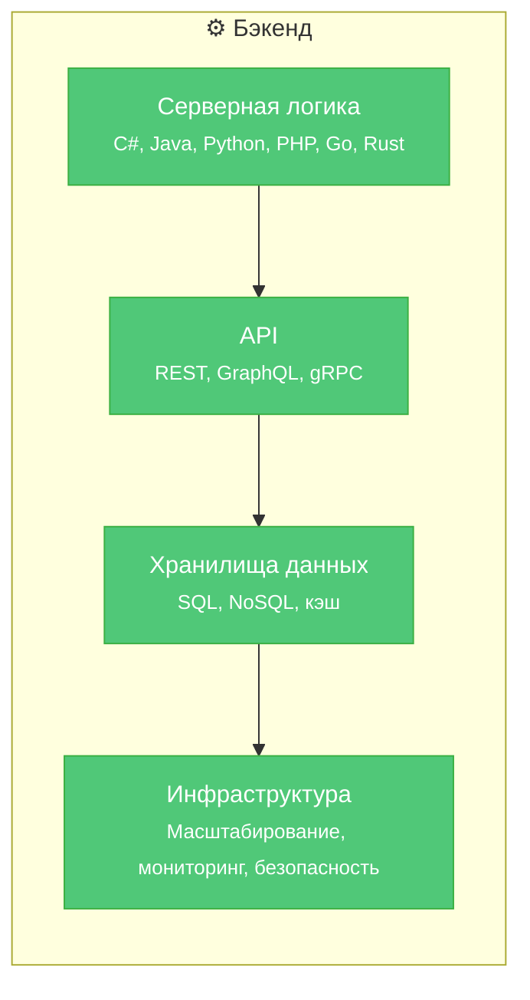

---
tags:
  - analytic
  - developer
  - architector
  - required
  - beginner
title: Бэкенд
description: "★ Серверная часть (Backend) — невидимый для пользователя слой приложения, отвечающий за бизнес-логику, хранение и обработку данных, а также взаимодействие с внешними системами."
---

import WebAppArchitecturePlay from '@site/src/components/WebAppArchitecturePlay.jsx';

# Бэкенд

<div class="article-tags">
  <span class="tag tag-required">ОБЯЗАТЕЛЬНО</span>
  <span class="tag tag-beginner">ДЛЯ НОВИЧКОВ</span>
</div>

<span class="complexity-badge">Разработчику</span>
<span class="complexity-badge">Аналитику</span>
<span class="complexity-badge">Архитектору</span>

## Бэкенд

<WebAppArchitecturePlay />

★ **Серверная часть (Backend)** — невидимый для пользователя слой приложения, отвечающий за бизнес-логику, хранение и обработку данных, а также взаимодействие с внешними системами. В отличие от фронтенда, бэкенд не имеет визуального представления и реализуется на стороне сервера. Его корректная работа напрямую определяет функциональность, надёжность и производительность всего приложения.

Хотя пользователь взаимодействует только с интерфейсом — кнопками, формами, анимациями — реальная логика приложения выполняется на сервере. Фронтенд может быть технически оптимизирован до предела: сжатые ресурсы, эффективный рендеринг, кэширование на клиенте — однако если бэкенд медленно обрабатывает запросы, возвращает ошибки или не масштабируется под нагрузку, качество пользовательского опыта неизбежно падает. Таким образом, производительность фронтенда ограничена качеством серверной реализации.

Чтобы развернуть бэкенд-часть приложения, недостаточно просто скопировать файлы на сервер. Требуется:
- установка среды выполнения (например, .NET Runtime, JVM, Python interpreter);
- настройка зависимостей (пакетов, библиотек, переменных окружения);
- конфигурация подключения к базе данных и внешним сервисам;
- проверка корректности запуска и мониторинг работоспособности.



---

### Составляющие бэкенда

**1. Серверная логика**  
Реализуется на одном или нескольких языках программирования (C#, Java, Python, PHP, Go и др.). Отвечает за обработку входящих запросов, применение бизнес-правил, валидацию данных, взаимодействие с хранилищами и сторонними API. Архитектурно часто разделяется на слои:
- контроллеры (обработка HTTP-запросов),
- сервисы (реализация бизнес-логики),
- репозитории (абстракция над доступом к данным).

Такое разделение способствует тестируемости, поддерживаемости и соблюдению принципов SOLID.

**2. API (Application Programming Interface)**  
Интерфейс взаимодействия между клиентом и сервером, а также между микросервисами. Наиболее распространены:
- **REST** — архитектурный стиль, основанный на ресурсах и HTTP-методах;
- **GraphQL** — язык запросов, позволяющий клиенту точно определять структуру требуемых данных;
- **gRPC** — высокопроизводительный RPC-протокол на основе Protocol Buffers, часто используется во внутренних сервисах.

API должен обеспечивать:
- чёткую контрактность (версионирование, документирование, например, через OpenAPI);
- контроль доступа (аутентификация и авторизация: JWT, OAuth 2.0, OpenID Connect);
- валидацию входных данных и обработку ошибок.

Минимальный контракт REST-эндпоинта (что ожидает фронтенд):

| Запрос | Успех | Ошибки |
|--------|--------|--------|
| `GET /api/users/42` | `200` + JSON тела пользователя | `404` — не найден, `401` — не авторизован |
| `POST /api/users` | `201` + `Location` или id в теле | `400` — невалидные поля, `409` — конфликт (дубликат email) |

Единый формат ошибки упрощает клиент:

```json
{
  "error": "USER_NOT_FOUND",
  "message": "Пользователь 42 не найден",
  "request_id": "7f3a9c2e-…"
}
```

**Идемпотентность:** повтор `PUT /api/users/42` с теми же данными не должен создавать дубликат; `POST` обычно создаёт новый ресурс при каждом вызове — для «оплатить заказ» нужны ключи идемпотентности (`Idempotency-Key`), иначе двойной клик на фронте даст две списания.

Пример обработчика на Python (Flask), слой контроллера:

```python
from flask import Flask, jsonify, abort

app = Flask(__name__)

@app.get("/api/users/<int:user_id>")
def get_user(user_id: int):
    user = find_user(user_id)  # слой сервиса / репозитория
    if user is None:
        abort(404, description="USER_NOT_FOUND")
    return jsonify({"id": user.id, "name": user.name, "email": user.email})
```

**3. Хранилища данных**  
Бэкенд взаимодействует с различными типами хранилищ:
- **Реляционные СУБД** (PostgreSQL, MySQL, MS SQL Server) — обеспечивают строгую схему, ACID-транзакции, поддержку сложных запросов;
- **Документные и ключ-значение хранилища** (MongoDB, Redis, DynamoDB) — оптимизированы под гибкость схемы, горизонтальное масштабирование, высокую скорость записи/чтения;
- **Кэши** (Redis, Memcached) — используются для снижения нагрузки на основные БД и ускорения ответов.

Оптимизация работы с данными включает:
- проектирование нормализованной/денормализованной схемы;
- использование индексов;
- разграничение операций чтения и записи (CQRS);
- реализацию стратегий резервного копирования и восстановления.

**4. Инфраструктурная составляющая**  
Современный бэкенд редко существует как монолитный сервис на одном сервере. Даже в небольших проектах учитываются:
- **Масштабируемость** — возможность горизонтального (добавление инстансов) и вертикального (увеличение ресурсов) расширения;
- **Безопасность** — защита от инъекций (SQL, command injection), валидация входа, заголовки (`Content-Security-Policy` снижает риск XSS на клиенте), управление секретами, шифрование данных в покое и в передаче;
- **Надёжность** — обработка сбоев, повторные попытки (retry), circuit breaker;
- **Наблюдаемость** — логирование, метрики, трассировка запросов (например, через OpenTelemetry).

Хотя бэкенд-разработчик не обязан быть экспертом в DevOps, понимание основ CI/CD, контейнеризации (Docker), оркестрации (Kubernetes) и облачных платформ (AWS, Azure, GCP) существенно повышает эффективность работы.

### Взаимодействие с клиентами — соединения и нагрузка

При работе в распределённой среде бэкенд редко взаимодействует с клиентом напрямую. Запрос проходит следующий путь:


### Взаимодействие бэкенда с клиентской частью и внешней инфраструктурой

Бэкенд принимает запросы от клиентов (фронтенд, мобильные приложения, другие сервисы) по сети — чаще всего через HTTP(S). На пути от клиента до серверной логики запрос, как правило, проходит через промежуточные компоненты:  
- **обратный прокси** (Nginx, HAProxy),  
- **балансировщик нагрузки** (например, в облаке — AWS ALB, Azure Load Balancer),  
- **API-шлюз** (Kong, Apigee, Tyk).  

Эти компоненты отвечают за маршрутизацию трафика, TLS-терминацию, защиту от DDoS, лимитирование запросов и объединение микросервисов под единым API. При этом каждый запрос требует установки TCP-соединения между клиентом и прокси, а от прокси — к бэкенду. При высокой интенсивности запросов система может столкнуться с двумя ключевыми ограничениями:

1. **Исчерпание портов/соединений на уровне ОС** (ограничение `net.core.somaxconn`, `net.ipv4.ip_local_port_range` и др. в Linux);  
2. **Переполнение очереди входящих соединений** (`listen backlog`) на сервере, что приводит к отбрасыванию соединений (`connection reset`, `ECONNREFUSED`).

Для стабильной обработки высокой нагрузки применяются следующие механизмы:

#### Пул соединений  

Пул соединений — это управляемое множество установленных соединений к ресурсу (базе данных, внешнему API), используемое повторно для выполнения операций. Преимущества:
- снижение накладных расходов на установку и разрыв TCP-соединений;
- контроль максимального числа одновременных подключений к ресурсу;
- возможность реализации таймаутов, повторных попыток и мониторинга состояния соединений.

Однако **дефолтные параметры пула часто не соответствуют реальным условиям эксплуатации**. Например:  
- `maxPoolSize = 100` может быть избыточным для базы данных с 4 ядрами, вызывая конкуренцию за блокировки и ухудшение пропускной способности;  
- `minIdle = 10` при низкой средней нагрузке — неоправданное потребление памяти и ресурсов СУБД.

Настройка пула требует замеров: анализ метрик (время ожидания в очереди, время выполнения запроса, число активных соединений) и учёта характеристик целевой системы — особенно числа одновременных потоков обработки на сервере (`max_connections` в PostgreSQL, `maxThreads` в Tomcat и т.п.).

#### Балансировка нагрузки и распределение запросов  

При горизонтальном масштабировании бэкенда несколько экземпляров (инстансов) принимают запросы от балансировщика. Эффективность распределения зависит от:
- **алгоритма балансировки** (round-robin, least-connections, IP-hash);
- **регулярных health-check’ов**, исключающих недоступные инстансы из пула;
- **настроек таймаутов** (connect, read, write), предотвращающих зависание клиентов.

Важно: балансировка не решает проблему перегрузки отдельного инстанса — она лишь перераспределяет нагрузку. Для устойчивости требуется как вертикальная, так и горизонтальная оптимизация:  
- ограничение скорости (rate limiting),  
- приоритизация критичных запросов,  
- деградация функциональности (graceful degradation).

---

### Формирование компетенций бэкенд-разработчика

Полная **матрица навыков по уровням** (junior → middle+) с ссылками на материалы энциклопедии: [Компетенции бэкенд-разработчика](./4.md).

Разработка серверной части требует понимания базовых принципов распределённых систем. Рекомендуемая последовательность освоения тем (для формирования системного мышления):

| Этап | Ключевые темы | Связь с бэкендом |
|------|----------------|------------------|
| **1. Сетевые основы** | TCP/IP, HTTP/1.1 и HTTP/2, DNS, latency vs bandwidth | Позволяет диагностировать ошибки уровня соединения, проектировать эффективные API (keep-alive, заголовки кэширования), понимать причины таймаутов |
| **2. Хранение данных** | ACID, индексация, блокировки, репликация, шардинг | Основа для проектирования масштабируемой и отказоустойчивой логики работы с данными |
| **3. Кэширование** | TTL, инвалидация, кэши на разных уровнях (приложение, CDN, БД) | Один из самых эффективных способов снижения нагрузки на бэкенд и уменьшения latency |
| **4. Асинхронная обработка** | Очереди (RabbitMQ, Kafka), фоновые задачи, реактивные потоки | Отделение синхронного интерфейса от длительных операций; повышение отзывчивости API |
| **5. Управление нагрузкой** | Пулы соединений, rate limiting, circuit breaker, graceful degradation | Обеспечение устойчивости системы под пиковой нагрузкой и при частичных сбоях |
| **6. Практика на типовых задачах** | Сокращение URL, лимиты запросов (token bucket), лента новостей, push-уведомления | Отработка шаблонов проектирования в контролируемых условиях |
| **7. Анализ инцидентов** | Post-mortem, SLO/SLI, анализ логов и трассировок | Формирование инженерной этики и умения прогнозировать отказы |

Эта последовательность не является строгой программой обучения, но отражает **логику причинно-следственных связей**: знание сетей объясняет поведение HTTP; понимание БД обосновывает выбор модели данных; практика очередей подготавливает к проектированию надёжных интеграций.

### Кто такой бэкенд-разработчик?

Бэкенд-разработчик — специалист, проектирующий и реализующий серверную логику приложений с учётом требований к:
- корректности (соответствие бизнес-правилам),
- производительности (время ответа, пропускная способность),
- надёжности (устойчивость к сбоям и нагрузке),
- безопасности (защита данных и операций).

В отличие от фронтенд-разработчика, он редко работает с визуальными элементами — но от его решений напрямую зависит, сможет ли пользователь *вообще* выполнить действие (отправить форму, загрузить данные, авторизоваться).

Современный бэкенд-разработчик сочетает навыки:
- программирования (на одном или нескольких языках),
- проектирования API и контрактов,
- работы с данными (моделирование, оптимизация, транзакции),
- понимания инфраструктуры и сетей.

Это делает профессию стабильной и востребованной — даже в условиях технологических сдвигов: в то время как клиентские фреймворки меняются часто, фундаментальные принципы серверной разработки остаются неизменными десятилетиями.

---
