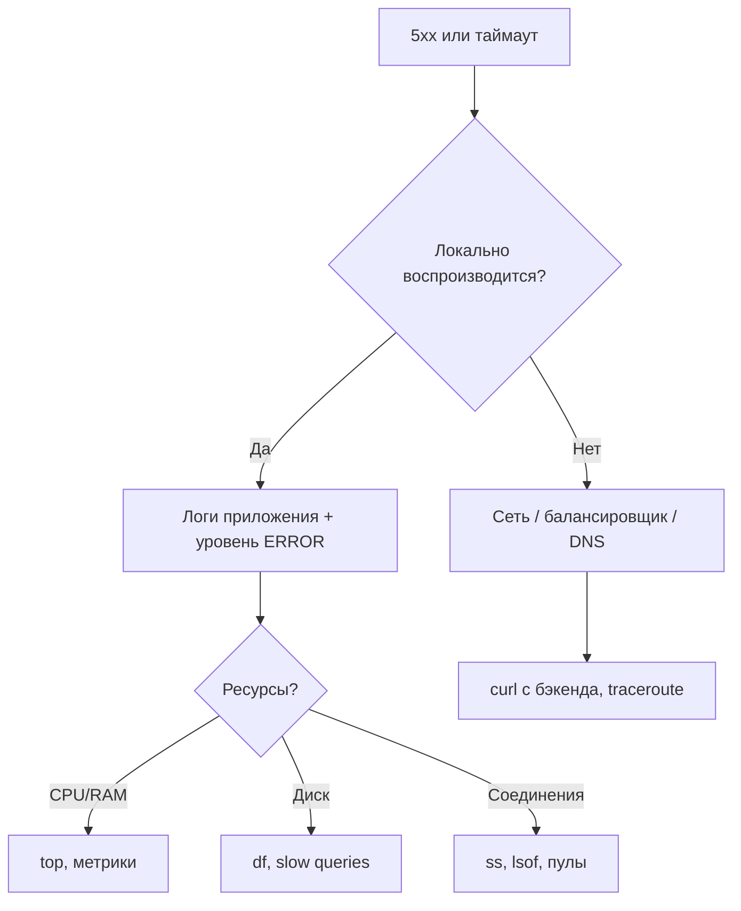

# Linux для бэкенд-разработчика

<div class="article-tags">
  <span class="tag tag-required">ОБЯЗАТЕЛЬНО</span>
  <span class="tag tag-beginner">ДЛЯ НОВИЧКОВ</span>
</div>

<span class="complexity-badge">Разработчику</span>
<span class="complexity-badge">Инженеру</span>

Большинство бэкендов в продакшене работают на **Linux** (или совместимых системах). Вам не нужно становиться администратором, но без базовой "консольной грамотности" отладка в Docker/Kubernetes превращается в угадывание.

Связанные материалы: [терминал](/encyclopedia/2-system-network/2-05-terminal/1), [администрирование Linux](/encyclopedia/2-system-network/2-06-sistemnoe-administrirovanie/93), [компетенции бэкенда](./4.md).

---

## С чего начать без перегруза

Практичный старт для новичка состоит из трёх привычек:

1. Уверенно перемещаться по каталогам и читать логи.
2. Понимать состояние процесса и порта.
3. Проверять API напрямую через `curl`.

Эти три навыка закрывают большую часть первичной диагностики в staging и production.

---

## Минимальный набор команд

Эти команды выступают базовым словарём работы с сервером. Чем увереннее разработчик владеет этим уровнем, тем быстрее он переходит от симптома к проверяемой гипотезе.

| Задача | Команды |
|--------|---------|
| Где я, что в каталоге | `pwd`, `ls -la`, `cd` |
| Прочитать конфиг / лог | `cat`, `less`, `tail -f /var/log/...` |
| Найти файл или строку | `find`, `grep -r` |
| Место на диске | `df -h`, `du -sh *` |
| Кто слушает порт | `ss -tlnp` или `netstat` (если установлен) |
| Проверить HTTP с сервера | `curl -v http://127.0.0.1:8080/health` |

**Пайп `|`** соединяет вывод одной команды со входом другой: `cat app.log | grep ERROR | tail -20`.

**Перенаправление:** `>` перезаписывает файл, `>>` дописывает, `2>` — поток ошибок. Так пишут скрипты деплоя и cron-задачи.

Примеры для отладки API на сервере:

```bash
# Кто слушает порт 8080
ss -tlnp | grep 8080

# Время DNS, TCP, TTFB (удобно сравнивать с DevTools)
curl -s -o /dev/null -w \
  "dns:%{time_namelookup}s connect:%{time_connect}s ttfb:%{time_starttransfer}s total:%{time_total}s\n" \
  http://127.0.0.1:8080/health

# Хвост логов с фильтром
tail -f /var/log/myapp/app.log | grep ERROR
```

**PID** (Process ID) — номер процесса в ОС. **Файловый дескриптор (FD)** — "ручка" к открытому файлу или сокету; утечки соединений к БД — это часто незакрытые FD. **`ulimit -n`** — лимит FD на пользователя/сессию; при `too many open files` его поднимают вместе с настройкой пулов ([бэкенд](./2.md)).

---

## Процессы и сигналы

Запущенное приложение — **процесс** с PID. Веб-серверы часто используют модель **master + worker**: мастер принимает соединения, воркеры обрабатывают запросы.

Понимание жизненного цикла процесса напрямую влияет на качество деплоя. Корректное завершение через сигналы сохраняет целостность активных запросов и снижает риск частичных сбоев в момент обновления сервиса.

| Сигнал | Действие | Когда использовать |
|--------|----------|-------------------|
| `SIGTERM` | Корректное завершение (graceful) | Остановка сервиса, rolling deploy |
| `SIGKILL` | Немедленное убийство | Процесс завис и не реагирует на SIGTERM |
| `SIGHUP` | Перечитать конфиг (у части демонов) | Смена nginx без полного рестарта |

Команды: `ps aux`, `top` / `htop`, `kill <pid>`, `kill -9 <pid>`.

**Зомби-процессы** — дочерние процессы, завершившиеся, но не "подобранные" родителем. Симптом: много записей `defunct` в `ps`. Лечится исправлением кода (ожидание дочерних) или перезапуском родителя.

---

## Дескрипторы и лимиты

Сокет, файл, pipe — в ядре это **файловые дескрипторы** (числа 0, 1, 2 — stdin/stdout/stderr).

Для бэкенда это один из ключевых эксплуатационных ресурсов. Рост нагрузки обычно увеличивает число одновременных сокетов, поэтому дескрипторы становятся ранним индикатором проблем с пулами и утечками соединений.

Типичная авария под нагрузкой: **`too many open files`**. Причины:

- утечка соединений к БД без закрытия;
- HTTP без keep-alive и тысячи коротких TCP;
- лимит `ulimit -n` ниже, чем нужно приложению.

Диагностика: `lsof -p <pid>` — какие файлы и сокеты открыты процессом. На высоком уровне — метрики активных соединений и настройка пулов ([бэкенд](./2.md)).

---

## Память и OOM

`free -h` показывает RAM и swap. **OOM Killer** — механизм ядра: при нехватке памяти ядро завершает "жертву" (часто самый прожорливый процесс). В логах: `dmesg`, `Out of memory: Kill process`.

С точки зрения архитектуры OOM отражает несоответствие между профилем нагрузки и лимитами окружения. Поэтому диагностика памяти включает как анализ кода, так и проверку контейнерных квот и настроек рантайма.

Для разработчика:

- задавайте лимиты контейнера осознанно;
- следите за утечками (рост RSS во времени);
- не кэшируйте без TTL всё подряд в heap.

---

## Сервисы и планировщик

**systemd** управляет демонами: `systemctl status myapp`, `journalctl -u myapp -f` — логи сервиса.

**cron** — повторяющиеся задачи (очистка, отчёты); расписание задаётся пятью полями (`0 0 * * *` — ежедневно в полночь, `*/5 * * * *` — каждые 5 минут). Шпаргалка — [Планирование задач](/encyclopedia/2-system-network/2-06-sistemnoe-administrirovanie/8). **at** — разовый запуск в заданное время.

Фон в текущей сессии: `command &`, `nohup command &` — процесс переживёт закрытие терминала (с оговорками для контейнеров).

---

## Быстрый runbook дежурного разработчика

Ситуация: "API начал отвечать 5xx". Базовая последовательность:

1. Проверить статус сервиса: `systemctl status myapp`.
2. Открыть поток логов: `journalctl -u myapp -f`.
3. Проверить порт и слушающий процесс: `ss -tlnp | grep 8080`.
4. Снять health локально на сервере: `curl -v http://127.0.0.1:8080/health`.
5. Проверить ресурсы: `top`, `free -h`, `df -h`.

Если сервис активен, а health не проходит, основной фокус уходит в зависимости:

- БД;
- Redis;
- сетевые вызовы;
- DNS.

Этот алгоритм задаёт воспроизводимый порядок диагностики. Повторяемость шагов особенно важна в дежурстве, когда разные инженеры работают с одним инцидентом и должны быстро синхронизировать выводы.

---

## Команды, которые чаще всего экономят время

| Задача | Команда | Что увидеть |
|--------|---------|-------------|
| Последние ошибки в логе | `journalctl -u myapp -n 200` | пик ошибок после деплоя |
| Процессы приложения | `ps aux \| grep myapp` | лишние инстансы, orphan-процессы |
| Открытые сокеты процесса | `lsof -p <pid>` | утечки соединений |
| DNS резолв хоста | `getent hosts api.example.com` | какой IP реально используется |
| Проверка диска каталога логов | `du -sh /var/log/myapp` | переполнение логами |

---

## Частые ошибки новичков

- Запуск задач под `root` там, где хватает отдельного сервисного пользователя.
- Отсутствие ротации логов при подробном логировании.
- Синхронные тяжёлые операции в HTTP-обработчике вместо фоновой очереди.
- Диагностика только по "среднему времени" без p95/p99 и без контекста логов.

Эти ошибки закономерны на раннем этапе и хорошо исправляются через практику с runbook и postmortem. Когда команда формирует единый стандарт диагностики, вероятность повторных инцидентов снижается.

---

## SSH и перенос артефактов

На сервере нет браузера — отладка через SSH и `curl`. Копирование дампа БД или логов: `scp`, для больших объёмов — `rsync`.

Работа через SSH формирует дисциплину минимального и точного действия в production-среде. Такой стиль сокращает риск случайных изменений и оставляет прозрачный след операций для команды.

Не работайте постоянно под **root**: лишние права = лишний риск при компрометации.

---

## Типовой сценарий отладки



1. Воспроизвести на staging.
2. `tail -f` логов + корреляция по `request_id`.
3. Проверить health зависимостей (БД, Redis).
4. Сравнить метрики до и после деплоя.

Сценарий полезен как базовый шаблон инженерного мышления: сначала факты, затем гипотеза, затем проверка. Такой подход масштабируется от локальной ошибки до сложного production-инцидента.

---

## Что изучать дальше

- [Диагностика системных ошибок](/encyclopedia/2-system-network/2-06-sistemnoe-administrirovanie/9)
- [Контейнеризация](/encyclopedia/8-infra-security/8-06-konteynerizatsiya-i-orkestratsiya/1)
- [Сеть для бэкенда](./6.md)
- [Наблюдаемость бэкенда](./9.md)

---
