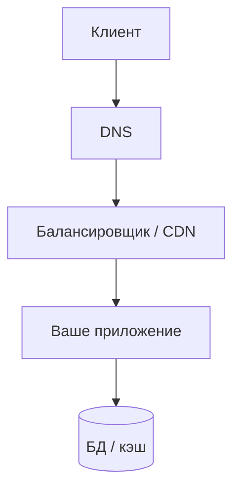

# Сеть для диагностики бэкенда

  ОБЯЗАТЕЛЬНО
  ДЛЯ НОВИЧКОВ

Разработчику

Пользователь жалуется: «сайт тормозит». Часть причин — **не в SQL и не в алгоритме**, а в пути пакета от клиента до сервера и обратно. Бэкенд-разработчик должен отличать **медленный код** от **медленной сети**.

База: [сеть и интернет](/encyclopedia/2-system-network/2-03-set-i-internet/1), [HTTP](/encyclopedia/2-system-network/2-09-osnovy-integratsionnogo-vzaimodeystviya/118).

---

## Уровни, которые вас касаются

На каждом hop добавляется задержка. **Время ответа API** = обработка на сервере + сеть туда-обратно + очередь на балансировщике.

---

## Ключевые метрики

| Метрика | Что означает | Типичный симптом |
|---------|--------------|------------------|
| **RTT** (Round-Trip Time) | Время туда-обратно до узла | Высокий RTT → долгий TTFB даже при лёгком коде |
| **Latency** | Задержка доставки | «Плавающее» время ответа |
| **Jitter** | Разброс задержки | Нестабильный UX, таймауты на мобильных сетях |
| **Packet loss** | Потеря пакетов | Ретрансмиссии TCP, «зависания» |
| **Bandwidth** | Пропускная способность | Долгая загрузка больших тел, не коротких API |

**Важно:** TCP при потерях **снижает скорость** (контроль перегрузки). UDP (DNS, QUIC/HTTP3) ведёт себя иначе — потери могут проявляться как ошибки без повторной доставки на уровне приложения.

---

## TCP и HTTP в двух словах

- **SYN → SYN-ACK → ACK** — установление соединения (один RTT и больше).
- **Keep-Alive** — повторное использование TCP для нескольких HTTP-запросов; без него каждый запрос платит handshake.
- **HTTP/2** — мультиплексирование потоков в одном TCP; меньше head-of-line blocking, чем в HTTP/1.1 с множеством соединений.
- **TLS** — дополнительные RTT на handshake (смягчается session resumption).

Если API вызывается **тысячи раз в секунду** с коротким телом, оптимизация JSON может дать меньше, чем пул соединений к БД и keep-alive к upstream.

---

## Симптом → гипотеза

| Наблюдение | Вероятная причина | Что проверить |
|------------|-------------------|---------------|
| Медленно только из одного региона | Маршрут, CDN, гео-реплика | Трассировка, DNS на региональный IP |
| Медленно только на мобильном | Высокий RTT/джиттер | Перцентили p95/p99, размер ответа |
| Таймауты пачками | Потери, перегрузка LB, исчерпание портов | Метрики LB, `ss`, лимиты |
| Быстро с сервера, медленно снаружи | Firewall, NAT, неверный DNS | `curl` с хоста vs с ноутбука |
| Быстро без TLS, медленно с TLS | Сертификат, цепочка, CPU | Профиль TLS, HTTP/2 |

---

## Инструменты разработчика

| Инструмент | Назначение |
|------------|------------|
| DevTools → Network | Водопад запросов, TTFB, размер |
| `curl -w "@-" -o /dev/null -s` | Время DNS/connect/TTFB с сервера |
| `dig`, `host` | Записи DNS, TTL, неверный A/AAAA |
| `ping`, `traceroute` / `tracert` | RTT по хопам (ICMP может быть заблокирован) |
| Логи прокси (Nginx) | `$request_time`, upstream time |

Глубокий разбор пакетов (tcpdump, анализ в GUI) — задача инженера по эксплуатации; разработчику достаточно уметь **заказать** такой анализ с воспроизводимым `request_id`.

---

## DNS — частый скрытый виновник

Каждый новый хост в цепочке микросервисов → резолвинг имени. Проблемы:

- слишком большой TTL при смене IP;
- нет кэша резолвера в приложении;
- IPv6 AAAA есть, но маршрут до IPv6 сломан (fallback замедляет).

Файл `/etc/hosts` на staging — легитимный способ подменить маршрут для отладки.

---

## Практические рекомендации для API

1. **Таймауты** на исходящие вызовы (connect + read) — всегда явные.
2. **Идемпотентность** и retry только на безопасных операциях — иначе дубли при ретрансмиссии TCP не спасут бизнес-логику.
3. **Сжатие** (`gzip`, `brotli`) для крупных JSON — экономит bandwidth, тратит CPU.
4. **CDN** для статики; API — ближе к пользователю через edge только если есть смысл (часто API остаётся в одном регионе).
5. Смотрите **p95/p99**, не среднее — сеть «длинным хвостом» портит UX.

---

## Связанные темы

- [Метрики производительности веб-приложений](./3.md)
- [Бэкенд — соединения и пулы](./2.md)
- [Linux для бэкенда](./5.md)

---
