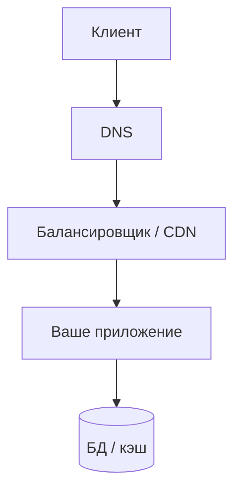

# Сеть для диагностики бэкенда

<div class="article-tags">
  <span class="tag tag-required">ОБЯЗАТЕЛЬНО</span>
  <span class="tag tag-beginner">ДЛЯ НОВИЧКОВ</span>
</div>

<span class="complexity-badge">Разработчику</span>

Пользователь жалуется: "сайт тормозит". Часть причин — **не в SQL и не в алгоритме**, а в пути пакета от клиента до сервера и обратно. Бэкенд-разработчик должен отличать **медленный код** от **медленной сети**.

База: [сеть и интернет](/encyclopedia/2-system-network/2-03-set-i-internet/1), [HTTP](/encyclopedia/2-system-network/2-09-osnovy-integratsionnogo-vzaimodeystviya/118).

---

## Практический фокус статьи

Эта статья помогает отвечать на рабочий вопрос "где узкое место":

- в коде приложения;
- в базе данных;
- в сетевом маршруте между клиентом и API;
- в прокси, CDN или TLS-слое.

Когда диагностика идёт по этой схеме, время до причины заметно сокращается.

---

## Уровни, которые вас касаются



На каждом hop добавляется задержка. **Время ответа API** = обработка на сервере + сеть туда-обратно + очередь на балансировщике.

Эта формула задаёт правильную рамку анализа. Медленный ответ не указывает автоматически на проблемы кода: значимая доля времени может возникать до входа запроса в приложение.

<div class="callout callout--info">
  <div class="callout-title">Напоминалка по узлам цепочки</div>

  <div class="callout-body">
  <p>Балансировщик, CDN, кэш, API Gateway и rate limit — что делает каждый блок на схеме: <a href="/encyclopedia/7-project/7-06-proektirovanie-i-arhitektura/141">12 концепций распределённой архитектуры</a>. Под капотом DNS отвечает на порту <strong>53</strong>, публичный API — на <strong>443</strong> (HTTPS), внутренняя БД — на <strong>5432</strong> / <strong>3306</strong> и т.д. — сводка по ролям в <a href="/encyclopedia/2-system-network/2-03-set-i-internet/618#setevye-servisy-po-rolyam">справочнике сетевых сервисов</a>.</p>
</div>
  </div>


---

## Ключевые метрики

| Метрика | Что означает | Типичный симптом |
|---------|--------------|------------------|
| **RTT** (Round-Trip Time) | Время туда-обратно до узла | Высокий RTT → долгий TTFB даже при лёгком коде |
| **Latency / RT** | Задержка доставки, время ответа запроса | "Плавающее" время ответа |
| **QPS / RPS** | Запросов в секунду к API | Очереди, 503 при пике |
| **Concurrency** | Одновременных активных запросов | Рост при том же QPS → запросы «зависают» дольше |
| **Jitter** | Разброс задержки | Нестабильный UX, таймауты на мобильных сетях |
| **Packet loss** | Потеря пакетов | Ретрансмиссии TCP, "зависания" |
| **Bandwidth** | Пропускная способность канала | Долгая загрузка больших тел, не коротких API |

Связь **QPS**, **concurrency** и среднего **RT** (`QPS = Concurrency / Avg RT`), а также отличие **TPS** от QPS — в [масштабируемости и параллелизме](/encyclopedia/7-project/7-06-proektirovanie-i-arhitektura/2#chetyre-bazovye-metriki).

TCP при потерях **снижает скорость** (контроль перегрузки). UDP (DNS, QUIC/HTTP3) ведёт себя иначе — потери могут проявляться как ошибки без повторной доставки на уровне приложения.

На практике это означает, что при одинаковой серверной нагрузке пользовательский опыт может заметно отличаться по регионам и типам сетей.

---

## TCP и HTTP в двух словах

- **SYN → SYN-ACK → ACK** — установление соединения (один RTT и больше).
- **Keep-Alive** — повторное использование TCP для нескольких HTTP-запросов; без него каждый запрос платит handshake.
- **HTTP/2** — несколько запросов в одном TCP; снята очередь ответов HTTP/1.1, но при потере TCP-пакета могут встать **все** параллельные запросы в соединении.
- **HTTP/3** — те же запросы поверх QUIC (UDP): потоки независимы, потеря пакета задерживает один запрос, подробнее в [HTTP-интеграциях](/encyclopedia/2-system-network/2-09-osnovy-integratsionnogo-vzaimodeystviya/118#http2-http3-streams). Карта всего стека — [HTTP-экосистема](/encyclopedia/2-system-network/2-09-osnovy-integratsionnogo-vzaimodeystviya/118#http-ecosystem).
- **TLS** — дополнительные RTT на handshake (смягчается session resumption).

Если API вызывается **тысячи раз в секунду** с коротким телом, оптимизация JSON может дать меньше, чем пул соединений к БД и keep-alive к upstream.

---

## Симптом → гипотеза

| Наблюдение | Вероятная причина | Что проверить |
|------------|-------------------|---------------|
| Медленно только из одного региона | Маршрут, CDN, гео-реплика | Трассировка, DNS на региональный IP |
| Медленно только на мобильном | Высокий RTT/джиттер | Перцентили p95/p99, размер ответа |
| Таймауты пачками | Потери, перегрузка LB, исчерпание портов | Метрики LB, `ss`, лимиты |
| Быстро с сервера, медленно снаружи | Firewall, NAT, неверный DNS | `curl` с хоста vs с ноутбука |
| Быстро без TLS, медленно с TLS | Сертификат, цепочка, CPU | Профиль TLS, HTTP/2 |

Таблица помогает формировать инженерную гипотезу до глубокого анализа. Последовательность "симптом → проверка → следующая проверка" снижает хаотичные действия и ускоряет локализацию причины.

---

## Инструменты разработчика

| Инструмент | Назначение |
|------------|------------|
| DevTools → Network | Водопад запросов, TTFB, размер |
| `curl -w` (см. пример ниже) | Время DNS/connect/TTFB с сервера |
| `dig`, `host` | Записи DNS, TTL, неверный A/AAAA |
| `ping`, `traceroute` / `tracert` | RTT по хопам (ICMP может быть заблокирован) |
| Логи прокси (Nginx) | `$request_time`, upstream time |

Глубокий разбор пакетов (tcpdump, анализ в GUI) — задача инженера по эксплуатации; разработчику достаточно уметь **заказать** такой анализ с воспроизводимым `request_id`.

С сервера (или из CI на staging):

```bash
curl -s -o /dev/null -w \
  "dns:%{time_namelookup}s connect:%{time_connect}s ttfb:%{time_starttransfer}s total:%{time_total}s code:%{http_code}\n" \
  https://api.example.com/health
```

**TTFB** (Time To First Byte) в DevTools — время до первового байта ответа. В логах Nginx поле `$request_time` ближе к **полной обработке на upstream**. Если TTFB высокий, а `$request_time` низкий — ищите сеть/CDN; если оба высокие — бэкенд или БД.

Метрики **на стороне страницы в браузере** (FCP, DOM Content Loaded, вес страницы, блокирующие ресурсы) — в [«Метрики производительности веб-страницы»](/encyclopedia/2-system-network/2-04-kak-rabotayut-sayty-i-veb-sayty/130).

---

## DNS — частый скрытый виновник

Каждый новый хост в цепочке микросервисов → резолвинг имени. Проблемы:

- слишком большой **TTL** (Time To Live) записи DNS — после смены IP клиенты ещё долго ходят на старый адрес;
- нет кэша резолвера в приложении;
- IPv6 AAAA есть, но маршрут до IPv6 сломан (fallback замедляет).

Файл `/etc/hosts` на staging — легитимный способ подменить маршрут для отладки.

---

## Разбор кейса "медленно после релиза"

Сценарий:

- после релиза жалобы идут только из одного региона;
- p95 вырос, p50 почти не изменился;
- CPU и БД у сервиса остаются в норме.

Порядок проверки:

1. Снять `curl -w` из проблемного региона и из дата-центра рядом с сервисом.
2. Сверить DNS-ответы и TTL.
3. Сравнить TTFB и полный `total`.
4. Проверить логи балансировщика по `$request_time` и upstream latency.
5. Сопоставить время деградации с изменениями в CDN/маршрутизации.

Этот шаблон хорошо показывает границу между "проблема кода" и "проблема доставки".

При повторяемом применении такой разбор превращается в командный runbook: новые инженеры быстрее входят в контекст, а инциденты закрываются на базе проверяемых фактов.

---

## Что добавить в продовый API уже сейчас

- Таймауты connect/read/write на каждый исходящий HTTP-вызов.
- Retry с ограничением попыток и jitter для идемпотентных операций.
- Явный `request_id` в запросах к downstream.
- Метрики сетевых ошибок по классам: timeout, DNS, TLS, connection reset.
- Дашборд с p50/p95/p99 отдельно по регионам и по мобильным/desktop клиентам.

---

## Практические рекомендации для API

1. **Таймауты** на исходящие вызовы (connect + read) — всегда явные.
2. **Идемпотентность** и retry только на безопасных операциях — иначе дубли при ретрансмиссии TCP не спасут бизнес-логику.
3. **Сжатие** (`gzip`, `brotli`) для крупных JSON — экономит bandwidth, тратит CPU.
4. **CDN** для статики; API — ближе к пользователю через edge только если есть смысл (часто API остаётся в одном регионе).
5. Смотрите **p95/p99**, не среднее — сеть "длинным хвостом" портит UX.

---

## Связанные темы

- [Метрики производительности веб-приложений](./3.md)
- [Бэкенд — соединения и пулы](./2.md)
- [Linux для бэкенда](./5.md)
- [Наблюдаемость бэкенда](./9.md)

---
