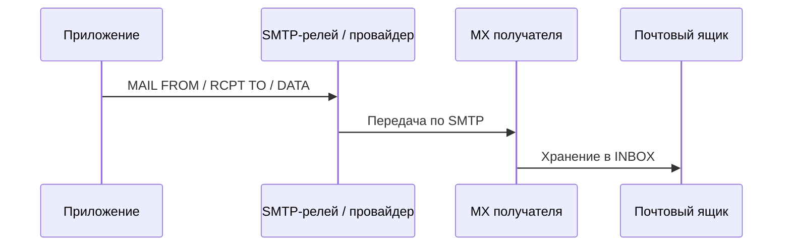

# Исходящая почта на бэкенде

<div class="article-tags">
  <span class="tag tag-required">ОБЯЗАТЕЛЬНО</span>
  <span class="tag tag-beginner">ДЛЯ НОВИЧКОВ</span>
</div>

<span class="complexity-badge">Разработчику</span>

Регистрация, сброс пароля, счета, уведомления — **email остаётся надёжным каналом**, когда push и мессенджеры недоступны. Бэкенд не «рисует письмо в браузере», а **формирует сообщение** и передаёт его почтовой инфраструктуре.

---

## Цепочка доставки



На практике приложение редко говорит напрямую с MX Gmail: чаще используют **транзакционный SMTP** (облачный релей) с API или SMTP-auth.

---

## Структура письма (MIME)

Письмо — **текст с заголовками** (RFC 5322 + MIME):

| Заголовок | Назначение |
|-----------|------------|
| `From` | Отправитель (должен быть разрешён SPF/DKIM домена) |
| `To` / `Cc` / `Bcc` | Получатели |
| `Subject` | Тема (кодировка UTF-8 → base64 в заголовке) |
| `Message-ID` | Уникальный идентификатор (полезен для поддержки) |
| `Content-Type` | `text/plain`, `text/html`, `multipart/alternative` |

**Multipart** — одно письмо с несколькими частями: plain + HTML + вложения. Клиент выбирает подходящую часть.

Упрощённый каркас `multipart/alternative` (как формирует библиотека или MTA):

```text
From: Shop <noreply@shop.example>
To: user@example.com
Subject: =?UTF-8?B?0J7Qv9C40YHQutC+0L3RgdC60Lg=?=
MIME-Version: 1.0
Content-Type: multipart/alternative; boundary="boundary42"

--boundary42
Content-Type: text/plain; charset=utf-8

Сброс пароля: https://shop.example/reset?token=…

--boundary42
Content-Type: text/html; charset=utf-8

<p>Сброс пароля: <a href="https://shop.example/reset?token=…">перейти</a></p>

--boundary42--
```

На DNS домена отправителя настраивают **SPF** (кто может слать от имени домена), **DKIM** (подпись письма) и **DMARC** (политика при несовпадении) — без этого транзакционные письма часто попадают в спам.

Кодировки тела:

- **base64** — бинарные вложения, нелатиница в старых клиентах;
- **quoted-printable** — текст с редкими не-ASCII символами.

---

## Что реализует бэкенд

1. **Шаблоны** — отделение текста от кода (HTML + подстановка переменных).
2. **Очередь** — отправка асинхронно: HTTP-запрос не ждёт SMTP 30 секунд.

```python
# После успешной регистрации — не блокировать ответ клиенту
def register_user(email: str, password: str) -> User:
    user = create_user(email, password)
    queue.enqueue("send_email", template="welcome", user_id=user.id)
    return user
```

3. **Идемпотентность** — повтор задачи не должен слать десятое «сбрось пароль»; ключ: `userId + template + window`.
4. **Логирование** — статус `queued / sent / bounced`, без паролей в логах.
5. **Unsubscribe** — для маркетинга обязателен; для транзакционных писем — другие правила.

Типичные ошибки:

- синхронная отправка в обработчике HTTP → таймауты;
- нет retry с экспоненциальной паузой при 4xx/5xx релея;
- From-домен без **SPF, DKIM, DMARC** → письма в спаме.

---

## Тестирование без риска

| Среда | Подход |
|-------|--------|
| Локально | Поднять **песочницу SMTP**: все письма перехватываются, в веб-UI видно HTML |
| CI | Mock SMTP или заглушка API провайдера |
| Staging | Отдельный домен, whitelist получателей |

Никогда не гоняйте автотесты на реальные ящики пользователей.

Проверка порта с сервера: `openssl s_client -connect smtp.example:587 -starttls smtp` (или аналог в [терминале](/encyclopedia/2-system-network/2-05-terminal/1131)).

---

## Безопасность

- Не вставляйте в HTML неэкранированные пользовательские данные (XSS в почтовике).
- Ссылки сброса пароля — одноразовые токены с коротким TTL.
- Rate limit на «отправить письмо» — защита от спама и перебора email.

Подробнее об общей модели: [безопасность приложений](/encyclopedia/8-infra-security/8-07-informatsionnaya-bezopasnost/113).

---

## Связанные темы

- [Коммуникация и почта](/encyclopedia/1-basics/1-22-kommunikatsiya-i-obschenie/1)
- [Асинхронная обработка](/encyclopedia/2-system-network/2-09-osnovy-integratsionnogo-vzaimodeystviya/119)
- [Компетенции бэкенда](./4.md)

---
