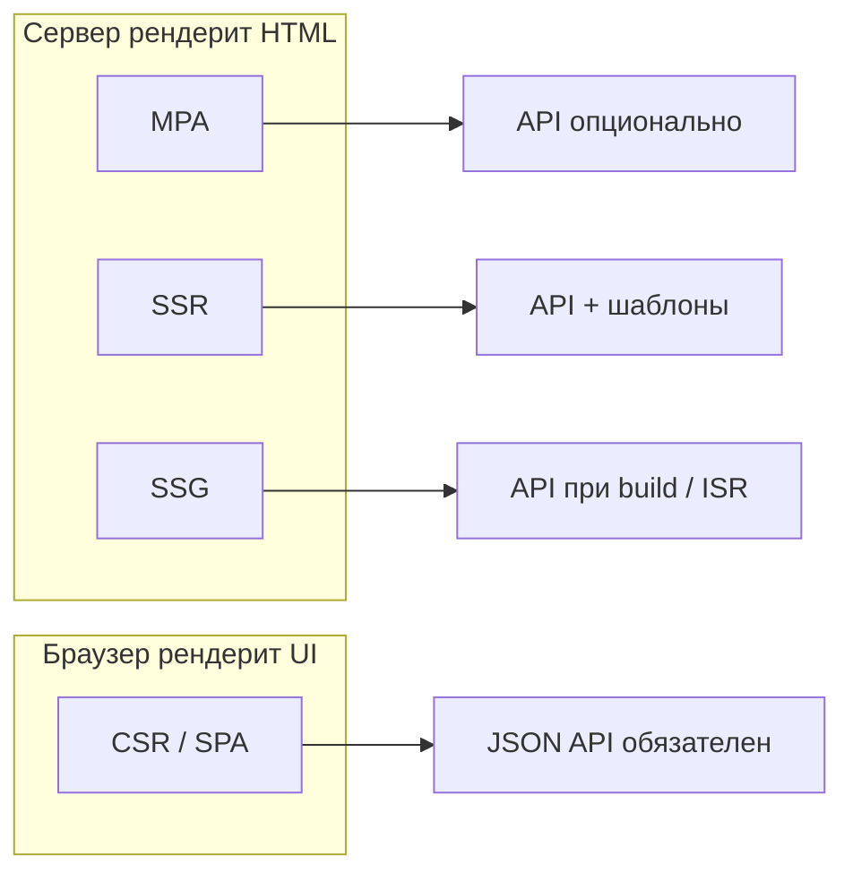
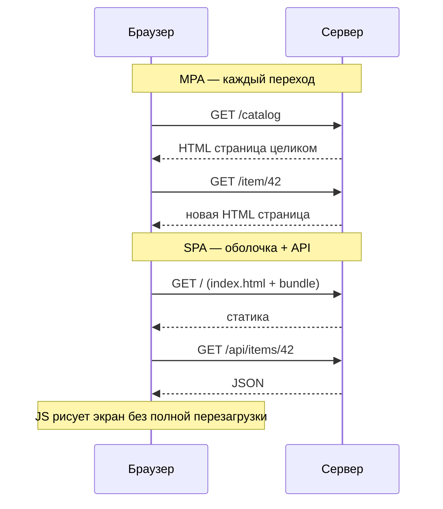

# Типы веб-приложений и роль бэкенда

<div class="article-tags">
  <span class="tag tag-required">ОБЯЗАТЕЛЬНО</span>
  <span class="tag tag-beginner">ДЛЯ НОВИЧКОВ</span>
</div>

<span class="complexity-badge">Разработчику</span>
<span class="complexity-badge">Аналитику</span>
<span class="complexity-badge">Архитектору</span>

Один и тот же бизнес можно вывести в интернет **разными способами**. От выбора зависят: формат API, кэширование, SEO, сложность деплоя и то, что именно пишет бэкенд-разработчик.

---

## Плавный ориентир для старта

Если вы только входите в тему, удобно идти от пользовательского сценария:

1. Как пользователь открывает первый экран.
2. Где формируется HTML первого экрана.
3. Откуда приходят данные при навигации.
4. Где держится состояние сессии и авторизации.

Этот порядок сразу показывает, какой тип веб-приложения ближе вашему продукту.

---

## Ось — где собирается HTML



Главная ось выбора показывает место рендеринга первого экрана. Если HTML формируется на сервере, система получает предсказуемый старт страницы и сильный SEO-профиль. Если рендеринг выполняется в браузере, команда получает гибкий интерактивный интерфейс и переносит большую часть UI-логики на клиент.

---

## Словарь

| Тип | Суть | Типичный API бэкенда |
|-----|------|----------------------|
| **MPA** (Multi-Page Application) | Каждый URL — новая HTML-страница с сервера | Формы POST, сессии, частично REST |
| **SPA** (Single Page Application) | Одна оболочка HTML, навигация в JS | REST/GraphQL, JWT, WebSocket |
| **CSR** (Client-Side Rendering) | Данные по API, разметка в браузере | Толстый JSON, пагинация, BFF иногда |
| **SSR** (Server-Side Rendering) | HTML собирается на сервере на каждый запрос | Те же API + слой рендера (Node, .NET Razor, PHP) |
| **SSG** (Static Site Generation) | HTML генерируется заранее (build) | API на этапе сборки + клиентский hydrate |
| **PWA** | Сайт + manifest + service worker | Как SPA + push, офлайн-кэш статики |

**SPA** — форма доставки; **CSR/SSR/SSG** — *когда* строится DOM. Комбинации нормальны: Next.js = SSR + CSR + SSG в одном проекте.

В энциклопедическом смысле эти термины описывают разные срезы архитектуры. SPA/MPA отвечают за навигационную модель, а CSR/SSR/SSG отвечают за временную точку генерации HTML. Эта связка помогает не спорить о названиях и обсуждать конкретные эксплуатационные эффекты.

---

### MPA vs SPA — путь запроса



Ответ API для SPA (бэкенд отдаёт данные, не разметку):

```json
{
  "id": 42,
  "title": "Кружка",
  "price": 590,
  "in_stock": true
}
```

**SSG / ISR:** при сборке CI может вызвать `GET /api/articles` и сгенерировать HTML в файлы; при **ISR** страница обновляется по расписанию или по событию — бэкенд дергается на build или по webhook, а не на каждый визит пользователя.

---

## Ответственность бэкенда по типам

### MPA (классика)

MPA концентрирует большую часть интерфейсной сборки на сервере. Бэкенд контролирует шаблоны, сессии и рендеринг страниц, поэтому граница между backend и frontend проходит внутри одного серверного приложения.

- Сессии на сервере (cookie + server-side store).
- CSRF-токены в формах.
- Меньше версионирования публичного API — логика в контроллерах и шаблонах.
- SEO "бесплатно" — HTML уже готов.

---

### SPA / CSR

В SPA сервер работает как поставщик данных с чётким контрактом. Качество API напрямую определяет скорость разработки клиента и стабильность пользовательских сценариев после релизов.

- **Контрактный API** (OpenAPI), версии `/v1`.
- CORS, JWT или cookie + SameSite.
- Пагинация, фильтры, загрузка файлов через API.
- SEO сложнее — нужен prerender, SSR или отдельный лендинг.

---

### SSR / гибрид

Гибридные схемы расширяют ответственность бэкенда: нужно удерживать баланс между серверной скоростью первого экрана и клиентской интерактивностью последующих переходов.

- Бэкенд (или BFF) отдаёт HTML **и** кормит клиентский bundle данными.
- Важны: время TTFB, кэш фрагментов, не дублировать бизнес-логику в двух слоях без дисциплины.

---

### SSG

SSG переносит часть вычислений на этап сборки. Продакшен в таком режиме обслуживает заранее подготовленный контент, а API остаётся источником динамических данных и пользовательских операций.

- На build CI дергает API и пишет статику.
- Бэкенд для **динамики** (формы, личный кабинет) остаётся API-first.
- Обновление контента: rebuild или **ISR** (инкрементальная регенерация страниц).

---

## BFF (Backend for Frontend)

Когда мобильному и веб-клиенту нужны **разные агрегаты данных**, вводят тонкий слой BFF:

- веб-BFF собирает экран заказа одним запросом;
- core-сервисы остаются узкими и стабильными.

Минус: ещё один компонент в деплое. Плюс: меньше "чата" на клиенте и проще эволюция UI.

На уровне архитектурной эволюции BFF часто появляется в момент, когда прямые вызовы множества сервисов начинают перегружать клиент и усложнять релизы интерфейса.

---

## Как выбрать (прагматично)

| Критерий | Склонность |
|----------|------------|
| SEO критичен, мало интерактива | MPA, SSR, SSG |
| Богатый UI, редкие индексируемые страницы | SPA + CSR |
| Одинаковый UI web + mobile | API-first + отдельные клиенты |
| Максимальная простота хостинга статики | SSG + serverless API |

---

## Стратегия миграции без резких разворотов

Команды часто переходят эволюционно:

- MPA → гибридный SSR для ускорения UX;
- SSR/MPA + отдельные SPA-экраны для сложных интерактивных зон;
- SPA + серверный prerender для SEO-критичных маршрутов.

Пошаговая миграция снижает технический риск и сохраняет предсказуемый деплой.

---

## Что бэкенду важно зафиксировать в контракте

Независимо от типа приложения полезно заранее определить:

- формат ошибок (`code`, `message`, `request_id`);
- правила пагинации и сортировки;
- стратегию версионирования API;
- подход к авторизации и обновлению токенов;
- ограничения по latency и размеру ответа.

Эти договорённости ускоряют фронтенд и стабилизируют интеграции.

---

## Мини-кейс выбора архитектуры

Пример: интернет-магазин с блогом и личным кабинетом.

- Каталог и блог требуют SEO и быстрой индексации.
- Личный кабинет требует интерактивности и динамических данных.

Практичное решение:

- SSR/SSG для каталога и контента;
- SPA-подход для кабинета;
- единый API и общая модель авторизации на бэкенде.

Такой гибрид даёт баланс между скоростью разработки, поисковой видимостью и UX.

Такой кейс показывает практическое правило: архитектура веб-приложения редко выбирается одной технологией. Рабочий результат достигается комбинацией режимов рендеринга и ясным контрактом между клиентом и сервером.

---

## Ошибки проектирования

- **Два источника правды** — бизнес-правила и в Node-рендере, и в Java-сервисе без синхронизации.
- **"Толстый" API для SPA** — отдача всей модели БД; нужны DTO и проекции.
- **Сессия в cookie для SPA на другом домене** — без продуманного CORS/SameSite ломается авторизация.

---

## Связанные темы

- [Фронтенд](./1.md), [Бэкенд](./2.md)
- [Как работают сайты](/encyclopedia/2-system-network/2-04-kak-rabotayut-sayty-i-veb-sayty/1)
- [Компетенции бэкенда](./4.md)
- [Наблюдаемость бэкенда](./9.md)

---
