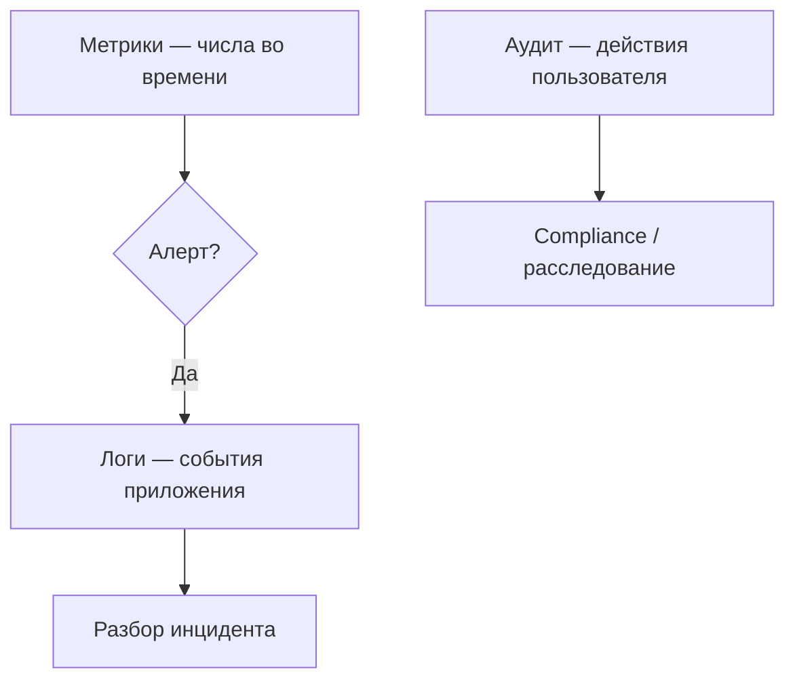

# Наблюдаемость бэкенда — метрики, логи и аудит

<div class="article-tags">
  <span class="tag tag-required">ОБЯЗАТЕЛЬНО</span>
  <span class="tag tag-beginner">ДЛЯ НОВИЧКОВ</span>
</div>

<span class="complexity-badge">Разработчику</span>
<span class="complexity-badge">Инженеру</span>
<span class="complexity-badge">Архитектору</span>

**Наблюдаемость** — способность понять внутреннее состояние системы по внешним сигналам. Для бэкенда критично не смешивать три разных потока данных.

<div class="callout callout--info">
  <div class="callout-title">Связанные материалы</div>

  <div class="callout-body">
  Определения QPS, TPS, перцентилей, распределённой трассировки и примеры Prometheus — в статье <a href="./3">Метрики производительности веб-приложений</a>.
</div>
  </div>


Развёрнутая инфраструктурная сторона: [мониторинг и логирование](/encyclopedia/2-system-network/2-06-sistemnoe-administrirovanie/92). Поиск по каталогу и тексту в продукте: [полнотекстовый поиск](/encyclopedia/2-system-network/2-06-sistemnoe-administrirovanie/94).

---

## С чего начинать наблюдаемость в новом сервисе

Минимальный рабочий комплект, который даёт управляемость с первого релиза:

1. `/health` и `/readiness` endpoint.
2. Структурированные логи с `request_id`.
3. Базовые метрики HTTP: RPS, latency, error rate.
4. Один дашборд для команды и один алерт на 5xx.

Этот базис покрывает диагностику большинства инцидентов уровня приложения.

---

## Три слоя



В практической эксплуатации эти слои работают как единая воронка. Метрики показывают, что деградация уже началась и затронула пользователей. Логи раскрывают технический механизм ошибки на уровне кода и зависимостей. Аудит завершает картину и объясняет, какое действие оператора или пользователя привело к изменению состояния системы.

| Слой | Вопрос | Примеры | Не путать с |
|------|--------|---------|-------------|
| **Метрики** | "Сколько и как быстро?" | RPS, latency p99, error rate, CPU | Текстом описывать каждый запрос |
| **Логи** | "Что случилось в коде?" | stack trace, timeout к БД, `order_id=…` | Персональные данные без маскировки |
| **Аудит** | "Кто изменил что?" | `user_id` сменил роль, экспорт CSV | Debug-логи уровня TRACE |

---

## Метрики (Prometheus-стиль)

Типы:

| Тип | Смысл | Пример |
|-----|-------|--------|
| **Counter** | Только растёт | `http_requests_total{status="500"}` |
| **Gauge** | Текущее значение | `db_connections_active` |
| **Histogram** | Распределение | длительность запроса в корзинах |
| **Summary** | Квантили (реже) | p95 latency на клиенте |

Метрики особенно полезны в динамике. Одно числовое значение в моменте редко объясняет ситуацию, а временной ряд сразу показывает тренд: деградация после релиза, периодический пик в рабочие часы, постепенный рост времени ответа по мере нагрузки.

Правила для разработчика:

- метки (labels) — **низкая кардинальность** (`route`, `method`), не `user_id`;
- считайте **золотые сигналы**: latency, traffic, errors, saturation;
- алерт на **симптом** (рост 5xx), не на "CPU 80%" без контекста.

Запросы в духе `rate(http_errors[5m])` — зона SRE; разработчику достаточно **экспортировать** метрики и знать, где дашборд.

---

## Логи

**Структурированные логи** (JSON) упрощают поиск:

```json
{
  "level": "error",
  "msg": "payment failed",
  "request_id": "7f3a…",
  "order_id": "ord_42",
  "duration_ms": 1203
}
```

Хороший лог связывает техническую ошибку и бизнес-контекст. По одной записи команда понимает, какой запрос сломался, в каком сценарии пользователь столкнулся с проблемой и какой шаг расследования нужен первым.

Уровни:

- **ERROR** — требует внимания, влияет на пользователя;
- **WARN** — деградация, retry;
- **INFO** — бизнес-значимые вехи (старт, останов);
- **DEBUG** — только на staging или кратковременно в проде.

**Корреляция:** один `request_id` / `trace_id` через API Gateway → сервисы → БД. Без этого микросервисы неотлаживаемы.

Middleware (идея на Python/FastAPI или Flask):

```python

import uuid

from flask import Flask, g, request

app = Flask(__name__)

@app.before_request
def assign_request_id():
    g.request_id = request.headers.get("X-Request-Id") or str(uuid.uuid4())

@app.after_request
def echo_request_id(response):
    response.headers["X-Request-Id"] = g.request_id
    return response
```

В логах всегда передавайте тот же `request_id` в поле JSON — тогда строки из разных сервисов склеиваются в одну цепочку.

Не логируйте: пароли, полные PAN карт, токены, тела запросов с PII по умолчанию.

---

## Аудит

Аудит — **юридически и организационно значимый** журнал:

- неизменяемость или WORM-хранение;
- долгий retention;
- поля: кто, когда, откуда (IP), что изменил (до/после).

Аудит закрывает задачи доверия и ответственности. Когда система меняет права доступа, финансовые параметры или критичные настройки, организация должна уметь восстановить хронологию действий без неоднозначности и спорных интерпретаций.

Отдельная таблица или поток Kafka → холодное хранилище. Не смешивайте с `console.log` при отладке скидок.

---

## Карта "симптом → куда смотреть"

| Симптом | Первый слой | Следующий шаг |
|---------|-------------|---------------|
| Рост 5xx | Метрики | Логи по `request_id` и маршруту |
| Пик задержки p99 | Метрики | Трассировка и downstream latency |
| Жалоба "кто изменил права" | Аудит | Запись актора, времени, IP и diff |
| Падение после деплоя | Метрики + логи | Сопоставить с release marker |

Такой порядок помогает команде одинаково разбирать инциденты и сокращает время споров о причине.

---

## Трассировка (четвёртый столп)

**Distributed tracing** (OpenTelemetry) связывает spans между сервисами. Дополняет логи: видно, на каком hop потерялись 800 ms.

Минимум для старта: propagate заголовок trace context из входящего HTTP в исходящие вызовы.

---

## Health check и smoke

| Проверка | Уровень | Назначение |
|----------|---------|------------|
| **Liveness** | Процесс жив | Перезапуск пода |
| **Readiness** | Готов принимать трафик | Исключение из LB при недоступной БД |
| **Smoke test** | После деплоя | "Логин + один критичный сценарий" проходит |

Liveness отвечает на вопрос "процесс существует", readiness отвечает на вопрос "процесс полезен для трафика". Эта граница помогает избежать ситуации, когда оркестратор считает сервис живым, а пользователи получают деградацию из-за недоступной зависимости.

Readiness не должен дергать тяжёлые отчёты — только зависимости, без которых сервис бессмысленен.

---

## Антипаттерны

- Логировать **всё** на INFO в проде → дорого и бесполезно.
- Метрика с label `url=/users/123` → взрыв кардинальности.
- Искать причину только по **среднему** времени ответа — смотрите p95/p99.
- Хранить аудит в той же БД без политики удаления → риск подмены.

---

## Как связать наблюдаемость с процессом разработки

- На code review проверяйте, добавлены ли метрики и корректные поля логов для новых эндпоинтов.
- В definition of done фиксируйте: "новая функциональность наблюдаема".
- После инцидента добавляйте playbook и недостающие сигналы в дашборд.
- На ретроспективе пересматривайте алерты и убирайте шумные правила.

Наблюдаемость становится частью engineering-процесса, а не отдельной задачей на потом.

Энциклопедический принцип здесь простой: измеримость проектируют заранее. Команда, которая строит наблюдаемость вместе с функциональностью, быстрее локализует инциденты, снижает стоимость ошибок и поддерживает предсказуемый темп развития продукта.

---

## Связанные темы

- [Метрики производительности](./3.md)
- [Компетенции бэкенда](./4.md)
- [DevOps и CI/CD](/encyclopedia/8-infra-security/8-04-devops-ci-cd/1)
- [Сеть для диагностики бэкенда](./6.md)
- [Linux для бэкенд-разработчика](./5.md)

---
