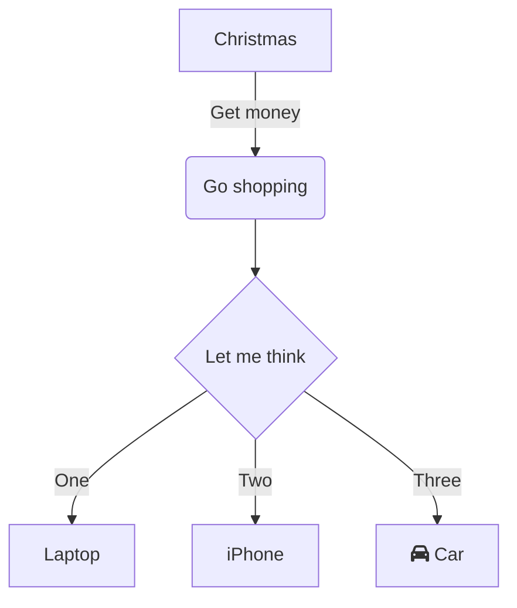

---
tags:
  - analytic
  - developer
  - architector
  - required
  - beginner
title: Естественные и искусственные языки в цифровой среде
description: "Естественный язык — это язык, на котором люди говорят и пишут: английский, русский, китайский и так далее."
---

# Естественные и искусственные языки в цифровой среде

<div class="article-tags">
  <span class="tag tag-required">ОБЯЗАТЕЛЬНО</span>
  <span class="tag tag-beginner">ДЛЯ НОВИЧКОВ</span>
</div>

<span class="complexity-badge">Разработчику</span>
<span class="complexity-badge">Аналитику</span>
<span class="complexity-badge">Архитектору</span>

---

## Общие языки

### Естественный язык

**Естественный язык** — это язык, на котором люди говорят и пишут: английский, русский, китайский и так далее. Он возник исторически и развивался вместе с культурой и обществом. Мы его можем встретить в интерфейсе, документации, а также в обработке искусственным интеллектом при анализе, генерации и понимании текста в речи.

Пример:

"Если температура ниже нуля, надень шапку, иначе можно обойтись без неё."

---

### Алгоритмический язык

**Алгоритмический язык** — это система обозначений, предназначенная для записи алгоритмов, и выступающая в качестве моста между естественным языком и языком программирования. Он может быть формальным (например, псевдокод) или графическим (блок-схемы). Когда мы логически формулируем задачу "ЕСЛИ ТАК ТО ДЕЛАТЬ ТАК, ИНАЧЕ ВОТ ТАК", то это и есть алгоритмический язык - формулировка логики через средства естественного языка. Для англоязычных людей это проще, ведь там подобная логика "IF THEN ELSE" будет совпадать с ключевыми словами языков программирования. 

Это **псевдокод** - условная запись алгоритма на условно-естественном языке, близком к программированию, но без строгого следования синтаксису какого-либо конкретного языка программирования. 

```
Пример:
ЕСЛИ температура < 0 ТО
    надеть(шапка)
ИНАЧЕ
    не_надевать(шапка)
КОНЕЦ
```

**Блок-схема** же — это графическое представление алгоритма или процесса, в котором каждый шаг изображается в виде геометрической фигуры (блока), а связи между блоками показываются стрелками.



---

### Юридический язык

**Юридический язык** - набор правил, норм, которые определяют права, соглашения об использовании, конфиденциальность. Он применяется в лицензировании, защите данных, обработке персональных данных, авторских правах на исходный код. Выделять его следует, потому что всё же он довольно специфичный и может быть непонятен для обычного человека и технаря.

Пример:

"Сторона, осуществляющая обработку персональных данных, обязана обеспечить конфиденциальность такой информации и не передавать её третьим лицам без письменного согласия субъекта данных, за исключением случаев, предусмотренных законодательством Российской Федерации."

---

### Ассемблер

**Ассемблер** — это низкоуровневый язык программирования, максимально близкий к машинному коду. Он использует мнемонические обозначения вместо числовых команд, что делает его более удобочитаемым для человека. Это промежуточный этап между человеком и машиной, даёт полный контроль над железом, но требует огромной квалификации, используется для прямого управления процессором, регистрами и памятью.

```
cmp eax, 0      ; сравнить значение в регистре eax с нулём
jl  wear_hat    ; если меньше — перейти к метке wear_hat
jmp end         ; иначе — прыгнуть в конец

wear_hat:
    call put_on_hat

end:
    ret
```

---

### Машинный язык


**Машинный язык (двоичный код)** - это самый базовый уровень представления информации в компьютере — набор нулей и единиц, соответствующих электрическим сигналам в цепях процессора. Он не требует перевода, так как процессор его понимает напрямую, что и делает такой язык основой всего цифрового мира. Без машинного кода не было бы ни одного бита информации.

```
10110000 00000001 11110100 10000001 11100000
```

---
