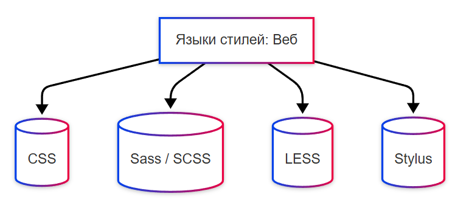

# Языки стилей - CSS и препроцессоры

<div class="article-tags">
  <span class="tag tag-required">ОБЯЗАТЕЛЬНО</span>
  <span class="tag tag-beginner">ДЛЯ НОВИЧКОВ</span>
</div>

<span class="complexity-badge">Разработчику</span>
<span class="complexity-badge">Аналитику</span>
<span class="complexity-badge">Архитектору</span>

## Языки стилей

### Style Sheet Languages

**Языки стилей (Style Sheet Languages)** определяют внешний вид и оформление содержимого, описанного на языке разметки.

Стиль регулирует цвет текста, размер шрифта, расположение на странице, рамки, тени, отступы, поведение при наведении. Если разметка лишь определяет структуру - заголовки, абзацы, списки, то стиль определяет, что заголовок будет именно синим, увеличенным и расположенным по центру с желтым фоном. Это как расширение разметки за счёт добавления визуального оформления. 



---

### CSS

**CSS (Cascading Style Sheets)** – язык таблиц стилей, определяющий внешний вид и оформление документов, написанных на языках разметки, таких как HTML. Дата создания — 1996 год. Основными особенностями являются каскадность, поддержка селекторов, модульное развитие через версии CSS2, CSS3 и т. д. Работает в браузерах. Применяется в веб-разработке для оформления сайтов и приложений. Один из ключевых технологий современного интернета.

```css
h1 {
    color: #333;
    font-size: 24px;
    margin-bottom: 16px;
}
```

---

### Sass / SCSS

**Sass / SCSS** – препроцессор CSS, добавляющий переменные, вложенные правила, миксины и другие удобства. Sass создан в 2006 году, SCSS — это его синтаксический вариант с совместимостью CSS. Основными особенностями являются расширяемость, поддержка условий и функций. Работает через компиляцию в обычный CSS. Применяется в масштабных проектах для упрощения управления стилями. Широко используется в профессиональной фронтенд-разработке.

```css
$primary-color: #007BFF;

.card {
    border: 1px solid #ddd;
    border-radius: 8px;
    
    &__title {
        color: $primary-color;
        font-weight: bold;
    }
}
```

---

### LESS

**LESS** – ещё один препроцессор CSS, предоставляющий переменные, миксины, операции и вложенные правила. Дата создания — 2009 год. Основными особенностями являются JavaScript-базовая реализация, простота освоения, интеграция с популярными фреймворками. Работает через интерпретатор или компилятор. Применяется в веб-проектах, где нужна гибкость стилей. Популярен среди разработчиков, особенно в сочетании с Bootstrap.

```css
@link-color: #1a73e8;

a {
    color: @link-color;
    
    &:hover {
        color: darken(@link-color, 10%);
    }
}
```

---

### Stylus

**Stylus** – гибкий препроцессор CSS с минимальным синтаксисом и мощными возможностями. Дата создания — 2010 год. Основными особенностями являются отсутствие необходимости в скобках и точках с запятой, поддержка JavaScript-выражений. Работает через компиляцию. Применяется в небольших и средних веб-проектах, где важна скорость написания кода и читаемость. Менее популярен, чем Sass или LESS, но остаётся актуальным в нишевых проектах.

```
primary = #0056b3

button
    padding 10px 15px
    background-color primary
    border none
    rounded()
        border-radius 4px
    rounded()
```

---

### XSLT

**XSLT (Extensible Stylesheet Language Transformations)** – язык преобразования XML-документов, в том числе в HTML и другие форматы. Дата создания — 1999 год. Основными особенностями являются работа с деревом XML, шаблонная система, использование XPath. Работает через XSLT-процессоры. Применяется в системах обработки данных, документообороте, legacy-веб-приложениях. Используется там, где нужно конвертировать XML в представимый формат.

```xml
<xsl:stylesheet version="1.0" xmlns:xsl="http://www.w3.org/1999/XSL/Transform">
    <xsl:template match="/">
        <html>
            <body>
                <h2>Список книг</h2>
                <ul>
                    <xsl:for-each select="catalog/book">
                        <li><xsl:value-of select="title"/></li>
                    </xsl:for-each>
                </ul>
            </body>
        </html>
    </xsl:template>
</xsl:stylesheet>
```

---

### FXML

**FXML** – язык разметки пользовательского интерфейса для JavaFX. Дата появления — 2008 год. Основными особенностями являются декларативное описание UI, связь с контроллерами на Java, поддержка стилей и анимаций. Работает в экосистеме JavaFX. Применяется в настольных Java-приложениях для создания графического интерфейса. Альтернатива программному созданию UI в Java.

```xml
<?import javafx.scene.control.*?>
<?import javafx.scene.layout.*?>

<VBox xmlns="http://javafx.com/javafx">
    <Label text="Добро пожаловать!" />
    <Button text="Нажми меня" onAction="#handleButtonClick" />
</VBox>
```

---