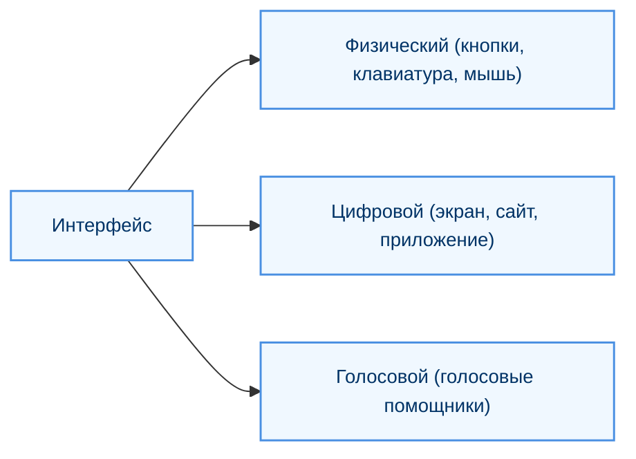
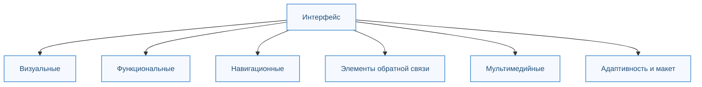

---
tags:
  - analytic
  - developer
  - tester
  - required
  - beginner
title: Пользовательский интерфейс - UX и UI
description: Различие между пользовательским опытом и пользовательским интерфейсом.
---

# Пользовательский интерфейс - UX и UI

  ОБЯЗАТЕЛЬНО
  ДЛЯ НОВИЧКОВ

Разработчику
Аналитику
Тестировщику

## Пользовательский интерфейс — UX и UI

Важно отличать понятие «интерфейс» в объектно-ориентированном программировании и «пользовательский интерфейс». Понятия «пользовательский интерфейс» и «пользовательский опыт» всегда идут смежно, так как оба связаны с ощущением пользователя.

---

### Интерфейс

**Интерфейс (от англ. interface — поверхность взаимодействия)** — это точка соприкосновения или взаимодействия между двумя системами, объектами или процессами. В контексте технологий интерфейс представляет собой способ общения пользователя с устройством, программой или системой.

Поэтому мы часто встречаем интерфейс общения программ (к примеру, API), но для обычного пользователя, понятие интерфейс представляется именно как пользовательский интерфейс, ведь он не видит то, что происходит «под капотом».

Интерфейс может быть следующих видов:
	- *физический интерфейс* (кнопки на пульте, клавиатура, мышь);
	- *цифровой интерфейс* (экран смартфона, веб-сайт, приложение);
	- *голосовой интерфейс* (голосовые помощники).
	

Задача такого интерфейса - обеспечить эффективное и понятное взаимодействие между человеком и системой.

---

### Пользовательский интерфейс

**Пользовательский интерфейс (UI, User Interface)** — это часть системы, которая отвечает за визуальное представление и функциональные элементы взаимодействия с пользователем. UI включает в себя всё, что пользователь видит, слышит и к чему обращается при работе с продуктом, это «лицо» продукта, которое должно быть интуитивно понятным, привлекательным и удобным для использования.

Можно сказать, что пользовательский интерфейс это просто вид интерфейса как точки соприкосновения между пользователем и системой.

Интерфейс состоит из нескольких ключевых компонентов:
1. *Визуальные элементы* - цветовая палитра, шрифты и типографика, иконки и символы, фоновые изображения и текстуры.
2. *Функциональные элементы* - кнопки, поля ввода, выпадающие списки, слайдеры, переключатели, чекбоксы, меню, панели навигации.
3. *Навигационные элементы* - хлебные крошки, пагинация, боковые панели и футеры.
4. *Элементы обратной связи* - уведомления, подсказки, тултипы, контекстное меню, анимации и переходы, сообщения об ошибках.
5. *Мультимедийные элементы* - аудио, видео, графики, диаграммы, виджеты.
6. *Адаптивность и макет* - расположение элементов на экране, ответ на разные размеры экранов (мобильные устройства, планшеты, десктопы).

---

### Пользовательский опыт

**Пользовательский опыт (UX – User Experience)** – опыт, который получает пользователь в процессе взаимодействия с продуктом. Это совокупность эмоций, ощущений и реакций пользователя, поэтому UX охватывает все аспекты взаимодействия, включая восприятие, удобство использования, доступность и удовлетворённость. Отсюда главный принцип:

	- Хороший UI = Хороший UX
	- Плохой UX = Плохой UI

Словом, если вроде бы с точки зрения дизайнера всё выглядит роскошно, но пользователи в бешенстве – значит, UI, всё-таки не хороший.

UX и UI тесно связаны, но они выполняют разные функции. UX создаёт основу, UI её оформляет. UX отвечает за стратегию, исследование и проектирование взаимодействия, сосредоточен на том, чтобы понять, что нужно пользователю, и создать удобный путь для достижения его целей, задавая вопросы «Как пользователь доходит до цели?» и «Что он чувствует в процессе?». UI же реализует эту стратегию через визуальное и функциональное оформление, фокусируется на том, как продукт будет выглядеть и работать.

---
