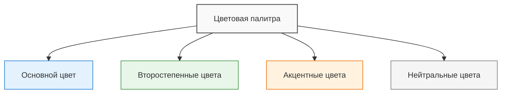
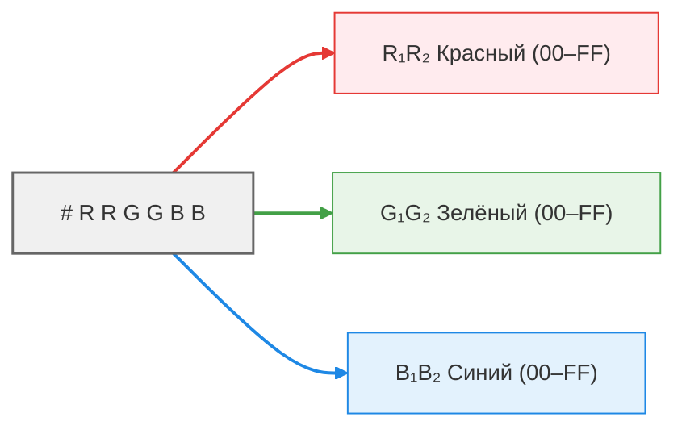
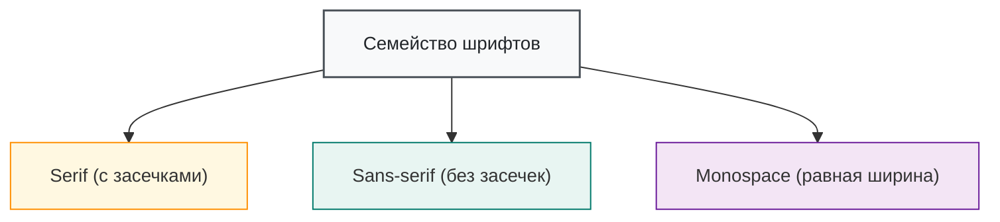
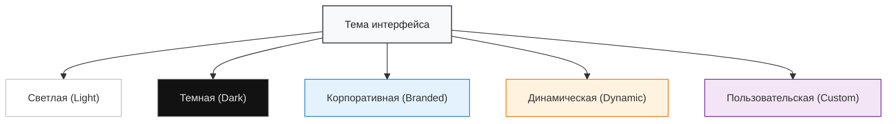

---
tags:
  - analytic
  - developer
  - tester
  - required
  - beginner
title: Визуальные элементы
description: "Разбор визуальных компонентов интерфейса, правил работы с цветовой палитрой, типографикой, иконками и фонами для создания целостного дизайна."
---

import ExternalPlayEmbed from '@site/src/components/ExternalPlayEmbed';
import UiIcon from '@site/src/components/UiIcon';


# Визуальные элементы

<div class="article-tags">
  <span class="tag tag-required">ОБЯЗАТЕЛЬНО</span>
  <span class="tag tag-beginner">ДЛЯ НОВИЧКОВ</span>
</div>

<span class="complexity-badge">Разработчику</span>
<span class="complexity-badge">Аналитику</span>
<span class="complexity-badge">Тестировщику</span>

<ExternalPlayEmbed example="basics/ui-visual-elements-demo" title="Ui Visual Elements" minHeight={420} />

---

## Визуальные элементы

### Цвета

**Цветовая палитра** — это набор цветов, которые используются в интерфейсе для создания визуальной идентичности продукта.

*Основной цвет* - доминирующий цвет, который отражает бренд или стиль продукта.

*Второстепенные цвета* — это дополнительные оттенки, которые поддерживают основной цвет.

*Акцентные цвета* - яркие цвета, используемые для выделения важных элементов (например, кнопок и уведомлений).

*Нейтральные цвета* - белый, серый, чёрный, бежевый - используются для фона, текста и других ненавязчивых элементов.



---

**HEX (Hexadecimal Color Code)** — это способ представления цвета в виде шестнадцатеричного кода. Этот формат используется в веб-дизайне и программировании для задания цветов в HTML, CSS и других технологиях.

HEX начинается с символа #, за которым следуют 6 символов (например, #FFFFFF).

Первые два символа обозначают интенсивность красного (Red), следующие два — зелёного (Green), последние два — синего (Blue).



Примеры:
	- Белый: __ #FFFFFF (максимальная интенсивность всех трёх цветов).
	- Чёрный: __ #000000 (отсутствие всех цветов).
	- Красный: __ #FF0000 (только красный цвет на максимуме).
	- Синий: __ #0000FF (только синий цвет на максимуме).
	
---

**RGB (Red, Green, Blue)** — это модель цветопередачи, основанная на смешении трёх основных цветов: красного, зелёного и синего. Каждый цвет представлен числом от 0 до 255, где 0 означает отсутствие цвета, а 255 — максимальную интенсивность.

RGB записывается как три числа через запятую, заключённые в функцию rgb(). Например, rgb(255, 0, 0) — это красный цвет.

Примеры:
	- Белый — __ rgb(255, 255, 255).
	- Чёрный __ — rgb(0, 0, 0).
	- Жёлтый — __ rgb(255, 255, 0) (красный + зелёный).
	- Фиолетовый — __ rgb(128, 0, 128) (красный + синий).

HEX и RGB — это два способа представления одного и того же цвета. Каждая пара символов в HEX соответствует значению одного из цветов в RGB. Можно разделить HEX-код на три пары символов (например, FF, 57, 33), преобразовать каждую пару из шестнадцатеричной системы в десятичную и получится RGM.

Например:
```
#FF5733 → rgb(255, 87, 51).
#00FF00 → rgb(0, 255, 0).
```

Сейчас нет нужды заучивать основные цвета. Существуют возможности в редакторах кода, которые автоматически могут подсветить цвет, к примеру, в Visual Studio Code - вы сразу увидите, какой цвет сейчас "спрятан" в коде.
 
Также на просторах сети можно найти интересные сайты, которые позволяют быстро подобрать нужный цвет и скопировать код из таблицы.

<ExternalPlayEmbed example="basics/html-colors-play" title="HTML-цвета: тренажёр" minHeight={560} />

---

### Шрифт

**Шрифт (Font)** — это графическое представление символов, букв и цифр, которое используется для отображения текста.

**Типографика** — это искусство и наука выбора, комбинирования и расположения шрифтов в интерфейсе.

**Семейство шрифтов (font family)** это классификация шрифтов по стилю:
	- Serif (с засечками): Times New Roman, Georgia.
	- Sans-serif (без засечек) — Arial, Helvetica, Roboto.
	- Monospace: Courier, Consolas (одинаковая ширина символов).



Шрифты играют ключевую роль в дизайне интерфейсов, брендинге и визуальной коммуникации. Они влияют на читаемость, стиль и восприятие текста. Рассмотрим самые популярные шрифты. *Подробнее о шрифтах* — [здесь](/encyclopedia/1-basics/1-15-tekst/intro).

- <span className="it-font-sample it-font-roboto"><b>Roboto</b> используется в Android, Google Docs, YouTube.</span>
- <span className="it-font-sample it-font-helvetica"><b>Helvetica</b> используется в Apple, American Airlines, Panasonic.</span>
- <span className="it-font-sample it-font-arial"><b>Arial</b> используется в Microsoft Office, Windows.</span>
- <span className="it-font-sample it-font-open-sans"><b>Open Sans</b> используется в Google Fonts, сайтах, презентациях.</span>
- <span className="it-font-sample it-font-montserrat"><b>Montserrat</b> используется в логотипах, заголовках, творческих проектах.</span>
- <span className="it-font-sample it-font-times"><b>Times New Roman</b> используется в печати, статьях, книгах и документах.</span>
- <span className="it-font-sample it-font-georgia"><b>Georgia</b> используется в веб-сайтах, блогах, онлайн-журналах.</span>
- <span className="it-font-sample it-font-baskerville"><b>Baskerville</b> используется в книгах, журналах, логотипах.</span>
- <span className="it-font-sample it-font-playfair"><b>Playfair Display</b> используется для заголовков, логотипов, веб-дизайна.</span>
- <span className="it-font-sample it-font-courier"><b>Courier New</b> используется для кода, текстовых файлов и сценариев фильмов.</span>
- <span className="it-font-sample it-font-consolas"><b>Consolas</b> используется в Visual Studio, Sublime Text, других IDE.</span>
- <span className="it-font-sample it-font-fira-code"><b>Fira Code</b> используется для разработки ПО, в коде.</span>
- <span className="it-font-sample it-font-pacifico"><b>Pacifico</b> используется для логотипов, открыток, творческих проектов.</span>
- <span className="it-font-sample it-font-dancing-script"><b>Dancing Script</b> используется для приглашений, визиток, декоративности.</span>
- <span className="it-font-sample it-font-lobster"><b>Lobster</b> используется в логотипах, заголовках, кафе и ресторанах.</span>
- <span className="it-font-sample it-font-bebas-neue"><b>Bebas Neue</b> используется для постеров, баннеров, логотипов.</span>
- <span className="it-font-sample it-font-inter"><b>Inter</b> часто используют в UI/дизайн-системах и веб-приложениях.</span>
- <span className="it-font-sample it-font-noto-sans"><b>Noto Sans</b> популярен как “универсальный” шрифт (много языков) для интерфейсов и документов.</span>
- <span className="it-font-sample it-font-lato"><b>Lato</b> часто встречается в лендингах, презентациях и UI.</span>
- <span className="it-font-sample it-font-poppins"><b>Poppins</b> популярен в современных сайтах, промо-страницах и заголовках.</span>
- <span className="it-font-sample it-font-raleway"><b>Raleway</b> часто используют в заголовках, брендинге и веб-дизайне.</span>
- <span className="it-font-sample it-font-source-sans-3"><b>Source Sans 3</b> удобен для интерфейсов, документации и длинного текста.</span>
- <span className="it-font-sample it-font-merriweather"><b>Merriweather</b> часто используют для статей и “читабельного” длинного текста в вебе.</span>
- <span className="it-font-sample it-font-nunito"><b>Nunito</b> популярен в дружелюбных интерфейсах, карточках и лендингах.</span>
- <span className="it-font-sample it-font-ubuntu"><b>Ubuntu</b> используется в Linux-экосистеме и часто встречается в технических интерфейсах.</span>
- <span className="it-font-sample it-font-pt-sans"><b>PT Sans</b> и <b>PT Serif</b> часто используют в русскоязычных интерфейсах, медиа и документах.</span>
- <span className="it-font-sample it-font-jetbrains-mono"><b>JetBrains Mono</b> популярен в IDE и редакторах кода.</span>
- <span className="it-font-sample it-font-source-code-pro"><b>Source Code Pro</b> часто используют для кода, терминала и документации.</span>
- <span className="it-font-sample it-font-ibm-plex-sans"><b>IBM Plex Sans</b> встречается в корпоративном дизайне, документации и интерфейсах.</span>
- <span className="it-font-sample it-font-manrope"><b>Manrope</b> популярен в современных интерфейсах и заголовках.</span>

**Размер шрифта (font size)** определяет высоту символов (например, 10px для основного текста, 14px для заголовка второго уровня, 18px для заголовка первого уровня).

**Насыщенность (font weight)** — это толщина шрифта (light, regular, bold).

**Межстрочный интервал (line height)** — это расстояние между строками текста.

**Межбуквенный интервал (letter spacing)** — это расстояние между символами.

**Цвет текста** - контрастность относительно фона.

---

### Иконки и символы

**Иконки** — это графические элементы, которые заменяют или дополняют текст для передачи информации.

**Символы** — это более простые графические элементы, такие как стрелки, галочки <UiIcon id="check" title="галочка" />, крестики.

Основные характеристики иконок и символов — это стиль, размер, цвет и универсальность.

Стиль может быть линейным (тонкие линии), сплошным (закрашенные области) или комбинированным.

Размер подразумевает, что иконки имеют определённое соотношение сторон, и они должны быть достаточно крупными для удобства взаимодействия (обычно 24×24 или 32×32 пикселя).

Цвет обычно соответствует цветовой палитре интерфейса.

Универсальность подразумевает, что иконки должны быть понятны без текстового описания — но на практике подпись или тултип всё равно помогают; см. [справочник иконок](./8.md).

Грамотные иконки упрощают навигацию и экономят место: вместо слова «Настройки» часто ставят <UiIcon id="settings" title="настройки" />, для почты — <UiIcon id="mail" title="почта" />, для сохранения в облако — <UiIcon id="cloud" title="облако" /> или <UiIcon id="download" title="скачать" />, для голосовой записи — <UiIcon id="mic" title="микрофон" />.

Визуально иконки привлекательнее, чем длинный текст в узкой панели.

В современных ОС (iOS, Android, Windows, macOS, ChromeOS) рядом с пиктограммами используют и **эмодзи** в тексте — 😊 в чате, 📁 в заметках. Эмодзи и иконки интерфейса решают разные задачи: эмодзи — эмоция в сообщении, UI-иконка — действие или раздел.

---

### Фоновые изображения и текстуры

**Фоновые изображения (background)** — это графические элементы, которые используются в качестве фона интерфейса или его частей. Это могут быть фотографии, иллюстрации, градиенты или абстрактные узоры.

В качестве фонового изображения можно добавлять фотографии, иллюстрации, геометрические узоры. Обычно важно, чтобы фоновое изображение занимало весь экран. Если, к примеру, поставить его фиксированно в центр и установить размер 800x600, то на мониторе с разрешением 4K это изображение покажется как иконка, а всё остальное место будет пустовать. Поэтому важна адаптивность - изображения должны корректно отображаться на всех устройствах (мобильных, планшетах, десктопах).

Фон должен сочетаться с остальными элементами интерфейса, поэтому иногда изображения делают полупрозрачными, чтобы текст был лучше читаем.
Хорошие изображения устанавливают настроение и атмосферу, привлекают внимание и могут даже служить ориентиром для разделения контента.

**Текстуры** — это графические элементы, которые имитируют поверхности реальных материалов (например, бумагу, дерево, металл, ткань). Они добавляют глубину и тактильность интерфейсу.

Текстура может быть растровой (например, фотография дерева) или векторной (например, геометрический узор). Они обычно нейтральные, чтобы не конфликтовать с основным содержимым, и часто накладываются с полупрозрачностью, чтобы не перегружать дизайн. Например, можно использовать имитацию старой бумаги, деревянного пола или камня, чтобы усилить атмосферу.

---

### Чипы (Chips, теги)

**Чипы** — компактные метки в виде «таблеток»: категория статьи, выбранный фильтр, навык в профиле, статус задачи. От кнопки чип отличается размером и контекстом — он чаще **маркирует** объект, а не запускает главное действие на экране.

Варианты:

- *информационный* — только текст (`Дизайн`, `Новинка`);
- *интерактивный* — клик применяет фильтр или переходит в раздел;
- *с удалением* — крестик снимает выбранный фильтр.

Чипы группируют в ряд с переносом (`flex-wrap` или сетка). Контраст фона и текста должен оставаться читаемым; для кликабельных чипов — зона нажатия не меньше 44 px по высоте. Код — [чипы в типовых элементах CSS](/encyclopedia/3-data-markup/3-10-css/113#чипы-chips).

---

### Сетка и компактная сетка

**Сетка (Grid layout)** — способ разложить карточки, превью или плитки по колонкам с равными отступами. В вебе чаще всего используют **CSS Grid** (`display: grid`) или **Flexbox** с переносом строк. Сетка задаёт ритм страницы: одинаковые зазоры, выравнивание по базовой линии, предсказуемое число колонок на разных экранах.

**Обычная сетка** — карточки каталога, галерея проектов, блок преимуществ на лендинге. Типичный приём: `grid-template-columns: repeat(auto-fill, minmax(240px, 1fr))` — колонки сами подстраиваются под ширину окна.

**Компактная сетка** — плотное размещение мелких элементов: иконки приложений, чипы-фильтры, миниатюры, KPI-плитки. Здесь меньше `gap`, меньше минимальная ширина ячейки (например `minmax(120px, 1fr)`), иногда фиксированное число колонок на мобильном (`repeat(3, 1fr)`).

При проектировании проверяйте:

- не «ломается» ли сетка на 320 px;
- остаётся ли достаточно воздуха между ячейками — компактность не должна превращаться в слипшиеся цели для пальца;
- совпадает ли визуальный ритм сетки с отступами шапки и футера.

Теория Flexbox и Grid — [отдельная глава CSS](/encyclopedia/3-data-markup/3-10-css/2); готовые примеры сеток — [типовые элементы интерфейса](/encyclopedia/3-data-markup/3-10-css/113#сетка-grid-layout).

---

### Темы

**Темы** интерфейса — это набор визуальных и функциональных параметров, которые определяют внешний вид и поведение пользовательского интерфейса.

Темы позволяют настроить дизайн приложения или сайта в соответствии с предпочтениями пользователя, контекстом использования или брендовыми требованиями.

Фактически, темы охватывают весь визуал - от цветов до анимаций.

*Светлая тема (Light)* использует светлый фон и темный текст, создаёт ощущение простора и легкости.

*Темная тема (Dark)* использует тёмный фон и светлый текст, и уменьшает нагрузку на глаза в темноте.

*Корпоративная тема (Branded)* отражает фирменный стиль компании (цвета, логотипы, шрифты, анимации) и используется для узнаваемости бренда.

*Динамическая тема (Dynamic)* автоматически меняется в зависимости от времени суток или условий освещения.

*Пользовательская тема (Custom)* позволяет пользователю настраивать интерфейс под свои предпочтения (выбор цветов, шрифтов, иконок).



---
