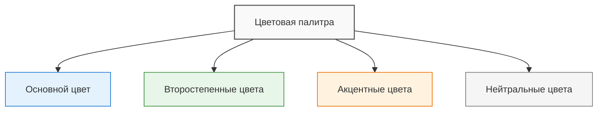
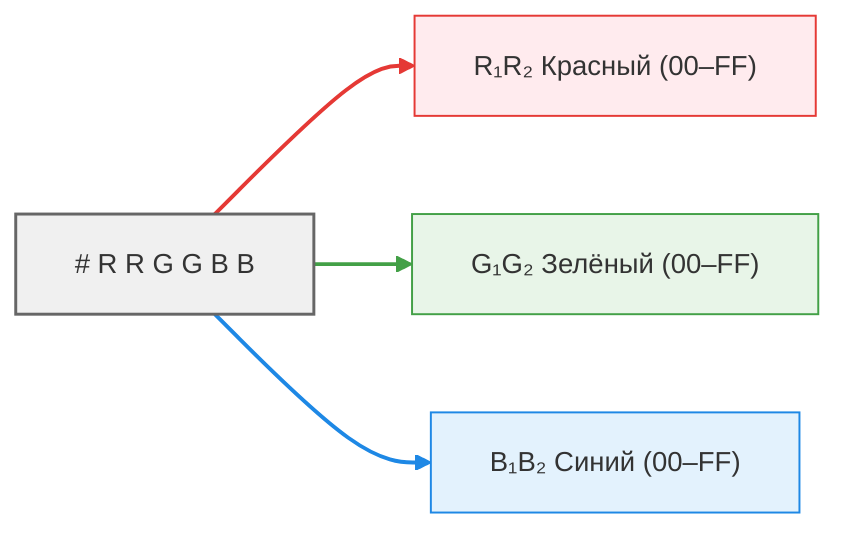
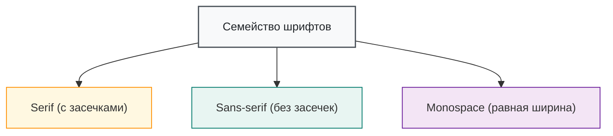
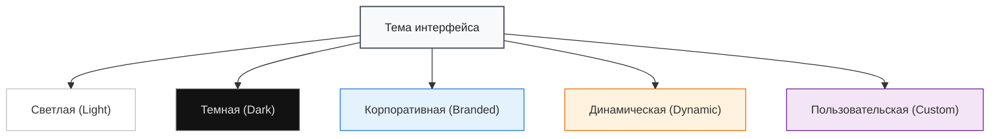

---
tags:
  - analytic
  - developer
  - tester
  - required
  - beginner
title: Визуальные элементы
description: "Цветовая палитра — это набор цветов, которые используются в интерфейсе для создания визуальной идентичности продукта."
  передачи информации.
---

import UiVisualElementsDemo from '@site/src/components/UiVisualElementsDemo';

# Визуальные элементы

<div class="article-tags">
  <span class="tag tag-required">ОБЯЗАТЕЛЬНО</span>
  <span class="tag tag-beginner">ДЛЯ НОВИЧКОВ</span>
</div>

<span class="complexity-badge">Разработчику</span>
<span class="complexity-badge">Аналитику</span>
<span class="complexity-badge">Тестировщику</span>

<UiVisualElementsDemo />

## Визуальные элементы

### Цвета

**Цветовая палитра** — это набор цветов, которые используются в интерфейсе для создания визуальной идентичности продукта.

*Основной цвет* - доминирующий цвет, который отражает бренд или стиль продукта.

*Второстепенные цвета* — это дополнительные оттенки, которые поддерживают основной цвет.

*Акцентные цвета* - яркие цвета, используемые для выделения важных элементов (например, кнопок и уведомлений).

*Нейтральные цвета* - белый, серый, чёрный, бежевый - используются для фона, текста и других ненавязчивых элементов.



---

**HEX (Hexadecimal Color Code)** — это способ представления цвета в виде шестнадцатеричного кода. Этот формат используется в веб-дизайне и программировании для задания цветов в HTML, CSS и других технологиях.

HEX начинается с символа #, за которым следуют 6 символов (например, #FFFFFF).

Первые два символа обозначают интенсивность красного (Red), следующие два — зелёного (Green), последние два — синего (Blue).



Примеры:
	- Белый: __ #FFFFFF (максимальная интенсивность всех трёх цветов).
	- Чёрный: __ #000000 (отсутствие всех цветов).
	- Красный: __ #FF0000 (только красный цвет на максимуме).
	- Синий: __ #0000FF (только синий цвет на максимуме).
	
---

**RGB (Red, Green, Blue)** — это модель цветопередачи, основанная на смешении трёх основных цветов: красного, зелёного и синего. Каждый цвет представлен числом от 0 до 255, где 0 означает отсутствие цвета, а 255 — максимальную интенсивность.

RGB записывается как три числа через запятую, заключённые в функцию rgb(). Например, rgb(255, 0, 0) — это красный цвет.

Примеры:
	- Белый: __ rgb(255, 255, 255).
	- Чёрный __: rgb(0, 0, 0).
	- Жёлтый: __ rgb(255, 255, 0) (красный + зелёный).
	- Фиолетовый: __ rgb(128, 0, 128) (красный + синий).

HEX и RGB — это два способа представления одного и того же цвета. Каждая пара символов в HEX соответствует значению одного из цветов в RGB. Можно разделить HEX-код на три пары символов (например, FF, 57, 33), преобразовать каждую пару из шестнадцатеричной системы в десятичную и получится RGM.

Например:
```
#FF5733 → rgb(255, 87, 51).
#00FF00 → rgb(0, 255, 0).
```

Сейчас нет нужды заучивать основные цвета. Существуют возможности в редакторах кода, которые автоматически могут подсветить цвет, к примеру, в Visual Studio Code - вы сразу увидите, какой цвет сейчас "спрятан" в коде.
 
Также на просторах сети можно найти интересные сайты, которые позволяют быстро подобрать нужный цвет и скопировать код из таблицы.

---

### Шрифт

**Шрифт (Font)** — это графическое представление символов, букв и цифр, которое используется для отображения текста.

**Типографика** — это искусство и наука выбора, комбинирования и расположения шрифтов в интерфейсе.

**Семейство шрифтов (font family)** это классификация шрифтов по стилю:
	- Serif (с засечками): Times New Roman, Georgia.
	- Sans-serif (без засечек): Arial, Helvetica, Roboto.
	- Monospace: Courier, Consolas (одинаковая ширина символов).



Шрифты играют ключевую роль в дизайне интерфейсов, брендинге и визуальной коммуникации. Они влияют на читаемость, стиль и восприятие текста. Рассмотрим самые популярные шрифты.

	- **Roboto** используется в Android, Google Docs, YouTube.
	- **Helvetica** используется в Apple, American Airlines, Panasonic.
	- **Arial** используется в Microsoft Office, Windows.
	- **Open Sans** используется в Google Fonts, сайтах, презентациях.
	- **Montserrat** используется в логотипах, заголовках, творческих проектах.
	- **Times New Roman** используется в печати, статьях, книгах и документах.
	- **Georgia** используется в веб-сайтах, блогах, онлайн-журналах.
	- **Baskerville** используется в книгах, журналах, логотипах.
	- **Playfair Display** используется для заголовков, логотипов, веб-дизайна.
	- **Courier New** используется для кода, текстовых файлов и сценариев фильмов.
	- **Consolas** используется в Visual Studio, Sublime Text, других IDE.
	- **Fira Code** используется для разработки ПО, в коде.
	- **Pacifico** используется для логотипов, открыток, творческих проектов.
	- **Dancing Script** используется для приглашений, визиток, декоративности.
	- **Lobster** используется в логотипах, заголовках, кафе и ресторанах.
	- **Bebas Neue** используется для постеров, баннеров, логотипов.

**Размер шрифта (font size)** определяет высоту символов (например, 10px для основного текста, 14px для заголовка второго уровня, 18px для заголовка первого уровня).

**Насыщенность (font weight)** — это толщина шрифта (light, regular, bold).

**Межстрочный интервал (line height)** — это расстояние между строками текста.

**Межбуквенный интервал (letter spacing)** — это расстояние между символами.

**Цвет текста** - контрастность относительно фона.

---

### Иконки и символы

**Иконки** — это графические элементы, которые заменяют или дополняют текст для передачи информации.

**Символы** — это более простые графические элементы, такие как стрелки ➡️, галочки ✅, крестики ❌.

Основные характеристики иконок и символов — это стиль, размер, цвет и универсальность.

Стиль может быть линейным (тонкие линии →), сплошным (закрашенные области ➞) или комбинированным (⇒).

Размер подразумевает, что иконки имеют определённое соотношение сторон, и они должны быть достаточно крупными для удобства взаимодействия (обычно 24x24 или 32x32).

Цвет обычно соответствует цветовой палитре интерфейса.

Универсальность подразумевает, что иконки должны быть понятны без текстового описания.

Грамотные иконки упрощают навигацию и взаимодействие с интерфейсом, экономят место на экране, к примеру, вместо слов «Конфигурация» или «Настройки» можно добавить иконку шестерёнки ⚙️, для сообщений - конверт ✉️ , для сохранения - дискета 💾 , для голосовой записи - микрофон 🎙, и это значительно освободит место.

Визуально иконки привлекательнее, чем текст.

Также в современных платформах, вроде iOS, Android, macOS, Windows, Linux и ChromeOS можно использовать эмодзи - 😊 👍 🌎 📁 🔗.

---

### Фоновые изображения и текстуры

**Фоновые изображения (background)** — это графические элементы, которые используются в качестве фона интерфейса или его частей. Это могут быть фотографии, иллюстрации, градиенты или абстрактные узоры.

В качестве фонового изображения можно добавлять фотографии, иллюстрации, геометрические узоры. Обычно важно, чтобы фоновое изображение занимало весь экран. Если, к примеру, поставить его фиксированно в центр и установить размер 800x600, то на мониторе с разрешением 4K это изображение покажется как иконка, а всё остальное место будет пустовать. Поэтому важна адаптивность - изображения должны корректно отображаться на всех устройствах (мобильных, планшетах, десктопах).

Фон должен сочетаться с остальными элементами интерфейса, поэтому иногда изображения делают полупрозрачными, чтобы текст был лучше читаем.
Хорошие изображения устанавливают настроение и атмосферу, привлекают внимание и могут даже служить ориентиром для разделения контента.

**Текстуры** — это графические элементы, которые имитируют поверхности реальных материалов (например, бумагу, дерево, металл, ткань). Они добавляют глубину и тактильность интерфейсу.

Текстура может быть растровой (например, фотография дерева) или векторной (например, геометрический узор). Они обычно нейтральные, чтобы не конфликтовать с основным содержимым, и часто накладываются с полупрозрачностью, чтобы не перегружать дизайн. Например, можно использовать имитацию старой бумаги, деревянного пола или камня, чтобы усилить атмосферу.

---

### Темы

**Темы** интерфейса — это набор визуальных и функциональных параметров, которые определяют внешний вид и поведение пользовательского интерфейса.

Темы позволяют настроить дизайн приложения или сайта в соответствии с предпочтениями пользователя, контекстом использования или брендовыми требованиями.

Фактически, темы охватывают весь визуал - от цветов до анимаций.

*Светлая тема (Light)* использует светлый фон и темный текст, создаёт ощущение простора и легкости.

*Темная тема (Dark)* использует тёмный фон и светлый текст, и уменьшает нагрузку на глаза в темноте.

*Корпоративная тема (Branded)* отражает фирменный стиль компании (цвета, логотипы, шрифты, анимации) и используется для узнаваемости бренда.

*Динамическая тема (Dynamic)* автоматически меняется в зависимости от времени суток или условий освещения.

*Пользовательская тема (Custom)* позволяет пользователю настраивать интерфейс под свои предпочтения (выбор цветов, шрифтов, иконок).



---
