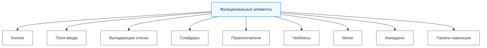

---
tags:
  - analytic
  - developer
  - tester
  - required
  - beginner
title: Функциональные элементы
description: "Разбор функциональных компонентов интерфейса, кнопок, полей ввода, чекбоксов и переключателей с акцентом на удобство и стандарты использования."
---

import ExternalPlayEmbed from '@site/src/components/ExternalPlayEmbed';

# Функциональные элементы

  ОБЯЗАТЕЛЬНО
  ДЛЯ НОВИЧКОВ

Разработчику
Аналитику
Тестировщику

<ExternalPlayEmbed example="basics/ui-functional-elements-demo" title="Ui Functional Elements" minHeight={420} />

---

## Функциональные элементы

**Кнопки** — это элементы управления, которые позволяют пользователю выполнять определенные действия. Они обычно содержат текст или иконку и реагируют на клик пользователя.

---

**Поля ввода** — это элементы, предназначенные для ввода текстовой информации пользователем. Они могут быть однострочными (input) или многострочными (textarea).

---

**Выпадающие списки (dropdowns)** позволяют пользователю выбирать один или несколько вариантов из предложенного списка. Они экономят место на экране и упрощают выбор.

---

**Слайдеры** — это элементы управления, которые позволяют пользователю выбирать значение из диапазона. Они часто используются для настройки параметров, таких как громкость или яркость.

---

**Переключатели (toggle switches)** позволяют пользователю включать или выключать определенные функции. Они работают по принципу "вкл/выкл". Их также называют флагами.

---

**Чекбоксы** — это элементы управления, которые позволяют пользователю выбрать один или несколько вариантов из списка. Они представлены в виде маленьких квадратов, которые можно отметить. Их также называют галочками.

- [x] Выполненная задача
- [ ] Невыполненная задача
- [ ] Другая задача

---

**Меню** — это набор пунктов, организованных в виде списка или сетки, который позволяет пользователю выбирать действия или переходить на другие страницы.

---

**Аккордеон (Accordion)** — блок с раскрывающимися секциями: виден заголовок, по клику открывается содержимое, остальные секции при этом могут сворачиваться. Часто используют в FAQ, настройках и длинных формах, чтобы не перегружать экран.

Типичные правила:

- заголовок секции кликабелен целиком, не только иконка «стрелка»;
- состояние «открыто/закрыто» видно и по иконке, и по `aria-expanded`;
- в HTML5 для простых случаев достаточно пары `
` + `
` без JavaScript;
- если секций много, не открывайте все сразу — пользователь теряет ориентир.

Пример вёрстки и стилей — [аккордеон в CSS](/encyclopedia/3-data-markup/3-10-css/113#аккордеон-accordion).

---

**Панели навигации** — это элементы интерфейса, которые помогают пользователю перемещаться между различными разделами приложения или сайта.

---
