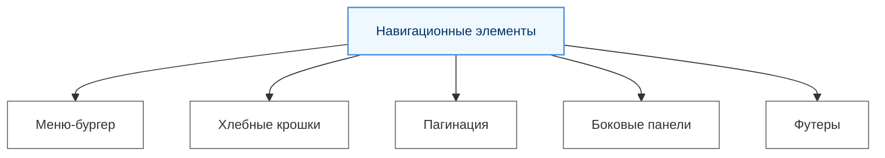

---
tags:
  - analytic
  - developer
  - tester
  - required
  - beginner
title: Навигационные элементы
description: "Архитектура навигационных элементов интерфейса, принципы построения меню, хлебных крошек и систем перемещения между разделами приложений."
---

import ExternalPlayEmbed from '@site/src/components/ExternalPlayEmbed';

# Навигационные элементы

  ОБЯЗАТЕЛЬНО
  ДЛЯ НОВИЧКОВ

Разработчику
Аналитику
Тестировщику

<ExternalPlayEmbed example="basics/ui-navigation-elements-demo" title="Ui Navigation Elements" minHeight={420} />

---

## Навигационные элементы

**Меню-бургер (Burger menu, «гамбургер»)** — компактная кнопка из трёх горизонтальных линий, которая открывает и скрывает навигацию на узких экранах. На мобильных устройствах горизонтальное меню не помещается в шапку, поэтому ссылки прячут в выдвижную панель или выпадающий блок. Иконка «бургера» экономит место и стала стандартом адаптивных сайтов.

При проектировании важно:

- область нажатия не меньше **44×44 px**;
- у кнопки есть понятная подпись для скринридера (`aria-label="Открыть меню"`);
- меню закрывается повторным нажатием, кликом по ссылке или клавишей Escape (в продакшене обычно подключают JavaScript);
- на широком экране пункты снова показываются в строку, а «бургер» скрывается.

Реализация на чистом CSS — через скрытый `checkbox` и медиазапросы; разбор с кодом — в [типовых элементах CSS](/encyclopedia/3-data-markup/3-10-css/113#меню-бургер-burger-menu).

---

**Хлебные крошки (Breadcrumbs)** — это навигационный элемент, который показывает текущее положение пользователя в структуре сайта или приложения. Обычно они отображаются в виде цепочки ссылок, разделенных символом (например, /), и позволяют быстро вернуться на предыдущие уровни.

---

**Пагинация (Pagination, от слова Page - страница)** — это элемент управления, который разделяет контент на страницы для удобства просмотра. Она часто используется в списках, каталогах или поисковых результатах, чтобы избежать перегрузки интерфейса большим объемом информации.

---

**Боковые панели (Sidebars, сайдбары)** — это вертикальные области, расположенные слева или справа от основного контента. Они используются для дополнительной навигации, фильтров, меню или второстепенной информации.

---

**Футеры (Footers)** — это нижняя часть страницы, которая содержит важную информацию, такую как контактные данные, ссылки на политику конфиденциальности, карту сайта или ссылки на социальные сети. Футеры помогают улучшить навигацию и предоставляют пользователю дополнительные возможности взаимодействия с сайтом.

---
