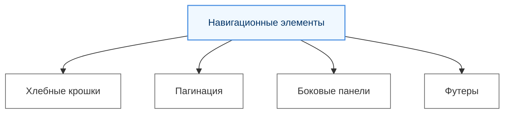
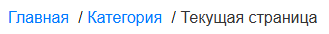

# Навигационные элементы

  ОБЯЗАТЕЛЬНО
  ДЛЯ НОВИЧКОВ

Разработчику
Аналитику
Тестировщику

## Навигационные элементы

**Хлебные крошки (Breadcrumbs)** — это навигационный элемент, который показывает текущее положение пользователя в структуре сайта или приложения. Обычно они отображаются в виде цепочки ссылок, разделенных символом (например, /), и позволяют быстро вернуться на предыдущие уровни.

---

**Пагинация (Pagination, от слова Page - страница)** — это элемент управления, который разделяет контент на страницы для удобства просмотра. Она часто используется в списках, каталогах или поисковых результатах, чтобы избежать перегрузки интерфейса большим объемом информации.

---

**Боковые панели (Sidebars, сайдбары)** — это вертикальные области, расположенные слева или справа от основного контента. Они используются для дополнительной навигации, фильтров, меню или второстепенной информации.

---

**Футеры (Footers)** — это нижняя часть страницы, которая содержит важную информацию, такую как контактные данные, ссылки на политику конфиденциальности, карту сайта или ссылки на социальные сети. Футеры помогают улучшить навигацию и предоставляют пользователю дополнительные возможности взаимодействия с сайтом.

---
