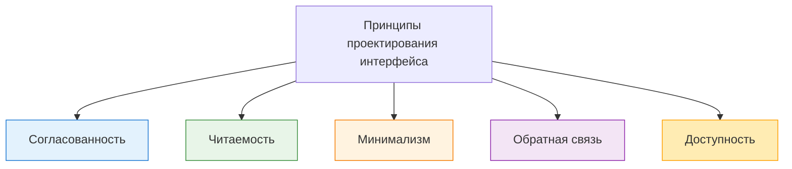

---
title: Особенности и принципы UX и UI
tags: [beginner, notrequired, analytic, developer, tester]
description: Правила создания удобных и понятных интерфейсов.
---

# Особенности и принципы UX и UI

  ДЛЯ НОВИЧКОВ
  НЕ ОБЯЗАТЕЛЬНО
  В РАЗРАБОТКЕ

Разработчику
Аналитику
Тестировщику

## Особенности и принципы UX и UI

**Юзабилити (Usability)** — это мера того, насколько легко и эффективно пользователь может взаимодействовать с интерфейсом для достижения своих целей. Хорошее юзабилити означает, что продукт полезен, эффективен, лёгок в обучении, удобен, и удовлетворяет пользователя.

**Удобство (Convenience)** — это характеристика интерфейса, которая отражает, насколько комфортно пользователю выполнять задачи. Удобство зависит от скорости выполнения задач, минимальных усилий для достижения результата и отсутствия лишних шагов или сложностей.

**Интуитивность (Intuitiveness)** — это способность интерфейса быть понятным пользователю без дополнительных объяснений или обучения. Интуитивный интерфейс предполагает очевидность действий, прогнозируемость поведения и знакомые паттерны (общепринятые стандарты).

**Адаптивность (Responsiveness / Adaptability)** — это способность интерфейса подстраиваться под различные условия использования, такие как размер экрана, контекст использования и скорость интернета. Адаптивный сайт автоматически меняет расположение элементов на маленьком экране.

**Поведение (Behavior)**. Поведение интерфейса описывает, как он реагирует на действия пользователя. Обычно поведение сочетаемо с удобством - поведение должно соответствовать ожиданиям, и интерфейс должен вести себя так, как это ожидает пользователь.

---

### Принципы проектирования интерфейса

**Согласованность (Consistency)** — это использование одинаковых шаблонов, стилей и правил во всем интерфейсе. Она помогает избежать путаницы у пользователя, ускорить обучение и запоминание, а также создать единый визуальный стиль.

**Читаемость (Readability)** — это способность текста быть легко воспринимаемым. Она зависит от размера шрифта, цвета текста и фона, а также межстрочного расстояния.

**Минимализм (Minimalism)** — это подход, при котором в интерфейсе остаются только самые важные элементы. Это помогает уменьшить когнитивную нагрузку и фокусировать внимание пользователя на ключевых задачах.

**Обратная связь (Feedback)** — это реакция интерфейса на действия пользователя. Она должна быть немедленной и чёткой, когда пользователь видит результат своего действия и понимает, что произошло.

**Доступность (Accessibility)** — это обеспечение возможности использования интерфейса для всех пользователей, включая людей с ограниченными возможностями. Она включает поддержку скринридеров, контрастные цвета, возможность управления с клавиатуры.

---

---
