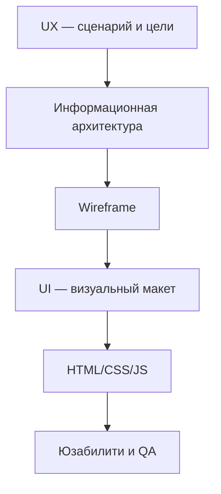

# Веб-дизайн — маршрут от UX до портфолио

  ОБЯЗАТЕЛЬНО
  ДЛЯ НОВИЧКОВ

Дизайнеру
Разработчику
Аналитику

> **Зачем эта статья.** Темы веб-дизайна в энциклопедии **разбросаны** по разделам "Интерфейс", "Графика", "Веб-сайты", "HTML/CSS", "Тестирование" и "Карьера". Здесь — **единый маршрут**: что изучать, в каком порядке и куда смотреть при проектировании конкретного типа сайта.

  
Границы маршрута

  

  Статья про **проектирование опыта и визуала** веб-страниц. Вёрстка и код — [HTML](/encyclopedia/3-data-markup/3-09-html/intro)

  [CSS](/encyclopedia/3-data-markup/3-10-css/intro)

  [JavaScript](/encyclopedia/5-languages/5-01-javascript/intro); сервер и деплой — [веб-сайты и веб-приложения](/encyclopedia/2-system-network/2-04-kak-rabotayut-sayty-i-veb-sayty/intro).

  

---

## Как пользоваться маршрутом

| Шаг | Действие |
|-----|----------|
| 1 | Пройдите блок 1, если только входите в UX/UI |
| 2 | Блок 2 — перед любым макетом в Figma или коде |
| 3 | Блоки 3–6 — по типу проекта (лендинг, магазин, портал) |
| 4 | Блоки 7–8 — перед сдачей заказчику и сбором портфолио |
| 5 | Теорию закрепите практикой — [лабораторный кейс "GitHub Pages"](/lab/Кейсы/3), [HTML-страницы целиком](/lab/Примеры/1153), учебный макет в [CSS — практика](/encyclopedia/3-data-markup/3-10-css/8), [готовые макеты HTML+CSS](/lab/Примеры/110) или [Tailwind — готовые блоки](/lab/Примеры/1117) |

  
Связка "макет → проверка"

  

  После каждого блока откройте макет в браузере на телефоне и ноутбуке, пройдите сценарий глазами нового пользователя и сверьте чек-лист из <a href="./99.md">самопроверки раздела</a>. Дизайн без проверки остаётся гипотезой.

  

---

## Блок 1 — UX/UI и основы визуального дизайна

**UX (User Experience)** — путь пользователя к цели — что он думает, где застревает, доволен ли результатом. **UI (User Interface)** — то, что видит и нажимает — кнопки, сетка, цвет, типографика. UI **реализует** стратегию UX; красивая картинка без сценария редко решает задачу бизнеса.

### Базовые понятия раздела "Интерфейс"

| Тема | Материал | Зачем |
|------|----------|-------|
| UX и UI, виды интерфейса | [Пользовательский интерфейс — UX и UI](./1.md) | Словарь и границы дисциплин |
| Визуальные элементы | [Визуальные элементы](./2.md) | Цвет, шрифт, иконки, контраст |
| Функциональные элементы | [Функциональные элементы](./3.md) | Кнопки, поля, переключатели |
| Навигация | [Навигационные элементы](./4.md) | Меню, хлебные крошки, табы |
| Обратная связь | [Элементы обратной связи](./5.md) | Загрузка, ошибки, успех |
| Принципы и юзабилити | [Особенности и принципы UX и UI](./6.md) | Согласованность, a11y, интерактивная демо |

### Визуальная коммуникация и веб-композиция

| Тема | Материал |
|------|----------|
| Макет, типографика, иерархия | [Графический дизайн](/encyclopedia/1-basics/1-16-grafika/6) |
| Структура веб-страницы (хедер, hero, блоки) | [Дизайн веб-интерфейсов](/encyclopedia/2-system-network/2-04-kak-rabotayut-sayty-i-veb-sayty/2) |
| Сетка и адаптив | [Flexbox и CSS Grid](/encyclopedia/3-data-markup/3-10-css/2), [Адаптивный дизайн](/encyclopedia/3-data-markup/3-10-css/7) |
| Разметка целой страницы | [HTML-страницы целиком](/lab/Примеры/1153) |
| Готовые страницы HTML+CSS | [HTML + CSS — готовые макеты](/lab/Примеры/110) |
| Tailwind — готовые блоки | [Tailwind — готовые блоки](/lab/Примеры/1117) |
| CSS-анимации (fade, loader, hover) | [CSS-анимации — готовые эффекты](/lab/Примеры/1116) |
| Типовые UI-компоненты в CSS | [Типовые элементы интерфейса](/encyclopedia/3-data-markup/3-10-css/113) |
| Доступность в стилях | [Доступность в CSS](/encyclopedia/3-data-markup/3-10-css/117) |
| Термины | [UX](/glossary/Ю#ux), [UI](/glossary/П#пользовательский-интерфейс-ui) |

---

## Блок 2 — референсы и прототипирование

Проект начинается с **брифа** и **аудитории**, а не с выбора шрифта. Референсы фиксируют ожидания заказчика; прототип проверяет логику до дорогой отрисовки.

### Референсы и moodboard

| Шаг | Что делать | Материал |
|-----|------------|----------|
| Собрать референсы | 5–10 экранов конкурентов и смежных продуктов; выписать, **что** нравится (сетка, тон, CTA) | [Графический дизайн — концептуализация](/encyclopedia/1-basics/1-16-grafika/6#графический-дизайн-как-проектная-деятельность) |
| Moodboard | Палитра, фото, текстуры, 2–3 шрифта — единое настроение | [Графика — вектор и растр](/encyclopedia/1-basics/1-16-grafika/2) (SVG, `srcset` для веба); учебные фигуры в SVG — [Lab / 1119](/lab/Примеры/1119) |
| Согласовать с заказчиком | Зафиксировать "да / нет" до high-fi | [Формализация требований](/encyclopedia/7-project/7-04-analitika/116) |

### Уровни прототипа

| Уровень | Содержание | Инструменты (примеры) |
|---------|------------|------------------------|
| **Low-fi** | Блоки, текст-рыба, порядок секций | Бумага, FigJam, Balsamiq |
| **Mid-fi** | Wireframe — без финального визуала | Figma, Penpot |
| **High-fi** | Цвет, типографика, компоненты | Figma + [дизайн-система](/encyclopedia/3-data-markup/3-10-css/111) |
| **Интерактивный** | Клики, переходы, состояния | Figma Prototype, HTML-прототип |

**Где углубиться**

- Wireframe снимает споры "я имел в виду другое" — [Коммуникация в команде](/encyclopedia/7-project/7-02-komanda-i-upravlenie/113)
- Прототипирование в жизненном цикле ПО — [Конструирование — RAD и прототипы](/encyclopedia/7-project/7-12-konstruirovanie-po/3)
- Wireframes / Figma в стеке разработки — [Конструирование — инструменты](/encyclopedia/7-project/7-12-konstruirovanie-po/5)
- ИИ-помощники для UI (Magician и аналоги) — [Нейросети — экосистема](/encyclopedia/6-ai/6-03-neyroseti/111); результат всё равно проходит ревью дизайнера

---

## Блок 3 — лонгрид и лендинг

**Лендинг** — одна страница под одну цель (заявка, регистрация, покупка). **Лонгрид** — длинная страница или серия материалов, где читатель идёт сверху вниз по сюжету (статья, отчёт, кейс).

### Лендинг — типовая структура

| Секция | Задача | Проверка |
|--------|--------|----------|
| Hero | Ценность за 5 секунд + CTA | Понятно без прокрутки? |
| Проблема / решение | Зачем продукт | Текст для целевой аудитории |
| Преимущества | 3–6 тезисов | Иконки + короткие заголовки |
| Социальное доказательство | Отзывы, логотипы клиентов | Реальные цитаты |
| FAQ | Снять возражения | Не дублирует блок выше |
| Финальный CTA | Повтор призыва | Контрастная кнопка |

Подробнее про hero, модульные блоки и CTA — [Дизайн веб-интерфейсов](/encyclopedia/2-system-network/2-04-kak-rabotayut-sayty-i-veb-sayty/2).

### Лонгрид — типовая структура

| Приём | Зачем |
|-------|-------|
| Оглавление с якорями | Навигация по длинному тексту |
| Визуальные паузы | Инфографика, цитаты, подзаголовки каждые 3–4 абзаца |
| Прогресс чтения | Полоска или "осталось N мин" |
| Единая типографическая шкала | [Текст — о разделе](/encyclopedia/1-basics/1-15-tekst/intro) |

### Сборка без кода и с кодом

| Подход | Когда | Материал |
|--------|-------|----------|
| Конструктор (Tilda и др.) | Быстрый маркетинговый лендинг | [Конструкторы сайтов](/encyclopedia/2-system-network/2-04-kak-rabotayut-sayty-i-veb-sayty/113), [Справочник Tilda](/encyclopedia/2-system-network/2-04-kak-rabotayut-sayty-i-veb-sayty/122) |
| HTML + CSS | Учебный проект, полный контроль | [HTML — о разделе](/encyclopedia/3-data-markup/3-09-html/intro), [HTML-страницы целиком](/lab/Примеры/1153), [CSS — практика](/encyclopedia/3-data-markup/3-10-css/8), [готовые макеты](/lab/Примеры/110), [Tailwind — готовые блоки](/lab/Примеры/1117), [CSS-анимации](/lab/Примеры/1116) |
| Статика на GitHub Pages | Портфолио и визитка | [Кейс "GitHub Pages"](/lab/Кейсы/3) |

---

## Блок 4 — интернет-магазин

Магазин — это **каталог + корзина + оплата + личный кабинет**. Дизайн должен вести к покупке и не терять пользователя на каждом шаге.

### Ключевые экраны

| Экран | UX-фокус | Связь с разработкой |
|-------|----------|---------------------|
| Каталог / листинг | Фильтры, сортировка, карточка товара | [REST-практикум OrderDesk](/encyclopedia/8-infra-security/8-08-praktikum-rest-i-websocket/1) |
| Карточка товара | Фото, цена, наличие, "в корзину" | [Функциональные элементы](./3.md) |
| Корзина | Редактирование, доставка, итог | [Тестирование корзины](/encyclopedia/7-project/7-05-testirovanie/1#функциональное-тестирование) |
| Оформление заказа | Минимум полей, прогресс шагов | [Формы в веб-тестировании](/encyclopedia/7-project/7-05-testirovanie/128.md#чек-лист--формы-и-ввод) |
| Личный кабинет | История, статусы, повтор заказа | [Паттерн State в архитектуре](/encyclopedia/7-project/7-06-proektirovanie-i-arhitektura/115) |

### Дизайн-чек-лист магазина

- Поиск и фильтры видны на первом экране каталога
- Цена и кнопка "Купить" не прыгают при смене варианта (размер, цвет)
- Пустая корзина объясняет следующий шаг
- Ошибки оплаты — понятный текст и путь "попробовать снова"
- Мобильная версия — палец дотягивается до CTA ([адаптив](/encyclopedia/3-data-markup/3-10-css/7))

---

## Блок 5 — новостной и корпоративный сайт

### Новостной портал и медиа

| Задача | Решение в дизайне |
|--------|-------------------|
| Много материалов | Лента, рубрики, теги, "похожие" |
| Быстрое сканирование | Крупные заголовки, дата, автор, превью |
| Удержание | Блок "читайте также", подписка |
| Доверие | Раздел "Редакция", контакты, политика |

Технически часто **CMS** (WordPress, 1C-Bitrix, headless) — [Конструкторы и CMS](/encyclopedia/2-system-network/2-04-kak-rabotayut-sayty-i-veb-sayty/113). Вёрстка статей — семантические теги `article` и `time` в [разделе HTML](/encyclopedia/3-data-markup/3-09-html/intro).

### Корпоративный сайт

| Раздел | Содержание |
|--------|------------|
| О компании | Миссия, история, команда |
| Услуги / продукты | B2B-воронка, кейсы |
| Карьера | Вакансии, культура |
| Контакты и реквизиты | Карта, форма, документы |
| Пресс-центр / новости | Связка с медиа-блоком |

Корпоративный сайт часто интегрируется с **CRM**, **ERP** и личными кабинетами партнёров — см. [Корпоративное ПО](/encyclopedia/2-system-network/2-02-platformy/3001), [Аналитика — о разделе](/encyclopedia/7-project/7-04-analitika/intro). Дизайн согласуют с [брендбуком](/encyclopedia/1-basics/1-16-grafika/6#функция-идентификации) и юридическими требованиями ([152-ФЗ, cookies](/encyclopedia/2-system-network/2-04-kak-rabotayut-sayty-i-veb-sayty/116)).

---

## Блок 6 — портфолио и сайт агентства

### Портфолио специалиста

| Элемент | Зачем |
|---------|-------|
| Hero с ролью | "Frontend-разработчик / UX-дизайнер" за 10 секунд |
| 3–6 кейсов | Задача → процесс → результат (метрики, если есть) |
| Навыки и стек | Таблица или теги |
| Контакты | Email, Telegram, GitHub, резюме PDF |

Подробный разбор визитки и GitHub Pages — [Личный профиль и портфолио](/encyclopedia/1-basics/1-26-karera-v-it-i-mify/7). Для дизайнера в кейс кладут **скриншоты, wireframe, финал** и короткий текст "что улучшилось".

### Сайт агентства (студии, интегратора)

| Блок | Отличие от личного портфолио |
|------|------------------------------|
| Услуги | Пакеты, отрасли, SLA |
| Кейсы | Логотипы клиентов, цифры (конверсия, срок) |
| Команда | Фото, роли, экспертиза |
| Блог / insights | SEO и доверие |
| Бриф / "Обсудить проект" | Форма + календарь созвона |

Агентский сайт — **витрина процесса**: покажите этапы "исследование → прототип → дизайн → передача в разработку" — это снижает страх заказчика перед "чёрным ящиком".

---

## Блок 7 — UX-исследования и юзабилити-тестирование

Дизайн проверяют на **реальных людях**, а не только на команде. Даже 5 коротких сессий находят проблемы, которые месяцами не замечали в офисе.

### Виды исследований

| Метод | Когда | Результат |
|-------|-------|-----------|
| **Интервью** | Старт проекта, неясная аудитория | Боли, мотивация, словарь пользователя |
| **Опрос / анкета** | Много респондентов, количественные данные | Приоритеты функций |
| **Картирование сценария (CJM)** | Оптимизация воронки | Точки отвала |
| **A/B-тест** | Живой продукт, две гипотезы | Метрика конверсии |
| **Юзабилити-сессия** | Есть прототип или сайт | Список проблем по severity |

Теория юзабилити в QA — [Основы тестирования](/encyclopedia/7-project/7-05-testirovanie/1#тестирование-юзабилити), [Классификация — usability и a11y](/encyclopedia/7-project/7-05-testirovanie/111#удобство-использования). Веб-чек-листы — [Ручное тестирование веба](/encyclopedia/7-project/7-05-testirovanie/128.md), маршрут QA — [Основы тестирования веб-приложений — маршрут для QA](/encyclopedia/7-project/7-05-testirovanie/132.md).

### Мини-протокол юзабилити-сессии

1. **Задача** — "найди тариф Pro и оформи пробный период" (без подсказок "нажми слева").
2. **Думай вслух** — попросите комментировать действия.
3. **Наблюдатель** — фиксирует время, ошибки, цитаты.
4. **5 пользователей** — по [Нильсену](https://www.nngroup.com/articles/why-you-only-need-to-test-with-5-users/) часто хватает для выявления большинства проблем интерфейса.
5. **Отчёт** — таблица "проблема → частота → рекомендация → приоритет".

Продуктовые метрики после запуска — [Продуктовая аналитика](/encyclopedia/7-project/7-04-analitika/1123).

---

## Блок 8 — презентация проектов и сбор портфолио

### Презентация заказчику или на защите

| Слайд / блок | Содержание |
|--------------|------------|
| Контекст | Кто клиент, задача, ограничения |
| Исследование | Цитаты, персоны, CJM (кратко) |
| Альтернативы | 2–3 направления, почему выбран финал |
| Решение | Ключевые экраны, дизайн-система |
| Результат | Метрики, отзыв, ссылка на прод |
| Следующие шаги | Итерации, A/B, техдолг |

Визуал кейса — **до/после**, **wireframe рядом с финалом**, скриншот на реальном устройстве. Избегайте "голых" мокапов на сером фоне без пояснения задачи.

### Портфолио — оформление работ

- **3–6 сильных кейсов** лучше двадцати скриншотов
- Структура кейса — **STAR для дизайна** — Situation → Task → Actions (исследование, прототип, UI) → Result
- Behance / Dribbble / личный домен — каналы; **GitHub** — для дизайн-систем и HTML-верстки макета
- PDF one-pager — для отклика на вакансию за 30 секунд
- Карьерный контекст — [Карьера в IT — о разделе](/encyclopedia/1-basics/1-26-karera-v-it-i-mify/intro)

---

## Сводная таблица маршрута

| Блок | Тема | Старт в энциклопедии |
|------|------|----------------------|
| 1 | UX/UI и визуал | [Пользовательский интерфейс - UX и UI](./1.md) → [Особенности и принципы UX и UI](./6.md), [Графический дизайн](/encyclopedia/1-basics/1-16-grafika/6), [2.04/2](/encyclopedia/2-system-network/2-04-kak-rabotayut-sayty-i-veb-sayty/2) |
| 2 | Референсы и прототип | [Графика/6](/encyclopedia/1-basics/1-16-grafika/6), [Аналитика/116](/encyclopedia/7-project/7-04-analitika/116) |
| 3 | Лонгрид и лендинг | [2.04/2](/encyclopedia/2-system-network/2-04-kak-rabotayut-sayty-i-veb-sayty/2), [Tilda](/encyclopedia/2-system-network/2-04-kak-rabotayut-sayty-i-veb-sayty/122) |
| 4 | Интернет-магазин | [OrderDesk](/encyclopedia/8-infra-security/8-08-praktikum-rest-i-websocket/1), [Ручное тестирование веб-приложений](/encyclopedia/7-project/7-05-testirovanie/128.md) |
| 5 | Новости и корпорат | [CMS](/encyclopedia/2-system-network/2-04-kak-rabotayut-sayty-i-veb-sayty/113), [Аналитика](/encyclopedia/7-project/7-04-analitika/intro) |
| 6 | Портфолио и агентство | [Карьера/7](/encyclopedia/1-basics/1-26-karera-v-it-i-mify/7), [GitHub Pages](/lab/Кейсы/3) |
| 7 | Исследования и юзабилити | [Тестирование/1](/encyclopedia/7-project/7-05-testirovanie/1), [Основы тестирования веб-приложений — маршрут для QA](/encyclopedia/7-project/7-05-testirovanie/132.md) |
| 8 | Презентация и портфолио | [Карьера/7](/encyclopedia/1-basics/1-26-karera-v-it-i-mify/7) |

---

## Чек-лист перед сдачей макета

- [ ] Есть сценарий "новый пользователь → цель" и он проходится без подсказок
- [ ] Контраст текста и фона достаточен ([a11y](/encyclopedia/3-data-markup/3-10-css/117))
- [ ] CTA виден на mobile и desktop
- [ ] Состояния кнопок и форм — default, hover, disabled, error ([обратная связь](./5.md))
- [ ] Шрифты и отступы из одной шкалы ([типографика](/encyclopedia/1-basics/1-16-grafika/6))
- [ ] Референсы и бриф согласованы с заказчиком
- [ ] Проведена хотя бы одна юзабилити-сессия или экспертный обход по [Ручное тестирование веб-приложений](/encyclopedia/7-project/7-05-testirovanie/128.md)

Итоги всего раздела "Интерфейс" — [Интерфейс — итоги](./98.md). Самопроверка по базовым темам — [Интерфейс — чек-лист](./99.md).

---
