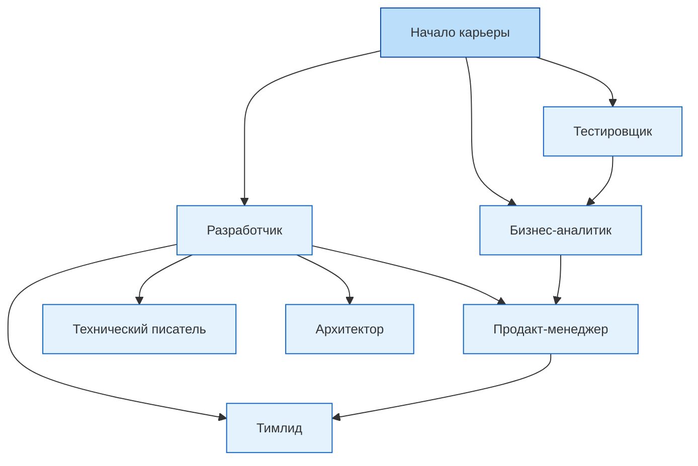

# Карьера в IT и мифы

  ОБЯЗАТЕЛЬНО
  ДЛЯ НОВИЧКОВ

Всем

## Обзор карьеры в IT

> Пробуйте разное — разработку, тестирование, аналитику, документацию, поддержку. Не зацикливайтесь на идеальном плане. Карьера в IT — это поиск своего места через эксперименты, а не по прямой.

  
Заметка

  Исследователи подтвердили, что нейросетевые резюме получают офферы (предложения о работе) гораздо чаще рукотворных. Шансы на трудоустройство разнятся в 20-60%. Так происходит, потому что HR-фильтры от аутсорсинговых систем до ручного просмотра рекрутерами, научились безжалостно находить косяки в человеческих текстах. А в идеально вылизанной по мнению нейросети, придраться не к чему. Сами нейросети выбирают чаще резюме, которые сгенерированы такими же нейросетями. Это назвали как "ИИ-нарциссизм". Поэтому сейчас у нас парадоксальная эпоха, когда мы пишем через роботов, чтобы понравится другим роботам. Забавно, не правда ли?

Карьера - это профессиональный путь, связанный с созданием, анализом или управлением. Она включает в себя разработку программного обеспечения и множество смежных ролей, таких как аналитика, тестирование, управление продуктом и обеспечение информационной безопасности.

Перед погружением в отрасль следует быть готовым к тому, что часть сведений являются мифами, распространёнными заблуждениями, формируемыми под влиянием медиа, маркетинга образовательных платформ и поверхностного понимания отрасли. Они могут вводить в заблуждение начинающих специалистов и искажать реальные ожидания работодателей.

К сожалению, СМИ и медиа пропагандировали долгое время именно обучение языкам и «быстрый путь к хорошим деньгам». Многие начинающие ошибочно считают, что освоение одного языка программирования гарантирует трудоустройство, однако рынок труда предъявляет более широкие требования к компетенциям специалиста. Но важно усвоить несколько ключевых моментов.

1. *Мы не нужны рынку*. Звучит грубо, но рынок труда всё же ориентирован на ценность, которую специалист приносит бизнесу, а не на факт наличия технических знаний. Если мы не усвоим это, развития не будет. Не нужно считать, что обучившись языку программирования или новой трендовой технологии, за нами побегут, такому не бывать.
2. *Работодатели прекрасно знают о лёгкости обучения и о том, что можно использовать нейросети*. На практике нейросети вас не спасут, когда речь пойдёт о решении сложных задач, к примеру, когда проект огромен, и без знания контекста ИИ просто не справится с задачей.
3. *IT является лабиринтом*. В отличие от традиционных профессий, где можно стать узким специалистом (юрист-договорник, стоматолог-хирург), здесь требуется гибкость и адаптация, а не приверженность чему-то одному. Думая, что вы «сначала изучите одну технологию в идеале, потом перейдёте к другой», вы рискуете застрять на этой технологии на всю жизнь. А время летит, нужно развиваться и изучать больше технологий.
4. *Но не нужно прыгать с одного стека на другой и бежать за каждым трендом*. Как было заметно из истории, если поначалу использовали одни инструменты, через несколько лет появлялись другие инструменты, и вроде бы создаётся впечатление «устаревания» и «замены старья». Но это работает немного сложнее, ведь представьте, после раздувания IT-пузыря на рынке, всех специалистов, следящих за трендами, стало много. Поэтому важно следить, изучать, но не переключаться полностью. Просто будьте в курсе.

Вот такая вот противоречивая ситуация получается, из-за которой новички и застревают в ужасе. Если представить себе развитие карьеры как движение по маршруту, то в большинстве случаев в IT этот маршрут не прямолинейный. Он извилистый, полон поворотов, ответвлений и иногда даже обратных путей. И это нормально.

Карьерный путь в IT

Карьера в IT чаще напоминает граф с множеством узлов, где специалист может начать как разработчик, затем перейти в аналитику, а завершить путь как технический писатель или преподаватель. Гибкость и любознательность важнее узкой специализации на ранних этапах.

Надо с чего-то начать, и для начала изучите базу - аналитику, разработку, тестирование. Именно поэтому в первом томе нет большого акцента на разработке, ведь не факт, что вы именно разработчик. Здесь у вас два пути.

Первый путь - **линейный** (специализированная траектория). Вы начинаете кодить/тестить/анализировать, развиваться в разных технологиях, повышать квалификацию и поступаете на первую должность ассистентом, стажером или, если повезёт, джуном. Дальше вам нужно просто работать, развиваться, набираться опыта, потом пройдёте карьерный рост с младшего к старшему, а потом станете лидом группы разработки/тестирования/аналитики на проекте. Вполне хорошо, почему бы и нет.

Второй путь - **«графовый» и извилистый** (трансверсальная траектория). Вы попробовали кодить и понимаете, что работать с документацией вам легче, но вот писать программы тяжко, постоянно ошибаетесь, и много времени тратите на анализы или тесты задач. Можно попробовать переквалифицироваться в тестировщики или аналитики, и если не подойдёт, пробовать себя дальше - продакт-менеджер, администратор, маркетолог, DevOps, технический писатель, преподаватель, и так далее. Вот лишь некоторые из них:

| Профессия | Описание |
| :--- | :--- |
|Product Manager / Продакт-менеджер / Руководитель	|Отвечает за жизненный цикл продукта, взаимодействует между командой и бизнесом.
|Business Analyst / Бизнес-аналитик	|Исследует потребности клиентов, переводит их в технические требования.
|Система Analyst / Системный аналитик	|Анализирует процессы, системы и данные, чтобы предлагать решения.
|Project Manager /  Scrum Master	|Управляет процессами, сроками, коммуникацией внутри команды.
|QA / Тестировщик ПО	|Обеспечивает качество продукта, находит баги, пишет тест-кейсы.
|DevOps / SRE (Site Reliability Engineer)	|Занимается инфраструктурой, деплоем, автоматизацией процессов.
|UI/UX Designer / Дизайнер / Веб-дизайнер / Графический дизайнер	|Создаёт интерфейсы, исследует пользовательское поведение, проектирует удобные продукты.
|Technical Writer / Технический писатель	|Пишет документацию, туториалы, справочные материалы.
|Support / Helpdesk Specialist / Техническая поддержка	|Консультирует пользователей, решает технические проблемы.
|Системный администратор	|Отвечает за установку программ, настройку серверов и железа.
|Данные Analyst / Аналитик данных / Данные Scientist / Данные Engineer	|Работает с данными, строит отчёты, анализирует метрики.
|Cybersecurity Specialist / Кибербезопасник / Специалист по ИБ	|Защищает данные, системы, сети от угроз.
|IT Recruiter / HR в IT	|Нанимает специалистов, работает с рынком труда, рекрутинговыми платформами.
|IT Lawyer / Legal Counsel in Tech / IT юрист	|Занимается вопросами регулирования, защиты данных, лицензирования, GDPR, смарт-контрактов и многого другого.
|IT Marketing / Growth Hacker / Маркетолог / Менеджер по продажам	|Продвижение продукта, digital-маркетинг, SEO, контент, аналитика.
|IT Trainer / Mentor / Coach / Преподаватель	|Обучает других, проводит курсы, ведёт блоги, записывает видео.
|Tech Entrepreneur / Founder / Основатель чего-то своего	|Создаёт собственный стартап, управляет командой, ищет инвестиции.
|Blockchain Developer / Smart Contract Auditor / Специалист по криптографии	|Работает с децентрализованными системами, криптографией, смарт-контрактами.
|AI Ethicist / AI Engineer / Специалист по ИИ	|Занимается этическими аспектами использования искусственного интеллекта, либо изучением и развитием ИИ в принципе.

И таких можно считать и считать - их множество, и одна из них может быть вашей, и может быть даже не связана с кодированием. Главное — пробовать и находить своё. Карьера в IT — это не про идеальный план, а про эксперименты, адаптацию и поиск своего места.

---

## ИИ в рекрутинге

Современные платформы трудоустройства активно внедряют ИИ для автоматизации рутинных задач рекрутинга. Например, в 2025 году одна из крупнейших российских платформ запустила инструмент, способный генерировать черновики вакансий, фильтровать отклики и вести первичную коммуникацию с кандидатами. Такие системы снижают административную нагрузку, но не заменяют экспертную оценку квалификации. 

Это порой доходит до абсурдной ситуации, когда:
- соискатели используют ИИ для составления резюме;
- соискатели используют ИИ для подготовки к собеседованию;
- соискатели используют ИИ на самом собеседовании;
- HR используют ИИ для анализа резюме;
- HR использует ИИ для подготовки к собеседованию;
- HR использует ИИ на самом собеседовании.

Мне сложно сказать, стоит ли использовать ИИ для подготовки резюме. Проблема в том, что нейросеть скажет:
- убрать всё лишнее (нерелевантный опыт);
- фокусироваться не на описании функциональности, а на достижениях;
- использовать показатели - цифры, статистику, динамику.

Например, ИИ порекомендует сказать в резюме "Повысил продажи на 200%", "увеличил конверсию на 30%", "сократил время обработки запросов вдвое" или что-то в этом духе. И самый абсурд, его рекомендации сочетаются с ИИ, который анализирует резюме! Отсутствие таких метрик может снизить видимость профиля, даже при высокой технической квалификации.

Вы можете быть гением, знать все языки программирования, но если у вас не будет цифр в резюме, ИИ просто вас пропустит, так как язык машины - числа и статистика. Эти системы анализируют ключевые слова, достижения в цифрах и соответствие профиля заявленным требованиям.

Такие дела. Фактически, получит работу именно тот, кто красиво адаптируется под алгоритмы. А рынок труда ориентирован на измеримую ценность, а не на наличие формальных знаний.

---