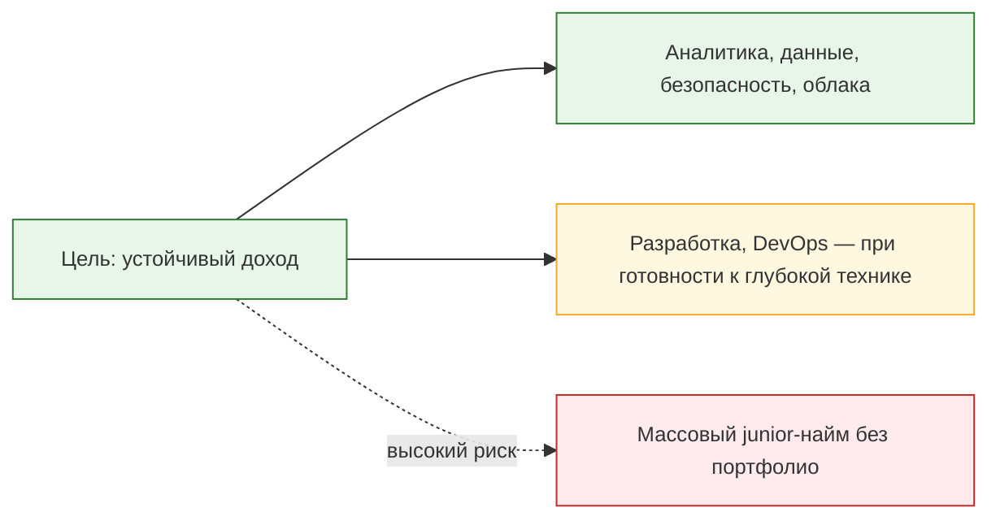

---
tags:
  - all
  - required
  - beginner
title: Рынок труда и зарплатные ориентиры
description: "Медиа и реклама курсов часто рисуют IT как короткий путь к высокому доходу."
---

# Рынок труда и зарплатные ориентиры

  ОБЯЗАТЕЛЬНО
  ДЛЯ НОВИЧКОВ

Всем

---

## Карьера в IT - маршрут и ожидания

Медиа и реклама курсов часто рисуют IT как короткий путь к высокому доходу. Публичная статистика и опыт соискателей говорят обратное: **рынок стал рынком работодателя**, конкуренция выросла, а платят прежде всего за **подтверждённый опыт и редкие навыки**. Эта статья даёт трезвые ориентиры — без обещаний "оффера через три месяца", но с опорой на открытые данные и логику отрасли.

  
Запомните

  Ваша задача - изучить, понять и научиться, а не просто закрыть вопросы на собеседовании! Вы - не "вкатун", и не обманщик. Вы - хороший, подготовленный специалист, который разбирается в предмете, знает, как всё устроено. Потому что в вашем распоряжение действительно полный материал, позволяющий стать профессионалом.

Контекст по России — в материале [IT в России](/encyclopedia/1-basics/1-04-kak-vidyat-it-obychnye-lyudi/7). О мифах и пузыре ожиданий — в разделе [Риски и мифы IT-индустрии](/encyclopedia/1-basics/1-05-preduprezhdenie/4).

---

## Как устроен рынок сейчас

К началу 2026 года отрасль переживает **корректировку**, а не "конец IT". Сокращается число вакансий, растёт число резюме, ужесточаются требования к начинающим. Одновременно **растёт спрос** в отдельных сегментах: информационная безопасность, облачная инфраструктура, искусственный интеллект и машинное обучение, аналитика (системная, продуктовая, данных).

Главный вывод для соискателя: **направление важнее общей формулировки "хочу в IT"**. Два человека с одинаковым стажем в годах могут иметь разный спрос и разную зарплату — в зависимости от роли, стека и отрасли работодателя (банк, госсектор, продуктовая компания, аутсорс).

При этом "найти работу" и "расти по карьерной лестнице" в 2026 году — **разные задачи**. Многие специалисты дольше остаются на той же должности: вакансий на повышение меньше, компании реже открывают новые грейды, смена работы без роста компетенций редко даёт скачок дохода. Реалистичная стратегия — горизонталь (новый стек, аналитика, безопасность, облако), доказуемые результаты и [индивидуальный карьерный план](/encyclopedia/1-basics/1-26-karera-v-it-i-mify/911), а не ставка на один оффер "навсегда". Контекст конкуренции и сокращений — в [Проблемы рынка труда](/encyclopedia/1-basics/1-26-karera-v-it-i-mify/9).

  
Важно

  

  Цифры ниже — ориентиры по публичным вакансиям и сводкам HeadHunter за 2025–2026 годы. Реальный оффер зависит от города, удалённости, премий и переговоров. Медиана в объявлении часто ниже, чем доход опытного мидла или сеньора в той же роли.

  

---

## Доход от 200 000 рублей — когда это реально

**Двести тысяч рублей и выше** — не "стартовая" планка, а уровень **уверенного мидла** (как правило, от трёх лет практики) или сеньора в узкой специализации. Без портфолио, стажировок и участия в реальных проектах рассчитывать на такую сумму сразу после курса — ошибка ожиданий.

Направления, где такие вилки **встречаются в открытых вакансиях** (весна 2026 года, по данным агрегаторов):

| Направление | Ориентир по предложениям | Что обычно требуют |
|-------------|--------------------------|-------------------|
| Аналитика данных, Data Scientist | от ~250 000 ₽ | SQL, Python, статистика, модели; опыт на задачах бизнеса |
| DevOps-инженер | ~220 000 ₽ и выше | Linux, CI/CD, облака, автоматизация, ответственность за среду |
| Системный аналитик | медиана ~187 000 ₽; мидл и сеньор — 200–400 тыс. | UML, BPMN, API, требования, связь с разработкой |
| Продуктовый аналитик | мидл 180–280 тыс., сеньор до 420 тыс. | Метрики продукта, A/B-тесты, SQL, инструменты аналитики |
| Разработчик, уровень сеньор | от 200 000 ₽ (зависит от стека) | Глубокий стек, архитектура, микросервисы, ответственность за модуль или систему |
| Разработка на "1С" с бизнес-логикой | от 200 000 ₽ в крупных городах | Опыт от трёх лет, конфигурации, интеграции |
| Автоматизация тестирования (Java и др.) | до 200 000 ₽ в столице | Фреймворки тестов, API, SQL |

Переход в **архитектора, тимлида или управление проектами** открывает верхние вилки, но туда редко берут без технической или аналитической базы и доказанного опыта в команде.

---

## Аналитика — отдельный акцент

Аналитика — одно из **наиболее устойчивых** направлений на фоне сжатия массового найма разработчиков-новичков. Здесь ценят не "знание термина", а умение **формализовать задачу**, работать с данными и согласовывать решение с бизнесом и разработкой. Нотации BPMN, UML, C4, ERD — [основы диаграмм и моделирования](/encyclopedia/7-project/7-04-analitika/1231).

| Роль | Типичные вилки (2026) | Базовые навыки |
|------|----------------------|----------------|
| Бизнес-аналитик | ~150 000 ₽; вакансии 140–200 тыс. | Требования, процессы, BPMN, коммуникация |
| Системный аналитик | мидл 140–230 тыс., сеньор 280–400 тыс. | UML, API, интеграции, ТЗ, Kafka и др. по проекту |
| Аналитик данных | медиана ~230 000 ₽ | SQL, визуализация, KPI, отчётность |
| Продуктовый аналитик | мидл 180–280 тыс., сеньор 300–420 тыс. | События в продукте, гипотезы, A/B-тесты |

Что усиливает резюме в 2026 году:

- уверенный **SQL** и работа с хранилищами;
- **нейросети как инструмент** (ускорение отчётов, разбор требований), а не как единственная "специализация";
- понимание **импортозамещения**: отечественные ОС и ПО в госсекторе и у крупных заказчиков;
- **гибридная компетенция**: аналитик, который понимает ограничения разработки и данных, ценится выше узкого "переписчика требований".

Углубление — в разделах [SQL](/encyclopedia/3-data-markup/3-07-sql/intro) и [Анализ данных](/encyclopedia/3-data-markup/3-11-analiz-dannyh/intro), в главе [Специализации](/encyclopedia/1-basics/1-26-karera-v-it-i-mify/2).

---

## Начинающим — честные ожидания

Для позиций **junior** конкуренция экстремальна: на одну вакансию — множество откликов. Работодатель смотрит на **портфолио, стажировки, пет-проекты**, совпадение стека с вакансией и прохождение фильтров ATS (см. [Взаимодействие с HR](/encyclopedia/1-basics/1-26-karera-v-it-i-mify/6)).

Практические шаги:

1. Выбрать **роль и стек**, а не "учить всё подряд" — см. [Дорожная карта изучения](/encyclopedia/1-basics/1-03-dorozhnaya-karta-izucheniya/1).
2. Собрать **2–3 завершённых проекта** с описанием задачи и результата.
3. Согласовать резюме с текстом вакансии (ключевые слова для ATS).
4. Рассматривать **стажировку, аутсорс, техподдержку** как вход, если прямой оффер на разработку не приходит.
5. Планировать рост на **2–4 года** до мидла — там и открывается разговор о доходе 200 000 ₽ и выше.

---

## Что выбирать при планировании карьеры

Сопоставьте **интерес**, **рынок** и **порог входа**:

**Импортозамещение** — не мода, а государственная и корпоративная политика: знание Astra Linux, Postgres Pro, отечественных BPM и документооборота — плюс в банках и госсекторе.

**Искусственный интеллект** — драйвер инвестиций, но вакансии "про нейросети" без математики, данных или инженерии часто размыты. Надёжнее строить базу (SQL, Python, системный анализ), а ИИ подключать как инструмент.

---

## Резюме

| Утверждение | Верно сейчас |
|-------------|--------------|
| "В IT всем платят огромные деньги сразу" | Нет — платят за опыт и редкость |
| "Программистов не берут вообще" | Нет — берут избирательно; страдает массовый junior |
| "Аналитика — спокойный путь к 200 000+" | Частично да — на уровне мидла, при сильном SQL и кейсах |
| "Курсы заменят три года практики" | Нет — курсы дают старт, не гарантию вилки |

Рынок **сложнее**, чем в 2021 году, но **не закрыт**. Выигрывает тот, кто сверяет цели с [карьерным планом](/encyclopedia/1-basics/1-26-karera-v-it-i-mify/911), учится непрерывно и выбирает направления с реальным спросом — аналитика, безопасность, данные, облака, зрелая разработка.

---
