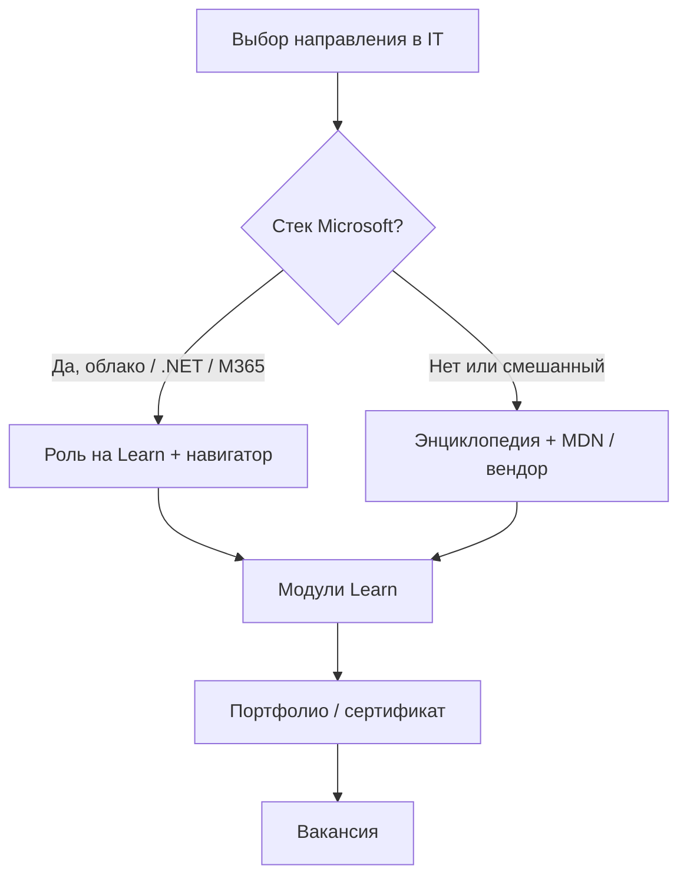

# Роли по таксономии Microsoft Learn

  ОБЯЗАТЕЛЬНО
  ДЛЯ НОВИЧКОВ

Всем

На [Microsoft Learn](https://learn.microsoft.com/ru-ru/training/browse/) каждый модуль помечен **ролью** — это не должность в компании, а **профиль компетенций**, под который написан материал. Таксономия Microsoft удобна как внешний ориентир: она структурирована, обновляется и привязана к сертификациям. Ниже — как роли Learn соотносятся с [разделами энциклопедии](/encyclopedia/1-basics/1-02-vvedenie/2) и с [специализациями](/encyclopedia/1-basics/1-26-karera-v-it-i-mify/2).

:::tip Практика
Интерактивный каталог с фильтрами: [Microsoft Learn — навигатор](/tools/documentation/6).
:::

---

## Собеседование - как готовиться и что спрашивают

Рынок труда называет должности по-разному («инженер платформы», «продуктовый аналитик», «fullstack»), а учебные платформы группируют контент по **навыкам**. Если вы видите на Learn роль «Инженер DevOps», это подсказка: курс предполагает знание Git, CI/CD и облака — даже если в вакансии слово DevOps не фигурирует.

Три правила сопоставления:

1. **Одна роль Learn ≠ одна вакансия** — работодатель может требовать смесь ролей.
2. **Сначала фундамент энциклопедии**, потом модули Learn — иначе практика превращается в «нажимание кнопок без понимания».
3. **Вендор нейтрален в теории** — Learn силён в экосистеме Microsoft; для Linux-first или AWS-only смотрите параллельно другие источники из [подборки документации](/tools/documentation/2).

---

## Таблица ролей

| Роль на Learn (RU) | Что ожидается от специалиста | Разделы Вселенной IT | Типичные треки Learn |
|--------------------|------------------------------|----------------------|----------------------|
| **Разработчик** | Код, отладка, API, фреймворки | [4. Код](/encyclopedia/4-code-dev/4-01-algoritmy/1), [5. Языки](/encyclopedia/5-languages/languages), [2.04 Веб](/encyclopedia/2-system-network/2-04-kak-rabotayut-sayty-i-veb-sayty/1) | C#, ASP.NET Core, Playwright |
| **Инженер DevOps** | Сборка, деплой, инфраструктура как код | [8.04 DevOps](/encyclopedia/8-infra-security/8-04-devops-ci-cd/intro), [8.06 Контейнеры](/encyclopedia/8-infra-security/8-06-konteynerizatsiya-i-orkestratsiya/intro) | GitHub Actions, Azure DevOps |
| **Аналитик данных** | SQL, витрины, визуализация, метрики | [3.07 SQL](/encyclopedia/3-data-markup/3-07-sql/intro), [3.11 Аналитика](/encyclopedia/3-data-markup/3-11-analiz-dannyh/1) | Power BI, DP-900 |
| **Администратор** | ОС, сеть, облачные подписки | [2.01 ОС](/encyclopedia/2-system-network/2-01-operatsionnaya-sistema/intro), [8.01 Облако](/encyclopedia/8-infra-security/8-01-oblachnye-tehnologii/12) | AZ-900, управление Azure |
| **Администратор ИБ / аналитик ИБ** | Идентичность, угрозы, соответствие | [8.07 ИБ](/encyclopedia/8-infra-security/8-07-informatsionnaya-bezopasnost/intro), [2.06 Админ](/encyclopedia/2-system-network/2-06-sistemnoe-administrirovanie/62) | SC-900, Entra, Defender |
| **Инженер по ИИ** | ML, LLM, развёртывание моделей | [6. ИИ](/encyclopedia/6-ai/6-01-vvedenie-v-ii/1) | AI fundamentals, generative AI, агенты |
| **Бизнес-пользователь** | Office, Copilot без кода | [1.11 Софт](/encyclopedia/1-basics/1-11-soft-ryadovogo-polzovatelya/52), [6.06 Применение ИИ](/encyclopedia/6-ai/6-06-primenenie-ii/3) | M365, Copilot в задачах |
| **Функциональный консультант** | CRM/ERP, требования, настройка | [7.04 Аналитика](/encyclopedia/7-project/7-04-analitika/intro), [8.02 Low-code](/encyclopedia/8-infra-security/8-02-low-code-no-code/intro) | Power Platform, Dynamics |
| **Студент / начинающий** | Базовые концепции | [1. Основы](/encyclopedia/1-basics/basics), [1.03 Дорожная карта](/encyclopedia/1-basics/1-03-dorozhnaya-karta-izucheniya/1) | AZ-900, первые модули C# |

---

## Уровни сложности на Learn

Параллельно с ролью указан **уровень**:

| Уровень | Смысл | Когда брать |
|---------|--------|-------------|
| Начальный | Термины, обзор, мало предпосылок | После соответствующей главы энциклопедии |
| Средний | Практика в продукте, сценарии | После 1–2 месяцев практики в теме |
| Расширенный | Архитектура, оптимизация, экзамены | Перед сертификацией или сменой стека |

Не гонитесь за «расширенным» модулем ради статуса: на собеседовании важнее объяснить [модель ответственности в облаке](/encyclopedia/8-infra-security/8-01-oblachnye-tehnologii/12), чем перечислить десяток названий сервисов Azure.

---

## Карта перехода «роль → учёба»

**Стек Microsoft** здесь — не «единственно правильный», а ситуация, когда работодатель или учебное заведение явно опирается на Azure, Active Directory / Entra, .NET или M365. В остальных случаях Learn остаётся полезным для **универсальных** тем (Git, ИИ-основы, облачные модели), но не заменяет документацию вашего стека.

---

## Связь с сертификациями

Роли на Learn часто ведут к экзаменам (AZ-900, DP-900, SC-900 и др.). Подробная карта «экзамен → для кого → что учить у нас» — в главе [Сертификации Microsoft и внешние треки](/encyclopedia/1-basics/1-26-karera-v-it-i-mify/12).

---

## Итоги

- Таксономия Learn — **удобный внешний словарь ролей**, а не список должностей.
- Каждой роли соответствуют **разделы 1–8** энциклопедии; практику берите в [навигаторе Learn](/tools/documentation/6).
- Сначала теория Вселенной IT, затем модули — так сохраняется vendor-neutral база и появляется прикладной навык.

---
