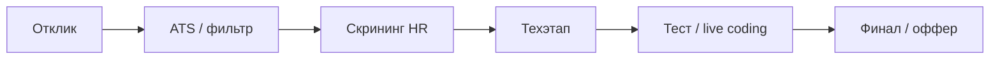

---
tags:
  - all
  - required
  - beginner
title: Подготовка к техническому собеседованию
description: Подготовка и прохождение интервью с техническими вопросами.
---

# Подготовка к техническому собеседованию

<div class="article-tags">
  <span class="tag tag-required">ОБЯЗАТЕЛЬНО</span>
  <span class="tag tag-beginner">ДЛЯ НОВИЧКОВ</span>
</div>

<span class="complexity-badge">Всем</span>

---

## Технические собеседования

<div class="callout callout--tip">
  <div class="callout-title">Запомните</div>
  Ваша задача - изучить, понять и научиться, а не просто закрыть вопросы на собеседовании! Вы - не "вкатун", и не обманщик. Вы - хороший, подготовленный специалист, который разбирается в предмете, знает, как всё устроено. Потому что в вашем распоряжение действительно полный материал, позволяющий стать профессионалом.
</div>

> После общения с HR обычно следует этап с разработчиками или инженерами. Они проверяют, умеете ли вы писать код, решать задачи и объяснять ход мыслей. Часть вопросов шире ежедневных обязанностей — так отсекают пробелы в базе и проверяют обучаемость.

Что спрашивают по уровням (ориентир, не догма):
- Junior — синтаксис, ООП, основы алгоритмов, Git, HTTP, SQL.
- Middle — паттерны проектирования, CI/CD, Docker, отладка, жизненный цикл ПО.
- Senior — архитектура систем, масштабирование, безопасность, менторство, управление техдолгом.

Иногда на джуниора задают вопрос уровня миддла, а у сеньора — базовый. Имеет смысл готовиться **по тексту вакансии** плюс **база** (алгоритмы, сети, БД), а не пытаться выучить весь стек мира.

---

### Что такое техническое собеседование?

**Собеседование** — это часть процесса найма, во время которой потенциальный работодатель оценивает кандидата на соответствие требованиям позиции. Это формальная процедура, в ходе которой HR-менеджеры и технические специалисты выясняют, подходит ли человек по уровню знаний, опыту, софт-скиллам и культурному соответствию.

**Техническое собеседование** — это этап процесса найма, на котором оцениваются профессиональные навыки кандидата — знание языков программирования, алгоритмов, архитектурных решений, инструментов разработки и способность решать задачи в условиях ограниченного времени.

**Цель собеседования** - проверить уровень квалификации, оценить коммуникабельность и поведение в стрессовых ситуациях, узнать мотивацию и цели кандидата и понять, насколько он готов к работе в команде и корпоративной культуре. Корпоративная культура есть, конечно, не везде, но всё же в высокооплачиваемых местах она присутствует.

Цель технического собеседования — убедиться, что кандидат может:
- писать читаемый и корректный код;
- проектировать решения, соответствующие требованиям;
- объяснять свои решения;
- работать с реальными инструментами разработки.

Собеседование может быть одноэтапным или состоять из нескольких раундов, включая интервью с HR, технический этап, [тестовое задание](./13) и финальное обсуждение с руководителем.

---

## Этапы процесса найма в IT

Процесс найма в IT-компаниях обычно состоит из нескольких этапов.

---

### Скрининг с HR

**Прелюдия** - иногда этот этап называют "скринингом" от HR, когда происходит первый контакт с рекрутером, в ходе которого проверяются базовые данные, соответствие резюме требованиям, наличие необходимого опыта и навыков, получение информации о том, какие у кандидата ожидания по зарплате и графикам работы. В этот момент важно чётко и лаконично рассказать о себе, своих компетенциях и мотивации. Как правило, HR не сильно разбирается в технологиях, поэтому углубляться в них здесь смысла нет.

HR-специалист проверяет соответствие резюме заявленным требованиям:
- наличие опыта работы;
- владение указанными технологиями;
- ожидания по зарплате и формату работы.

На скрининге рекрутер часто работает **по чек-листу вакансии** — опыт, стек, зарплатные ожидания, формат работы, сроки выхода.$1это ограниченное время и KPI по закрытию позиции. Ваша задача — за 2–3 минуты показать **соответствие роли** и готовность к следующему этапу; глубокую технику проверят на [техническом собеседовании](#техническое-собеседование).

---

### Воронка найма (теория)

Упрощённая модель, которую полезно держать в голове:



На каждом шаге отсекают по другому сигналу: ключевые слова → формальное соответствие → hard skills → практика → культура и мотивация.

---

### Техническое собеседование

**Техническое интервью** - самый ответственный этап, где оценивают по технической части. Сначала просят рассказать о себе - в этот момент важно чётко перечислить опыт работы, рассказать о своих крупнейших проектах и также перечислить стек технологий. Важно понимать релевантность, и сообщать первой именно ту информацию, которая даст работодателю понимание что у соискателя есть и базовые, а для миддла или сеньора - продвинутые навыки.

Этот этап проводят разработчики или технические лиды. Формат может включать:
- устные вопросы по теории;
- решение задач на доске или в онлайн-редакторе;
- обсуждение архитектуры систем;
- анализ чужого кода.

Продолжительность — от 45 минут до нескольких часов.

Базовые навыки - это, как правило, понимание алгоритмов, структур данных, языков программирования и различных платформ. Продвинутые подразумевают сложные задачи, вопросы по системному проектированию, успешные проекты.

Не нужно путать техническое интервью с техническим собеседованиям. По своей сути, интервью проводит именно кадровик, а он далеко не профессионал в части технической, поэтому он максимум уточнит ваш опыт и проверит вас как человека. Ваши хард-скиллы будут проверяться именно на техническом собесе.

---

### Практическое задание

Некоторые компании дают домашнее задание, чтобы оценить реальные навыки разработки - написать приложение, прочитать чужой код и доработать его, сделать pull request в существующий проект. Словом, на этом этапе проверяют, способен ли кандидат реально выполнять задачи. 

Важно отметить, что задания могут быть очень сложными и требовать нестандартного подхода - всё зависит от подхода собеседующих. Они могут быть изобретательными, потому что их цель не столько найти нужного человека, сколько отсеять ненужных.

Задание оценивается по качеству кода, архитектуре, читаемости и соответствию требованиям.

---

### Финальное интервью

Здесь уже оценивают культурное соответствие, софт-скиллы, опыт работы в команде, понимание бизнес-задач.

На этом этапе оцениваются:
- коммуникабельность;
- опыт работы в команде;
- понимание бизнес-контекста;
- соответствие корпоративной культуре.

Для позиций уровня middle и senior может включаться отдельное архитектурное интервью.

---

## Что проверяют на техническом собеседовании

### О технических собеседованиях

В авторской практике встречались и **трёхчасовые** интервью, и вопросы "в сторону" от вакансии — от принципа Лисков на джуна до базовых определений у сеньора. Это не норма для всех компаний, но к разбросу стоит быть готовым: после собеседования полезно записывать пробелы и закрывать их точечно, а не пытаться за неделю выучить всю энциклопедию.

**Реалистичный план подготовки:**

1. Вакансия → список тем (язык, фреймворк, БД, инструменты).
2. База — структуры данных, Git, HTTP, SQL — см. раздел [Теория](#теория) ниже.
3. 10–20 задач на [LeetCode](https://leetcode.com) / [Codewars](https://www.codewars.com) уровня Easy (массивы, строки, хеш-таблицы).
4. Один pet-проект или [take-home](./13), о котором можете рассказать по [STAR](/encyclopedia/1-basics/1-26-karera-v-it-i-mify/5).

Полный обзор томов энциклопедии — долгосрочная цель обучения, а не чек-лист на завтра. На собеседовании честное "не сталкивался, но рассуждаю так…" лучше, чем выдуманный ответ.

Если HR-этап можно пройти сильной самопрезентацией, то технический этап требует **навыков и практики**. Без регулярного кода и разбора задач пройти его сложно.

Что проверяют на техническом собеседовании?

Набор тем широкий, но обычно он крутится вокруг **роли** и **стека**. Примеры крайностей: у джуниора спросят про Kubernetes, у сеньора — уточнят базу; так проверяют глубину и честность.

---

#### Для junior-разработчиков

Ожидаются базовые знания:
- синтаксис и особенности основного языка программирования;
- основы алгоритмов и структур данных;
- принципы объектно-ориентированного программирования;
- работа с Git;
- понимание HTTP, REST, баз данных.

---

#### Для middle-разработчиков

Добавляются:
- опыт проектирования модулей;
- знание паттернов проектирования;
- умение отлаживать и оптимизировать код;
- понимание жизненного цикла ПО;
- опыт работы с CI/CD, Docker, облачными сервисами.

---

#### Для senior-разработчиков и техлидов

Проверяются:
- системное мышление;
- способность проектировать масштабируемые архитектуры;
- опыт управления техническим долгом;
- навыки менторства и принятия архитектурных решений;
- глубокое понимание безопасности, производительности и отказоустойчивости.

---

### Теория

Теория — основа успешного прохождения собеседования.

---

#### Обязательные темы
- **Алгоритмы и структуры данных** — массивы, списки, хеш-таблицы, деревья, графы, сортировки, поиск.
- **Сложность алгоритмов**: нотация Big O, оценка времени и памяти.
- **Основы ОС** — процессы, потоки, память, файловые системы.
- **Сети** — модель OSI, TCP/IP, HTTP/HTTPS, DNS, CORS.
- **Базы данных** — SQL, нормализация, индексы, транзакции.
- **ООП** — инкапсуляция, наследование, полиморфизм, абстракция.
- **Парадигмы программирования** — императивное, функциональное, декларативное.
- **Архитектурные паттерны** — MVC, MVVM, микросервисы, CQRS, Event Sourcing.

---

#### Языки и технологии
- Глубокое знание одного основного языка (например, Python, Java, C#).
- Базовое понимание второго языка.
- Умение писать чистый, тестируемый, поддерживаемый код.

Джуну важно уверенно объяснить основы; миддлу и сеньору добавляются потоки, асинхронность, оптимизация, паттерны и trade-off решений.

---

#### Пример live-coding (уровень junior)

Задача: проверить, является ли строка палиндромом (без учёта регистра пробелов). На интервью проговаривайте шаги и сложность.

```python
def is_palindrome(s: str) -> bool:
    cleaned = "".join(ch.lower() for ch in s if ch.isalnum())
    return cleaned == cleaned[::-1]

# "A man, a plan, a canal — Panama" -> True
# Время O(n), память O(n) для новой строки
```

Альтернатива с двумя указателями — меньше памяти, чуть сложнее код; обсуждение таких вариантов и оценивают.

---

### Практика

Здесь нужно уметь непосредственно работать - это может быть знание инструментов вроде Confluence, Jira, Azure, Git, Docker, а может быть и "ловящий вопрос", который можно ответить, поработав на практике.

Для совершенствования практики нужна регулярная работа — стажировка, задачи на тренажёрах, pet-проекты, [тестовые задания](./13). В теории решения выглядят просто; в практике — отладка, краевые случаи и чужой код.

Начать можно с тренажёров. 

Вот несколько вариантов:
	- платформы - LeetCode, Codewars, Learn Git Branching;
	- нейросети - можно использовать ChatGPT, DeepSeek или Qwen для того, чтобы ИИ дал задание, и проверил выполнение (промпты "задача без решения" — [библиотека](/lab/Примеры/1150#homework)).

Лучше познакомиться со всеми бесплатными вариациями - попробовать, чтобы визуально запомнить. Но платные, конечно, получше.

Рекомендуемые действия:
- **Решение задач** на платформах — LeetCode, HackerRank, Codewars.
- **Работа с Git** — создание веток, слияние, разрешение конфликтов (тренажёр Learn Git Branching).
- **Разработка pet-проектов** — веб-приложения, API, CLI-утилиты.
- **Чтение чужого кода**: изучение open-source проектов на GitHub.
- **Отладка и профилирование** — использование debugger’ов, логирования, метрик.

Инструменты, которые стоит освоить:
- Git и GitHub
- Docker
- Postman / curl
- Jira / Confluence (для понимания workflow)
- IDE (Visual Studio, IntelliJ IDEA, VS Code)

---
