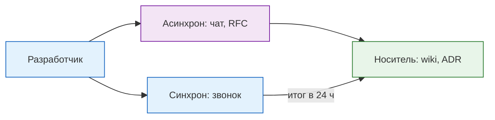

---
tags:
  - all
  - required
  - beginner
title: Удаленная работа
description: >-
  Удаленная работа как формат труда — процессы, коммуникации, доступы и
  инструменты взаимодействия команды вне офиса.
---

import ExternalPlayEmbed from '@site/src/components/ExternalPlayEmbed';


# Удаленная работа

<div class="article-tags">
  <span class="tag tag-required">ОБЯЗАТЕЛЬНО</span>
  <span class="tag tag-beginner">ДЛЯ НОВИЧКОВ</span>
</div>

<span class="complexity-badge">Всем</span>

<div class="callout callout--tip">
  <div class="callout-title">Как устроена глава</div>

  <div class="callout-body">
  Сначала — **практика** (доступы, чат, домашнее место).

  Затем — **теория и история**, **инфраструктура и процессы**, **право**, **психология**.

  Итоги — в [главе 2](/encyclopedia/1-basics/1-27-udalennaya-rabota/2), чек-лист — в [главе 3](/encyclopedia/1-basics/1-27-udalennaya-rabota/3).
</div>
  </div>


<ExternalPlayEmbed example="basics/remote-work-connect-play" title="Remote Work Connect" />

---

### Как устроено подключение (схема выше)

| Сценарий | Суть | Когда встречается |
|----------|------|-------------------|
| **VPN + RDP/SSH** | Трафик в корпоративную сеть, как из офиса | Классическая удалёнка |
| **VDI** | Рабочий стол в ЦОД; секреты не на домашнем ПК | Финтех, госсектор, строгий DLP |
| **Zero Trust** | Нет "плоской" VPN: SSO + MFA на каждое приложение | Облачные и distributed-команды |

Чаты и видеозвонки часто идут **напрямую в интернет**, минуя VPN — если политика безопасности это разрешает.

---

## Быстрый вход без академичности

Если коротко: удаленная работа в IT — это не "работа из пижамы", а дисциплина по трем линиям:

- **Результат**: задачи доводятся до "готово", а не "я почти доделал".
- **Прозрачность**: команда понимает, кто чем занят и где узкие места.
- **Надежность**: доступы, связь, техника и безопасность не разваливаются в самый важный момент.

Почему тема важна даже новичку:

1. Уже на стажировке оценивают не только код, но и коммуникацию в удаленном формате.
2. Ошибки на удаленке часто "дороже", чем в офисе: молчание в чате может заблокировать целую команду.
3. Навык асинхронной работы пригодится в любой современной компании, даже если формат гибридный.

Связанные темы: [Коммуникация](/encyclopedia/1-basics/1-22-kommunikatsiya-i-obschenie/intro), [Цифровая коммуникация](/encyclopedia/1-basics/1-22-kommunikatsiya-i-obschenie/1), [Основы информационной безопасности](/encyclopedia/2-system-network/2-08-osnovy-informatsionnoy-bezopasности/1).

### В рунет-дискурсе

**Удалёнка** в мемах и форумах — "работа из пижамы", "всегда на связи", "созвон в 23:00". За шутками стоят реальные риски: размытые границы дня, выгорание и ожидание мгновенного ответа в Telegram.

В IT-культуре рунета удалёнка закрепилась раньше COVID: аутсорс, фриланс, "клиент в другом часовом поясе". Рабочая практика становится устойчивой, когда команда отделяет **юмор** от **договорённостей**: окно связи, VPN, отчётность и [этика переписки](/encyclopedia/1-basics/1-22-kommunikatsiya-i-obschenie/1). Указатель — [Неолурк (Удалёнка)](https://neolurk.org/wiki/%D0%A3%D0%B4%D0%B0%D0%BB%D1%91%D0%BD%D0%BA%D0%B0), [мессенджеры](/encyclopedia/1-basics/1-22-kommunikatsiya-i-obschenie/2#в-рунет-дискурсе).

---

## Практика — удалёнка в IT

### Формы работы: офис, гибрид, удалёнка

Чтобы не путаться в ожиданиях работодателя, важно сразу договориться о формате работы.

| Формат | Как устроено | На что обратить внимание |
|--------|---------------|--------------------------|
| **Офис** | Постоянное присутствие в офисе, обычно закреплённое рабочее место, фиксированный график. | Отсутствие на рабочем месте без согласования обычно считается нарушением дисциплины. |
| **Гибрид** | Часть задач выполняется из офиса, часть — удалённо; часто фиксируют количество "офисных" дней в неделю. | Дни присутствия/отсутствия нужно заранее согласовать с руководителем. |
| **Полная удалёнка** | Работа вне офиса: из дома, из другого города или страны. | Личные встречи с коллегами обычно редки: проектные сессии, общекомандные офлайн-встречи, корпоративные мероприятия. |

Важно: при удалённой модели личная коммуникация часто инициируется руководством и командой осознанно — не "случайно у кулера", а как часть командообразования и поддержки мотивации.

---

### Как обычно переходят в удалённый формат

Формат часто согласуют поэтапно:

1. Первые месяцы — больше работы из офиса для погружения в процессы.
2. Затем — гибрид, когда сотрудник уже лучше знает команду и контекст.
3. После адаптации — полная удалёнка, если это подходит роли и компании.

Такой сценарий помогает быстрее войти в рабочий ритм и снижает риск "потеряться" на старте.

---

### Когда выбора формата почти нет

Иногда сотрудник и компания физически находятся в разных городах: например, офис в Москве или Санкт-Петербурге, а сотрудник живёт в Уссурийске. В таких случаях расстояние и разница во времени делают удалёнку не "льготой", а единственной рабочей моделью.

---

### Как организована удалёнка в IT?

1. **Техника**. Допустимо использование личного оборудования, если выполняются требования ИБ: антивирусная защита, обновления, защищённый VPN-доступ, MFA и другие правила компании.
2. **Корпоративная техника**. По запросу и согласованию с руководителем компания может выдать рабочий ноутбук, гарнитуру и другое оборудование.
3. **Доступы**. Выдают VPN (для внутренних ресурсов), логины к корпоративным сервисам (Jira, Git, Figma), иногда — виртуальный рабочий стол.
4. **Общение**. Ежедневные короткие созвоны (daily), общий чат (Slack/Telegram), видеовстречи в Zoom/Teams.

Иногда бывают тайм-трекеры. Это программы, которые фиксируют, чем ты занят: скриншоты экрана, время нажатий клавиш, активность в программах (например, работал ли в IDE или в Ютубе). Бывают жёсткими (наказывают за отвлечения) или мягкими (просто для отчёта, без слежки за каждым кликом). Чаще встречаются в аутсорсе, в продуктовых компаниях — редко.

В крупных компаниях контроль активности часто строится через комбинацию инструментов: тайм-трекеры, системы учёта рабочего времени, ежедневные статусы в таблицах или отчётность в таск-системах. На этапе трудоустройства полезно сразу уточнить:
- где ставят и обсуждают задачи;
- где фиксируют проделанную работу;
- какие каналы/мессенджеры используют для неформального общения.

Правила, которые лучше соблюдать:
- Выходить на связь в рабочее время — это главное.
- Оставлять статусы в чатах ("встреча", "ушел на обед").
- Отвечать в течение 10–20 минут в рабочие часы.
- Иметь нормальный фон для созвонов (не тапки в кадре и не грязная стена, если с видеокамерой).
- Спрашивать, а не молчать, если что-то непонятно или затягиваешь сроки.

Пример статуса в чате:

```text
🟢 На связи | 🟡 Встреча до 12:00 | 🔴 Deep work до 15:00 — срочное в #team-backend
```

Подробнее — [Коммуникация](/encyclopedia/1-basics/1-22-kommunikatsiya-i-obschenie/intro).

Можно работать из другого города или страны (уточни правила), самому планировать день — встать позже, днём сходить в зал или погулять, съездить в магазин, забрать ребёнка из сада.

> Главное — чтобы задачи были сделаны к сроку и ты был на связи во время договорённостей. В адекватных компаниях никто не смотрит на часы: сделал работу за 4 часа — ты молодец.

После массового перехода на удалёнку в 2020 году многие команды увидели на практике: в задачах интеллектуального труда результат часто можно делать в том же объёме, что и в офисе, но без "демонстративного присутствия". Ключевой критерий в удалёнке — не сидеть "для вида", а выполнять задачи, быть доступным и участвовать в процессе.

---

### Типичные ошибки новичков на удаленке

- **"Сделаю молча, потом покажу"**. На удаленке это выглядит как пропажа с радаров.
- **Слабая фиксация договоренностей**. Созвон прошел, а решений в тексте нет — через день все трактуют по-разному.
- **Нет сигнала о рисках**. Если видишь срыв срока, сообщай заранее с планом, а не в дедлайн.
- **Смешение личного и рабочего времени**. "Всегда онлайн" быстро приводит к усталости и снижению качества.

Мини-шаблон сигнала о риске:

```text
TASK-241: вижу риск по сроку +1 день из-за зависимости от API.
Что сделал: подготовил контракт и тесты.
Что нужно: доступ к стенду до 16:00.
План Б: временный мок, чтобы не блокировать фронт.
```

---

### Домашнее рабочее место

- **Зона** — стол, стул, свет; по возможности не кровать на весь день.
- **Связь** — стабильный Wi‑Fi или кабель; запасной канал (мобильный интернет).
- **Звук** — гарнитура для созвонов.
- **Границы** — ритуал начала/конца дня, чтобы не "жить на работе" 24/7.
- **Договорённость с домашними** — если живёте с семьёй, заранее проговорите, что рабочее время — это рабочее время, даже если со стороны кажется, что "человек просто сидит за компьютером".
- **Дисциплина присутствия** — во время рабочего дня лучше оставаться на месте и не "пропадать", если есть активные задачи и зависимые от вас коллеги.

### Рабочее время и часовые пояса

Начало рабочего дня при удалёнке не всегда совпадает с офисным временем. Если команда распределённая (например, Москва и Владивосток), заранее согласуйте:
- общее окно пересечения для синхронных встреч;
- ожидания по времени ответа;
- личный режим, в котором вы стабильно доступны.

Чем раньше это зафиксировано с руководителем и командой, тем меньше конфликтов по ожиданиям.

---

## Теория и контекст

### Что такое удалённая работа?

**Удалённая работа** (в быту — "удалёнка") — задачи вне офиса с опорой на цифровые каналы. Не привязана к одному адресу, если это согласовано с работодателем.

**Дистанционная работа** в России — **юридический термин** (гл. 49.1 ТК РФ): штатный сотрудник, трудовой договор, работа вне места нахождения работодателя через ИКТ.

| Понятие | Суть | Договор | Типично в IT |
|---------|------|---------|--------------|
| Удалёнка (разговорное) | Работа не из офиса | любой | daily, Slack, VPN |
| Дистанционная (ТК РФ) | Оформленная удалённость | трудовой | ст. 312.1–312.9 |
| Гибрид | Часть дней в офисе | трудовой + LNA | 2–3 дня в офисе |
| ГПХ / фриланс | Результат, не процесс | ГПХ, ИП, самозанятый | проект |
| Distributed | Нет "главного" офиса | трудовой / EoR | handbook, async |

**Пример (штат):** программист из дома, stand-up, Jira, Slack — в договоре режим дистанционной работы.

**Фриланс** — подрядчик на проекты для разных заказчиков.

**Пример (фриланс):** дизайнер по договору оказания услуг, сам планирует нагрузку и ставку.

Чаще всего первый поток заказов ищут через биржи: [freelance.ru](https://freelance.ru/), [FL.ru](https://www.fl.ru/), [Kwork](https://kwork.ru/). На практике диапазон задач очень широкий:
- от микрозадач (простые реакции в соцсетях, правки поста, мелкие правки карточек и текстов),
- через регулярные операционные задачи (дизайн, контент, таблицы, поддержка, базовые настройки рекламы),
- до комплексной разработки "под ключ" (сайт, интеграции, автоматизация, техподдержка продукта).

Важно разделять удалённую работу в штате и фриланс: формат может быть одинаково "из дома", но юридическая модель, ответственность, налоги и социальные гарантии отличаются.

---

Удалённая работа - это реинкарнация давних практик, реализованная в новых технических, экономических и социальных условиях. Её корни уходят в докомпьютерную эпоху: ремесленники, писцы, переводчики, учителя и врачи-консультанты веками выполняли задачи вне централизованных учреждений. Однако современное понимание удалённой работы формируется под влиянием трёх взаимосвязанных трансформаций: технологической (цифровизация), организационной (смещение от иерархии к сетевой структуре) и культурной (переоценка ценностей труда — от преданности организации к контролю над временем и пространством).

---

### Исторический контекст и этапы эволюции

Первую фазу можно условно обозначить как **эпоху телекоммуникационного предвестника** (1970–1995 гг.). Появление факсимильной связи, модемных сетей (например, ARPANET, позже ставшей основой Интернета), а также ранних СУБД (dBase, Oracle) позволило вынести часть операционных задач за пределы центрального офиса. В 1973 году Джек Ниллес, один из первых исследователей темы, ввёл термин *telecommuting* — телекоммутируемая работа, предполагающая сокращение физических поездок сотрудников за счёт использования телекоммуникаций. Его концепция основывалась на модели "сателлитных офисов" и домашних рабочих станций, соединённых с центром через выделенные линии. Однако тогда это оставалось нишевой практикой: высокая стоимость оборудования, низкая пропускная способность каналов и отсутствие стандартов совместимости делали масштабирование невозможным.

Вторая фаза — **интернет-катализ** (1995–2019 гг.) — характеризуется массовым распространением широкополосного интернета, появление SaaS-платформ (Gmail, Salesforce, Basecamp), VoIP-связи (Skype), а затем и облачных вычислений (AWS, Azure). В этот период удалённая работа постепенно из "льготы для отдельных сотрудников" превращается в стратегический инструмент привлечения талантов: компании типа Automattic (WordPress.com), GitLab, Toptal и Basecamp позиционируют себя как fully remote-first. Важно подчеркнуть, что до 2020 года удалённость воспринималась преимущественно как *исключение*, требующее оправдания. Руководители скептически относились к возможности контроля, опасались снижения неформального обмена знаниями и утраты корпоративной культуры. В большинстве организаций доминировала модель *гибридной сдержанности*: разрешалось работать из дома 1–2 дня в неделю, при условии явки в офис в "ключевые дни".

Качественный скачок произошёл в марте–апреле 2020 года — начался **период форсированной универсализации**. Эпидемиологические ограничения, введённые в 170+ странах, сделали удалённую работу необходимостью. По оценкам аналитиков (в т.ч. McKinsey), в развитых экономиках доля полностью удалённых заметно выросла к допандемийному уровню. Эксперимент "в условиях реального времени" дал большой материал — цифры в отчётах расходятся, тренды повторяются:

- В ряде исследований (Stanford, N. Bloom et al., 2021) для *информационной* работы (код, анализ, документы) фиксировался рост продуктивности относительно офиса; для *операционной* (производство, розница) — иная картина.
- Отмечалось снижение текучести у части удалённых команд (Microsoft Work Trend Index, 2022).
- Системно росли жалобы на изоляцию и "размытие границ" работы и личного времени (опросы 2020–2022 гг.).

Этот этап продемонстрировал, что технологическая готовность была достигнута задолго до кризиса, но *институциональная инерция* сдерживала трансформацию. Пандемия сыграла роль экзогенного шока, разрушившего когнитивные и нормативные барьеры. С 2022 года началась фаза **институционального закрепления**: удалённая работа перестаёт быть временной мерой и встраивается в долгосрочные HR- и ИТ-стратегии. В России, например, с 1 января 2021 года в Трудовой кодекс внесены поправки (ст. 312.1–312.9), юридически закрепившие дистанционную работу с отдельными правилами оформления, компенсаций и контроля.

---

### Типологизация форматов удалённой работы

Существующая классификация часто сводится к упрощённому делению: *офис*, *удалёнка*, *гибрид*. Однако для теоретического осмысления необходима более тонкая дифференциация, учитывающая степень пространственной, временнóй и организационной автономии. Ниже представлены пять базовых моделей, выделяемых по критериям:

| Модель | Пространственная привязка | Временной режим | Юридический статус | Уровень интеграции в команду |
|--------|----------------------------|------------------|---------------------|------------------------------|
| **Офисная с эпизодической удалённостью** | Высокая (офис — основной локус) | Фиксированный (например, 10:00–18:00) | Штатный сотрудник | Полная |
| **Дистанционная (статусная удалённость)** | Нулевая (официально — вне офиса) | Частично гибкий (core hours + свобода) | Штатный сотрудник | Высокая |
| **Фриланс (проектно-контрактная)** | Отсутствует | Полная автономия | ГПХ / ИП / Самозанятый | Переменная (от полной изоляции до встраивания в команду на срок проекта) |
| **Digital Nomad / Работа из любой точки** | Глобальная (не фиксируется по месту жительства) | Полностью адаптивный | Часто — международный контракт (B2B) | Средняя–низкая (зависит от tools-инфраструктуры) |
| **Fully Distributed Organization** | Не существует центрального офиса | Асинхронная коммуникация как норма | Сотрудники в разных юрисдикциях, часто через Employer of Record (EoR) | Высокая, но построена на документирующей культуре |

Важно уточнить: *полностью распределённая организация* (например, GitLab, Canonical, Doist) — это принципиально иная архитектура взаимодействия. Здесь отсутствует "офисный эталон": все процессы — от онбординга до ретроспектив — проектируются под асинхронный режим. Решения принимаются в issue-трекерах; знания фиксируются в открытых документах (handbook-first подход). Такая модель требует значительных инвестиций в инфраструктуру *социального капитала* — доверие заменяет наблюдаемость.

---

### Технологический фундамент

Удалённая работа как массовое явление стала возможна только при наличии трёх взаимозависимых слоёв:

1. **Транспортный уровень** — стабильный интернет (ориентир: от 25 Мбит/с на загрузку и отдачу), задержка до VPN-шлюза обычно **до 50–80 мс**. Низкий upload критичен для Zoom и `git push`.

```bash
   # Linux / macOS
   ping -c 10 vpn.company.example
   # Windows
   ping -n 10 vpn.company.example
```

   | Симптом | Частая причина | Что попробовать |
   |---------|----------------|-----------------|
   | Рвётся Zoom | низкий upload, Wi‑Fi | кабель в роутер, 5 GHz |
   | Медленный git push | VPN, upload | расписание push, LFS |
   | VPN отваливается | MTU, провайдер | мобильный backup |

2. **Прикладной уровень** — SaaS-экосистема, решающая три базовые функции:
   - *Коммуникация*: синхронная (Zoom, Teams, Google Meet) и асинхронная (Slack, Mattermost, Discord);
   - *Координация*: управление задачами (Jira, Linear, ClickUp), документация (Notion, Confluence, Coda), контроль релизов (GitHub/GitLab CI);
   - *Доставка ресурсов*: виртуализация рабочих столов (Citrix, Azure Virtual Desktop), DaaS (Desktop-as-a-Service), SSO (Okta, Auth0).

3. **Информационная безопасность как сервис**: zero trust-архитектура, EDR/XDR-системы (CrowdStrike, SentinelOne), DLP-политики, а также — ключевой для удалёнки — *управление конечными устройствами* (MDM: Mobile Device Management). Если в офисе контроль осуществляется через сегментацию сети и физический доступ, то при удалённой работе каждое устройство становится потенциальной точкой входа, что требует централизованного управления конфигурациями, шифрованием дисков (BitLocker, FileVault) и изоляции корпоративных данных (например, через контейнеризацию в приложениях).

Следует подчеркнуть: технологии — необходимое, но недостаточное условие. Ошибочно полагать, что установка Teams автоматически "делает" компанию удалённой. Технологии лишь *разрешают* удалённую работу; её эффективность определяется *процессами*, *культурой* и *управленческими решениями*.

---

### Социально-экономические драйверы и структурные противоречия

Удалённая работа не является "нейтральной" формой организации труда — она усиливает одни социальные тренды и ослабляет другие:

- **Демократизация доступа к рынку труда**: специалист из региона с низкой концентрацией IT-компаний может конкурировать на равных с московским или санкт-петербургским коллегой. Это разрушает географическую монополию мегаполисов и способствует деконцентрации экономики знаний.

- **Изменение баланса власти в трудовых отношениях**: сотрудник получает больший контроль над *временем* и *пространством*, но теряет в части *социальных гарантий* (особенно при переходе на ГПХ). В случае фриланса и digital nomad-моделей возникает новый тип уязвимости — "регуляторный вакуум": трудовой кодекс одной страны не применяется, а договор подчиняется праву другой, где защита работника минимальна.

- **Трансформация корпоративной культуры**: если офисная культура часто строилась на ритуалах (утренняя сводка у кофемашины, пятничные посиделки), то удалённая требует *документируемой культуры* — чётко прописанных ценностей, стандартов, процессов. Здесь проявляется парадокс: чем выше автономия сотрудника, тем строже должны быть правила взаимодействия.

- **Проблема "цифрового присутствия" (digital presenteeism)**: в отсутствие физического контроля возникает давление *демонстрировать* занятость — постоянная активность в Slack, включение камеры на всех звонках, оперативные ответы в нерабочее время. Это ведёт к выгоранию, особенно у introvert-сотрудников, для которых постоянный онлайн — когнитивная перегрузка.

---

## Инфраструктурные и процессные основы удалённой работы

Удалённая работа не сводится к использованию Zoom и Trello. Это — целостная система, в которой техническая инфраструктура, управленческие процессы и культурные нормы взаимосвязаны. Ошибка многих организаций при переходе на удалёнку состоит в том, что они имитируют офисные практики в цифровом формате: ежедневные 45-минутные стендапы с камерой, отчётность через скриншоты активности, "цифровые доски" без правил ведения. Такая модель быстро деградирует в "цифровой микроменеджмент", подрывающий автономию и повышающий когнитивную нагрузку.  

Эффективная удалённая инфраструктура строится на трёх принципах:  
1. **Асинхронность как умолчание** — синхронное взаимодействие используется только там, где оно действительно необходимо (например, мозговой штурм с высокой степенью неопределённости);  
2. **Документирование как действие** — каждое решение, каждая задача, каждый конфликт фиксируются в структурированном, поисковом, ссылочном виде;  
3. **Измеримость без слежки** — контроль осуществляется через прозрачность прогресса и предсказуемость результатов.  

Рассмотрим, как эти принципы реализуются на практике.

---

### Архитектура коммуникационной среды

В офисе значительная часть передачи знаний происходит неформально: через перехват разговоров в коридоре, наблюдение за работой коллеги, совместное решение неожиданной проблемы у доски. Удалённая среда лишена этих "боковых каналов", и их компенсация требует осознанного проектирования коммуникации.

Ключевое различие — между *каналами передачи* и *носителями знания*. Многие компании путают их: используют Slack для обсуждения архитектурных решений или Zoom-записи как единственный источник информации после совещания. Это приводит к фрагментации знаний и их недоступности новым сотрудникам.



См. [Цифровую коммуникацию](/encyclopedia/1-basics/1-22-kommunikatsiya-i-obschenie/1).

Правильная архитектура предполагает чёткое разделение функций:

| Функция | Рекомендуемый класс инструментов | Примеры | Требования к использованию |
|---------|----------------------------------|---------|----------------------------|
| **Синхронная координация** (сроки, блокеры, срочные решения) | Видеоконференции с возможностью записи и транскрибации | Zoom (с Otter.ai), Google Meet (с записью в Drive), Microsoft Teams (с автоматической транскрипцией) | Каждая встреча — с чёткой повесткой, назначенным модератором и письменным итогом в течение 24 часов |
| **Оперативный обмен** (вопросы, уточнения, быстрые согласования) | Асинхронные чаты с категоризацией и архивированием | Slack (с каналами по темам, а не по людям), Mattermost (self-hosted), Zulip (topic-based threading) | Запрет на DM для рабочих вопросов; все обсуждения — в тематических каналах с возможностью поиска |
| **Хранение и развитие знаний** | Structured wiki / handbook-платформы | Notion (с базами и ролями), Confluence (с шаблонами и space permissions), Coda (с интеграцией задач) | Единый стиль документирования (RFC, ADR, PRD); обязательные метаданные: автор, дата, статус, ссылки на зависимые документы |
| **Управление задачами и потоком** | Системы с визуализацией workflow и метриками цикла | Linear (для engineering), ClickUp (для cross-functional teams), Jira (при условии строгой настройки workflow) | Чёткие определения состояний ("In Review", "Blocked", "Ready for QA"); автоматический сбор lead time, cycle time, throughput |

**Инструменты не заменяют процессы**. Например, GitHub Issues может быть использован и как простой трекер багов, и как основа для RFC-процесса архитектурных решений — в зависимости от того, как настроены labels, templates, CODEOWNERS и правила мёржа. Инфраструктура должна быть *настроена под процессы*.

---

### Электронный документооборот (ЭДО)

ЭДО часто воспринимается как "офисная формальность", адаптированная для удалёнки. На самом деле, в распределённой среде ЭДО приобретает статус *критической инфраструктуры*, поскольку:

- он обеспечивает **юридическую силу действий** (в т.ч. в судебных спорах);
- создаёт **аудиторский след** всех согласований;
- устраняет зависимость от физического лица ("Анна ушла в отпуск, и никто не знает, как подписать договор");
- позволяет реализовывать *асинхронные процессы* без "человеческого бутылочного горлышка".

В России ЭДО регулируется Федеральным законом № 63-ФЗ "Об электронной подписи" и рядом подзаконных актов. Для удалённой работы наиболее значимы следующие режимы:

| Тип ЭП | Юридическая сила | Подходит для | Ограничения в удалёнке |
|--------|-------------------|--------------|------------------------|
| **Простая ЭП** (SMS, логин/пароль) | Ограниченная — только если стороны договорились в контракте | Внутренние документы, заявки на отпуск, внутренние акты | Не подходит для первички, договоров, кадровых приказов |
| **УКЭП** (усиленная квалифицированная) | Полная, равная собственноручной подписи | Все виды документов, включая кадровые, бухгалтерские, договорные | Требует СКЗИ, сертификата на устройстве, сложна для digital nomad-сотрудников |
| **НеУКЭП** (усиленная неквалифицированная, например, Контур.Диадок, СБИС) | Полная — при соблюдении условий закона (нотариальное удостоверение, договор о признании) | Внешний документооборот (с контрагентами), налоговая отчётность | Требует формального соглашения с контрагентом о признании НеУКЭП |

Для распределённой команды оптимальной является гибридная модель:  
- **внутренний документооборот** (трудовые договоры, приказы, заявки) — через УКЭП, интегрированную в HRIS (например, "1С:ЗУП" + КриптоПро);  
- **внешний документооборот** — через операторов ЭДО (Диадок, СБИС, "Тензор"), использующих НеУКЭП с предварительным заключением соглашений;  
- **проектная документация** (ТЗ, спецификации, протоколы согласований) — в Notion/Confluence с версионированием и ссылками на юридически значимые документы в ЭДО.

Критически важно: **интеграция ЭДО в рабочие процессы**. Например, при закрытии задачи в Jira автоматически генерируется акт выполненных работ, направляется в Диадок, и после подписания контрагентом статус в Jira меняется на "Оплачено". Это исключает ручные переключения между системами и снижает вероятность ошибок.

---

### Метрики эффективности

Одна из главных проблем удалённой работы — соблазн заменить наблюдаемость на продуктивность. Инструменты вроде Time Doctor или Hubstaff, фиксирующие активность клавиатуры и скриншоты, создают иллюзию контроля, но разрушают доверие и подавляют инициативу.  

Вместо этого следует фокусироваться на метриках, отражающих *прохождение ценности* через систему. Для этого применяется подход **Flow Metrics** (см. книгу Д. Андерсона "Анти-Фрагильное Управление"):

| Метрика | Что измеряет | Как интерпретировать | Инструменты сбора |
|---------|--------------|----------------------|-------------------|
| **Скорость потока (Throughput)** | Количество завершённых работоспособных единиц в единицу времени (например, задач/неделю) | Падение — признак блокеров, перегрузки или неясных критериев готовности | Jira, Linear (через JQL-запросы) |
| **Время цикла (Cycle Time)** | Время от начала активной работы над задачей до её завершения | Рост — признак технического долга, недостатка автономии, сложных согласований | Cumulative Flow Diagram (CFD) |
| **Размер работоспособной единицы (Work Item Age)** | Возраст незавершённой задачи | >2x среднего cycle time — задача "застряла", требует вмешательства | Aging WIP Chart |
| **Потерянное время (Blocked Time)** | Доля времени, когда задача ждёт ресурса/решения | >20 % — указывает на узкое место в процессе (например, QA, архитектор) | Ручная разметка в трекере или плагины (e.g., Jira "Time in Status") |

Эти метрики позволяют управлять *системой*, а не *людьми*. Например, если cycle time растёт, это сигнал проверить:  
- не увеличилось ли время на code review?  
- не возникли ли задержки в тестировании из-за нестабильности окружения?  
- не усложнились ли процессы согласования?  

Такой подход совместим с автономией: сотрудник знает, *что* ожидается (результат), и *как* будет измеряться (метрика), но решает *как* и *когда* выполнять.

---

### Асинхронная координация

Асинхронность — преимущество, позволяющее:  
- устранить "эффект совещания" (когда решения принимаются самыми громкими);  
- дать время на рефлексию (особенно важно для сложных технических решений);  
- работать в разных часовых поясах без выгорания.  

Ключевые методы:

---

#### 1. RFC (Request for Comments) / ADR (Architecture Decision Record)  

Любое значимое решение (техническое, процессное, продуктовое) оформляется в виде структурированного документа:  
- **Контекст** — какая проблема решается, какие ограничения;  
- **Варианты** — рассмотренные подходы с плюсами/минусами;  
- **Решение** — выбранный вариант с обоснованием;  
- **Последствия** — как это повлияет на архитектуру, процессы, команду.  

Документ публикуется в handbook, обсуждается в тематическом канале (не более 72 часов на комментарии), после чего принимается по умолчанию — если нет принципиальных возражений. Это заменяет 2–3 совещания и даёт историю для новых сотрудников.

```markdown
# ADR-007: Хранилище логов для распределённой команды
## Контекст
Три часовых пояса; нужен единый поиск по инцидентам.
## Решение
Loki + Grafana.
## Последствия
+ один источник правды; − агенты на ноутбуках.
```

---

#### 2. Async Standup  

Вместо утреннего звонка каждый участник в течение 15 минут заполняет шаблон в Notion, треде или issue:  
- ✅ Что завершено вчера;  
- 🚧 Что в работе сегодня;  
- ⚠️ Блокеры / запросы помощи;  
- 📅 Планы на ближайшие 2 дня.  

```markdown
## Standup — 2026-05-26 (@ivan)
**Сделано:** TASK-142
**Сегодня:** TASK-155, созвон с QA 15:00 MSK
**Блокеры:** нет staging — @devops
```

Модератор (ротируется) анализирует блокеры и инициирует *точечные* синхронные обсуждения только по ним. Время собрания — до 10 минут.

---

#### 4. Часовые пояса и core hours

Договоритесь о **пересечении рабочих часов** (например, 11:00–16:00 MSK) для срочных созвонов. Вне окна — асинхрон: треды, документы, отложенные ревью.

---

#### 3. Письменная обратная связь  

Код-ревью, ревью документации, фидбек по презентациям — всё оформляется письменно, с чёткой структурой:  
- **Что хорошо** — конкретные сильные места;  
- **Что можно улучшить** — с примерами и ссылками на стандарты;  
- **Предложение** — не "сделай иначе", а "рассмотрите вариант X, потому что Y".  

Это исключает эмоциональную составляющую устной критики и создаёт обучающий артефакт.

---

## Правовые и экономические аспекты удалённой работы

<div class="callout callout--caution">
  <div class="callout-title">Юридическая оговорка</div>

  <div class="callout-body">
  Нормы ТК РФ, налогов и ЭДО меняются. Ниже — обзор для ориентира, не замена консультации юриста или бухгалтера.
</div>
  </div>


---

### Трудовое право и формализация отношений

В российском правовом поле удалённая трудовая деятельность регулируется **Главой 49.1 Трудового кодекса РФ** (введена с 1 января 2021 г., дополнена в 2022–2024 гг.). Ключевое понятие — *дистанционная работа*, определяемая как выполнение трудовой функции вне места нахождения работодателя, его обособленного подразделения, с использованием информационно-телекоммуникационных сетей (ст. 312.1 ТК РФ).

Важно различать **дистанционную работу** (трудовые отношения) и **выполнение работ по ГПХ** (гражданско-правовой договор). Первое предполагает:
- оформление трудового договора с обязательным указанием характера дистанционной работы (постоянная, временная, смешанная);
- выплату заработной платы не реже двух раз в месяц;
- предоставление ежегодного оплачиваемого отпуска (не менее 28 календарных дней);
- обязательное страхование от несчастных случаев (включая при исполнении трудовых обязанностей дома);
- компенсацию расходов на связь и оборудование — *по письменному соглашению* (ст. 312.7 ТК РФ; без соглашения — работодатель не обязан).

Во втором случае (ГПХ) отношения строятся на принципе *результата*, а не *процесса*. Суды и надзор нередко **переквалифицируют ГПХ в трудовой**, если есть признаки трудовых отношений:  
- субординация (график, ежедневная отчётность);  
- систематичность (ежемесячные выплаты за "месяц работы");  
- корпоративные ресурсы (внутренние системы, корпоративный email).  

Риск реален: возможны доначисление НДФЛ, взносов и штрафы. Точные доли в отчётах зависят от года — уточняйте у юриста.

---

### Налогообложение, компенсации и районный коэффициент

Один из наиболее запутанных вопросов — **применение районного коэффициента (РК) и процентной надбавки за стаж работы в районах Крайнего Севера и приравненных к ним местностях** (ст. 315 ТК РФ, Постановление Правительства РФ № 458 от 1996 г.).

Согласно разъяснениям Минтруда (письмо № 14-2/ООГ-2274 от 2023 г.):  
- РК и надбавка применяются **по месту фактического выполнения работы**, а не по месту нахождения работодателя;  
- Если сотрудник зарегистрирован и работает из Норильска (РК = 1,8), но работодатель — в Москве, то заработная плата индексируется на 1,8;  
- Если сотрудник прописан в Краснодаре (РК = 1,0), но временно работает из Якутска (РК = 2,0), то РК применяется **только на период фактического пребывания** в регионе — при условии документального подтверждения (например, аренда жилья, данные геолокации в корпоративных системах *с согласия сотрудника*).

Однако остаётся юридическая неопределённость:  
- Как подтвердить место работы при цифровом кочевничестве (работа из разных стран/регионов в течение месяца)?  
- Может ли работодатель требовать предоставления справки о регистрации по месту пребывания? (Судебная практика: да, если это прямо предусмотрено трудовым договором и не нарушает ст. 23 Конституции РФ — право на неприкосновенность частной жизни.)  

Компенсации за использование личного оборудования и связи регулируются **ст. 312.7 ТК РФ**: их размер и порядок выплаты определяются *трудовым договором или локальным нормативным актом*. Если не зафиксировано — компенсация не выплачивается. На практике распространены два подхода:  
1. **Фиксированные надбавки** (например, 5 000 руб./мес. на интернет и оборудование);  
2. **Возмещение по чекам** — сотрудник предоставляет документы, подтверждающие расходы.  
Второй вариант сложнее администрировать, но снижает налоговые риски: такие выплаты не облагаются НДФЛ и страховыми взносами при соблюдении условий ст. 217 НК РФ.

Для международных случаев (сотрудник — резидент другого государства) применяются правила **налоговых резидентств** и **двойных соглашений об избежании двойного налогообложения**. Например, если российская компания нанимает разработчика из Армении, заработная плата облагается налогом в Армении (по месту резидентства), а не в РФ — при условии, что работа выполняется полностью на территории Армении и сотрудник не проводит в РФ более 183 дней в году (согласно Соглашению от 02.04.1996 г.).

---

### Международный найм и Employer of Record (EoR)

Когда компания хочет нанимать удалённо в юрисдикциях, где у неё нет юрлица, возникает проблема: оформление трудового договора невозможно без создания представительства. Решение — использование **Employer of Record** (EoR) — специализированного поставщика, который становится *формальным работодателем* для целей трудового и налогового права, а заказчик — *фактическим* (управляет работой).

Ключевые функции EoR:  
- регистрация трудового договора по местному законодательству;  
- уплата налогов и социальных взносов;  
- оформление отпусков, больничных, увольнений;  
- соблюдение требований по минимальной зарплате, рабочему времени, отчётности.  

Популярные EoR-платформы: Deel, Remote, Oyster, Papaya Global. Важно: EoR не заменяет *комплаенс* — компания-заказчик остаётся ответственной за нарушения, связанные с содержанием работы (например, дискриминация, нарушение IP-прав). Стоимость услуг — от 15 % до 30 % от зарплаты сотрудника.

---

## Социально-психологические аспекты

### Цифровая усталость и "всегда-включённость"

Отчёты Microsoft (Work Trend Index, 2023–2024) фиксировали у части удалённых **удлинение рабочего дня** и **рост числа встреч** (цифры зависят от выборки). Причина — **распад границ времени**. В офисе физический уход домой служил естественным рубежом; в удалёнке переход от работы к личному времени требует сознательных действий.

Механизмы профилактики:  
- **Жёсткие временные рамки** — использование календарных буферов (15 мин до/после встречи), блокировка "тихого времени" в Outlook/Google Calendar;  
- **Правило 3-х экранов** — не более трёх одновременно открытых видеоконференций в день (подтверждено исследованиями NASA по когнитивной нагрузке);  
- **Асинхронные "дни без встреч"** — например, каждый вторник — только глубокая работа, без синхронных взаимодействий.

Особую уязвимость демонстрируют **introvert-сотрудники** и **люди с нейроразнообразием** (например, Аутизм-спектр). Для них постоянное включение камеры — истощающая когнитивная задача. Решение — нормализация "камера по желанию" и альтернативные формы участия (чат, предварительно загруженные комментарии).

---

### Инклюзия и "невидимые" сотрудники

В гибридной модели (часть команды — в офисе, часть — удалённо) возникает феномен **proximity bias** — бессознательное предпочтение тех, кого видно физически. Исследования (Gartner и др.) описывают **proximity bias**: при равной производительности офисные иногда чаще получают повышение.

Меры нивелирования:  
- **Единый пользовательский интерфейс** — все участники встречи подключаются индивидуально (даже находясь в одном офисе), чтобы избежать "кучки у проектора";  
- **Ротация модераторов** — чтобы не закреплялась роль "офисного координатора";  
- **Запрет на неформальные решения** — любое решение, принятое в офисе, должно быть зафиксировано и опубликовано для всех.

---

### Гибридная работа

Гибрид — самостоятельная архитектура, требующая пересмотра всех процессов. Офис в такой модели перестаёт быть "местом работы" и превращается в:  
- **Пространство для синхронизации** (стратегические сессии, onboarding, team-building);  
- **Лабораторию для прототипирования** (работа с физическими устройствами, AR/VR-средами);  
- **Зону неформального обмена** — но *организованного*, а не случайного (например, "кофе-рулетки" по расписанию, а не у кофемашины).

Ключевой показатель зрелости гибридной модели — **уровень "удалённой равноценности"**: может ли сотрудник, никогда не посещавший офис, участвовать в принятии решений, получать повышение и чувствовать себя частью команды? Если нет — гибрид становится инструментом воспроизводства иерархии.

---

## Перспективы и критический анализ

### Технологические драйверы

1. **AI-ассистенты как координаторы**  
   Современные LLM (Claude, GPT, Gemini и др.) уже способны:  
   - генерировать ADR на основе чат-обсуждений;  
   - выявлять блокеры по тону сообщений в Slack;  
   - формировать отчёты по cycle time без ручного запроса.  
   Будущее — в автоматизации *координационной нагрузки*: AI берёт на себя функции секретаря, аналитика и архивариуса, освобождая людей для принятия решений.

2. **Иммерсивные среды (VR/AR)**  
   Пока Meta Horizon Workrooms и Microsoft Mesh остаются нишевыми, но их потенциал — в решении проблемы "отсутствия периферийного зрения". В VR можно моделировать "офисную среду": доски, проходы, неформальные зоны — с контролем уровня погружения (от пассивного наблюдения до полного участия). Главный вызов — этический: как предотвратить "цифровой паноптикум", когда каждый жест отслеживается?

---

### Регуляторные вызовы

- **Право на отключение (right to disconnect)** — уже закреплено во Франции, Италии, Испании. В РФ инициатива обсуждается в рамках проекта ТК РФ "Цифровая занятость" (2025). Суть: запрет на связь с сотрудником вне рабочего времени без его согласия (кроме чрезвычайных ситуаций).  
- **Регулирование digital nomad-виз** — более 50 стран ввели специальные визы для удалённых работников. Проблема: такие сотрудники не платят налоги в стране пребывания, но используют инфраструктуру. Ожидается введение "цифрового сбора" (например, Португалия — €100/мес).

---

### Критический взгляд

Удалённая работа не является универсальным благом. Её массовое внедрение несёт системные риски:  
- **Размывание профессиональной идентичности** — при отсутствии неформальных ритуалов передачи ценностей новое поколение сотрудников формирует идентичность вокруг бренда работодателя или проекта;  
- **Усиление неравенства** — "выигрывают" те, у кого есть тихое рабочее место, стабильный интернет, поддержка в быту; "проигрывают" родители маленьких детей, люди с ограниченными возможностями, жители регионов с плохой инфраструктурой;  
- **Фрагментация знаний** — при слабой документирующей культуре организация становится зависимой от отдельных людей-"хранилищ"; уход одного сотрудника может унести критические знания.

---

## Устная речь на удалёнке — риск "закисания"

При длительной работе в текстовой среде у части людей **снижается практика развёрнутой устной речи** — короткие сообщения, "да/ок" на созвонах. Логопеды описывают возможное сужение словаря; это **риск без устных ритуалов**, а не обязательное следствие удалёнки. 

Основной фактор — системное вытеснение устной речи: вместо развёрнутого вербального взаимодействия преобладают короткие текстовые сообщения, эмодзи, голосовые заметки без структуры, а также пассивное участие в видеовстречах с минимальной вербальной вовлечённостью ("да", "ок", фоновое молчание). Такая среда не стимулирует артикуляционный аппарат, не требует построения связного высказывания, не тренирует речевую импровизацию — а значит, не поддерживает нейропластичность речевых зон мозга. Особенно уязвимы специалисты, чья профессия требует высокой степени вербальной точности — технические писатели, архитекторы, тимлиды, преподаватели. 

Для профилактики рекомендуется осознанно вводить в рабочий процесс элементы *устного* взаимодействия: проводить часть синхронных встреч без чата (только голос), практиковать устное объяснение решений "вслух" перед записью, возвращать в ритуалы команды форматы типа "lightning talk" (5-минутные выступления без слайдов), а также поддерживать внеформальное устное общение — в том числе в оффлайн-формате. Чтение вслух художественной или технической литературы также демонстрирует положительный эффект: оно поддерживает артикуляционную гибкость, синтаксическую сложность и просодические параметры речи. Важно рассматривать устную речь не как "устаревший" навык, а как инструмент мышления — потеря которого снижает не только коммуникативную, но и аналитическую эффективность.

---
