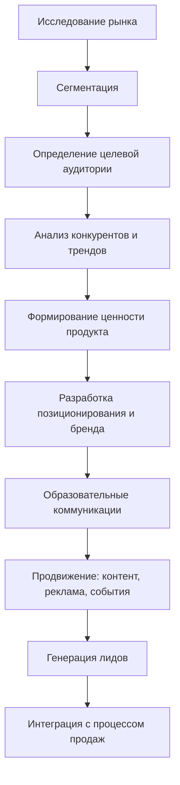
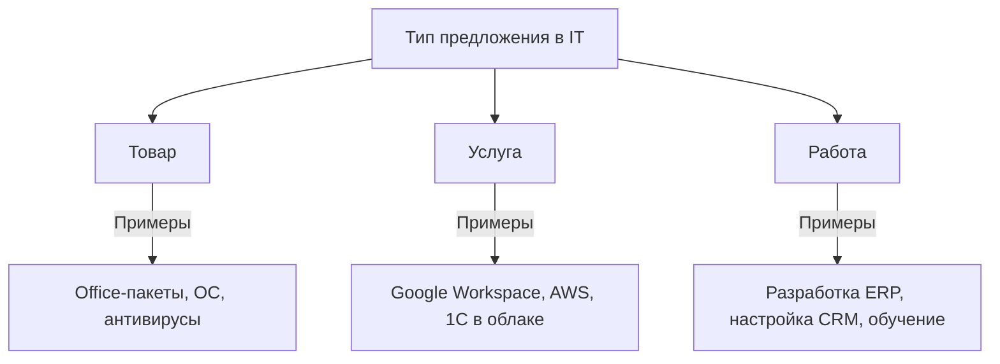
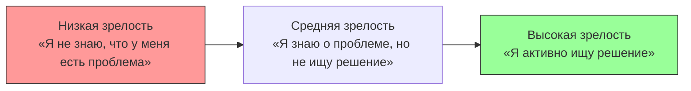

---
tags:
  - all
  - required
  - beginner
title: Маркетинг и распространение IT-продуктов
description: >-
  IT-продукт нельзя пощупать. Клиент не поймёт, нужен ли ему ваш софт, пока не
  попробует. Поэтому маркетинг здесь — это обучение и доверие, а не крикливая
  реклама.
---

import MarketingFunnelPlay from '@site/src/components/MarketingFunnelPlay';

# Маркетинг и распространение IT-продуктов

  ОБЯЗАТЕЛЬНО
  ДЛЯ НОВИЧКОВ

Всем

## Общее о маркетинге

> IT-продукт нельзя пощупать. Клиент не поймёт, нужен ли ему ваш софт, пока не попробует. Поэтому маркетинг здесь — это обучение и доверие, а не крикливая реклама.

Кто покупает:
- B2B — компании (долгие сделки, много согласований, важна безопасность и окупаемость);
- B2C — обычные люди (быстро, эмоционально, важно удобство);
- B2D — разработчики (хотят документацию, простую интеграцию и чтобы работало «из коробки»).

Сделайте простой сайт, понятное демо, соберите обратную связь. И не забывайте, что в IT клиент остаётся с вами годами — маркетинг не заканчивается на продаже.

**Маркетинг** — это комплекс мероприятий по исследованию рынка, позиционированию продукта, формированию ценности и продвижению товаров или услуг. В сфере информационных технологий маркетинг приобретает особую роль, поскольку продукты часто нематериальны, сложны для восприятия и требуют доверия со стороны клиента.

Главная задача маркетинга в IT — создание ценности для клиента. Современный потребитель ищет не просто функциональность, а решение конкретной бизнес- или личной задачи. Поэтому маркетинг должен быть тесно связан с процессами разработки, поддержки и развития продукта.

Процесс продаж в IT отличается от классической модели. Продукт невозможно «потрогать», его качество сложно оценить до использования, а внедрение часто требует изменений в инфраструктуре или бизнес-процессах клиента. Это делает доверие, образование и демонстрацию ценности ключевыми элементами маркетинговой стратегии.

Ценность IT-продукта определяется его способностью масштабироваться, интегрироваться с другими системами, обеспечивать безопасность и снижать операционные издержки. Маркетинг должен фокусироваться на долгосрочных отношениях с клиентом, а не только на однократной продаже.

Современный IT-маркетинг включает в себя:
- исследование рынка и целевой аудитории;
- сегментацию и позиционирование;
- создание образовательного контента;
- генерацию лидов;
- интеграцию с отделом продаж;
- работу с репутацией и обратной связью.

---

## Рынок

**Рынок** в IT — это совокупность участников, взаимодействующих для обмена технологическими решениями, знаниями и ресурсами. Он характеризуется глобализацией, высокой конкуренцией и быстрым циклом обновления продуктов.

### Потребности, спрос и предложение

Потребности в IT могут быть явными (например, «нужно мобильное приложение для заказов») или скрытыми (например, «у нас хаос в управлении проектами»). Маркетолог выявляет скрытые потребности и предлагает решения, которые клиент ещё не осознал.

Спрос формируется под влиянием технологических трендов, экономической ситуации и поведения пользователей. Например, рост удалённой работы увеличил спрос на видеоконференции и облачные хранилища.

Предложение в IT часто опережает спрос. Технологии искусственного интеллекта, блокчейна или квантовых вычислений могут существовать задолго до того, как рынок поймёт их практическую пользу. Здесь маркетинг играет роль просветителя.

### Сегментация и целевая аудитория

Сегментация рынка позволяет разделить аудиторию на группы с похожими характеристиками. Основные критерии сегментации в IT:

- **Географические**: регион, страна.
- **Демографические**: возраст, уровень образования.
- **Отраслевые**: финансы, здравоохранение, образование.
- **Технологические**: используемые системы, уровень цифровизации.
- **Поведенческие**: частота использования, готовность к инновациям.

**Целевая аудитория** — это группа, на которую ориентирован продукт. В IT важно учитывать:
- роль в принятии решений (IT-директор, CFO, конечный пользователь);
- техническую грамотность;
- бюджет;
- ожидания (безопасность, простота, масштабируемость).

Пример: SaaS-платформа может ориентироваться на стартапы (низкий бюджет, простота) или на корпорации (высокая безопасность, API, поддержка SLA).

### Анализ рынка

Анализ рынка включает четыре ключевых этапа:

1. **Изучение целевой аудитории**: кто они, какие задачи решают, какие ограничения имеют.
2. **Оценка конкурентов**: какие решения предлагают, какие у них сильные и слабые стороны.
3. **Анализ трендов**: какие технологии набирают популярность, какие потребности остаются неудовлетворёнными.
4. **SWOT-анализ**:
   - **Strengths**: уникальные технологии, опыт команды.
   - **Weaknesses**: низкая узнаваемость, зависимость от одного клиента.
   - **Opportunities**: новые рынки, партнёрства.
   - **Threats**: усиление конкуренции, санкции, изменения в законодательстве.

Пример: если анализ показывает, что конкуренты игнорируют персонализацию в финтех-приложениях, компания может сделать акцент на этом преимуществе.

---

## Товар, услуга, работа

В IT границы между товаром, услугой и работой часто размыты.

**Товар** — это готовый продукт, который можно купить и использовать автономно. Примеры: Windows, Microsoft Office, антивирус Касперского.

**Услуга** — предоставление доступа к технологии по подписке. Примеры: Google Workspace, AWS, 1C в облаке.

**Работа** — выполнение индивидуального заказа. Примеры: разработка ERP-системы, настройка CRM, обучение сотрудников.

### Ассортимент и товарный знак

**Ассортимент** в IT — это набор продуктов и решений, предлагаемых компанией. Он характеризуется:
- **Широтой**: количество категорий (облако, безопасность, BI).
- **Глубиной**: варианты внутри категории (CRM для малого, среднего и крупного бизнеса).
- **Совместимостью**: насколько продукты интегрируются друг с другом.
- **Масштабируемостью**: возможность адаптации под разные размеры бизнеса.

**Товарный знак** (бренд) в IT — это символ доверия и качества. Он помогает:
- выделиться среди конкурентов;
- снизить барьер принятия решения;
- защитить интеллектуальную собственность;
- формировать эмоциональную связь с клиентом.

Пример: бренд Apple ассоциируется с инновациями, простотой и надёжностью.

---

## Субъекты рынка

### Поставщики

Поставщики в IT обеспечивают ресурсы для создания и доставки продукта:
- разработчики ПО;
- производители оборудования (Dell, Cisco);
- облачные провайдеры (AWS, Azure);
- лицензиары (владельцы API, патентов).

Отношения с поставщиками часто переходят в партнёрские. Например, Microsoft и SAP тесно интегрируют свои решения.

### Заказчики

Заказчик — это сторона, инициирующая покупку. В B2B-сегменте в процессе участвуют:
- **Экономические лица**: утверждают бюджет.
- **Технические специалисты**: оценивают соответствие требованиям.
- **Конечные пользователи**: влияют на выбор через UX-оценку.

Заказчик ожидает не только продукт, но и внедрение, обучение, поддержку и развитие.

### Конкуренция

Конкуренция в IT имеет следующие черты:
- **Глобальный характер**: конкурент может быть из другой страны.
- **Быстрый цикл инноваций**: продукт устаревает за 1–2 года.
- **Низкий порог входа**: даже небольшая команда может создать MVP.
- **Альтернативные решения**: облачные сервисы конкурируют с локальными серверами.

Анализ конкурентов помогает выявить рыночные пробелы и усилить своё предложение.

### Потребители

Потребитель — это тот, кто непосредственно использует продукт. Его особенности:
- высокие ожидания по удобству и скорости;
- разный уровень цифровой грамотности;
- влияние социальных отзывов;
- использование нескольких устройств.

Пример: мобильное приложение должно работать одинаково хорошо на iOS и Android, на слабом и мощном смартфоне.

---

## Клиенты в коммерции

### Воронка продаж

**Воронка продаж** — это модель пути клиента от первого контакта до заключения сделки. В IT она включает:

1. **Генерация лидов**: формы, демо-запросы, вебинары.
2. **Квалификация**: определение готовности к покупке.
3. **Демонстрация**: персонализированная презентация ценности.
4. **Коммерческое предложение**: описание решения, выгод, сроков и стоимости.
5. **Переговоры**: согласование условий, ответы на возражения.
6. **Закрытие сделки**: подписание договора, начало внедрения.

<MarketingFunnelPlay />

### Лиды и их прогрев

**Лид** — потенциальный клиент, проявивший интерес. Не все лиды готовы купить сразу. Их нужно «прогреть» через:
- email-рассылки;
- полезный контент (кейсы, чек-листы, статьи);
- вебинары и демо-видео.

**Обогащение данных лида** — сбор информации о компании, должности, боли, поведении на сайте. Это позволяет персонализировать коммуникацию.

### Квалификация по BANT

Фреймворк **BANT** помогает оценить готовность лида:
- **Budget**: есть ли бюджет?
- **Authority**: может ли принимать решение?
- **Need**: есть ли реальная потребность?
- **Timeline**: когда планируется внедрение?

Только квалифицированные лиды передаются в отдел продаж.

### Уровни зрелости потребности

Коммуникации должны соответствовать уровню зрелости:
- для низкой — образовательный контент;
- для высокой — сравнение решений, демо, КП.

### FOLLOW UP и TOP UP

- **FOLLOW UP** — систематическое сопровождение после первой встречи: благодарственные письма, уточнения, материалы.
- **TOP UP** — повторное обращение после паузы: напоминание, новое КП, актуальный кейс.

Эти практики поддерживают контакт и двигают сделку вперёд.

### Коммерческое предложение и закрытие

Хорошее **коммерческое предложение**:
- ориентировано на ценность, а не на функции;
- персонализировано под клиента;
- содержит чёткие сроки, этапы и стоимость.

**Закрытие сделки** — это не конец, а начало отношений. В IT важны:
- успешное внедрение;
- обучение;
- поддержка;
- развитие продукта.

---

## Каналы продвижения и инструменты маркетинга в IT

Маркетинг IT-продуктов опирается на специфические каналы коммуникации, которые позволяют достичь целевой аудитории с минимальными затратами и максимальной релевантностью. Эти каналы можно разделить на три большие группы: **образовательные**, **технические** и **социальные**.

### Образовательные каналы

Образовательный маркетинг — это основа IT-продвижения. Потребитель должен понять не только, *что* делает продукт, но и *почему* он решает его проблему лучше конкурентов. Поэтому ключевые инструменты здесь:

- **Блоги и технические статьи**: публикации о кейсах внедрения, сравнении решений, разборе ошибок.
- **Вебинары и демо-сессии**: живое взаимодействие с потенциальным клиентом, возможность ответить на вопросы в реальном времени.
- **Документация как маркетинговый инструмент**: качественная документация снижает порог входа и повышает доверие.
- **Открытые курсы и обучающие материалы**: особенно эффективны для B2D (business-to-developer) продуктов.

Пример: компания, разрабатывающая API для распознавания лиц, может вести блог, где публикует примеры интеграции, объясняет GDPR-аспекты и показывает, как избежать ложных срабатываний.

### Технические каналы

Эти каналы ориентированы на разработчиков, системных администраторов и технических специалистов — тех, кто принимает решение о выборе технологии.

- **GitHub и GitLab**: наличие публичного репозитория с примерами кода, issue tracker’ом и активным community повышает доверие.
- **API-документация с интерактивным playground**: позволяет сразу попробовать продукт без установки.
- **Интеграция с популярными DevOps-инструментами**: Helm-чарты для Kubernetes, Terraform-провайдеры, Ansible-роли.
- **Open Source**: выпуск части функционала под открытой лицензией создаёт экосистему и привлекает контрибьюторов.

Пример: проект типа Prometheus или Grafana вырос благодаря открытому исходному коду, активному сообществу и простоте интеграции в существующие стеки.

### Социальные и коммерческие каналы

Хотя IT-маркетинг часто кажется «рациональным», эмоциональная составляющая играет важную роль. Здесь задействуются:

- **LinkedIn**: основной B2B-канал для продаж ERP, CRM, облачных решений.
- **Twitter / X**: популярен среди разработчиков, особенно в англоязычной среде.
- **Reddit и специализированные форумы**: r/programming, Stack Overflow, Habr, VC.ru.
- **Партнёрские программы и реферальные ссылки**: особенно эффективны для SaaS и developer tools.
- **Конференции и митапы**: доклады, спонсорство, стенды — всё это формирует экспертный имидж.

Важно: в IT редко работает «массовая реклама». Целесообразнее фокусироваться на узких, но высококачественных каналах, где аудитория уже проявила интерес к теме.

---

## Метрики и аналитика

Успех маркетинговой кампании в IT измеряется не количеством просмотров, а **качеством взаимодействия**. Основные метрики:

| Метрика | Описание |
|--------|----------|
| **CPL (Cost Per Lead)** | Стоимость получения одного лида. |
| **CTR (Click-Through Rate)** | Процент переходов по ссылке из письма, поста или рекламы. |
| **Time to Value** | Время от первого контакта до осознания ценности продукта. |
| **Activation Rate** | Доля пользователей, выполнивших ключевое действие (например, первый API-запрос). |
| **Churn Rate** | Уровень оттока клиентов — критичен для подписочных моделей. |
| **NPS (Net Promoter Score)** | Готовность клиента рекомендовать продукт. |

Аналитика должна быть **сквозной**: от первого клика по рекламе до закрытия сделки и последующего использования продукта. Для этого используются системы вроде HubSpot, Pipedrive, Mixpanel или собственные решения на базе PostgreSQL + Metabase.

---

## Особенности маркетинга в разных сегментах IT

### B2B (Business-to-Business)

- Длинный цикл продаж (от 1 до 12 месяцев).
- Несколько уровней принятия решения: технический специалист → руководитель отдела → CFO/CEO.
- Акцент на ROI, безопасность, соответствие стандартам (ISO, GDPR, ФСТЭК).
- Часто используется **account-based marketing (ABM)** — персонализированный подход к конкретной компании.

### B2D (Business-to-Developer)

- Целевая аудитория — разработчики.
- Ключевые триггеры: простота интеграции, наличие SDK, хорошая документация.
- Решение должно «работать из коробки».
- Важна репутация в GitHub, Stack Overflow, Reddit.

### B2C (Business-to-Consumer)

- Короткий цикл принятия решения.
- Эмоциональные триггеры: удобство, скорость, дизайн.
- Часто используется freemium-модель (бесплатная версия + платные функции).
- Пример: приложения для заметок, фотофильтры, игры.

---

## Заключительные рекомендации

1. **Начинайте с понимания боли клиента**, а не с описания функций.
2. **Инвестируйте в образование**, а не в баннеры.
3. **Автоматизируйте сбор данных о лидах**, но сохраняйте человеческое взаимодействие на ключевых этапах.
4. **Тестируйте гипотезы быстро**: A/B-тесты лендингов, email-рассылок, демо-сценариев.
5. **Стройте продукт так, чтобы он сам становился маркетинговым инструментом**: если пользователь легко достигает ценности — он расскажет другим.

---

## Стратегии позиционирования и ценообразования

### Позиционирование продукта

**Позиционирование** — это процесс формирования в сознании целевой аудитории чёткого образа продукта, отличающего его от конкурентов. В IT позиционирование особенно важно, поскольку продукты часто выглядят «невидимыми» и сложными для сравнения.

Эффективное позиционирование опирается на:
- уникальное торговое предложение (УТП);
- ясную формулировку выгоды;
- соответствие ожиданиям целевой аудитории.

Пример: Slack позиционирует себя не как «чат», а как «платформу для командной работы». Это сразу выводит продукт из категории мессенджеров и помещает его в контекст бизнес-процессов.

Часто используются следующие типы позиционирования:
- **Функциональное**: акцент на решаемой задаче (например, «автоматизируем расчёт зарплат»).
- **Эмоциональное**: вызывает доверие, безопасность, удобство (например, «ваши данные всегда под контролем»).
- **Ценностное**: ориентировано на ценности клиента (например, «открытый исходный код — ваша свобода»).

Позиционирование должно быть последовательным во всех каналах: сайт, презентации, документация, реклама.

---

### Ценообразование в IT

Ценообразование в IT отличается гибкостью и разнообразием моделей. Выбор модели зависит от типа продукта, целевой аудитории и стратегии роста.

#### Основные модели ценообразования:

| Модель | Описание | Примеры |
|--------|----------|---------|
| **Freemium** | Базовая версия бесплатно, продвинутые функции — платно | Notion, Trello, Zoom |
| **Подписка (SaaS)** | Регулярная оплата за доступ к сервису | Microsoft 365, AWS, GitLab |
| **Разовая лицензия** | Оплата за пожизненное использование | JetBrains IDE, Office (ранние версии) |
| **Pay-per-use** | Оплата за фактическое потребление | AWS Lambda, Twilio SMS |
| **Enterprise-лицензия** | Индивидуальный контракт с крупным клиентом | SAP, Oracle, Salesforce |

#### Факторы, влияющие на цену:
- **Стоимость владения для клиента** (TCO): сколько времени, денег и ресурсов клиент тратит на внедрение и поддержку.
- **ROI (Return on Investment)**: какую прибыль или экономию получает клиент.
- **Конкурентная среда**: цены аналогичных решений.
- **Стадия жизненного цикла продукта**: на старте — низкие цены для привлечения, на зрелости — фокус на ценность.

Важно: цена в IT редко определяется только себестоимостью. Она формируется на основе воспринимаемой ценности.

---

### Упаковка предложения

**Упаковка** — это способ представления продукта на рынке. Она включает:
- название и бренд;
- описание функций и выгод;
- визуальное оформление (логотип, цвета, дизайн сайта);
- структуру тарифов.

Хорошая упаковка отвечает на три вопроса:
1. **Что это?** — краткое и понятное описание.
2. **Для кого?** — чёткое указание целевой аудитории.
3. **Почему стоит выбрать именно это?** — УТП.

Пример упаковки:
> **PostHog** — open-source платформа для аналитики продуктов.  
> Для продуктовых команд, которые хотят понимать поведение пользователей без передачи данных третьим лицам.  
> В отличие от Google Analytics, PostHog полностью контролируется вами и работает on-premise.

---

### Распространение IT-продуктов

Распространение — это доставка продукта до конечного пользователя. В IT оно почти всегда цифровое, но каналы могут сильно различаться.

#### Основные каналы распространения:
- **Собственный сайт** — основной канал для B2B и SaaS.
- **App Store / Google Play** — для мобильных приложений.
- **Маркетплейсы** (AWS Marketplace, Azure Marketplace) — для enterprise-решений.
- **GitHub** — для developer tools и open-source проектов.
- **Партнёрские сети** — интеграторы, реселлеры, системные дома.
- **API-маркетплейсы** (RapidAPI, APILayer) — для API-продуктов.

Выбор канала зависит от:
- типа продукта (B2B, B2C, B2D);
- технической сложности;
- уровня доверия, необходимого для покупки.

Пример: продукт для DevOps-инженеров (например, HashiCorp Vault) распространяется через GitHub, документацию и технические блоги. Продукт для HR-менеджеров (например, Greenhouse) — через LinkedIn, демо-звонки и email-маркетинг.

---

### Виральность и органический рост

В IT многие продукты растут благодаря **виральному эффекту**: пользователи сами рекомендуют решение коллегам или сообществу.

Условия вирального роста:
- **Высокая ценность «здесь и сейчас»**: пользователь сразу видит результат.
- **Лёгкость интеграции**: можно подключить за 5 минут.
- **Социальный компонент**: совместное использование (например, Figma, Miro).
- **Открытость**: возможность делиться ссылками, экспортировать данные, публиковать результаты.

Пример: Replit позволяет мгновенно запустить код и поделиться ссылкой. Это создаёт естественный поток новых пользователей среди студентов и преподавателей.

---

## Автоматизация маркетинга и метрики успеха

### Маркетинговая автоматизация

**Маркетинговая автоматизация** — это использование программных решений для выполнения повторяющихся задач: отправка email, сегментация аудитории, отслеживание поведения на сайте, управление рекламными кампаниями. В IT-сфере автоматизация особенно важна, поскольку позволяет масштабировать коммуникации без пропорционального роста команды.

Основные компоненты автоматизации:
- **Email-маркетинг**: триггерные письма (например, после регистрации), серии писем для «прогрева», персонализированные предложения.
- **Лид-скоринг**: автоматическая оценка качества лида на основе его действий (просмотр цен, посещение демо-страницы, скачивание чек-листа).
- **Интеграция с CRM**: передача данных о лидах в систему управления отношениями с клиентами.
- **Ретаргетинг**: показ рекламы тем, кто уже проявил интерес к продукту.

Пример: SaaS-компания может настроить автоматическую серию писем для новых пользователей:
1. Добро пожаловать + ссылка на быстрый старт.
2. Совет по первой задаче через 2 дня.
3. Приглашение на вебинар через 5 дней.
4. Предложение техподдержки или демо-звонка через 7 дней.

Такой подход повышает активацию и снижает отток.

---

### Ключевые метрики успеха

Успех маркетинговой стратегии в IT измеряется не количеством кликов, а бизнес-результатами. Основные метрики:

| Метрика | Что показывает | Почему важна |
|--------|----------------|--------------|
| **CAC (Customer Acquisition Cost)** | Стоимость привлечения одного клиента | Позволяет оценить рентабельность каналов |
| **LTV (Lifetime Value)** | Доход от клиента за всё время сотрудничества | Показывает долгосрочную ценность клиента |
| **Activation Rate** | Доля пользователей, выполнивших ключевое действие | Отражает, насколько быстро клиент понимает ценность |
| **Churn Rate** | Процент клиентов, прекративших использование | Критичен для подписочных моделей |
| **NPS (Net Promoter Score)** | Готовность рекомендовать продукт | Индикатор лояльности и репутации |

Оптимальное соотношение **LTV:CAC** — не менее 3:1. Если CAC выше трети LTV, модель нерентабельна.

---

### Инструменты аналитики

Для сбора и анализа данных используются:
- **Google Analytics / Plausible / Matomo** — поведение на сайте.
- **Mixpanel / Amplitude / PostHog** — анализ пользовательских событий внутри продукта.
- **HubSpot / Pipedrive / Salesforce** — управление воронкой продаж.
- **Metabase / Grafana** — визуализация бизнес-метрик.

Важно: данные должны быть сквозными. Например, лид из LinkedIn → просмотр демо → регистрация → первый платёж → использование функции X → рекомендация другу. Только так можно выявить слабые звенья воронки.

---

### A/B-тестирование и эксперименты

IT-маркетинг основан на проверке гипотез. Примеры A/B-тестов:
- Два варианта заголовка на лендинге.
- Разные CTA-кнопки: «Попробовать бесплатно» vs «Начать за 5 минут».
- Две версии email-рассылки: с видео vs с текстовым кейсом.

Правила эффективного тестирования:
- Тестируйте одну переменную за раз.
- Набирайте статистически значимую выборку (обычно >1000 показов).
- Фиксируйте не только конверсию, но и качество лида (например, сколько из них дошли до оплаты).

---

### Обратная связь и итерации

Маркетинг в IT — это не разовая кампания, а непрерывный цикл:
1. **Сбор данных** — из CRM, аналитики, поддержки.
2. **Анализ** — где теряются лиды, какие каналы приносят лучших клиентов.
3. **Гипотеза** — как улучшить воронку.
4. **Эксперимент** — запуск A/B-теста или нового канала.
5. **Измерение** — оценка результата.
6. **Итерация** — внедрение успешных решений, отказ от неэффективных.

Пример: если 80% лидов из Facebook не доходят до демо, возможно, таргетинг слишком широкий. Решение — сузить аудиторию до IT-менеджеров в компаниях с 50+ сотрудниками.

---
