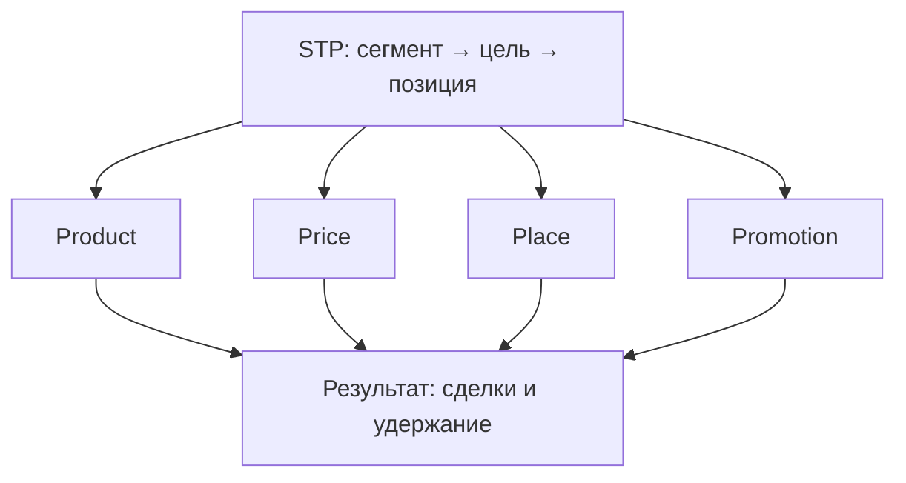

---
tags:
  - all
  - required
  - beginner
title: "Комплекс маркетинга — товар, цена, каналы, продвижение"
description: "Комплекс маркетинга (4P) — согласованный набор решений о продукте, цене, распределении и продвижении; основа GTM для IT."
related:
  - title: Маркетинг IT-продуктов
    doc: encyclopedia/1-basics/1-28-marketing-i-rasprostranenie/1
  - title: Персонализированный маркетинг
    doc: encyclopedia/1-basics/1-28-marketing-i-rasprostranenie/2
  - title: Каналы распределения в торговле
    doc: context/commerce/4
---

# Комплекс маркетинга — товар, цена, каналы, продвижение

  ОБЯЗАТЕЛЬНО
  ДЛЯ НОВИЧКОВ

Всем

---

## Комплекс маркетинга (4P)

**Комплекс маркетинга** — набор управляемых решений, которыми компания отвечает на запросы целевого рынка. Распространённая модель включает четыре группы (**4P**):

| P | Русский термин | Вопрос, на который отвечает | IT-примеры |
|---|----------------|----------------------------|------------|
| **Product** | Товар (продукт) | *Что* получает клиент? | SaaS-функции, API, SLA, onboarding, документация |
| **Price** | Цена | *Сколько* и *на каких условиях*? | Freemium, seat-based, usage-based, enterprise quote |
| **Place** | Распределение (каналы) | *Как* продукт доходит до клиента? | Сайт, маркетплейс (AWS/Azure), GitHub, партнёры-интеграторы |
| **Promotion** | Продвижение | *Как* клиент узнаёт и убеждается? | Контент, конференции, реклама, DevRel, email |

Четыре рычага работают **системой**. Низкая цена при слабом продукте даёт churn; сильный продукт без канала distribution остаётся «секретом инженеров»; агрессивное продвижение без fit в продукте сжигает CAC.

См. также: [Маркетинг IT-продуктов](/encyclopedia/1-basics/1-28-marketing-i-rasprostranenie/1), [Каналы в торговле](/context/commerce/4), [Электронная коммерция](/context/commerce/2).

---

### Product — продукт и ценностное предложение

**Товар** в широком смысле — всё, что удовлетворяет потребность: ПО, услуга, поддержка, бренд, даже идея open source. Принято выделять три уровня:

- **По замыслу (core)** — главная выгода (например, «сократить время обработки заявок»).
- **В реальном исполнении (actual)** — функции, UX, интеграции, версия API.
- **С подкреплением (augmented)** — гарантии, обучение, community, статус SLA.

Для SaaS «товар» включает **time-to-value**: сколько минут от регистрации до первого полезного результата. Для developer tools — качество SDK, примеров и error messages.

**Бренд** снижает риск выбора: клиент покупает не только функции, но и обещание надёжности. **Ассортимент** — широта линейки (один продукт vs платформа) и глубина тарифов.

---

### Price — ценообразование

Цена передаёт **воспринимаемую ценность**, а не только себестоимость. Основные подходы:

| Метод | Суть | Когда уместен в IT |
|-------|------|---------------------|
| Cost-plus | Себестоимость + наценка | Инфраструктурные услуги с известным COGS |
| Break-even / target profit | Объём для покрытия затрат | Стартап с фиксированными расходами на R&D |
| Value-based | Цена от экономии/выгоды клиента | B2B automation, security, compliance |
| Конкурентный | Ориентир на рынок | Commodity-сегменты (hosting, email) |

Психология цены работает и в B2B: якорные тарифы «Enterprise», пакеты «Pro», годовая скидка vs помесячная оплата. **Дискриминационные** (дифференцированные) цены — разные условия для разных сегментов; этические границы — в [Персонализированном маркетинге](/encyclopedia/1-basics/1-28-marketing-i-rasprostranenie/2).

---

### Place — каналы распределения

**Place** отвечает за доступность: где и как клиент получает продукт. В цифровой экономике каналы часто **прямые** (сайт, app store), но посредники остаются:

- маркетплейсы облаков (листинг + billing через платформу);
- системные интеграторы и реселлеры в enterprise;
- app stores и extension marketplaces.

**Мультиканальность** — клиент взаимодействует через несколько точек (сайт, email, офлайн-ивент); **омниканальность** — единый профиль и непрерывный опыт между ними. Подробнее — [Каналы распределения в торговле](/context/commerce/4).

---

### Promotion — продвижение

**Promotion** — коммуникации, стимулирующие осведомлённость, интерес и действие. Комплекс включает:

- **Рекламу** (paid media, таргет).
- **Контент и PR** (статьи, кейсы, выступления).
- **Стимулирование сбыта** (промокоды, extended trial).
- **Личные продажи** (демо, переговоры в B2B).

В IT promotion часто **образовательный**: документация, вебинары, open-source — часть воронки, а не «отдел отдельно от продукта».

  
Связь 4P с метриками

  Product → activation rate; Price → ARPU и LTV; Place → CAC по каналу; Promotion → CTR и качество лидов. Сквозная аналитика связывает все четыре с unit-экономикой.

---

## Жизненный цикл продукта

Продукт проходит этапы от вывода на рынок до спада. Стратегия по **4P** меняется на каждом:

| Этап | Характеристика | Product | Price | Place | Promotion |
|------|----------------|---------|-------|-------|-----------|
| **Вывод (introduction)** | Мало продаж, высокие затраты | MVP, быстрые итерации | Penetration или skimming | Узкие каналы, early adopters | Образование, beta, DevRel |
| **Рост (growth)** | Рост спроса, конкуренты входят | Расширение функций | Стабилизация, пакеты | Масштабирование каналов | Массовый контент, партнёры |
| **Зрелость (maturity)** | Плато, борьба за долю | Дифференциация, upsell | Конкурентные акции | Полное покрытие | Brand, retention, case studies |
| **Спад (decline)** | Падение спроса | Migrate, sunset, archive | Сокращение или niche premium | Сужение каналов | Коммуникация миграции |

В SaaS «зрелость» часто означает **expansion revenue** (допродажи seats и модулей), а «спад» — legacy-модуль, который заменяют новой архитектурой.

**Разработка новых продуктов** (NPD) — цикл идей → отбор → концепт → бизнес-кейс → разработка → trial → коммерческий запуск. В agile-командах это сливается с continuous delivery, но маркетинговые gate (позиционирование, pricing, launch plan) остаются.

---

## Позиционирование и карта восприятия

**Позиционирование** — место продукта в сознании целевого сегмента относительно альтернатив. Эффективное позиционирование отвечает на три вопросы:

1. Для **кого** (сегмент и главная задача).
2. **Чем** отличаемся (одно-два ключевых отличия).
3. **Почему** верить (доказательства: метрики, сертификаты, кейсы).

**Карта позиционирования** — двумерная схема, где по осям (например, «простота vs мощность») наносят конкурентов и свой продукт. Пустая клетка на карте — гипотеза ниши; переполненная — нужна острая дифференциация.

Пример формулировки для IT:

> **PostHog** — product analytics с контролем данных on-premise. Для продуктовых команд, которым важна privacy. В отличие от облачных-only аналитик, данные остаются у заказчика.

---

## Планирование комплекса

Перед запуском или масштабированием полезен чек-лист согласованности 4P:

1. **Сегмент** описан измеримо (ICP — ideal customer profile).
2. **Product** закрывает главную боль сегмента (не «feature list ради списка»).
3. **Price** согласована с value и конкурентами; unit-экономика сходится.
4. **Place** — клиент может купить/активировать без лишних барьеров.
5. **Promotion** — сообщение одно и то же на сайте, в sales deck и в docs.

Стратегический контур (миссия, цели, контроль планов) для торговых компаний — в [Менеджмент](/context/commerce/3); процесс маркетинга в целом — в [статье 1](/encyclopedia/1-basics/1-28-marketing-i-rasprostranenie/1).

---
