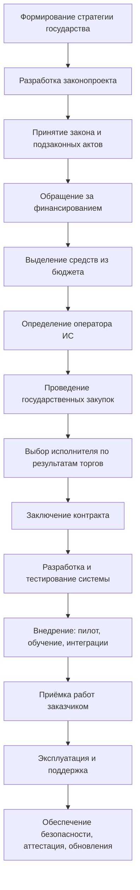
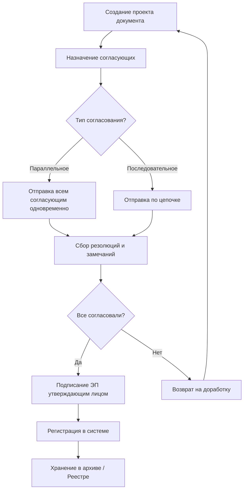

---
tags:
  - all
  - required
  - beginner
title: "Государство и цифровая экономика"
description: "Роль государства в регулировании и развитии IT-сектора."
related:
  - title: "Потребительская грамотность в цифровой среде"
    doc: encyclopedia/1-basics/1-28-marketing-i-rasprostranenie/3
  - title: "Основы бизнеса для IT-специалиста"
    doc: encyclopedia/1-basics/1-29-gosudarstvo-i-biznes/112
  - title: "Цифровая коммуникация"
    doc: encyclopedia/1-basics/1-22-kommunikatsiya-i-obschenie/1
  - title: "Государственное регулирование интернета"
    doc: encyclopedia/2-system-network/2-03-set-i-internet/91
---

# Государство и цифровая экономика

  ОБЯЗАТЕЛЬНО
  ДЛЯ НОВИЧКОВ

Всем

---

## Что такое государство

## Финансовая основа государства

Доходы государства формируются из:
- налогов;
- пошлин и сборов;
- штрафов;
- внутренних облигаций;
- внешних займов;
- доходов от государственных активов — дивидендов госпредприятий, аренды имущества, продажи природных ресурсов.

Эти средства распределяются через **бюджет** — документ, фиксирующий доходы и расходы государства. Если расходы превышают доходы, возникает **бюджетный дефицит**, который покрывается за счёт кредитов и увеличения **государственного долга**.

---

## Цели государства

Цели делятся на две группы:

---

### Основные цели
- защита границ;
- поддержание правопорядка;
- создание и исполнение законов;
- защита прав человека;
- развитие инфраструктуры;
- регулирование рынков;
- обеспечение образования и здравоохранения;
- пенсионное обеспечение.

---

### Второстепенные цели
- развитие науки и технологий;
- укрепление международных позиций;
- поддержка культуры;
- обеспечение политической стабильности.

Эти цели зависят от формы правления, уровня экономического развития и культурных особенностей страны.

---

## Цифровизация государственных функций

Современные государства активно внедряют цифровые технологии во все ключевые сферы:

- **Оборона** — системы управления войсками, разведка, связь;
- **Промышленность** — "умное" производство, автоматизация, интернет вещей;
- **Строительство** — BIM-технологии, цифровые карты;
- **Медицина** — электронные карты пациентов, аналитика;
- **Образование** — онлайн-обучение, цифровые платформы;
- **Правосудие** — электронный документооборот, учёт дел;
- **Экология и ЖКХ** — мониторинг состояния среды, умные сети.

Цель цифровизации — повышение эффективности, доступности и качества государственных услуг.

---

## Государственные информационные системы (ГИС)

**Государственная информационная система (ГИС)** — это программно-технический комплекс, предназначенный для автоматизации функций органов власти.

---

### Цели создания ГИС
- повышение эффективности управления;
- упрощение взаимодействия с гражданами;
- автоматизация рутинных процессов;
- обеспечение прозрачности;
- централизация и защита данных.

Пример: портал **"Госуслуги"** позволяет получать сотни государственных услуг онлайн.

На практике эти цели иногда конфликтуют между собой. Например, максимальная прозрачность может требовать широкого доступа к данным, а безопасность — строгого ограничения доступа. Поэтому при проектировании ГИС всегда ищут баланс между доступностью услуги, юридической значимостью операций и требованиями информационной безопасности.

---

### Участники ГИС
- **Граждане** — получатели услуг;
- **Органы власти** — заказчики и пользователи;
- **Оператор ИС** — юридическое лицо, отвечающее за функционирование системы;
- **Разработчики и поставщики ПО** — исполнители работ;
- **Регуляторы и эксперты** — контролируют соответствие требованиям.

---

### Типы ГИС
- единые централизованные системы;
- распределённые системы (по регионам или муниципалитетам);
- облачные сервисы;
- мобильные приложения (как дополнение);
- API-интерфейсы для интеграции.

Выбор типа ГИС определяется не только технологией, но и управленческой моделью государства. Централизованные системы упрощают стандартизацию и контроль качества данных, но сложнее адаптируются к региональной специфике. Распределенные модели гибче в локальных процессах, но требуют более строгих правил синхронизации и унификации справочников.

---

## Этапы создания ГИС

1. **Формирование стратегии** — руководство страны определяет направление цифрового развития.
2. **Подготовка законопроекта** — уполномоченные органы исследуют тему, формулируют требования, выбирают технологии.
3. **Принятие закона** — парламент утверждает инициативу, она становится юридически обязательной.
4. **Определение ответственного органа и оператора** — закон назначает исполнителя и может указать оператора системы.
5. **Финансирование** — финансовые органы выделяют бюджет, требуя отчёты и контроль за расходованием средств.
6. **Государственные закупки** — оператор проводит торги, выбирает исполнителя (разработчика).
7. **Разработка и тестирование** — исполнитель создаёт систему в соответствии с контрактом.
8. **Внедрение** — подготовка инфраструктуры, обучение сотрудников, пилотный запуск.
9. **Приёмка** — проверка соответствия результатов требованиям заказчика.
10. **Эксплуатация и поддержка** — постоянное обслуживание, обновления, защита информации.

Практический комментарий:
- Наибольшие риски обычно появляются на стыке этапов "требования -> закупка" и "внедрение -> эксплуатация".
- Если требования размыты, подрядчик формально сдаёт контракт, но система не решает реальную задачу.
- Если не заложена поддержка, после запуска быстро накапливаются инциденты и технический долг.

---

## Электронные документы и документооборот

**Документ** — зафиксированная информация, используемая для передачи знаний, принятия решений или выполнения действий.

**Электронный документ** — информация, зафиксированная в машиночитаемой форме, предназначенная для обработки компьютером. Наиболее распространённый формат — XML. PDF и скан-образы не считаются электронными документами в строгом смысле, так как не предназначены для автоматической обработки.

**Электронный документооборот** — процесс создания, согласования, подписания, хранения и уничтожения документов в цифровой среде.

---

### Согласование документов
- **Последовательное** — документ проходит согласующих по цепочке;
- **Параллельное** — отправляется всем согласующим одновременно.

Согласование включает:
- ознакомление;
- верификацию;
- визирование;
- добавление резолюций (комментариев).

Подписание осуществляется с использованием **электронной подписи (ЭП)**.

С точки зрения процессного дизайна последовательное согласование повышает управляемость и уменьшает конфликт версий, но замедляет цикл. Параллельное согласование сокращает время, но требует более зрелой культуры комментариев и разрешения противоречий, иначе документ быстро "застревает" между замечаниями разных подразделений.

---

## Государственные реестры

**Государственные реестры** — централизованные базы данных с официальной информацией, имеющей юридическую силу.

Примеры:
- ЕГРН — единый государственный реестр недвижимости;
- ЕГРЮЛ — реестр юридических лиц;
- ЕГРИП — реестр индивидуальных предпринимателей;
- реестры лицензий, разрешений, сертификатов.

Реестры интегрируются между собой и предоставляют данные через API, формируя единую цифровую экосистему.

Энциклопедически важно понимать роль реестра как "источника правды". Пока данные не внесены в официальный реестр, многие юридические действия либо невозможны, либо рисковы. Поэтому качество реестровых данных напрямую влияет на надежность госуслуг, судебных процедур, налогового администрирования и межведомственного обмена.

---

## Государственные услуги

**Государственная услуга** — действие или комплекс действий, совершаемых органом власти для достижения правового результата для гражданина или организации.

Примеры:
- выдача паспорта;
- регистрация автомобиля;
- запись ребёнка в детский сад.

Порядок предоставления услуг регулируется **административными регламентами** — официальными документами, устанавливающими:
- перечень необходимых документов;
- сроки оказания услуги;
- порядок взаимодействия с заявителем;
- процедуры проверки и принятия решений;
- возможность получения услуги онлайн;
- порядок обжалования.

Большинство ГИС интегрированы с порталом **"Госуслуги"**, обеспечивая "единое окно" для обращений граждан.

---

## Стандартизация в цифровой экономике

**Стандартизация** — основа для совместимости, автоматизации и межведомственного взаимодействия.

Стандарты охватывают:
- форматы данных (XML, JSON, XSD);
- протоколы обмена (HTTP, SOAP, REST);
- методологии разработки;
- технические требования к безопасности;
- процессные модели.

В Российской Федерации стандартизацией занимаются:
- **Минцифры России**;
- **Росстандарт**.

Международные стандарты (ISO, IEC, ITU) также применяются и адаптируются под национальные нужды.

---

## Технический контроль, сертификация и аттестация ГИС

### Обеспечение безопасности государственных информационных систем

**Технический контроль** — это совокупность мероприятий, направленных на проверку соответствия государственных и корпоративных информационных систем установленным требованиям безопасности, надёжности и функциональности.

В Российской Федерации технический контроль осуществляется уполномоченными органами, среди которых ключевую роль играют:

- **ФСТЭК России** — Федеральная служба по техническому и экспортному контролю;
- **ФСБ России** — Федеральная служба безопасности.

Эти органы разрабатывают и утверждают нормативные документы, регулирующие защиту информации, включая требования к защите персональных данных, государственной тайны и критически важной инфраструктуры.

---

### Сертификация и аттестация

**Сертификация информационных систем** — процедура подтверждения соответствия системы или её компонентов установленным требованиям безопасности. Сертификация проводится аккредитованными организациями и завершается выдачей сертификата соответствия.

**Аттестация ГИС** — процесс официального признания возможности эксплуатации информационной системы после проверки её соответствия требованиям законодательства и нормативных актов. Аттестация обязательна для всех государственных ИС, обрабатывающих конфиденциальные или значимые данные.

Этапы аттестации:
1. Подготовка технической документации (описание архитектуры, модели угроз, политики безопасности).
2. Проведение предаттестационного анализа.
3. Выполнение испытаний и проверок (в том числе тестирование на проникновение).
4. Формирование заключения аттестационной комиссии.
5. Выдача аттестата или отказ с указанием причин.

За этими этапами стоит управленческая логика: государство должно убедиться, что система не только функциональна, но и безопасна в реальной эксплуатации. Поэтому аттестация проверяет не "наличие документов ради галочки", а воспроизводимость защитных мер: как настроены доступы, как фиксируются события безопасности, как реагируют ответственные лица при инциденте.

---

### Постоянный контроль и проверки

После ввода системы в эксплуатацию оператор обязан обеспечивать:

- **Регулярный мониторинг безопасности**;
- **Обновление средств защиты**;
- **Проведение внутренних и внешних аудитов**;
- **Уведомление регуляторов о серьёзных инцидентах**.

ФСТЭК и ФСБ вправе инициировать внеплановые проверки, особенно в случае утечек данных, кибератак или изменений в законодательстве.

Именно на этапе постоянного контроля чаще всего проявляется зрелость системы. Проект может успешно пройти внедрение, но без регулярного обновления средств защиты быстро теряет устойчивость — меняются угрозы, появляются новые уязвимости, расширяется интеграционный контур. Поэтому безопасность ГИС — это непрерывный операционный процесс, а не одноразовый проект.

Важно

  

Соответствие требованиям ФСТЭК и ФСБ — непрерывный процесс, включающий обучение персонала, управление доступом, шифрование, резервное копирование и многоуровневую защиту.

  

---

## Стандартизация в цифровой экономике

### Роль стандартов

**Стандартизация** — основа для совместимости, автоматизации и межведомственного взаимодействия. Без единых стандартов невозможна интеграция реестров, обмен электронными документами или создание единого цифрового пространства.

Стандарты охватывают:
- форматы данных (XML, JSON, XSD);
- протоколы обмена (HTTP, SOAP, REST);
- методологии разработки;
- технические требования к безопасности;
- процессные модели.

---

### Национальная и международная стандартизация

В Российской Федерации стандартизацией занимаются:
- **Минцифры России** — определяет стратегические направления цифровой трансформации;
- **Росстандарт** — координирует разработку и утверждение национальных стандартов.

Международные стандарты также применяются:
- **ISO/IEC** — общие стандарты в области ИТ и информационной безопасности;
- **ITU** — стандарты в области телекоммуникаций.

Примеры применяемых стандартов:
- **ГОСТ Р 57580** — модель зрелости процессов разработки ПО;
- **ГОСТ Р ИСО/МЭК 27001** — система менеджмента информационной безопасности;
- **ГОСТ Р 7.0.97–2016** — оформление организационно-распорядительной документации.

---

### Отраслевые и государственные стандарты

Наряду с международными и общероссийскими стандартами существуют отраслевые нормативы, например:
- **МИЭЦ** — методические рекомендации по электронному документообороту;
- **ЕПГУ** — единые принципы и подходы к построению порталов госуслуг;
- **ТИП** — типовые интерфейсы взаимодействия между системами.

Эти документы обеспечивают единообразие при проектировании, разработке и эксплуатации ГИС.

Когда стандартизация работает корректно, появляется предсказуемость — системы проще интегрировать, подрядчиков легче менять без потери совместимости, а данные могут циркулировать между ведомствами без ручного "перевода форматов". В результате государственные цифровые сервисы становятся стабильнее для граждан и дешевле в сопровождении для оператора.

{/* sidebar-collections */}

---

## В подборках

Статья входит в [тематические подборки](/about/collections) и блок "С чего начать?" на [главной](/). Соседние шаги того же маршрута:

**Цифровая грамотность** — [Потребительская грамотность в цифровой среде](/encyclopedia/1-basics/1-28-marketing-i-rasprostranenie/3), [Основы бизнеса для IT-специалиста](/encyclopedia/1-basics/1-29-gosudarstvo-i-biznes/112), [Цифровая коммуникация](/encyclopedia/1-basics/1-22-kommunikatsiya-i-obschenie/1), [Государственное регулирование интернета](/encyclopedia/2-system-network/2-03-set-i-internet/91), [Эффективный поиск в интернете](/encyclopedia/1-basics/1-21-poisk-informatsii/3), [Интернет-культура — о разделе](/encyclopedia/9-spinoff/9-10-internet-kultura/intro).

{/* /sidebar-collections */}

---
