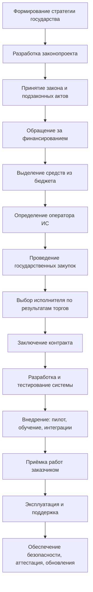
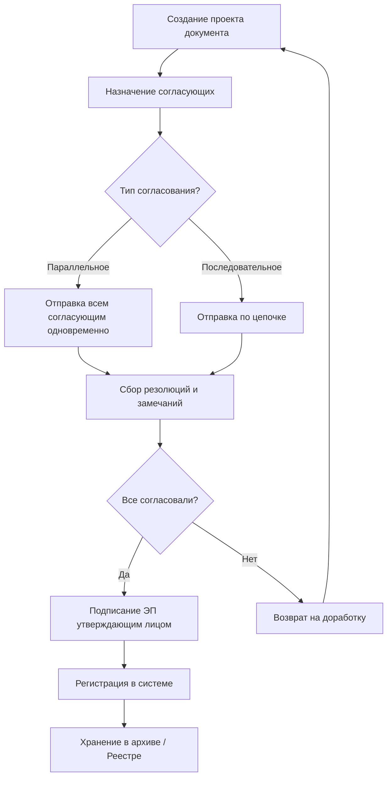

---
tags:
  - all
  - required
  - beginner
title: "Государство и цифровая экономика"
description: "Роль государства в регулировании и развитии IT-сектора."
related:
  - title: "Потребительская грамотность в цифровой среде"
    doc: encyclopedia/1-basics/1-28-marketing-i-rasprostranenie/3
  - title: "Основы бизнеса для IT-специалиста"
    doc: encyclopedia/1-basics/1-29-gosudarstvo-i-biznes/112
  - title: "Цифровая коммуникация"
    doc: encyclopedia/1-basics/1-22-kommunikatsiya-i-obschenie/1
  - title: "Государственное регулирование интернета"
    doc: encyclopedia/2-system-network/2-03-set-i-internet/91
---

# Государство и цифровая экономика

  ОБЯЗАТЕЛЬНО
  ДЛЯ НОВИЧКОВ

Всем

---

## Что такое государство

Взаимоотношения государства и цифровой экономики строятся на фундаментальном сдвиге: технологии перестали быть просто отдельной ИТ-отраслью и стали основой функционирования всей экономической и государственной системы. Государство сегодня выступает в трех главных ролях:
- как главный регулятор (создает законы для цифровой среды),
- крупнейший инвестор (строит инфраструктуру),
- ключевой потребитель (оцифровывает свои услуги).

Основные роли в цифровой экономике:
1. Создание цифровой инфраструктуры. Бизнес не сможет развивать цифровые сервисы без базовой сети. Государство берет на себя самые масштабные и капиталоемкие проекты - связь и интернет, облачные платформы, научно-исследовательские проекты. Например, создание единых государственных дата-центров и облачных экосистем (например, «ГосТех» в РФ), где собираются и обрабатываются большие данные.
2. Законодательное регулирование (Новые правила игры). Классические законы не работают в цифровой среде. Государство вынуждено оперативно формировать новые правовые рамки - регулирование деятельности маркетплейсов, экосистем и служб доставки (защита прав продавцов, курьеров и покупателей), оборот данных, разработка механизмов, которые позволяют бизнесу легально и безопасно использовать обезличенные государственные данные для обучения нейросетей, и, конечно же, внедрение национальных цифровых валют центральных банков (например, цифрового рубля или цифрового юаня) для ускорения и удешевления расчетов.
3. Кибербезопасность и борьба с киберпреступностью. В цифровой экономике главным уязвимым местом становятся данные и деньги граждан. Государство выстраивает защитный контур - системы фильтрации и мониторинга, защита критической инфраструктуры.

## Финансовая основа государства

Финансовая основа государства — это совокупность денежных средств, находящихся в распоряжении органов власти для выполнения их функций. Эти средства формируют публичные финансы, которые аккумулируются, распределяются и используются через государственную финансовую систему, и включают в себя бюджеты, внебюджетные фонды, государственные кредиты. Государство не производит блага напрямую в масштабах всей экономики, поэтому его доходы формируются за счет перераспределения ресурсов - налогов, сборов, пошлин, эмиссии и займов.

Доходы государства формируются из:
- налогов;
- пошлин и сборов;
- штрафов;
- внутренних облигаций;
- внешних займов;
- доходов от государственных активов — дивидендов госпредприятий, аренды имущества, продажи природных ресурсов.

Эти средства распределяются через **бюджет** — документ, фиксирующий доходы и расходы государства. Если расходы превышают доходы, возникает **бюджетный дефицит**, который покрывается за счёт кредитов и увеличения **государственного долга**.

Все собранные деньги государство возвращает в экономику через систему расходов - социальная сфера (пенсии, пособия, медицина, образование), экономика (инфраструктура, субсидии бизнесу, ИТ-сектор), безопасность (армия, полиция, судебная система), управление (содержание госаппарата и чиновников).

Соотношение доходов и расходов определяет состояние финансовой основы государства:
- Профицитный бюджет: `Доходы > Расходы` (образуются излишки, которые направляются в резервные фонды).
- Сбалансированный бюджет: `Доходы = Расходы` (идеальное теоретическое состояние).
- Дефицитный бюджет: `Доходы < Расходы` (нехватка денег, требующая займов или сокращения трат).

---

## Цели государства

Цели государства — это главные направления его деятельности, ради которых оно создается и функционирует. Их можно разделить на две фундаментальные группы: конечные (высшие) цели, ориентированные на благо общества, и обеспечивающие (инструментальные) цели, которые необходимы для сохранения самого государства. Высшие, или основные, цели зафиксированы в конституциях большинства современных стран и отражают смысл существования государства как общественного института

---

### Основные цели
- защита границ;
- поддержание правопорядка;
- создание и исполнение законов;
- защита прав человека;
- развитие инфраструктуры;
- регулирование рынков;
- обеспечение образования и здравоохранения;
- пенсионное обеспечение.

Чтобы эффективно выполнять высшие цели, государство должно постоянно поддерживать собственную стабильность, силу и ресурсы. Это сохранение государственного суверенитета, независимости на мировой арене, удержание целостности своих территорий и предотвращение внутренних расколов, обеспечение устойчивого роста экономики, сдерживание инфляции, минимизация безработицы и стабильное наполнение государственного бюджета (финансовой основы). И конечно достижение технологического суверенитета, создание собственной цифровой инфраструктуры и переход к управлению на основе данных и искусственного интеллекта.

В ходе истории главные ориентиры государств кардинально менялись:
1. Эпоха Древнего мира и Средневековья. Главная цель — удержание власти правителя, расширение территорий за счет войн и сбор дани.
2. Эпоха Просвещения и Нового времени. Целью становится сохранение правопорядка. Возникает концепция государства как «ночного сторожа», которое не вмешивается в жизнь людей, а лишь охраняет их собственность и покой.
3. Современность (XX–XXI века). Большинство развитых стран провозгласили себя «социальными государствами» (Welfare State). Их ключевой целью стало обеспечение благополучия граждан «от рождения до старости» через регулирование экономики, медицину и социальные пособия.

---

### Второстепенные цели

Второстепенными называют цели государства, которые носят обеспечивающий, локальный или временный характер:
- развитие науки и технологий;
- укрепление международных позиций;
- поддержка культуры;
- обеспечение политической стабильности.

Эти цели зависят от формы правления, уровня экономического развития и культурных особенностей страны. Они не являются смыслом существования государства (в отличие от высших целей — безопасности и благополучия граждан), но необходимы для решения конкретных текущих задач. Если высшие цели отвечают на вопрос «Зачем существует государство?», то второстепенные отвечают на вопрос «Что нужно сделать прямо сейчас, чтобы всё работало?».

Обычно для этого поддерживают работоспособность государственной машины - сокращение лишних чиновников, упрощение документооборота, цифровизация ведомств, обновление процессуальных кодексов, повышение квалификации судей для ускорения рассмотрения дел, точный учет населения и экономических показателей для принятия более верных управленческих решений, восстановление инфраструктуры после наводнений, землетрясений или техногенных аварий, введение временных санитарных ограничений, экстренное развертывание медицинских центров, спасение конкретных системообразующих банков или предприятий в период острого финансового кризиса.

Можно выделить и имиджевые, символические - организация Олимпийских игр, всемирных выставок (EXPO) или крупных экономических форумов, продвижение национального языка, кино, искусства и ценностей за рубежом («мягкая сила»), поддержка позитивного восприятия отечественных товаров и туристических направлений.

При этом в условиях жесткого кризиса (например, при угрозе войны или дефолта) государство временно замораживает большинство второстепенных целей (отменяет праздники, сокращает расходы на имиджевые проекты), чтобы бросить все ресурсы на выполнение базовой цели — выживание.

---

## Цифровизация государственных функций

Современные государства активно внедряют цифровые технологии во все ключевые сферы:

- **Оборона** — системы управления войсками, разведка, связь;
- **Промышленность** — "умное" производство, автоматизация, интернет вещей;
- **Строительство** — BIM-технологии, цифровые карты;
- **Медицина** — электронные карты пациентов, аналитика;
- **Образование** — онлайн-обучение, цифровые платформы;
- **Правосудие** — электронный документооборот, учёт дел;
- **Экология и ЖКХ** — мониторинг состояния среды, умные сети.

Цель цифровизации — повышение эффективности, доступности и качества государственных услуг.

Цифровизация государственных функций — это перевод процессов управления, контроля и предоставления услуг в автоматический режим с использованием больших данных и искусственного интеллекта (ИИ). Ее главная цель — убрать человеческий фактор из рутинных процессов, сделать взаимодействие с гражданами незаметным (проактивным) и снизить издержки на содержание госаппарата. Государство автоматизирует три ключевых направления своей деятельности:
1. Социальная и сервисная функция (G2C, G2B). Трансформация от заявительного принципа (когда нужно просить справку) к проактивному (когда государство само предлагает услугу) - суперсервисы, безбумажный документооборот. Например, использование мобильной электронной подписи («Госключ») для заключения сделок и перевод документов (паспорт, права, дипломы) в верифицированные QR-коды.
2. Контрольно-надзорная и фискальная функция. Цифровые алгоритмы заменяют инспекторов, делая проверку бизнеса и граждан непрерывной и бесконтактной - налоговый онлайн-мониторинг, автоматические штрафы, системы маркировки (например, «Честный Знак»), которые автоматически блокируют продажу просроченных или контрафактных лекарств и продуктов на кассе.
3. Управленческая и аналитическая функция (Внутри самого государства). Это перенос всех ведомственных программ на единый ИТ-конструктор (платформа «ГосТех»), что исключает дублирование баз данных и ускоряет обмен информацией между министерствами через СМЭВ. Может быть, даже использование алгоритмов машинного обучения для прогнозирования дефицита мест в школах, моделирования транспортных потоков в мегаполисах или выявления зон бедности для точечного распределения субсидий.

Несмотря на удобство, тотальная цифровизация госаппарата несет в себе серьезные угрозы - кибербезопасность, утечки, цифровое неравенство, риск слишком сильного ограничения. Концентрация миллиардов записей персональных данных в единых облачных хранилищах делает их главной мишенью для хакеров. Жители удаленных регионов или пожилые люди, не имеющие качественного интернета и навыков работы с гаджетами, рискуют оказаться отрезанными от госуслуг.

---

## Государственные информационные системы (ГИС)

**Государственная информационная система (ГИС)** — это программно-технический комплекс, предназначенный для автоматизации функций органов власти. Они содержат юридически значимые сведения, которые служат главным эталонным источником информации для ведомств, граждан и бизнеса. Согласно Федеральному закону № 149-ФЗ, все ГИС делятся на федеральные (действуют на всю страну) и региональные (работают внутри конкретного субъекта).

По закону государственные ведомства не могут использовать обычный софт — любая официальная информация должна обрабатываться внутри строго сертифицированных контуров с обеспечением учёта, хранения, межведомственного взаимодействия, контроля и надзора, например - фиксация прав собственности, паспортов, налоговых обязательств и медицинских карт, моментальный обмен данными между министерствами через систему СМЭВ без привлечения граждан, автоматический мониторинг уплаты налогов, движения маркированных товаров или соблюдения ПДД.

Российская ИТ-инфраструктура насчитывает несколько сотен систем - ЕСИА, ЕИС Закупки, ФГИС ЕГР ЗАГС, ФГИС ЕГРН, ГИИС "Электронный бюджет", ГАС "Правосудие", ГАС "Выборы" и прочее.

---

### Цели создания ГИС
- повышение эффективности управления;
- упрощение взаимодействия с гражданами;
- автоматизация рутинных процессов;
- обеспечение прозрачности;
- централизация и защита данных.

Пример: портал **"Госуслуги"** позволяет получать сотни государственных услуг онлайн.

На практике эти цели иногда конфликтуют между собой. Например, максимальная прозрачность может требовать широкого доступа к данным, а безопасность — строгого ограничения доступа. Поэтому при проектировании ГИС всегда ищут баланс между доступностью услуги, юридической значимостью операций и требованиями информационной безопасности.

Создание и поддержка ГИС строго регламентированы государством, к ним предъявляются повышенные требования - бескомпромиссная безопасность, например. Каждая ГИС обязана пройти процедуру аттестации ФСТЭК и ФСБ России по классу информационной безопасности. Системы должны быть защищены от взломов, утечек данных и кибератак.

Также существует такое понятие, как импортозамещение, когда государственные системы строятся исключительно на базе российского ПО из Реестра Минцифры и отечественных СУБД (например, Postgres Pro вместо американской Oracle). А чтобы ведомства не тратили миллиарды на дублирующие ИТ-разработки, все новые ГИС сейчас обязаны проектироваться на базе единого государственного облачного конструктора — платформы «ГосТех». Правительство проводит масштабную ревизию всех ведомственных ИТ-ресурсов, собирая их в единый федеральный реестр, чтобы исключить существование "неучтенных" баз данных и стандартизировать требования безопасности.

---

### Участники ГИС

Участники государственных информационных систем (ГИС) — это все субъекты, которые создают, наполняют информацией, защищают, администрируют или используют эти платформы:
- **Граждане** — получатели услуг;
- **Органы власти** — заказчики и пользователи;
- **Оператор ИС** — юридическое лицо, отвечающее за функционирование системы;
- **Разработчики и поставщики ПО** — исполнители работ;
- **Регуляторы и эксперты** — контролируют соответствие требованиям.

Их состав, права и обязанности четко регламентированы законодательством (в России — Федеральным законом № 149-ФЗ «Об информации, информационных технологиях и о защите информации»).
1. Заказчик (Инициатор создания ГИС) - это государственный орган, который принимает решение о необходимости создания цифровой платформы для выполнения своих функций. Министерства, федеральные службы или ведомства (например, Минцифры, ФНС, Минздрав). Выделяет бюджет, формирует техническое задание, определяет цели системы и нормативную базу для её работы.
2. Оператор ГИС - главное юридическое лицо, которое отвечает за техническую работоспособность, доступность и безопасность системы на протяжении всего времени её эксплуатации. Государственное ведомство самостоятельно либо привлеченное им государственное учреждение/госкомпания (например, подведомственные ИТ-институты, ПАО «Ростелеком»). Обеспечивает бесперебойную работу серверов, защищает базу данных от хакерских атак согласно требованиям ФСТЭК и ФСБ, а также предоставляет доступ другим участникам.
3. Поставщики информации (Информационные доноры) - субъекты, которые по закону обязаны наполнять ГИС актуальными и достоверными сведениями. Органы власти всех уровней, суды, бюджетные учреждения (школы, больницы), а в ряде систем — коммерческий бизнес и индивидуальные предприниматели. При заполнении ГИС «Честный Знак» поставщиками информации выступают заводы-производители и импортеры, которые обязаны вносить данные о маркировке каждой единицы товара.
4. Пользователи (Потребители информации) - те, ради кого система создавалась. Пользователи получают санкционированный доступ к данным ГИС для работы, получения услуг или контроля. Их делят на три группы - государственные ведомства, бизнес и граждане.
5. Разработчики и ИТ-интеграторы (Подрядчики) - коммерческие или окологосударственные ИТ-компании, которые непосредственно пишут код, проектируют базы данных и внедряют систему. Это аккредитованные Минцифры ИТ-компании, выигравшие государственный тендер. Программирование, тестирование, интеграция ГИС с единой платформой «ГосТех» и техническая поддержка на начальных этапах.

Государственные ведомства запрашивают данные друг у друга через СМЭВ для проверки документов граждан без их участия. Бизнес (Юридические лица) используют ГИС для сдачи отчетности, участия в торгах (например, в ЕИС Закупки) или проверки контрагентов. А граждане (Физические лица) видят свои данные, получают выписки, справки и электронные услуги через интерфейсы (например, личный кабинет на Госуслугах).

---

### Типы ГИС

Государственные информационные системы (ГИС) классифицируются по нескольким ключевым признакам. Основными критериями деления являются территориальный масштаб, функциональное назначение и характер обрабатываемых данных.
- единые централизованные системы;
- распределённые системы (по регионам или муниципалитетам);
- облачные сервисы;
- мобильные приложения (как дополнение);
- API-интерфейсы для интеграции.

Выбор типа ГИС определяется не только технологией, но и управленческой моделью государства. Централизованные системы упрощают стандартизацию и контроль качества данных, но сложнее адаптируются к региональной специфике. Распределенные модели гибче в локальных процессах, но требуют более строгих правил синхронизации и унификации справочников.

Федеральный закон № 149-ФЗ жестко делит системы на уровни управления:
- Федеральные ГИС (ФГИС) действуют на территории всей страны. Создаются на основании федеральных законов или актов Президента/Правительства.
- Региональные ГИС (РГИС) создаются органами власти конкретного субъекта РФ и действуют только в его границах.
- Муниципальные ИС (МИС) создаются местными органами самоуправления для решения задач конкретного города или района (формально они часто не имеют статуса ГИС, но работают по схожим правилам).

В зависимости от того, какие задачи выполняет система для государства, выделяют четыре основных типа ГИС:
- Реестровые (учетные) системы. Их главная задача — быть единым «источником правды». Они хранят эталонные государственные базы данных, на которые опираются все остальные ведомства.
- Контрольно-надзорные и фискальные системы. Используются государством для мониторинга нарушений, сбора налогов, пошлин и отслеживания товарных потоков.
- Используются государством для мониторинга нарушений, сбора налогов, пошлин и отслеживания товарных потоков. Это сервисные ГИС, которые связывают разные ведомства между собой или предоставляют удобный интерфейс для взаимодействия государства с людьми.
- Системы поддержки принятия решений (аналитические). Инструменты для долгосрочного планирования, моделирования ситуаций и сбора макроэкономической статистики.

---

## Этапы создания ГИС

1. **Формирование стратегии** — руководство страны определяет направление цифрового развития.
2. **Подготовка законопроекта** — уполномоченные органы исследуют тему, формулируют требования, выбирают технологии.
3. **Принятие закона** — парламент утверждает инициативу, она становится юридически обязательной.
4. **Определение ответственного органа и оператора** — закон назначает исполнителя и может указать оператора системы.
5. **Финансирование** — финансовые органы выделяют бюджет, требуя отчёты и контроль за расходованием средств.
6. **Государственные закупки** — оператор проводит торги, выбирает исполнителя (разработчика).
7. **Разработка и тестирование** — исполнитель создаёт систему в соответствии с контрактом.
8. **Внедрение** — подготовка инфраструктуры, обучение сотрудников, пилотный запуск.
9. **Приёмка** — проверка соответствия результатов требованиям заказчика.
10. **Эксплуатация и поддержка** — постоянное обслуживание, обновления, защита информации.

Практический комментарий:
- Наибольшие риски обычно появляются на стыке этапов "требования -> закупка" и "внедрение -> эксплуатация".
- Если требования размыты, подрядчик формально сдаёт контракт, но система не решает реальную задачу.
- Если не заложена поддержка, после запуска быстро накапливаются инциденты и технический долг.

В основе создания ГИС всегда лежит нормативно-правовой акт (Федеральный закон, Постановление Правительства). Государство не ищет прибыль; система создается, потому что этого требует закон для исполнения функций власти. Без юридического основания (даже если ИТ-решение гениально) проект запустить невозможно. 

Тратятся бюджетные (народные) деньги, поэтому каждый шаг жестко контролируется (Казначейством, Счетной палатой). Выбор разработчика происходит строго через публичные государственные закупки (44-ФЗ). Выигрывает тот, кто предложил наименьшую цену при соответствии формальным критериям, что часто связывает руки оператору системы, если подрядчик оказался некомпетентным.

Разработка ведется строго по ГОСТам (например, ГОСТ 34). ТЗ утверждается до начала торгов и имеет юридическую силу. Любое изменение ТЗ в процессе разработки требует длительных бюрократических согласований и дополнительных соглашений к госконтракту. Изменить стек технологий или интерфейс «потому что так удобнее» посреди проекта нельзя. Система обязана соответствовать жесточайшим требованиям информационной безопасности (ФСТЭК и ФСБ). Систему нельзя развернуть в коммерческом облаке — только на защищенной гос-платформе (например, «ГосТех»). Код должен состоять исключительно из компонентов, одобренных Минцифры, а базы данных должны строиться на российском сертифицированном софте.

Приёмка — это сложнейшая юридическая процедура (аттестация, государственные испытания). ГИС не имеет права выйти в свет «сырой» и терять данные граждан или путать их ИНН. Ошибки в ГИС ведут не просто к потере клиентов, а к судебным искам, срывам выплат пособий и уголовной ответственности для чиновников за халатность.

---

## Электронные документы и документооборот

**Документ** — зафиксированная информация, используемая для передачи знаний, принятия решений или выполнения действий.

**Электронный документ** — информация, зафиксированная в машиночитаемой форме, предназначенная для обработки компьютером. Наиболее распространённый формат — XML. PDF и скан-образы не считаются электронными документами в строгом смысле, так как не предназначены для автоматической обработки.

**Электронный документооборот** — процесс создания, согласования, подписания, хранения и уничтожения документов в цифровой среде. Это система создания, обмена, обработки и хранения юридически значимых документов в цифровом виде без использования бумажных носителей.

Чтобы цифровой файл имел ту же юридическую силу, что и бумажный документ с синей печатью, используется электронная подпись. Согласно закону № 63-ФЗ, она бывает трех видов:
- Простая (ПЭП): СМС-код или связка логин/пароль. Используется гражданами для авторизации на Госуслугах или подтверждения банковских операций. Не защищает документ от изменений после подписания.
- Усиленная неквалифицированная (УНЭП): Создается с помощью криптографических алгоритмов. Позволяет определить автора и защищает документ от правок. Подходит для внутреннего документооборота компании или работы физлиц (именно она выпускается в приложении «Госключ» для подписания договоров).
- Усиленная квалифицированная (УКЭП): Самый защищенный вид подписи. Выдается только аккредитованными Минцифры удостоверяющими центрами, а для бизнеса — ФНС. По закону она по умолчанию равна личной подписи человека ручкой на бумаге и применяется для сдачи отчетности в ГИС, участия в госзакупках и подписания внешних контрактов.

Государство не просто контролирует ЭДО, а выступает главным драйвером его тотального внедрения через ГИС и законодательные требования:
1. Мгновенный межведомственный обмен (СМЭВ). Благодаря системе межведомственного электронного взаимодействия госорганы отправляют друг другу миллионы документов в секунду. Гражданину больше не нужно носить бумажную справку из одного министерства в другое.
2. Внедрение машиночитаемых доверенностей (МЧД). Государство перевело доверенности в цифровой формат. МЧД — это электронный файл в формате XML, который подписывается руководителем компании и прикрепляется к документам, подтверждая полномочия сотрудника (например, бухгалтера) без предоставления бумажной нотариальной доверенности.
3. Единые государственные стандарты (Форматирование). ФНС России утверждает жесткие электронные форматы для ключевых документов (счета-фактуры, товарные накладные, акты). Это позволяет ГИС ФНС (АИС «Налог-3») автоматически «читать» файлы, выявлять налоговые разрывы и проводить проверки без участия инспекторов.
4. Кадровый ЭДО (КЭДО). Государство законодательно разрешило компаниям полностью отказаться от бумажных трудовых договоров, приказов о приеме на работу и заявлений на отпуск, переведя их в цифру.

Благодаря электронному документообороту, скорость доставки документа сокращается с дней (почтой) до секунд; расходы на бумагу, печать и курьеров снижаются на 80--90%; цифровые архивы в ГИС и серверах компаний занимают терабайты памяти вместо огромных пыльных помещений.

Однако есть и минус - необходимость жесткой защиты ИТ-периметра от кражи ключей электронной подписи; риск потери доступа к архивам при технических сбоях; сложности интеграции старых ИТ-систем бизнеса с государственными ГИС.

---

### Согласование документов

Согласование документов в государственном и коммерческом ИТ-контуре — это упорядоченный процесс проверки, корректировки и одобрения электронного документа должностными лицами перед его финальным подписанием. В системах электронного документооборота (СЭД) этот процесс превратился из ручного перекладывания бумаг в автоматизированный цифровой конвейер, работающий по строгим алгоритмам.

- **Последовательное** — документ проходит согласующих по цепочке;
- **Параллельное** — отправляется всем согласующим одновременно.

Согласование включает:
- ознакомление;
- верификацию;
- визирование;
- добавление резолюций (комментариев).

Подписание осуществляется с использованием **электронной подписи (ЭП)**.

С точки зрения процессного дизайна последовательное согласование повышает управляемость и уменьшает конфликт версий, но замедляет цикл. Параллельное согласование сокращает время, но требует более зрелой культуры комментариев и разрешения противоречий, иначе документ быстро "застревает" между замечаниями разных подразделений.

Современные СЭД и ГИС автоматизируют рутину и исключают человеческий фактор с помощью следующих ИТ-инструментов:
1. Версионность файлов. Система жестко блокирует возможность запутаться в редакциях. Каждое изменение сохраняется как новая версия (v1.0, v1.1, v2.0), при этом авторы правок и комментарии фиксируются в истории документа навсегда.
2. Электронная виза (согласование). В отличие от финального подписания (которое требует защищенной УКЭП), этап промежуточного согласования часто подтверждается внутренней электронной визой пользователя внутри СЭД.
3. Автоматические уведомления и эскалация. Если согласующий чиновник или менеджер не проверил документ в установленный срок (например, за 2 дня), система автоматически отправляет напоминание на почту/в мессенджер, а при дальнейшей задержке — перенаправляет задачу его вышестоящему руководителю.
4. Внедрение искусственного интеллекта. В продвинутых ГИС и корпоративных системах нейросети проводят первичный аудит — они автоматически сверяют текст проекта документа с эталонными шаблонами и законами, подсвечивая юристу потенциальные риски или ошибки еще до начала ручной проверки.

---

## Государственные реестры

**Государственные реестры** — централизованные базы данных с официальной информацией, имеющей юридическую силу. Это официальные систематизированные своды юридически значимых сведений об объектах, субъектах, правах или фактах, которые ведутся уполномоченными органами власти. В цифровом государстве государственные реестры переведены в электронный вид и функционируют как специализированные реестровые ГИС. Запись в таком электронном реестре сегодня имеет приоритет над любым бумажным документом: бумажное свидетельство — это лишь выписка, а юридическую силу имеет именно цифровая строка в базе данных государства.

Всю систему госреестров можно разделить на четыре ключевых блока в зависимости от того, что именно они учитывают:
1. Реестры лиц (Субъекты права). Хранят эталонную информацию о гражданах и организациях.
2. Реестры имущества и прав (Объекты). Фиксируют право собственности и характеристики материальных или нематериальных ценностей.
3. Реестры разрешений, лицензий и ограничений. Реестры разрешений, лицензий и ограничений
4. Отраслевые и экономические реестры. Используются для регулирования конкретных рынков и импортозамещения.

Примеры:
- ЕГРН — единый государственный реестр недвижимости;
- ЕГРЮЛ — реестр юридических лиц;
- ЕГРИП — реестр индивидуальных предпринимателей;
- реестры лицензий, разрешений, сертификатов.

Реестры интегрируются между собой и предоставляют данные через API, формируя единую цифровую экосистему.

Энциклопедически важно понимать роль реестра как "источника правды". Пока данные не внесены в официальный реестр, многие юридические действия либо невозможны, либо рисковы. Поэтому качество реестровых данных напрямую влияет на надежность госуслуг, судебных процедур, налогового администрирования и межведомственного обмена.

Раньше каждый реестр был изолированной «цифровой крепостью», что вынуждало граждан носить справки из одного ведомства в другое. Сегодня эта проблема решена с помощью двух ИТ-инструментов:
1. СМЭВ (Система межведомственного электронного взаимодействия). Позволяет ГИС обмениваться реестровыми записями за секунды. Если гражданин меняет фамилию в ЗАГСе, ЗАГС через СМЭВ уведомляет ФНС, Социальный фонд и Госуслуги, и данные обновляются автоматически.
2. НСУД (Национальная система управления данными). Действует как «супер-диспетчер» над всеми госреестрами. Она следит за тем, чтобы форматы данных везде совпадали, исключает дублирование информации и проверяет реестры на наличие ошибок или устаревших сведений.

---

## Государственные услуги

**Государственная услуга** — действие или комплекс действий, совершаемых органом власти для достижения правового результата для гражданина или организации. В отличие от государственных функций (где государство контролирует, штрафует или проверяет по своей инициативе), госуслуга всегда оказывается по заявлению получателя. В цифровом государстве этот процесс практически полностью переведен в электронный вид.

Примеры:
- выдача паспорта;
- регистрация автомобиля;
- запись ребёнка в детский сад.

Порядок предоставления услуг регулируется **административными регламентами** — официальными документами, устанавливающими:
- перечень необходимых документов;
- сроки оказания услуги;
- порядок взаимодействия с заявителем;
- процедуры проверки и принятия решений;
- возможность получения услуги онлайн;
- порядок обжалования.

Большинство ГИС интегрированы с порталом **"Госуслуги"**, обеспечивая "единое окно" для обращений граждан.

Основной точкой доступа к государственным услугам в России является Единый портал государственных и муниципальных услуг (ЕПГУ), работающий в связке с ключевыми ГИС:
1. Госуслуги (ЕПГУ). Единое окно (фронт-офис), через которое пользователь выбирает услугу, заполняет интерактивную форму, загружает документы, оплачивает пошлины и получает готовый результат.
2. ЕСИА (Цифровой паспорт). Единая система идентификации и аутентификации. Именно она проверяет личность пользователя, обеспечивает безопасный вход на портал и позволяет ГИС доверять запросу конкретного человека.
3. Цифровой профиль. Подсистема ЕСИА, которая автоматически подтягивает в форму заявления актуальные данные пользователя из ведомственных реестров (паспорт из МВД, ИНН из ФНС, СНИЛС из СФР), избавляя от необходимости вводить их вручную.

Развитие ИТ-технологий изменило саму логику оказания услуг, разделив их на три поколения:
- Традиционный (офлайн) формат - визит в ведомство или Многофункциональный центр (МФЦ «Мои документы»). Заявитель приносит бумажные документы, сотрудник сканирует их и заводит дело. Офлайн-канал сохраняется для цифровой безопасности и удобства пожилых граждан.
- Традиционный (офлайн) формат - визит в ведомство или Многофункциональный центр (МФЦ «Мои документы»). Заявитель приносит бумажные документы, сотрудник сканирует их и заводит дело. Офлайн-канал сохраняется для цифровой безопасности и удобства пожилых граждан.
- Проактивный формат (Суперсервисы) - революционный формат «без заявления». Государственные информационные системы на основе Big Data сами фиксируют наступление жизненного события и оказывают услугу автоматически. Например, при рождении ребенка маме в личный кабинет без каких-либо действий с ее стороны приходят оформленный СНИЛС, полис ОМС и уведомление о назначении материнского капитала.

Когда пользователь нажимает кнопку «Отправить заявление» на Госуслугах, запускается сложный автоматизированный ИТ-процесс:
1. Валидация. Портал проверяет корректность заполнения полей.
2. Маршрутизация (СМЭВ). Заявление мгновенно шифруется и передается через Систему межведомственного электронного взаимодействия (СМЭВ) в ведомственную ГИС исполнителя (например, в систему МВД при заказе справки о судимости).
3. Автоматическая проверка. Ведомственная ГИС отправляет фоновые запросы в другие реестры для подтверждения подлинности данных (например, проверяет статус паспорта заявителя).
4. Вынесение решения. Если услуга простая (выписка из реестра), ИИ или алгоритм ГИС формирует её за секунды без участия чиновника. Если услуга требует экспертизы (например, назначение инвалидности), к делу подключается сотрудник ведомства через свое рабочее место в СЭД.
5. Фиксация результата. Готовый документ подписывается электронной подписью ведомства, заносится в государственный реестр и отправляется в личный кабинет гражданина.

---

## Стандартизация в цифровой экономике

**Стандартизация** — основа для совместимости, автоматизации и межведомственного взаимодействия.  Она переводит традиционные технические требования в машиночитаемый формат и задает единые правила для обработки больших данных, искусственного интеллекта и интернета вещей.

Стандарты охватывают:
- форматы данных (XML, JSON, XSD);
- протоколы обмена (HTTP, SOAP, REST);
- методологии разработки;
- технические требования к безопасности;
- процессные модели.

В Российской Федерации стандартизацией занимаются:
- **Минцифры России**;
- **Росстандарт**.

Международные стандарты (ISO, IEC, ITU) также применяются и адаптируются под национальные нужды.

Основные направления цифровой стандартизации:
- Сквозные технологии - разработка ГОСТов для искусственного интеллекта, систем распределенного реестра (блокчейн), квантовых коммуникаций и промышленного интернета вещей.
- SMART-стандарты (машиночитаемые документы) - переход от классических текстовых PDF-файлов к умным цифровым моделям данных. Их могут напрямую считывать, анализировать и исполнять инженерные программы, роботы и ERP-системы предприятий.
- Стандарты качества цифровой трансформации - оценка готовности и эффективности коммерческих и государственных структур к переходу на цифровые рельсы.

Главная проблема, которую можно заметить, так это высокая скорость изменений. ИТ-технологии развиваются быстрее, чем классические институты стандартизации успевают утверждать регламенты. Да, стандарты обеспечивают интероперабельность, повышают безопасность, масштабируют инновации и снижают издерждки, но всё же остаются слишком архаичным способом решения проблем.

---

## Технический контроль, сертификация и аттестация ГИС

### Обеспечение безопасности государственных информационных систем

**Технический контроль** — это совокупность мероприятий, направленных на проверку соответствия государственных и корпоративных информационных систем установленным требованиям безопасности, надёжности и функциональности.

В Российской Федерации технический контроль осуществляется уполномоченными органами, среди которых ключевую роль играют:

- **ФСТЭК России** — Федеральная служба по техническому и экспортному контролю;
- **ФСБ России** — Федеральная служба безопасности.

ФСТЭК и ФСБ — это главные государственные регуляторы в сфере информационной безопасности в России, которые жестко разделяют сферы влияния между технической защитой данных и криптографией. ФСТЭК отвечает за защиту информации от утечек по техническим каналам и безопасность гражданских систем, а ФСБ контролирует шифрование (криптографию), государственную тайну и противодействие кибершпионажу.

Эти органы разрабатывают и утверждают нормативные документы, регулирующие защиту информации, включая требования к защите персональных данных, государственной тайны и критически важной инфраструктуры.

ФСТЭК (Федеральная служба по техническому и экспортному контролю) выполняет роль главного "архитектора" гражданской информационной безопасности:
- устанавливает правила, как настраивать операционные системы, брандмауэры и антивирусы, чтобы в них не было уязвимостей;
- выдает сертификаты соответствия на гражданское программное обеспечение (например, Astra Linux, Dallas Lock) по уровням доверия;
- ведет реестр объектов критической информационной инфраструктуры (банковские системы, ТЭЦ, больницы) и проверяет их защищенность;
- следит, чтобы технологии двойного назначения (которые можно использовать в военных целях) не утекли за рубеж.

ФСБ (Федеральная служба безопасности) в цифровой среде отвечает за суверенную безопасность, криптографическую силу и оперативно-розыскную деятельность:
- контролирует разработку, производство и продажу средств криптографической защиты информации (все шифровальные алгоритмы и программы);
- лицензирует Удостоверяющие центры, которые выдают КЭП (квалифицированные электронные подписи) для бизнеса и граждан;
- руководит Государственной системой обнаружения, предупреждения и ликвидации последствий компьютерных атак, собирая данные о кибернападениях на страну;
- обеспечивает защищенную и кодированную связь для Президента, Правительства и дипломатических ведомств.

---

### Сертификация и аттестация

**Сертификация информационных систем** — процедура подтверждения соответствия системы или её компонентов установленным требованиям безопасности. Сертификация проводится аккредитованными организациями и завершается выдачей сертификата соответствия.

**Аттестация ГИС** — процесс официального признания возможности эксплуатации информационной системы после проверки её соответствия требованиям законодательства и нормативных актов. Аттестация обязательна для всех государственных ИС, обрабатывающих конфиденциальные или значимые данные.  Без действующего аттестата соответствия ввод ГИС в эксплуатацию законодательно запрещен.

Этапы аттестации:
1. Подготовка технической документации (описание архитектуры, модели угроз, политики безопасности).
2. Проведение предаттестационного анализа.
3. Выполнение испытаний и проверок (в том числе тестирование на проникновение).
4. Формирование заключения аттестационной комиссии.
5. Выдача аттестата или отказ с указанием причин.

За этими этапами стоит управленческая логика: государство должно убедиться, что система не только функциональна, но и безопасна в реальной эксплуатации. Поэтому аттестация проверяет не "наличие документов ради галочки", а воспроизводимость защитных мер: как настроены доступы, как фиксируются события безопасности, как реагируют ответственные лица при инциденте.

Регуляторная база:
- Приказ ФСТЭК России № 117: ключевой документ, определяющий требования к защите ГИС. Он полностью заменил устаревший Приказ № 17. Область применения расширена на ГИС, муниципальные системы и ИС госучреждений.
- Приказ ФСБ России № 524: регламентирует правила применения средств криптографической защиты (СКЗИ) в ГИС за пределами контролируемой зоны.
- Приказ ФСТЭК России № 60: устанавливает новый порядок аттестации, включая требования к периодическому контролю.

Аттестационные испытания и аккредитованные лицензиаты ФСТЭК — это две стороны одного процесса проверки безопасности. Если ГИС — это «экзаменуемый», то испытания — это сам «экзамен», а лицензиаты — «строгая экзаменационная комиссия», назначенная государством.

Аттестационные испытания — это финальная, комплексная проверка готовой системы защиты ГИС в реальных условиях эксплуатации. Их цель — не просто посмотреть документы, а экспериментально доказать, что хакеры не смогут взломать систему или украсть данные. Они проводятся по специальной «Программе и методике испытаний» (ПМИ), которую эксперты пишут индивидуально под вашу ГИС. Здесь выполняется следующее:
- проверяют инструкции для администраторов и пользователей, приказы о назначении ответственных, регламенты реагирования на инциденты;
- эксперты заходят на серверы и проверяют, правильно ли настроены брандмауэры, антивирусы, права доступа и операционные системы;
- сканируют ИТ-периметр ГИС и сравнивают конфигурации со специальным Банком данных угроз (БДУ) ФСТЭК России;
- для систем высокого класса (К1 и К2) с выходом в интернет эксперты имитируют реальные хакерские атаки, пытаясь пробить защиту;
- проверяют, как система защиты ведет себя при сбоях электропитания, обрывах связи или попытках перегрузить сервера (DDoS).

В результате эксперты  Эксперты оформляют детальные протоколы, пишут итоговое Заключение и, если все требования выполнены, выдают официальный **Аттестат соответствия**. Согласно новым правилам, такой аттестат теперь выдается на весь срок эксплуатации объекта (но требует периодического контроля уязвимостей каждые 3 года).

Аккредитованные лицензиаты ФСТЭК - это специализированные ИТ- или ИБ-компании (коммерческие или государственные), которые получили от ФСТЭК официальное разрешение (лицензию) проводить аттестацию. Государство запрещает обычным системным администраторам или сторонним ИТ-компаниям без лицензии выдавать аттестаты на ГИС.  Закон запрещает одной и той же компании проектировать/внедрять систему защиты для вашей ГИС и затем самой же проводить её аттестационные испытания. Это сделано во избежание конфликта интересов: «экзаменатор» не может проверять свою собственную работу. Внедряет защиту один интегратор, а аттестует — другой.

Все действующие, приостановленные и отозванные лицензии занесены в публичный Государственный реестр лицензиатов ФСТЭК. Перед заключением договора оператор ГИС обязан проверить компанию в этом списке.

---

### Постоянный контроль и проверки

Постоянный контроль и периодические проверки ГИС регламентируются новыми приказами ФСТЭК России № 117 и № 60. Регулятор полностью изменил подход к ИБ: концепция «разовой аттестации ради бумажки» заменена на непрерывное управление безопасностью и жесткую отчетность. Согласно нормативным актам, выданный аттестат соответствия теперь действует бессрочно на весь период эксплуатации ГИС, но только при условии строгого соблюдения графиков внутреннего контроля, мониторинга уязвимостей и внешнего аудита.

После ввода системы в эксплуатацию оператор обязан обеспечивать:

- **Регулярный мониторинг безопасности**;
- **Обновление средств защиты**;
- **Проведение внутренних и внешних аудитов**;
- **Уведомление регуляторов о серьёзных инцидентах**.

ФСТЭК и ФСБ вправе инициировать внеплановые проверки, особенно в случае утечек данных, кибератак или изменений в законодательстве.

Именно на этапе постоянного контроля чаще всего проявляется зрелость системы. Проект может успешно пройти внедрение, но без регулярного обновления средств защиты быстро теряет устойчивость — меняются угрозы, появляются новые уязвимости, расширяется интеграционный контур. Поэтому безопасность ГИС — это непрерывный операционный процесс, а не одноразовый проект.

Важно

  

Соответствие требованиям ФСТЭК и ФСБ — непрерывный процесс, включающий обучение персонала, управление доступом, шифрование, резервное копирование и многоуровневую защиту.

  

Оператор ГИС обязан организовать внутренние ИБ-процессы в непрерывном цикле:
- автоматизированное сканирование ИТ-инфраструктуры, инвентаризация активов, контроль обновлений ПО. Любая задержка в патч-менеджменте (дольше 24 часов для критических уязвимостей) автоматически снижает коэффициент (КЗИ) защищённости системы.
- подключение ИС к системам мониторинга (SIEM), фиксация аномальной активности пользователей, сбор сетевых логов. Подозрительные инциденты немедленно передаются в ГосСОПКА.
- регулярное обучение сотрудников правилам цифровой гигиены, проведение учебных фишинговых атак и оценка ИБ-знаний. Результаты обучения также влияют на итоговую оценку защищенности ГИС.

Периодический контроль - это выездной или дистанционный технический аудит всей системы защиты:
- государственные организации имеют право проводить периодический контроль своих систем самостоятельно (при наличии штатных ИБ-специалистов и средств контроля) либо с привлечением аккредитованных лицензиатов ФСТЭК.
- проводится обязательный инструментальный контроль (анализ трафика, аудит конфигураций серверов, проверка СЗИ от НСД) и моделирование действий внешнего нарушителя (пентест).
- внеочередной контроль проводится незамедлительно в случае масштабной модернизации ГИС, смены оператора, выявления критического ИБ-инцидента или успешной хакерской атаки.

Если вы масштабируете ГИС и добавляете новые сегменты (например, новые рабочие места или сервера), аналогичные уже существующим и защищенным, полная переаттестация больше не требуется. Достаточно провести локальные испытания добавленного оборудования в рамках контроля и внести изменения в техпаспорт.

---

## Стандартизация в цифровой экономике

### Роль стандартов

**Стандартизация** — основа для совместимости, автоматизации и межведомственного взаимодействия. Без единых стандартов невозможна интеграция реестров, обмен электронными документами или создание единого цифрового пространства.

Стандарты охватывают:
- форматы данных (XML, JSON, XSD);
- протоколы обмена (HTTP, SOAP, REST);
- методологии разработки;
- технические требования к безопасности;
- процессные модели.

---

### Национальная и международная стандартизация

В Российской Федерации стандартизацией занимаются:
- **Минцифры России** — определяет стратегические направления цифровой трансформации;
- **Росстандарт** — координирует разработку и утверждение национальных стандартов.

Международные стандарты также применяются:
- **ISO/IEC** — общие стандарты в области ИТ и информационной безопасности;
- **ITU** — стандарты в области телекоммуникаций.

Примеры применяемых стандартов:
- **ГОСТ Р 57580** — модель зрелости процессов разработки ПО;
- **ГОСТ Р ИСО/МЭК 27001** — система менеджмента информационной безопасности;
- **ГОСТ Р 7.0.97–2016** — оформление организационно-распорядительной документации.

---

### Отраслевые и государственные стандарты

Наряду с международными и общероссийскими стандартами существуют отраслевые нормативы, например:
- **МИЭЦ** — методические рекомендации по электронному документообороту;
- **ЕПГУ** — единые принципы и подходы к построению порталов госуслуг;
- **ТИП** — типовые интерфейсы взаимодействия между системами.

Эти документы обеспечивают единообразие при проектировании, разработке и эксплуатации ГИС.

Когда стандартизация работает корректно, появляется предсказуемость — системы проще интегрировать, подрядчиков легче менять без потери совместимости, а данные могут циркулировать между ведомствами без ручного "перевода форматов". В результате государственные цифровые сервисы становятся стабильнее для граждан и дешевле в сопровождении для оператора.

{/* sidebar-collections */}

---

## В подборках

Статья входит в [тематические подборки](/about/collections) и блок "С чего начать?" на [главной](/). Соседние шаги того же маршрута:

**Цифровая грамотность** — [Потребительская грамотность в цифровой среде](/encyclopedia/1-basics/1-28-marketing-i-rasprostranenie/3), [Основы бизнеса для IT-специалиста](/encyclopedia/1-basics/1-29-gosudarstvo-i-biznes/112), [Цифровая коммуникация](/encyclopedia/1-basics/1-22-kommunikatsiya-i-obschenie/1), [Государственное регулирование интернета](/encyclopedia/2-system-network/2-03-set-i-internet/91), [Эффективный поиск в интернете](/encyclopedia/1-basics/1-21-poisk-informatsii/3), [Интернет-культура — о разделе](/encyclopedia/9-spinoff/9-10-internet-kultura/intro).

{/* /sidebar-collections */}

---
