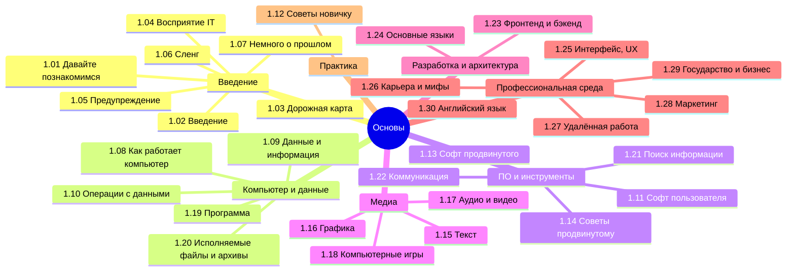

  ОБЯЗАТЕЛЬНО
  ДЛЯ НОВИЧКОВ
  В РАЗРАБОТКЕ

import DocCardList from '@theme/DocCardList';

## О разделе

<DocCardList />

Вообще, лучше воспользуйтесь содержанием или перейдите к Базе знаний. Но для удобства, я размещу здесь ссылки на основные главы раздела:

---
