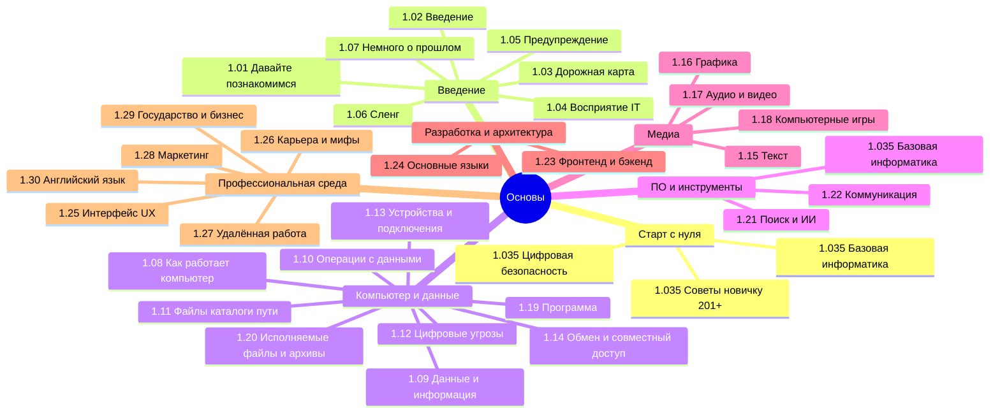

  ОБЯЗАТЕЛЬНО
  ДЛЯ НОВИЧКОВ

import DocCardList from '@theme/DocCardList';

---

## О разделе

<DocCardList />

**С чего начать:** [1.035. Основы компьютерной грамотности](/encyclopedia/1-basics/1-035-bazovaya-informatika/101) → [Цифровая безопасность](/encyclopedia/1-basics/1-035-bazovaya-informatika/112) → [1.035. Советы новичку (201+)](/encyclopedia/1-basics/1-035-bazovaya-informatika/201). Маршруты — также на [странице раздела](/section/basics).

**Как устроен проект «Вселенная IT»:** не один сайт, а **15+ поддоменов** — spirzen.ru (энциклопедия), search, terms, lab, tools, kids, games, code, play, writer, schema, sql, color, random, assets, html. Обзор — [1.02 Введение](/encyclopedia/1-basics/1-02-vvedenie/1#живой-пример--проект-вселенная-it); карта сервисов — [status.spirzen.ru](https://status.spirzen.ru); полная схема — [О проекте](/about/project#arhitektura-proekta).

Вообще, лучше воспользуйтесь содержанием или перейдите к Базе знаний. Но для удобства, я размещу здесь ссылки на основные главы раздела:

---
