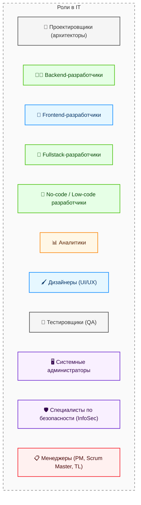

---
title: Восприятие IT в обществе
tags: [beginner, notrequired, all]
description: Восприятие сферы информационными технологиями широкой публикой и стереотипы.
---

# Восприятие IT в обществе

  ДЛЯ НОВИЧКОВ
  НЕ ОБЯЗАТЕЛЬНО

Всем

## Айти – это не только программисты

> **Информационные технологии (ИТ)** — это совокупность методов, производственных процессов и программно-технических средств, интегрированных для сбора, хранения, обработки, передачи, распространения и использования информации с целью решения задач в различных сферах деятельности.

### Айтишники

  
Важно

  Эта статья рассчитана на то, что вы вкратце познакомитесь с основными направлениями специальностей в отрасли. Возможно, вы не кодер, но отличный аналитик, или тестировщик. А, может быть, дизайнер? Кто знает? Пока не попробуете - не поймёте точно. Давайте не обжигаться, а будем изучать всё.

**Айтишник** — специалист в сфере информационных технологий ("IT-шник"). Эта роль охватывает множество профессий, включая проектировщиков, разработчиков, аналитиков, дизайнеров, тестировщиков, администраторов, специалистов по безопасности и менеджеров.

Бытует мнение, что «айтишник» = кодер. Но это не так. В этой области обитает множество специалистов. Так же как у юристов, строителей, врачей или экономистов, в IT есть направления. Говоря «врач», мы редко уточняем, что человек оториноларинголог или анестезиолог. Людям, не знакомым со сферой, сложно объяснять, кто такой DevOps, поэтому для всех мы так и остаёмся «программистами». Давайте же разберём, кто прячется под этим ярлыком.

---

### Виды айтишников

---

### Проектировщики

**Проектировщики** – архитекторы, которые готовят схему, структуру и набор технологий, и готовят каркас для работы. Зачастую это самые сильные специалисты, которые способны видеть шире других, они создают фундамент, на котором строится весь проект. Их принцип работы очень похож со строительством и архитектурой зданий, ведь нужно решить, сколько будет этажей, где будут окна и как будут проложены коммуникации. Архитекторы выбирают технологии, которые будут использоваться в проекте, продумывают структуру системы и решают, как разные части программы будут взаимодействовать друг с другом. Без них проект будет хаотичным, неповоротливым и даже может провалиться.

Проектировщик — специалист, отвечающий за архитектурное и техническое видение программной системы. Проектировщик определяет состав компонентов системы, их взаимодействие, выбор технологического стека и стратегию масштабирования. Его работа начинается до написания первой строки кода и продолжается на протяжении всего жизненного цикла проекта. Архитектурные решения влияют на производительность, безопасность, стоимость поддержки и скорость дальнейшей разработки.

Проектировщиками и архитекторами программного обеспечения нельзя стать без глубоких знаний и хорошего опыта. Вы сами поймёте, когда приступите к крупным решениям, и столкнётесь с тем, что... не знаете решения. Как раз эта профессия должна выручать, направлять и определять. Поэтому сюда относятся лучшие специалисты с уровнем Senior и выше.

---

### Разработчики

**Разработчики** – строители программ (сайтов, приложений). И это не всегда кодеры. Есть те, кто пишет код, а есть те, кто работает без кода – и он всё равно разработчик. Это строители, которые могут быть нескольких видов:

	- **Backend-разработчики** работают над внутренней частью программы, которая спрятана «под капотом». Кнопка «Оплатить» в онлайн-магазине выполняет что-то магическое, после чего деньги списываются со счёта - пользователь не видит этой магии - это бэкенд, спрятанная логика;

	- **Frontend-разработчики** отвечают за то, что видит пользователь, занимаются интерфейсом, делают его красивым, удобным и функциональным. Кнопка «Оплатить» выглядит именно определённым образом, имеет какую-то тему и цветовую гамму, свой дизайн - это их работа.

	- **Fullstack-разработчики** сочетают в себе навыки бэкенда и фронтенда. Они могут работать как с внутренней логикой, так и с внешним интерфейсом.

	- **No-code/Low-code разработчики** создают программы без написания кода через специальные платформы-конструкторы приложений.

Но разработчики пишут всё не с нуля, а руководствуются документацией, так же, как строители руководствуются проектной документацией. Если заказчик что-то просит, разработчикам сложно будет объяснить причины, почему это невозможно.

Разработка доступна на всех уровнях - от новичка-стажёра или самоучки до максимального знания стека. Разработчикам открыты все пути, и они могут стать в дальнейшем как менеджером, так и архитектором.

---

### Аналитики

**Аналитики** – те, кто изучает глубины и переводит язык бизнеса на язык программистов. Иначе говоря, разработчики не обязаны знать предметную область компании, а бизнесмены не обязаны разбираться в технологиях. И между ними есть переводчик – аналитик, который превращают идею бизнесмена в конкретные требования для технической команды. Аналитики задают правильные вопросы, получают правильные ответы, полученную информацию структурируют, и пишут на основе этого специальную документацию, которая должна быть понятной, а задачи должны быть реалистичными.

Бизнес (тот, кто платит и заказывает) говорит "Хочу видеть лучшие товары на главной". А аналитик превращает это в детальный документ с описанием "На главной странице показывать топ-10 товаров по количеству продаж за последние 7 дней, отсортированных по убыванию". Как аналитик принимает решения, почему именно 10 товаров, почему 7 дней, почему по убыванию? Вот тут и самая сложная работа - нужно всё согласовать с заказчиком, провести исследование, обсудить, предусмотреть риски и последствия такого решения.

Бывают разные виды аналитиков:
- системные аналитики;
- бизнес-аналитики;
- аналитики данных.

Бизнес-аналитики и системные аналитики доступны с уровня Junior, а в перспективе - прокладывают путь к проектированию и архитектуре.

Бизнес-аналитики обычно работают на стороне заказчиков, их цель - определить нужды, потребности и сформировать требования, которые принесут ценные результаты. Они общаются на гибридном языке технических и бизнес-специалистов.

Системные аналитики разбираются в требованиях, представленных бизнес-аналитиками, и переводят с гибридного языка на технический, изучают возможные решения и направляют итоговое задание на разработку.

Аналитики данных связаны вообще с другим. Это изучение массивов данных, собранных с различных источников, с целью вытащить итоговую полезную информацию. К примеру, вкусы покупателей, тенденции развития и прогнозы на будущее. Здесь существует целый пласт профессий - Data Analyst, Data Scientist, ML-Engineer. Объединить их можно как охотников за "паттернами". Они строят модели машинного обучения, нейросети, обрабатывают большие объемы данных.

Некоторые разделяют Data Scientist от аналитика данных двумя простыми фразами:
- Data Scientist смотрит в будущее;
- Аналитик данных смотрит в прошлое.

---

### Инженеры данных

Представьте себе интернет-магазин. Каждую секунду кто-то что-то кладёт в корзину, удаляет, оплачивает, возвращает. Эти данные разбросаны по разным базам, логам, очередям сообщений. Data-инженер пишет пайплайны (конвейеры), которые собирают всё это в одно место, чистят от мусора и готовят для аналитиков. Без него аналитик будет сидеть и плакать над кучей сырых, грязных данных.

**Data-инженеры** - это специалист, который проектирует, строит и поддерживает инфраструктуру для сбора, очистки, хранения и обработки больших объёмов данных. Он создаёт фундамент для других специалистов (аналитиков данных и ML-инженеров), обеспечивая бесперебойную поставку структурированных данных из разрозненных источников в единое хранилище.

Чаще всего здесь нужен Python или Scala/Java, и много глубоких познаний в Big Data, SQL, NoSQL.

Не путать с Data Scientist и Data Analyst. Инженер именно строит инфраструктуру и готовит данные. Это уже техническая роль, но не чистая разработка.

---

### Дизайнеры

**Дизайнеры** – оформители, которые делают так, чтобы программы были удобными и красивыми. Их работа начинается с создания макетов интерфейса, с решениями, где будут находиться кнопки, какого цвета будет текст, и как пользователь будет переходить между экранами. Разработчики могут быть технически одарёнными, но могут совсем не смыслить в дизайне, для чего и приглашаются специальные художники и дизайнеры.

Здесь можно начинать и с нуля, но требуется талант, аккуратность и тяга к визуальному порядку.

---

### Тестировщики

**Тестировщики** – ищут ошибки, воспроизводя поведение пользователя, чтобы всё работало именно так, как задумано. Их работа похожа на проверку автомобиля перед продажей - ведь никто не захочет купить машину, которая ломается через неделю. Аналогично и с программами - никто не будет использовать программу, которая зависает или работает неправильно. Тестировщики ищут ошибки до того, как продукт попадёт к пользователям, и если находят - сообщают об этом разработчикам, чтобы те исправляли.

Тестировщик — специалист, отвечающий за проверку корректности работы программного обеспечения в соответствии с заданными требованиями.

Тестировщик - отличная профессия для новичка. Порой она даже не требует знания технологий, и ограничена запуском процессов или ручной имитацией действий пользователя. Достаточно внимательности к деталям. В перспективе, можно перейти в разработку, аналитику или даже остаться как талантливый Senior тестировщик.

Выделяют также автоматизатора - это отдельная профессия. Ручной тестировщик будет кликать по кнопкам 100 раз, чтобы убедиться, что всё работает. Автоматизатор один раз напишет скрипт (на Python, Java, JavaScript), и этот скрипт будет сам кликать, заполнять формы, проверять результаты и писать отчёт. Когда проект большой и выходят новые версии каждый день, без автоматизации не обойтись — ручные тестировщики просто физически не успевают всё перепроверять.

---

### Сисадмины и безопасники

**Сисадмины и безопасники** – следят за тем, чтобы всё функционировало стабильно, бесперебойно, а данные были под защитой. Системные администраторы обеспечивают работу серверов, сетей, баз данных. Если сервер сломается, сайт или приложение перестанет работать, и не разработчикам его чинить - а если не решить проблему, будут серьёзные финансовые потери. Специалисты по безопасности же защищают данные от хакеров и других угроз, создавая системы защиты, проверяя уязвимости и обучая сотрудников основам работы с данными. Если кто-то пытается украсть данные, безопасники предотвращают атаку.

Современная сфера информационных технологий добавила также ещё такие профессии, как DevOps-инженер, связывающий разработку и эксплуатацию, поэтому можно разделить такой сектор профессий по зонам:

1. Зона разработки - специалисты, которые обеспечивают:
- безопасность среды разработки;
- безопасность среды тестирования;
- обеспечение инструментами и технологиями.

2. Зона эксплуатации - специалисты, которые обеспечивают:
- безопасность в промышленном (боевом) режиме в реальных условиях;
- обеспечение инструментами и технологиями в продакшене.

3. Промежуточная зона - связь разработки и эксплуатации, где обеспечивается:
- автоматизация процесса разработки;
- автоматизация процесса доставки обновлений;
- автоматизация процесса настройки.

Именно благодаря DevOps-инженерам новые версии приложений выходят каждый день, а не раз в полгода. Потому что серверы настраиваются парой команд, а не вручную. Автоматизируется всё - сборка, тестирование, развёртывание, мониторинг. Программист нажимает на кнопку - и через 10 минут код уже работает на сотнях серверов.

Данный пласт профессий может развиваться независимо от разработки, аналитики, тестирования или архитектуры. Порой можно начать с системного администрирования.

  
Честно для новичков

  Не пытайтесь стать DevOps или Data Scientist без опыта. Это роли для тех, кто уже год-два поработал разработчиком или аналитиком. Но знать, что они существуют — полезно: вдруг это ваша конечная цель?

---

### Менеджеры

**Менеджеры** – организаторы и управленцы, которые следят и дирижируют этим оркестром специалистов. Они координируют работу, следят за сроками, ставят задачи аналитикам, решают конфликты в команде, помогают распределить нагрузку в команде и поддерживают общий прогресс проекта. Без менеджеров проект может застрять на одном месте, ибо никто не будет следить за тем, чтобы всё было сделано в срок и в рамках бюджета.

Где-то роли могут объединяться и комбинироваться, к примеру, проектировщи-сисадмин, или аналитик-тестировщик, а где-то и вовсе может быть один за всех. Но серьёзные проекты требуют большого количества участников, вследствие чего формируется команда менеджеров (заказчиков) и техническая команда (исполнителей). Каждый участник команды важен, ибо это командная работа, где все вносят свой вклад в общий успех.

---

### Технические писатели

Технические писатели – переводчики с технического на человеческий. Разработчики пишут код, архитекторы создают схемы, но обычный пользователь (или даже новый сотрудник) ничего в этом не поймёт. Технический писатель берёт сложную техническую документацию, API-справочники, инструкции по установке и перерабатывает их в понятные тексты, руководства, статьи базы знаний.

Такой специалист выстраивает структуру, добавляет примеры, рисует поясняющие скриншоты и схемы. Хороший технический писатель спасает службу поддержки от тысяч глупых вопросов вроде "а куда нажимать?".

Могут писать документацию:
- для пользователей (базы знаний, руководства и инструкции);
- формальную документацию (отчетные, эксплуатационные, обязательные и ГОСТ документы);
- юридические документы (договора, соглашения, регламенты, правила, акты, протоколы);
- технические документы (описания программ, устройств, комментарии и README к коду).

Часто работа здесь проектная и временная (написал документацию и свободен). Для начала работы достаточно умения писать понятные тексты и базового понимания технологий (хотя бы знать разницу между базой данных и сервером). Часто приходят филологи, журналисты или бывшие разработчики, которые устали от кода.

---