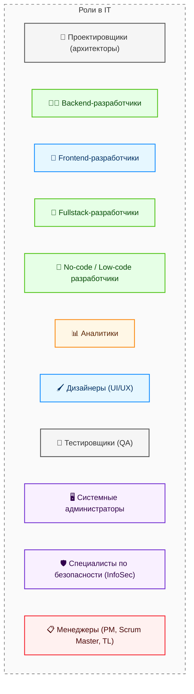

---
title: 1.04. Как видят IT обычные люди
---

# 1.04. Как видят IT обычные люди

  ДЛЯ НОВИЧКОВ
  НЕ ОБЯЗАТЕЛЬНО

Всем

## Айти – это не только программисты

### Айтишники

  
Важно

  Эта статья рассчитана на то, что вы вкратце познакомитесь с основными направлениями специальностей в отрасли. Возможно, вы не кодер, но отличный аналитик, или тестировщик. А, может быть, дизайнер? Кто знает? Пока не попробуете - не поймёте точно. Давайте не обжигаться, а будем изучать всё.

Бытует мнение, что «айтишник» = кодер. Но это не так. В этой области обитает множество специалистов. Так же как у юристов, строителей, врачей или экономистов, в IT есть направления. Говоря «врач», мы редко уточняем, что человек оториноларинголог или анестезиолог. Людям, не знакомым со сферой, сложно объяснять, кто такой DevOps, поэтому для всех мы так и остаёмся «программистами». Давайте же разберём, кто прячется под этим ярлыком.

---

### Виды айтишников

---

### Проектировщики

**Проектировщики** – архитекторы, которые готовят схему, структуру и набор технологий, и готовят каркас для работы. Зачастую это самые сильные специалисты, которые способны видеть шире других, они создают фундамент, на котором строится весь проект. Их принцип работы очень похож со строительством и архитектурой зданий, ведь нужно решить, сколько будет этажей, где будут окна и как будут проложены коммуникации. Архитекторы выбирают технологии, которые будут использоваться в проекте, продумывают структуру системы и решают, как разные части программы будут взаимодействовать друг с другом. Без них проект будет хаотичным, неповоротливым и даже может провалиться.

---

### Разработчики

**Разработчики** – строители программ (сайтов, приложений). И это не всегда кодеры. Есть те, кто пишет код, а есть те, кто работает без кода – и он всё равно разработчик. Это строители, которые могут быть нескольких видов:

	- **Backend-разработчики** работают над внутренней частью программы, которая спрятана «под капотом». Кнопка «Оплатить» в онлайн-магазине выполняет что-то магическое, после чего деньги списываются со счёта - пользователь не видит этой магии - это бэкенд, спрятанная логика;

	- **Frontend-разработчики** отвечают за то, что видит пользователь, занимаются интерфейсом, делают его красивым, удобным и функциональным. Кнопка «Оплатить» выглядит именно определённым образом, имеет какую-то тему и цветовую гамму, свой дизайн - это их работа.

	- **Fullstack-разработчики** сочетают в себе навыки бэкенда и фронтенда. Они могут работать как с внутренней логикой, так и с внешним интерфейсом.

	- **No-code/Low-code разработчики** создают программы без написания кода через специальные платформы-конструкторы приложений.

Но разработчики пишут всё не с нуля, а руководствуются документацией, так же, как строители руководствуются проектной документацией. Если заказчик что-то просит, разработчикам сложно будет объяснить причины, почему это невозможно.

---

### Аналитики

**Аналитики** – те, кто изучает глубины и переводит язык бизнеса на язык программистов. Иначе говоря, разработчики не обязаны знать предметную область компании, а бизнесмены не обязаны разбираться в технологиях. И между ними есть переводчик – аналитик, который превращают идею бизнесмена в конкретные требования для технической команды. Аналитики задают правильные вопросы, получают правильные ответы, полученную информацию структурируют, и пишут на основе этого специальную документацию, которая должна быть понятной, а задачи должны быть реалистичными.

---

### Дизайнеры

**Дизайнеры** – оформители, которые делают так, чтобы программы были удобными и красивыми. Их работа начинается с создания макетов интерфейса, с решениями, где будут находиться кнопки, какого цвета будет текст, и как пользователь будет переходить между экранами. Разработчики могут быть технически одарёнными, но могут совсем не смыслить в дизайне, для чего и приглашаются специальные художники и дизайнеры.

---

### Тестировщики

**Тестировщики** – ищут ошибки, воспроизводя поведение пользователя, чтобы всё работало именно так, как задумано. Их работа похожа на проверку автомобиля перед продажей - ведь никто не захочет купить машину, которая ломается через неделю. Аналогично и с программами - никто не будет использовать программу, которая зависает или работает неправильно. Тестировщики ищут ошибки до того, как продукт попадёт к пользователям, и если находят - сообщают об этом разработчикам, чтобы те исправляли.

---

### Сисадмины и безопасники

**Сисадмины и безопасники** – следят за тем, чтобы всё функционировало стабильно, бесперебойно, а данные были под защитой. Системные администраторы обеспечивают работу серверов, сетей, баз данных. Если сервер сломается, сайт или приложение перестанет работать, и не разработчикам его чинить - а если не решить проблему, будут серьёзные финансовые потери. Специалисты по безопасности же защищают данные от хакеров и других угроз, создавая системы защиты, проверяя уязвимости и обучая сотрудников основам работы с данными. Если кто-то пытается украсть данные, безопасники предотвращают атаку.

---

### Менеджеры

**Менеджеры** – организаторы и управленцы, которые следят и дирижируют этим оркестром специалистов. Они координируют работу, следят за сроками, ставят задачи аналитикам, решают конфликты в команде, помогают распределить нагрузку в команде и поддерживают общий прогресс проекта. Без менеджеров проект может застрять на одном месте, ибо никто не будет следить за тем, чтобы всё было сделано в срок и в рамках бюджета.

Где-то роли могут объединяться и комбинироваться, к примеру, проектировщи-сисадмин, или аналитик-тестировщик, а где-то и вовсе может быть один за всех. Но серьёзные проекты требуют большого количества участников, вследствие чего формируется команда менеджеров (заказчиков) и техническая команда (исполнителей). Каждый участник команды важен, ибо это командная работа, где все вносят свой вклад в общий успех.

В дальнейшем мы ещё вернёмся к перечислению различных профессий.

