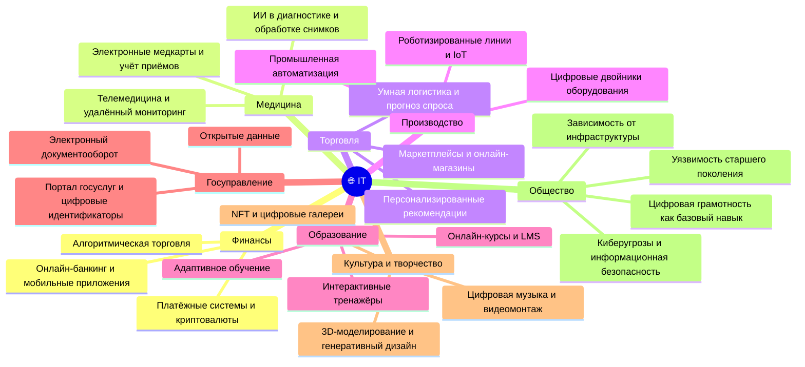

---
title: Связь IT с другими сферами
tags: [beginner, notrequired, all]
---

# Связь IT с другими сферами

  ДЛЯ НОВИЧКОВ
  НЕ ОБЯЗАТЕЛЬНО

Всем

## Связь IT с другими сферами

### Взаимодействие IT с различными отраслями

  
Важно

  С годами, объяснять людям, чем так важна сфера информационных технологий, не придётся. Эта статья как раз рассчитана на то, чтобы можно было понять, насколько отрасль глубоко внедрилась в нашу повседневную жизнь.

Почему людям с других сфер так «чуждо» наше направление? Скорее всего, потому что им не хочется вникать. Но уже XXI век, и нельзя игнорировать смежность. Цифровизация сейчас является главным направлением во всех государствах, так как приносит невероятную эффективность. Результат будет единым - максимальное «смешение» с IT. 

Информационные технологии, несмотря на глубину и сложность, соприкасаются практически со всеми видами деятельности человека:

	- Финансы – онлайн-банкинг, переводы, мобильный банк и крипта;
	- Медицина – учёт пациентов и приёмов, диагностика и анализ;
	- Торговля – онлайн-магазины (маркетплейсы), доставка и рекомендации;
	- Производство – автоматизация рутины, роботы и ИИ;
	- Образование – онлайн-обучение, курсы, тренажеры.

Благодаря взаимодействию IT с другими отраслями, наша жизнь изменилась. Сфера торговли обросла такими решениями, как онлайн-магазины, доставка еды, а системы автоматизации упростили производственные процессы.

Сейчас невозможно представить нашу жизнь без технологий, а стоит какой-либо государственной или иной критически важной системе приостановить или прекратить работу – наступают крайне серьезные последствия для общества. Допустим, полностью электронный документооборот делает зависимыми от стабильности системы всех участников. Именно поэтому важно понимать, что без поддержки развития технологий уже не выжить с тем же уровнем комфорта.

Существует мнение, что современный капитализм всё больше становится капитализмом данных. Платформы монетизируют поведение, а подписки являются чуть ли не главной моделью удержания клиента, которая приносит стабильный доход. И при этом всём ИИ обучается на наших данных, предоставляя огромную прибыль корпорациям. Старый добрый закон экономики «спрос рождает предложение» окончательно ломается, ведь абсолютно весь спрос является искусственным. Когда все сферы жизнедеятельности человека (да, все!) погружены в IT, общество стало таким уязвимым и зависимым - если будет сбой в облачной платформе - вся сеть магазинов встанет; упадёт государственная система - временно услуги не будут предоставляться. И конечно же, киберугрозы.

Для новичка звучит как конспирология. Всё же спрос формируют чаще не люди, а алгоритмы, подсовывая нам то, чего мы минуту назад не хотели, но после таргетинга уже не можем без этого жить. Чтобы зарабатывать в сфере, которая создаёт такую индустрию, мы должны разбираться.

Люди без цифровой грамотности остаются за бортом, и часто можно заметить забавные моменты - врачи, к примеру, больше проводят времени за компьютером, чем с пациентами, вбивая данные. Аналогичная ситуация у преподавателей, юристов, экономистов, продавцов, менеджеров, инженеров, бухгалтеров, и даже художников, музыкантов и писателей! Абсолютно всё цифровизуется, подсаживаясь на иглу. Каждый замечал, как тяжело бывает старшему поколению, когда бабушкам/дедушкам, которым осталось несколько лет до пенсии, приходится привыкать к «инновациям» на работе.

**Но, наша с вами сфера - IT**. Чем же другие сферы актуальны для нас? Тем, что нам, скорее всего, придется выступить в роли связующего звена. Поясняю - работа в IT не означает, что будет связана строго с этим, нет - если компания занимается проектом по разработке медицинской системы - значит, неизбежна связь с медициной (что очевидно!), и если, к примеру, вы в прошлом медик или банкир, то ваши знания, в совокупности с IT, позволят вам стать ценным аналитиком, который разбирается в предмете и сможет помочь коллегам объяснить глубину бизнес-логики. Поэтому - ваш жизненный опыт, даже если вы пришли с другой профессии, может пригодится и в IT.

---

## Финансы

### Онлайн-банкинг и мобильные приложения  

**Онлайн-банкинг** — цифровая платформа, предоставляющая клиентам доступ к банковским услугам через интернет. Мобильные банковские приложения расширяют этот функционал на смартфоны и планшеты.  

Пользователь авторизуется в системе, после чего получает возможность просматривать баланс, переводить средства, оплачивать услуги, блокировать карты и управлять инвестициями. Все операции проходят через защищённые каналы связи с многоуровневой аутентификацией. Интерфейс адаптирован под повседневные финансовые задачи, а уведомления помогают отслеживать транзакции в реальном времени.

### Платёжные системы и криптовалюты  

**Платёжная система** — инфраструктура для перевода денег между участниками (банками, пользователями, торговыми точками). Примеры: Visa, Mastercard, Mir, PayPal.  

Криптовалюты — цифровые активы, основанные на технологии блокчейн. Они позволяют осуществлять децентрализованные транзакции без участия посредников. Транзакции записываются в распределённый реестр и проверяются сетью узлов. Доступ к средствам обеспечивается через криптографические ключи.

### Алгоритмическая торговля  

**Алгоритмическая торговля** — автоматизированный процесс покупки и продажи финансовых инструментов на основе заранее заданных правил.  

Система анализирует рыночные данные — цены, объёмы, новости — и принимает решения быстрее человека. Такие алгоритмы используются как розничными трейдерами, так и крупными финансовыми организациями. Их работа основана на статистических моделях, машинном обучении и техническом анализе.

---

## Медицина

### Электронные медкарты и учёт приёмов  

**Электронная медицинская карта** — цифровой аналог бумажного документа, содержащего историю болезни пациента.  

Система хранит данные о диагнозах, назначениях, анализах, вакцинации и посещениях врачей. Доступ к информации имеют только авторизованные медицинские работники. Это ускоряет приём, снижает риск ошибок и позволяет отслеживать динамику состояния пациента.

### ИИ в диагностике и обработке снимков  

**Искусственный интеллект в медицине** — программные системы, анализирующие медицинские изображения, лабораторные данные и симптомы для поддержки врачей.  

Алгоритмы обучаются на тысячах размеченных снимков (рентген, МРТ, КТ) и выявляют патологии — опухоли, переломы, воспаления. Результат отображается как вероятностная оценка, которую врач использует при постановке диагноза.

### Телемедицина и удалённый мониторинг  

**Телемедицина** — оказание медицинских услуг на расстоянии с использованием видеосвязи, чатов и специализированных платформ.  

Удалённый мониторинг осуществляется через носимые устройства (пульсоксиметры, глюкометры, ЭКГ-браслеты), которые передают данные в облачную систему. Врач получает уведомления при отклонениях от нормы и может корректировать лечение без личной встречи.

---

## Торговля

### Маркетплейсы и онлайн-магазины  

**Маркетплейс** — цифровая торговая площадка, где множество продавцов предлагают товары через единый интерфейс. Примеры: Wildberries, Ozon, Amazon.  

Онлайн-магазин — сайт одного продавца, управляющий своим каталогом, складом и доставкой. Обе модели используют корзину, систему оплаты, отзывы и рейтинг товаров. Интеграция с логистическими службами позволяет отслеживать заказы в реальном времени.

### Персонализированные рекомендации  

**Персонализированные рекомендации** — предложения товаров, сформированные на основе поведения пользователя.  

Система анализирует историю просмотров, покупок, время на странице и даже сезонность. На основе этих данных строятся профили интересов, и пользователю показываются релевантные товары. Такой подход повышает конверсию и средний чек.

### Умная логистика и прогноз спроса  

**Умная логистика** — управление цепочками поставок с использованием аналитики и автоматизации.  

Прогноз спроса строится на данных о продажах, праздниках, погоде и маркетинговых акциях. Система рассчитывает оптимальные запасы на складах и маршруты доставки. Это снижает издержки и предотвращает дефицит или избыток товаров.

---

## Производство

### Промышленная автоматизация  

**Промышленная автоматизация** — использование программного и аппаратного обеспечения для управления производственными процессами без постоянного участия человека.  

Датчики, контроллеры и исполнительные механизмы связаны в единую сеть. Программируемые логические контроллеры (ПЛК) принимают решения на основе входных сигналов и управляют станками, конвейерами и роботами.

### Роботизированные линии и IoT  

**Роботизированная линия** — комплекс промышленных роботов, выполняющих сборку, сварку, покраску или упаковку.  

IoT (Интернет вещей) обеспечивает связь оборудования с центральной системой. Каждое устройство имеет уникальный адрес и передаёт данные о состоянии, температуре, износе. Это позволяет проводить профилактическое обслуживание и оптимизировать загрузку.

### Цифровые двойники оборудования  

**Цифровой двойник** — виртуальная копия физического объекта, синхронизированная с ним в реальном времени.  

Модель воспроизводит поведение станка, двигателя или целого завода на основе данных с датчиков. Инженеры могут тестировать изменения, имитировать аварии и оптимизировать параметры без остановки производства.

---

## Образование

### Онлайн-курсы и LMS  

**Онлайн-курс** — структурированная образовательная программа, доступная через интернет.  

LMS (Learning Management System) — платформа для создания, распространения и отслеживания обучения. Она включает видеоуроки, тесты, форумы и журнал успеваемости. Преподаватель видит прогресс каждого ученика и может корректировать материал.

### Интерактивные тренажёры  

**Интерактивный тренажёр** — симулятор, позволяющий практиковать навыки в безопасной среде.  

Примеры: виртуальные лаборатории по химии, симуляторы полётов, тренажёры кодирования. Пользователь совершает действия, система даёт немедленную обратную связь и предлагает улучшения.

### Адаптивное обучение  

**Адаптивное обучение** — подход, при котором содержание курса меняется под уровень и темп ученика.  

Система анализирует ответы на вопросы, время выполнения и частоту ошибок. На основе этого она предлагает дополнительные материалы, упрощает или усложняет задания, формируя индивидуальную траекторию.

---

## Госуправление

### Электронный документооборот  

**Электронный документооборот** — система обмена официальными документами в цифровом виде между госорганами, бизнесом и гражданами.  

Документы подписываются электронной подписью, имеют юридическую силу и хранятся в защищённых реестрах. Это сокращает время согласования и исключает потерю бумаг.

### Портал госуслуг и цифровые идентификаторы  

**Портал госуслуг** — единая точка доступа к государственным сервисам: от записи к врачу до подачи декларации.  

Цифровой идентификатор (например, СНИЛС или учётная запись) подтверждает личность пользователя. После входа система автоматически подставляет данные из государственных баз, устраняя дублирование ввода.

### Открытые данные  

**Открытые данные** — информация, публикуемая государственными органами в машиночитаемом формате для свободного использования.  

Примеры: бюджетные расходы, реестр компаний, данные о качестве воды. Эти данные становятся основой для аналитики, журналистики и создания полезных приложений гражданами и бизнесом.

---

## Культура и творчество

### Цифровая музыка и видеомонтаж  

**Цифровая музыка** — создание, редактирование и распространение аудиоконтента с помощью программ.  

Видеомонтаж осуществляется в специализированных редакторах, где можно склеивать клипы, добавлять эффекты, синхронизировать звук и цветокоррекцию. Результат публикуется напрямую на платформы вроде YouTube или TikTok.

### 3D-моделирование и генеративный дизайн  

**3D-моделирование** — создание трёхмерных объектов в виртуальном пространстве для игр, кино, архитектуры или печати.  

Генеративный дизайн — метод, при котором алгоритм создаёт множество вариантов формы на основе заданных ограничений (вес, прочность, материал). Дизайнер выбирает лучший вариант из предложенных.

### NFT и цифровые галереи  

**NFT (невзаимозаменяемый токен)** — цифровой сертификат владения уникальным объектом: картиной, музыкой, коллекционным предметом.  

Цифровые галереи — онлайн-пространства для демонстрации и продажи таких работ. Владение подтверждается записью в блокчейне, что гарантирует подлинность и право собственности.

---

## Общество

### Цифровая грамотность как базовый навык  

**Цифровая грамотность** — способность эффективно и безопасно использовать цифровые технологии для работы, общения и обучения.  

Навык включает понимание интерфейсов, работу с поиском, распознавание мошенничества, управление приватностью и критическое отношение к информации. Он становится таким же необходимым, как чтение и письмо.

### Зависимость от инфраструктуры  

Современное общество зависит от стабильной работы цифровой инфраструктуры: интернета, облачных сервисов, энергосетей и центров обработки данных.  

Сбой в одной из систем — например, отказ облачного хранилища или DDoS-атака на банк — может парализовать работу организаций, транспорта и даже экстренных служб.

### Уязвимость старшего поколения  

Пожилые люди часто сталкиваются с трудностями при освоении цифровых сервисов из-за недостатка опыта, снижения когнитивных функций или отсутствия поддержки.  

Это ограничивает их доступ к медицинским записям, пенсиям, социальным услугам и коммуникации с родными. Решение — упрощённые интерфейсы, офлайн-помощь и программы цифрового наставничества.

### Киберугрозы и информационная безопасность

**Киберугрозы** — риски, связанные с несанкционированным доступом, кражей данных, шифрованием файлов или дезинформацией.  

Информационная безопасность включает защиту устройств антивирусами, использование двухфакторной аутентификации, регулярное обновление ПО и обучение пользователей распознаванию фишинга и социальной инженерии.

---