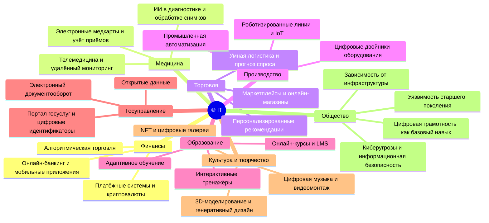

---
title: 1.04. Связь IT с другими сферами
---

# 1.04. Связь IT с другими сферами

  ДЛЯ НОВИЧКОВ
  НЕ ОБЯЗАТЕЛЬНО

Всем

## Связь IT с другими сферами

Почему людям с других сфер так «чуждо» наше направление? Скорее всего, потому что им не хочется вникать. Но уже XXI век, и нельзя игнорировать смежность. Цифровизация сейчас является главным направлением во всех государствах, так как приносит невероятную эффективность. Результат будет единым - максимальное «смешение» с IT. 

Информационные технологии, несмотря на глубину и сложность, соприкасаются практически со всеми видами деятельности человека:

	- Финансы – онлайн-банкинг, переводы, мобильный банк и крипта;
	- Медицина – учёт пациентов и приёмов, диагностика и анализ;
	- Торговля – онлайн-магазины (маркетплейсы), доставка и рекомендации;
	- Производство – автоматизация рутины, роботы и ИИ;
	- Образование – онлайн-обучение, курсы, тренажеры.

Благодаря взаимодействию IT с другими отраслями, наша жизнь изменилась. Сфера торговли обросла такими решениями, как онлайн-магазины, доставка еды, а системы автоматизации упростили прозводственные процессы.

Сейчас невозможно представить нашу жизнь без технологий, а стоит какой-либо государственной или иной критически важной системе приостановить или прекратить работу – наступают крайне серьезные последствия для общества. Допустим, полностью электронный документооборот делает зависимыми от стабильности системы всех участников. Именно поэтому важно понимать, что без поддержки развития технологий уже не выжить с тем же уровнем комфорта.

Существует мнение, что современный капитализм всё больше становится капитализмом данных. Платформы монетизируют поведение, а подписки являются чуть ли не главной моделью удержания клиента, которая приносит стабильный доход. И при этом всём ИИ обучается на наших данных, предоставляя огромную прибыль корпорациям. Старый добрый закон экономики «спрос рождает предложение» окончательно ломается, ведь абсолютно весь спрос является искусственным. Когда все сферы жизнедеятельности человека (да, все!) погружены в ITобщество стало таким уязвимым и зависимым - если будет сбой в облачной платформе - вся сеть магазинов встанет; упадёт государственная система - временно услуги не будут предоставляться. И конечно же, киберугрозы.

Люди без цифровой грамотности остаются за бортом, и часто можно заметить забавные моменты - врачи, к примеру, больше проводят времени за компьютером, чем с пациентами, вбивая данные. Аналогичная ситуация у преподавателей, юристов, экономистов, продавцов, менеджеров, инженеров, бухгалтеров, и даже художников, музыкантов и писателей! Абсолютно всё цифровизуется, подсаживаясь на иглу. Каждый замечал, как тяжело бывает старшему поколению, когда бабушкам/дедушкам, которым осталось несколько лет до пенсии, приходится привыкать к «инновациям» на работе.

**Но, наша с вами сфера - IT**. Чем же другие сферы актуальны для нас? Тем, что нам, скорее всего, придется выступить в роли связующего звена. Поясняю - работа в IT не означает, что будет связана строго с этим, нет - если компания занимается проектом по разработке медицинской системы - значит, неизбежна связь с медициной (что очевидно!), и если, к примеру, вы в прошлом медик или банкир, то ваши знания, в совокупности с IT, позволят вам стать ценным аналитиком, который разбирается в предмете и сможет помочь коллегам объяснить глубину бизнес-логики. Поэтому - ваш жизненный опыт, даже если вы пришли с другой профессии, может пригодится и в IT.
