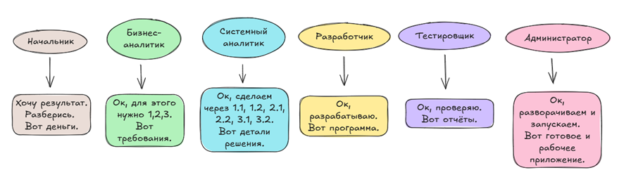

---
title: 1.04. Оборот денег в IT
---

# 1.04. Оборот денег в IT

  ДЛЯ НОВИЧКОВ
  НЕ ОБЯЗАТЕЛЬНО

Всем

## Оборот денег в IT

  
Важно

  Если что-то происходит, то это кому-то понадобилось.

Важно понимать, **кто платит за разработку**, и **кто платит за продукты**. И если за продукцию как за готовые приложения, сервисы или возможности, очевидно, платит их пользователь, допустим, приобретающий подписку на Spotify, то с процессом разработки всё немного сложнее.

Вообще, современный мир, он скатился к тому, что искусство продаётся как обычный продукт, будь то игра, книга, фильм или сериал - для корпорации творчество не важно. Вся отрасль работает как конвейер по производству товаров, работ и услуг. Поэтому любая инициатива - это деньги, чьи-то деньги.

Ваша задача - понимать, чьи деньги и кто потребитель.

**Продуктовые компании** – профильные компании, у которых IT – основной вид деятельности, от производства софта до обслуживания технологий. У таких компаний есть клиенты-покупатели, которые заказывают разработанный продукт, а сама продуктовая компания сосредоточена на развитие таких продуктов собственного производства.

**Аутсорс** – привлекаемые специалисты или компании, которые разрабатывают программы под заказ. Допустим, фрилансеры, или профессионалы по развёртыванию «коробочных» решений на сервера заказчика. Тут всегда есть заказчик, а аутсорсеры выполняют этот заказ разной степени сложности – от создания простого сайта до поставки и развертывания «коробочных» решений на сервера заказчика.

**IT-отделы в составе компаний** – когда организация в целом занимается другой деятельностью, но включает в себя отдел, отвечающий за технологии – допустим, инфобез или поддержку CRM, базы данных.

Получается, процесс идёт в следующей цепочке:

	- *Начальник* (он же Product Owner, владелец продукта) ставит цели, вроде «Мне нужно, чтобы этот процесс прошел быстрее за счёт автоматизации через систему»;
	- *Бизнес-аналитик* – разбирает поставленные начальником цели, определяет, что нужно бизнесу, выстраивает бизнес-логику и излагает в виде бизнес-требований (при этом он не погружается в техническую часть);
	- *Системный аналитик* получает бизнес-требования и переводит их в технические спецификации, описывая, как всё должно работать;
	- *Разработчик* (Developer) пишет код и выполняет разработку в соответствии с документацией, затем производит отладку (поиск ошибок);
	- *Тестировщик* (QA-инженер, Quality Assurance) проверяет разработанное программное обеспечение на соответствие требованиям, и ищёт ошибки, а в случае обнаружения проблем – отчет передается разработчику для исправления.
	- *Системный администратор* обеспечивает единую сеть и инфраструктуру, а также управляет доступом.
