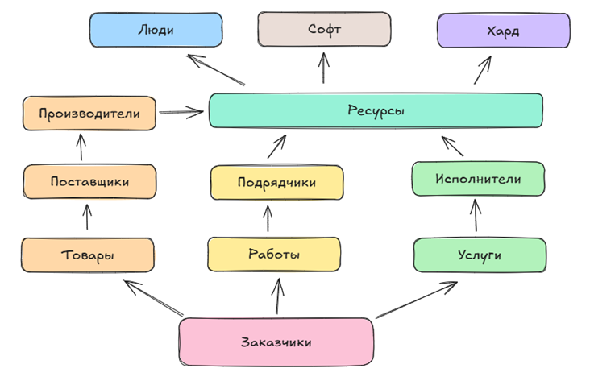

---
title: 1.04. Рынок
---

# 1.04. Рынок

  ДЛЯ НОВИЧКОВ
  НЕ ОБЯЗАТЕЛЬНО

Всем

## Рынок

IT – это рынок, включающий в себя как совокупность товаров-технологий, так и человеческих ресурсов, включая как ценных, опытных специалистов, так и новичков.

Технологические продукты, как мы выяснили – это программное обеспечение (софт), оборудование (хард). Кроме них, есть ещё один важный ресурс - люди.

**Человеческие ресурсы** - специалисты разных уровней подготовки, от начинающих разработчиков до опытных архитекторов и менеджеров.

Компании ищут специалистов, которые могут решать задачи, а специалисты стремятся найти работу, соответствующую их навыкам и амбициям – это спрос и предложение рынка.

Как уже ранее отмечено, в сети можно увидеть некую ложную видимость высокого спроса на специалистов в областях ИИ, машинного обучения, а порой Data Science и кибербезопасности и низкий спрос на «узких» специалистов, которые знают только один язык программирования. 

Первая часть данного мнения, связанная с ИИ, актуальна для корпораций-техногигантов, которые обладают огромными ресурсами. Вы когда-нибудь видели, как выглядят дата-центры для обеспечения работы искусственного интеллекта? Это чуть ли не целые города из серверов! И много ли ваших знакомых «айтишников» работает там, в Google, Microsoft, Amazon? А много ли вакансий имеется в таких областях? А видели ли вы ежегодные новости о том, что они увольняют сотрудников тысячами? 

Вот здесь и проблема. В 2020-х годах была пандемия, а также криптовалютный и нейросетевой бум, из-за которого каждая крупная корпорация начала разработку ИИ и прибыль в IT стала невероятной, благодаря тому, что пользователи перешли на удалёнку. Сейчас у них уже основной массив разработан и долгое время происходит обучение, поэтому в 2024-2025 годах заметно еженедельное появление очередной новой нейросети. На взлёте этих технологий было нанято множество сотрудников, а сейчас в них уже нужды нет, и они так же тысячами увольняются по инициативе тех же корпораций. Поэтому справедливый вопрос - а действительно ли имеет место такая актуальность?

Вторая часть касается низкого спроса на узких специалистов. Она так же обоснована бумом ИИ-технологий, когда в сети есть множество нейросетей, с помощью которых можно за считанные минуты собрать приложение без знаний кода (потому что ИИ сам напишет код). И джуниоры, к сожалению, так и работают - они просто шлют всё в ИИ, потому что сами не знают деталей. А ИИ будет подгонять имеющийся код под определённый паттерн (шаблон проектирования), а также его логика основана именно на статистики и вероятностях, из-за чего он не даст знаний. Корпорации это понимают, и им интересны действительно более универсальные специалисты, обладающие глубокими знаниями в различнях областях.

Сейчас войти в IT совсем не легко – уровень образованности населения высокий, курсы и руководства очень доступны, что порождает высочайшую конкуренцию – новичков много, хороших специалистов мало. Зачем компания будет платить ничего не знающему новичку и дарить ему опыт, если им нужен результат – готовый и стабильно работающий, качественный продукт, а этот новенький потом просто уйдёт в лучшее место? Лучше нанять опытного специалиста с кучей навыков и обилием опыта. Поэтому на рынке есть крайне высокая сложность входа – без знаний и практики будет очень тяжело. Но возможности есть – если учиться не «для галочки», а вникать – сейчас на «корочку» уже не обращают внимания.

Что важно понять новичку? Что теперь рынок перегружен, и просто разобраться в одном языке или фреймворке уже недостаточно - придётся овладеть дополнительными навыками. Важно не просто пройти курс, а действительно понять, перенастроить своё мышление. Причём, если техническая часть даётся крайне тяжело – это не повод переживать, так как IT подходит не только тем, кто разбирается в математике и логике.

Нужно также понять, в чём призвание - может быть, разработка не интересна, но может понравится анализировать данные, искать ошибки, уязвимости, координировать работу других, или просто создавать красивые дизайны - почти любым талантам найдётся место в индустрии. Главное - найти своё место.

**IT – это не страшно.** Здесь, как мы можем сделать вывод, есть место не только для технарей, но и для гуманитариев. Но как можно понять, программирование для вас, аналитика, тестирование или инфобез, если разбираться лишь в одном направлении? Лучше изучим всё целиком, увидим полную картину, и лишь потом будем судить, нравится это или нет.
