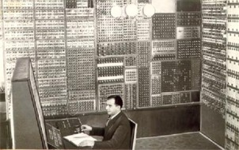

---
title: 1.04. IT в России
---

# 1.04. IT в России

  ДЛЯ НОВИЧКОВ
  НЕ ОБЯЗАТЕЛЬНО

Всем

Российская информационно-технологическая сфера — это сложный, многослойный феномен, сформированный пересечением геополитических, экономических и научных тенденций. Её история представляет собой уникальную траекторию развития, где государственный сектор на протяжении десятилетий являлся основным драйвером технологической модернизации, а рыночная экономика — катализатором экспансионного роста. 

Например, у нас есть отличная информационная система - "Госуслуги", мощнейший ресурс, позволяющий предоставлять почти все государственные и муниципальные услуги в электронном виде. Лично я несколько лет "подарил" развитию цифровизации государственных услуг.

Но мы рассмотрим всю отрасль в целом.

Рассмотрим ключевые этапы и аспекты этой траектории.

---

## **Советский период**

В СССР развитие информационных технологий носило централизованный, в значительной мере закрытый характер. Причина — в приоритетах государственной научно-технической политики: акцент делался на оборону, атомную энергетику, космос и промышленную автоматизацию. Именно в этих областях и зародились первые советские ЭВМ.

Советская власть фокусировалась на развитии идеологии, военной машины и силы. Соответственно, и потенциал рассматривался именно в этой части - нужно было создавать такие технологии, которые могли бы выполнять расчёты. Важно отметить, что советские учёные это гениальные люди, умудрившиеся в условиях ограниченных технологий (ведь Запад имел преимущество в коммуникациях) выполняли просто невероятную работу по развитию науки.

Первые отечественные электронно-вычислительные машины появились ещё в 1950-х годах. В 1950 году в Институте электротехники АН СССР под руководством Сергея Алексеевича Лебедева была построена **МЭСМ (Малая Электронная Счётная Машина)** — первая в континентальной Европе электронная ЭВМ на ламповых элементах. В 1953 году последовала **БЭСМ-1 (Большая Электронная Счётная Машина)** — уже с объёмом памяти 2 Кб (на ртутных линиях задержки), быстродействием 8–10 тысяч операций в секунду и архитектурой, приближенной к современным принципам фон Неймана.

Я лично знал людей, которые прикасались к первым технологиям страны - это было невероятно интересно, послушать о том, какими они были. Технологическая база того времени — лампы, позже — дискретные полупроводниковые элементы (транзисторы, диоды). Интегральных схем в СССР не производили до конца 1970-х; их дефицит компенсировался импортными поставками через третью страны или копированием зарубежных микросхем. Например, советская линейка **К1800** (процессорные и логические ИС 1980-х) была клоном американской серии **Intel 8080/8085**, но с задержкой в 5–7 лет.

Ключевой особенностью советской IT-инфраструктуры была **модель «мейнфрейма в институте»**: крупные вычислительные центры (вычислительные машины типа **ES EVM** — Единая Система Электронных Вычислительных Машин, разработанная в рамках договорённостей СЭВ в 1970-х как аналог IBM System/360) размещались при академических институтах, оборонных НИИ и вузах. Доступ к ним был строго регламентирован, а интерактивная работа — невозможна: программа вводилась на перфокартах или перфолентах, задачи ставились в очередь, результаты получались часами или сутками позже.

Частная собственность на ЭВМ — практически не существовала. В СССР существовала личная собственность, но не «частная собственность» в капиталистическом понимании. Личная собственность граждан — это имущество, приобретенное за счет трудовых доходов и предназначенное для личного потребления, которое не давало права использовать наемный труд для эксплуатации. Сюда относились жилье (в пределах норм), дачи, транспорт, предметы домашнего обихода и сбережения, которые охранялись законом, но не могли быть использованы для извлечения нетрудового дохода. Понятие «частная собственность» в полном смысле вернулось в российское законодательство только в 1990 году.  Даже в 1980-х, когда в США и Западной Европе уже массово распространялись персональные компьютеры (Apple II, Commodore 64, IBM PC), в СССР персоналки были экзотикой, доступной лишь в узких кругах — чаще как контрабанда или как результат «народного умения». Популярные самодельные микрокомпьютеры — такие как **«Радио-86РК»** (1986), **«Микро-80»**, **«Специалист»**, **«Агат»** (на базе Apple II) — изготавливались энтузиастами по схемам в журнале *«Радио»* и собиралась вручную, часто без корпуса, из дефицитных компонентов.

Сетевые технологии были в зачаточном состоянии, как я и отметил выше - Запад получал преимущество в коммуникации. Локальные сети типа **Ethernet** не внедрялись. Коммуникация между ВЦ осуществлялась в основном по выделенным телефонным линиям с помощью протоколов типа **ОСИ (отраслевая система интерфейсов)** — советского аналога стека TCP/IP, но без реализации маршрутизации на межгородском уровне. Интернет в современном понимании отсутствовал. Лишь к 1990 году в нескольких московских институтах (например, в Курчатовском институте) появился ограниченный доступ к международным сетям через **RELCom** — первую советскую точку подключения к глобальной сети, основанную энтузиастами и действовавшую через модемный шлюз в Финляндию.

Советский IT — это эпоха **государственной монополии на вычислительные мощности**, **технологического отставания по элементной базе**, но при этом — **насыщенная теоретическая база**, глубокие разработки в области алгоритмов, автоматического управления, математического моделирования и криптографии. Имена Андрея Петровича Ершова (теория программирования), Андрея Николаевича Колмогорова (информация и сложность), Игоря Васильевича Абрамова (языки программирования), Виктора Михайловича Глушкова (кибернетика и автоматизация народного хозяйства) — заложили основы отечественной информатики как научной дисциплины.

Есть очень много классных трудов советских специалистов, для интересующихся - рекомендую.

---

## **1990-е**

Распад СССР в 1991 году стал одновременно катастрофой и возможностью. Государственная финансовая поддержка вычислительных центров резко сократилась; многие институты потеряли доступ к зарубежным компонентам. В то же время — открылись границы, и начался массовый импорт зарубежной техники.

Забавно, что именно моё детство и взросление было уже на постсоветском пространстве, а рос я в 1990-2000, что мне и подарило незабываемые впечатления, которые получали практически все дети страны - первые игровые консоли, персональные компьютеры и прочая техника, что буквально взрывало нам мозг!

Персональные компьютеры (в основном IBM PC-совместимые) хлынули на рынок — сначала как контрабанда, затем через легальные каналы. Уже к середине 1990-х в крупных городах сформировались **рынки компьютерной техники** — такие как московский «Горбушка» или петербургский «Фотон» — где можно было приобрести программное обеспечение, часто в виде пиратских копий. Отсутствие авторского контроля способствовало быстрому знакомству миллионов с ОС Windows, MS-DOS, пакетом Microsoft Office, а также с игровыми платформами (DOS-игры, позже — Windows 95/98).

Именно в этот период формируется первое поколение IT-энтузиастов — школьников и студентов, осваивающих ассемблер, BASIC, Pascal, а затем и C. В 1994 году в Москве проходит первая выставка **Softool**, демонстрирующая зарождение отечественного ПО: системы бухгалтерского учёта («1С:Предприятие», вышедшая в 1991 году как адаптация пакета «ДИНАМИКА»), САПР, редакторы («Лексикон»), антивирусы («Доктор Веб» от Евгения Касперского, 1992).

Интернет появляется в России не «сверху», а «снизу» — через инициативу учёных и технических энтузиастов. В 1992 году в Курчатовском институте запускается **RELCom**, затем к ней подключаются ФТИАН, ИПМ РАН и другие. В 1994 году появляется первая российская доменная зона — **.ru**, а также первые провайдеры («Демос», «Релком», «Совам Телепорт», «Гласнет»). Электронная почта, USENET, FTP-архивы — становятся инструментами научного и неформального общения.

К концу 1990-х наблюдается **два параллельных процесса**:

- **Институционализация цифровой инфраструктуры**: появление крупных телеком-операторов («МТУ-Интел», позже «МТС»), формирование магистральных сетей, развитие хостинга;
- **Зарождение интернет-бизнеса**: первые порталы («Рамблер» — 1996, «Яндекс» — как поисковая система запущен в 1997, зарегистрирован как ООО в 2000), онлайн-магазины, электронные СМИ.

Особую роль сыграло образовательное наследие: лучшие университеты — МГУ, МФТИ, СПбГУ, НГУ, МИФИ — продолжали готовить высококвалифицированных специалистов в области математики, программирования и теории автоматов. Выпускники этих вузов стали основой для будущих технологических компаний.

Словом, здесь наша индустрия фактически зародилась.

---

## **2000-е**

2000-е годы — время, когда российский IT выходит из ниши и становится массовым явлением. Драйвером служит сочетание факторов:

- Рост охвата широкополосного интернета (ADSL, затем оптика);
- Удешевление ПК и появление ноутбуков;
- Массовое проникновение мобильной связи (GSM → 3G);
- Формирование поколения «цифровых уроженцев» — тех, кто вырос с компьютером дома.

В 2006 году в России насчитывается уже более 20 млн пользователей интернета (около 14% населения). К 2010 году — 50 млн (34%). За это же время происходит **локализация глобальных сервисов** и рождение **собственных платформ**, адаптированных под культурные и языковые особенности российского пользователя.

Благодаря талантливым специалистам страны, мы буквально за короткое время "бустанули" индустрию в эти годы, подняв уровень так, что держим планку до сих пор.

### **Крупнейшие отечественные интернет-проекты**

- **«Яндекс»** — изначально поисковик, построенный на оригинальных алгоритмах ранжирования (в т.ч. «Матрикснет»), быстро превращается в экосистему: почта, карты, маркет, такси, облако, браузер. Ключевая особенность — глубокая лингвистическая проработка русского языка, включая морфологию, падежи, омонимию. Уже в 2009 году «Яндекс» обгоняет Google по доле поискового трафика в Рунете.

- **Mail.Ru Group** (ныне VK) — консолидирует популярные сервисы: почта Mail.ru (1998), портал «Мой Мир» (2006), соцсеть **«Одноклассники»** (2006), затем **«ВКонтакте»** (2006). «ВК» становится феноменом: интерфейс, интуитивно понятный даже подросткам, открытый API, гибкая политика модерации — всё это обеспечивает рост до 100 млн активных пользователей к 2014 году. Павел Дуров, основатель ВК, покидает проект в 2014 году и в 2013 создаёт **Telegram** — мессенджер, изначально позиционированный как максимально приватный (сквозное шифрование, отсутствие привязки к номеру в ранних версиях), с акцентом на скорость и кроссплатформенность. Telegram стал одним из самых успешных экспортных IT-продуктов России. Сейчас не сказать, что Telegram российский, но всё же сделан нашими соотечественниками - а ведь это буквально мессенджер, которому нет равных. Даже ВК в своё время был просто невероятной социальной сетью, так что подчеркнём - у нас родилось немало гениев!

- **«Рутуб»** (2006) — попытка создать YouTube на русском языке. Несмотря на ранний старт, долгое время уступал в качестве и масштабе, но в 2020-х, в условиях изменения медиапотребления, получает господдержку и активно развивается как альтернатива западным видеоплатформам.

Эти проекты отличались **адаптацией западных аналогов**: интерфейсы учитывали низкую цифровую грамотность части аудитории, монетизация строилась не на рекламе в первую очередь (как в США), а на виртуальных товарах, внутриигровых покупках, подписках. Например, модель **«Одноклассников»** — ориентирована на пользователей 35+, с акцентом на ностальгию, простоту и «социальную безопасность».

### **Российская индустрия видеоигр**

В СССР игровая индустрия отсутствовала. Понятие «видеоигра» ассоциировалось с аркадными автоматами (редкими, как «Пионер» на ВДНХ) или с загадочными упоминаниями о «Nintendo» в зарубежных журналах. Лишь в конце 1980-х в некоторых ДК появляются клонированные аркады — «Танчики", «Удав» и прочие.

Интересующимся - посмотрите фильм «Тетрис» - он довольно наглядно, даже без излишней клюквы, показывает то, как СССР и отсутствие частной собственности сказывалось на играх. Игру Tetris первое время продавали так, что создатель, как и органы власти, даже не знали об этом. Словом, гляньте фильм, думаю, вам понравится.

В 1990-е годы вся игровая культура строится на **неофициальных копиях**: диски с сотнями игр (DOS, Windows), распространяемые через рынки или «дискотеки» (сборники на CD-R). Оригиналы — редкость: стоимость лицензионной игры могла достигать месячной зарплаты инженера. Эта среда породила уникальный феномен — **русификацию**: локализацию с учётом мемов, сленга, культурных отсылок. Например, перевод *Fallout 2* стал культовым событием — он выполнен с таким уровнем литературного мастерства, что считается самостоятельным художественным произведением.

К 2000-м появляются первые коммерчески успешные российские студии:

- **1C Company** — разработчик «1С», крупнейший издатель и дистрибьютор игр. Через неё в Россию поступали *World of Warcraft*, *S.T.A.L.K.E.R.*, *IL-2 Sturmovik* и др.

- **Nival** — стратегии *Blitzkrieg*, *Heroes of Might and Magic V* (по лицензии Ubisoft), *Etherlords*.

- **Targem Games**, **K-D Lab**, **Action Forms** — разработчики шутеров, симуляторов, аркад.

2010-е годы — эпоха **цифровой дистрибуции** (Steam), **мобильных игр** и **индипендентов**. Российские разработчики всё чаще выходят на международные рынки: *Pathologic 2* (Ice-Pick Lodge), *Atomicrops* (tinyBuild), *Atomic Heart* (Mundfish — совместно с российскими и зарубежными командами), *The Norwood Suite* (Cosmo D), *Encodya* (Chaosmongers).

Несмотря на успехи, индустрия остаётся фрагментированной: отсутствует единая государственная поддержка, как в Южной Корее или Франции; студии часто зависят от зарубежных издателей и платформ. Тем не менее, технический уровень, художественное видение и локализационный опыт российских команд высоко ценятся на мировом рынке.

---

## **Кадровый потенциал**

Как можно заметить, основной поставщик кадров, как и вакансий - агрегатор HH.ru. Сейчас фактически народ не использует традиционную рассылку резюме на электронную почту компаний - в основном, либо HR ищут соискателей на агрегаторе, либо сами кандидаты ищут размещённые вакансии.

Особо сильной утечки мозгов не наблюдается - наши соотечественники с детства довольно продвинутые. Лично я преподаю у детей, и могу лично подтвердить, что мышление у населения страны отличается от зарубежного уже с детства. Это сложно передать, но будто фундаментально работает поиск оригинального решения задачи более эффективно, что ли. Конечно, здесь влияет фактор социума - в какой среде человек растёт, как его воспитывают. Но общий менталитет здесь крепкий - а постоянные ограничения вынуждают людей учиться тому, что им нравится, намного интенсивнее.

Мы постоянно говорим о проблемах, давайте немного о картинке в целом.

К 2025 году в России насчитывается **около 850 тысяч IT-специалистов** — по оценкам Минцифры и аналитических агентств (РАЭК, «Ростелеком Индекс», hh.ru). Этот рост не был равномерным: пик пришёлся на 2020–2022 гг., когда, по разным оценкам, в отрасль ежегодно вливались от 80 до 120 тысяч новых специалистов. Драйверами выступали:

- **Бурное развитие онлайн-образования**: платформы («Яндекс Практикум», «Skillbox», «GeekBrains», «Нетология», «Университет 20.35») предложили массовые, доступные по цене и времени курсы по программированию, аналитике, тестированию, DevOps. Многие из них позиционировались как «гарантия трудоустройства», что усиливало приток.
- **Высокий уровень заработных плат**: в 2021 году средняя заявленная зарплата в IT превысила 150 тыс. ₽ в Москве, что в 3–4 раза превосходило среднероссийский уровень. Это привлекало студентов технических вузов и карьерных мигрантов из других сфер — учителей, медиков, бухгалтеров.
- **Удалённый формат работы**: до 2022 года около 40% вакансий предполагали полную или частичную удалёнку, что сняло географические барьеры и сделало IT привлекательным даже для жителей малых городов.

Однако уже к 2023 году начался **структурный перелом**. Рынок перешёл от дефицита кадров к избытку предложения. Показатель **HH-индекса** — соотношение числа резюме к числу вакансий — вырос с 3,6 в январе 2023 г. до **16,1 в сентябре 2025 г.** Это означает, что на одну открытую позицию приходится более 16 соискателей. Для сравнения: индекс в районе 5–6 считается нейтральным; 10+ — «высокая конкуренция»; 15+ — «экстремальная насыщенность».

Ключевая причина — **резкое сокращение спроса**. По данным hh.ru, количество вакансий в IT-сегменте уменьшилось на 42% по сравнению с пиком 2021 года. Сокращения затронули:

- Зарубежные компании и их российские подразделения (Google, IBM, SAP, Oracle, VMware и др.), свернувшие локальные офисы;
- Внутренние IT-подразделения крупного бизнеса, оптимизировавшие штаты;
- Стартапы, потерявшие доступ к venture-капиталу и вынужденные переходить в «режим выживания».

В этих условиях изменилась и структура спроса. Наиболее востребованы специалисты с опытом **от 1 до 6 лет** — так называемые **middle-специалисты**, сочетающие самостоятельность, техническую зрелость и относительно умеренные ожидания по зарплате. Согласно статистике hh.ru:

- **43%** вакансий — для специалистов с опытом **1–3 года**;  
- **34%** — для опытных **3–6 лет**;  
- Лишь **6%** — для senior-разработчиков (более 6 лет), что говорит о сдерживании роста управленческих и архитектурных позиций;  
- **17%** — для кандидатов без опыта (junior), но с чётко обозначенными требованиями — наличие портфолио, прохождение стажировок, знание конкретных стеков.

Интересно, что **каждая четвёртая вакансия (25%)** предполагает возможность удалённой или гибридной работы — признак того, что формат стал нормой для ряда профессий (backend, аналитика, DevOps), при этом front-end, дизайн и QA чаще требуют офисного присутствия.

---

## **Санкционный поворот 2022 года**

Сначала было страшно всем. С 2022 года IT-отрасль столкнулась с беспрецедентным внешним давлением: прекращение поставок лицензионного ПО, отключение от глобальных сервисов (GitHub Enterprise, Atlassian Cloud, Figma, Zoom, Slack), ограничение доступа к облачным платформам (AWS, Azure — в части managed-сервисов), блокировка платёжных систем (PayPal, Stripe), уход ключевых западных компаний.

В краткосрочной перспективе это привело к:

- **Остановке ряда проектов**, зависимых от иностранных инструментов разработки и тестирования;
- **Проблемам с CI/CD**, репозиториями, системами мониторинга;
- **Срыву сроков поставок** и росту издержек на миграцию.

Импортозамещение было основным решением, это экономическая и промышленная политика государства, направленная на замену импортных товаров отечественными аналогами. Цели такой стратегии включают развитие внутреннего производства, снижение зависимости от других стран и минимизацию геополитических рисков, часто в ответ на внешние санкции или эмбарго. Для достижения этих целей государство использует различные меры поддержки, такие как субсидии, льготное кредитование и налоговые льготы для отечественных производителей. 

Однако в среднесрочной перспективе последовал **ускоренный переход к альтернативным решениям**, причём не только «импортозамещению», но и **импортонезависимости**.

### **Open Source как стратегический ресурс**

Открытый исходный код оказался единственным доступным и юридически безопасным фондом технологий. Российские компании и госструктуры активизировали участие в upstream-проектах (PostgreSQL, Kubernetes, ClickHouse, Apache Kafka), создавали ответвления (fork-ы) и развивали собственные дистрибутивы:

- **Astra Linux** и **РОСА Linux** — сертифицированные ОС для госсектора (соответствие ФСТЭК, ГОСТ Р);
- **Postgres Pro** — корпоративная версия PostgreSQL с поддержкой, расширениями (например, шардирование, бэкапы) и российской разработкой ядра;
- **ALT Linux** — платформа для критически важных систем (таможня, МВД, Роскосмос);
- **Ru-Stack** — инициатива по унификации open-source стека для госпроектов: Linux + PostgreSQL + OpenJDK + Apache + NGINX.

Важно: речь не шла о простом «переименовании» — проводилась глубокая адаптация: локализация интерфейсов, интеграция с ЕСИА, ГИС, ГОСТ-криптография (ГОСТ Р 34.10-2012, 34.11-2012), сертификация по требованиям ФСБ и ФСТЭК.

Поэтому, если увидите мнения о том, что российское ПО - это просто переименованное западное - технически, это не так.

### **Развитие отечественных платформ**

Параллельно шло создание собственных аналогов ушедших сервисов:

| Зарубежный сервис | Российский аналог (или альтернатива) | Комментарий |
|-------------------|--------------------------------------|-------------|
| GitHub | **Gitea-инстансы**, **Gogs**, **Planar** (от «Ростелеком Солар») | Локальные git-платформы с RBAC, аудитом, интеграцией с 2ФА |
| Figma | **Figma-совместимые редакторы** («Адаптив», «Коджин», «UX Studio»), **Avocode → Planar.Design** | Поддержка .fig-файлов, но без real-time协作; акцент на дизайн-системы для госстандартов |
| Jira / Confluence | **YouTrack (JetBrains)**, **Redmine+плагины**, **Taskor**, **OnlyOffice Docs** | OnlyOffice — особенно примечателен: полный аналог MS Office + документ-менеджмент + BPM-элементы |
| Slack / Teams | **Р7-Офис Чат**, **СберЧат**, **Яндекс.360 Команды** | Интеграция с госЭЦП, внутренними каталогами, системами отчётности |
| Zoom | **МС Teams (локализованные инстансы)**, **VK Мессенджер для встреч**, **MyOffice Video** | Шифрование по ГОСТ, хранение записи в РФ |

Особое внимание уделялось **платформам для госуправления**:

- **«Единая цифровая платформа» (ЕЦП)** — backbone для госуслуг, интегрирующий ЕПГУ, ГИС ЖКХ, СУРВ, МЭР, МВД;
- **«Диасофт», «Инфосистемы Джет», «Техносерв»** — разработчики корпоративных систем под ГОСТ 19 и 34;
- **ELMA365 / BPMSoft** — low-code BPM-платформы, позволяющие быстро собирать процессы с учётом требований 152-ФЗ, 187-ФЗ (промышленная безопасность), 115-ФЗ (ПОД/ФТ).

Основная политика - заменить всё, чтобы не зависеть. Причём, даже в части коммуникаций - технически, даже если Запад отключит нас от сети, мы сохраним работу банков, Госуслуг, некоторых жизненно важных сервисов вроде маркетплейсов - и этот список будет расширяться, так что мы видим скорее укрепление независимости индустрии в стране, чем простое развитие.

Попытка закрыть и оградить страну, которая жила в закрытом режиме почти сотню лет, фактически, всегда будет приводить к адаптации - наш народ всегда так существовал, и именно это делает нас крепче. 

### **ГОСТы и стандарты как основа архитектуры**

В отличие от динамичной западной модели, где архитектура диктуется рыночными трендами (microservices → serverless → AI-native), российский госсектор делает ставку на **регламентированную, документированную, аудируемую** разработку. Ключевые стандарты:

- **ГОСТ Р 19.101–77** — классификация программных документов («техническое задание», «эскизный проект», «технический проект», «рабочая документация»);
- **ГОСТ 34.601–90** — жизненный цикл АС (этапы: обследование, ТЗ, ЭП, ТП, РД, внедрение);
- **ГОСТ Р 56939-2016** — управление требованиями;
- **ГОСТ Р ИСО/МЭК 12207-2010** — международный стандарт ЖЦ ПО, адаптированный под российские условия.

Эти стандарты обеспечивают воспроизводимость, контроль и передачу проектов между подрядчиками — ценное качество в условиях высокой текучести кадров и необходимости долгосрочной поддержки.

Кстати, для будущих профессионалов - ГОСТов не следует бояться, они небольшие довольно-таки, и содержат базовый фундамент, который не так сложно соблюдать.

---

## **Текущее состояние рынка (2025 г.)**

### **Региональная концентрация и центры компетенций**

Основной кластер — **Москва и Московская область** (около 52% IT-компаний), затем **Санкт-Петербург** (18%). Однако в последние годы ускоряется развитие **региональных центров**:

- **Иннополис (Татарстан)** — федеральная IT-столица: Университет Иннополис, ОЭЗ, резиденты («Яндекс», «Сбер», «VK», «Лаборатория Касперского»), центр компетенций по ИИ и кибербезопасности;
- **Нижний Новгород** — «Нижегородская электронная долина»: полупроводниковое производство («Микрон»), НИИ «Квант», филиалы МФТИ и ВШЭ;
- **Томск, Новосибирск, Екатеринбург, Казань** — сильные технические вузы, инкубаторы, госзаказ.

### **Крупнейшие работодатели (топ-20 по hh.ru, 2025)**

| № | Компания | Вакансий | Комментарий |
|---|----------|----------|-------------|
| 1 | ANCOR (кадровое агентство) | 1224 | Отражает высокий спрос на аутстаффинг и рекрутинг |
| 2 | СБЕР | 890 | IT как ядро бизнеса: «Сбербанк-Технологии», «СберОблако», «СберМаркет», ИИ-лаборатория |
| 3 | Яндекс Крауд | 744 | Активное развитие crowdsourcing, разметки данных, тестирования |
| 4 | Ozon | 716 | Логистика, автоматизация складов, аналитика, ML |
| 5 | T1 (телеком) | 609 | Развитие 5G, IoT, цифровых сервисов |
| 6 | Яндекс | 444 | После реструктуризации — фокус на Яндекс.Облако, Маркет, Карты, Такси |
| 7 | МТС | 433 | Цифровизация телекома, «МТС Линк», ИИ-стартапы |
| 8 | Т-Банк | 399 | Технологизация банка, open API, финтех |
| 9 | Альфа-Банк | 355 | Продуктовые команды, data-driven подход |
|10| Работут (аутсорсинг) | 341 | — |

Обращает внимание **доминирование инфраструктурных компаний** (банки, телекомы, ритейл) над классическими IT-вендорами. Это говорит о том, что IT перестал быть «support-функцией», а стал **ключевым драйвером бизнес-модели**.

### **Востребованные навыки**

Топ-10 по hh.ru (доля вакансий, где навык указан):

1. **SQL — 11,8%**  
2. **Linux — 8,7%**  
3. **Python — 8,35%**  
4. **Аналитическое мышление — 6,12%**  
5. **PostgreSQL — 5,94%**  
6. **Git — 5,73%**  
7. **Работа с большими данными — 5,31%**  
8. **Техническая поддержка — 5,23%**  
9. **Деловая коммуникация — 5,2%**  
10. **Adobe Photoshop — 5,0%**

Примечательно: **«аналитическое мышление» и «деловая коммуникация»** входят в топ-10 — работодатели ищут **гибридных специалистов**, способных формулировать гипотезы, интерпретировать метрики, выстраивать диалог с заказчиком. Это подтверждает тренд на **продуктовую зрелость**: от «написать по ТЗ» к «понять проблему и предложить решение».

Также растёт спрос на:

- **Инженерию данных** (Airflow, dbt, ClickHouse);
- **DevOps-практики** (Terraform, Ansible, Kubernetes, Prometheus);
- **Информационную безопасность** (PT, pentest, SOC, стандарты ISO 27001, ГОСТ Р 57580);
- **Техническую документацию** — рост числа вакансий на **технических писателей**, особенно в госсекторе и embedded.

### **Зарплатные ожидания и реальность**

Из 85 207 вакансий в июле–августе 2025 г. лишь **42%** содержали указание зарплаты — большинство работодателей скрывают диапазон, чтобы не провоцировать переговоры или из-за неопределённости бюджета.

Средняя предлагаемая зарплата снизилась:

- **Июль 2025**: 118 000 ₽  
- **Август 2025**: 105 000 ₽  

Но — **рост у отдельных профессий**:

| Профессия | Зарплата (июль) | Зарплата (август) | Прирост |
|-----------|-----------------|-------------------|---------|
| Продуктовый аналитик | 106 000 | 142 000 | +34% |
| Арт-директор | 106 000 | 138 000 | +29% |
| BI-аналитик | 108 000 | 124 000 | +15% |
| Гейм-дизайнер | 96 000 | 123 000 | +28% |

Рост связан с **дефицитом профильных компетенций**: продукт-аналитики и BI-специалисты — ключевые фигуры в условиях необходимости точечной монетизации; гейм-дизайнеры — востребованы в edutainment и корпоративном геймифицированном обучении.

---

## **Прогнозы**

### **«ИИ-пузырь»**

Налицо **некритическое внедрение генеративных моделей** без архитектурной проработки:

- Продукты на базе LLM часто поставляются **без защиты IP**: промпты в открытом виде, отсутствие обфускации, прямая зависимость от внешних API;
- Отсутствие интеграции в существующие CI/CD и системы мониторинга;
- Игнорирование требований к аудиту, traceability, explainability — что критично для госсектора и регулируемых индустрий.

Реакция сообщества — рост интереса к:

- **локальным LLM** (GigaChat, «Яндекс.Глеб», RuGPT-3 XL, Saiga);
- **fine-tuning на доменных данных** (медицина, право, бухгалтерия);
- **RAG-подходам** (Retrieval-Augmented Generation) — как способ снижения галлюцинаций и повышения контролируемости;
- **этическим framework’ам** для ИИ (прозрачность, непредвзятость, human-in-the-loop).

Ожидается, что **к 2026–2027 гг.** рынок пройдёт фазу «отсеивания»: останутся решения с чёткой бизнес-метрикой (снижение стоимости поддержки, рост конверсии), а не просто «модно».

### **Государственная поддержка и налоговые льготы**

Для аккредитованных IT-компаний действует **льготный режим** (ФЗ-265 от 2021 г.):

- Ставка **НДС — 0%** на экспорт ПО и услуг;
- Ставка **налога на прибыль — 3%** (вместо 20%);
- Страховые взносы — **7,6%** (вместо 30%);
- Льготы по налогу на имущество.

Это стимулирует легализацию малого бизнеса и выход на экспорт. В 2024 году российские IT-компании экспортировали ПО и услуги на сумму **$1,8 млрд** — основные направления: СНГ, Ближний Восток, Юго-Восточная Азия, Латинская Америка.

### **Регуляторные инициативы**

Роскомнадзор и Минцифры выработали **четыре условия для возвращения иностранных IT-компаний**:

1. **Открытие юридического лица в РФ** — представительство с штатом и отчётом;
2. **Хранение персональных данных на территории РФ** — по 152-ФЗ;
3. **Оперативное удаление запрещённого контента** — в рамках реестра запрещённой информации;
4. **Прозрачное взаимодействие с регуляторами** — API для мониторинга, аудиты, отчёты.

Эти требования формируют новую парадигму — **«суверенный цифровой суверенитет»**, где безопасность и контроль перевешивают открытость.

### **Инвестиции МСП в IT**

В 2024 году малые и средние предприятия потратили **54,8 млрд ₽** на IT — в основном на:

- ERP/CRM («1С:ERP», «Битрикс24», «Мегаплан»);
- Облачные инфраструктуры (СберОблако, VK Cloud, Selectel);
- Автоматизацию бухгалтерии и логистики;
- Цифровые каналы продаж (мобильные приложения, чат-боты, интеграция с маркетплейсами).

Это говорит о **реальном цифровом трансформировании** «реального сектора» экономики.

---