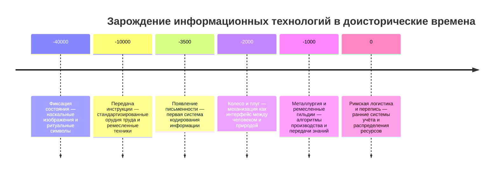
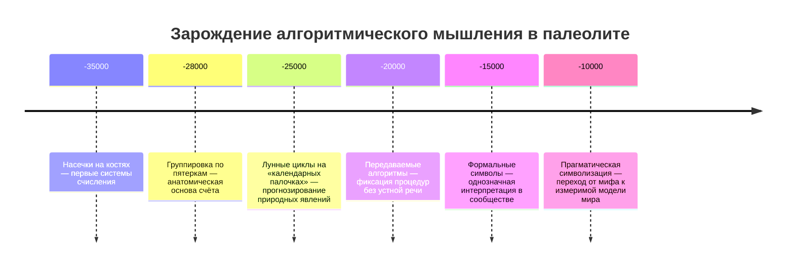
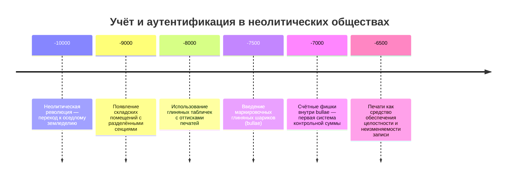
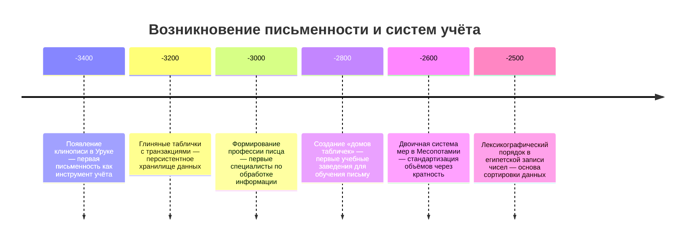
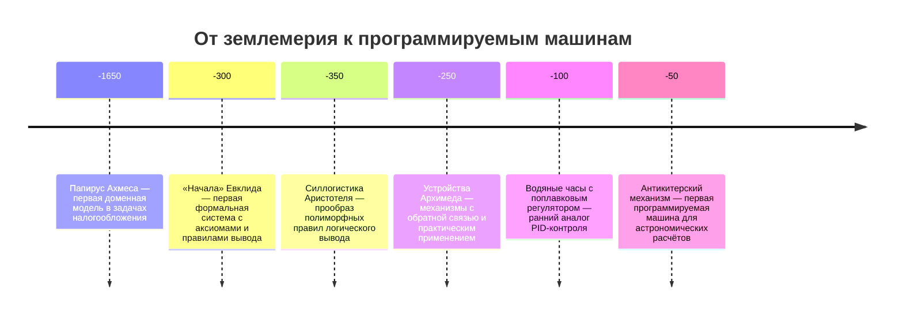
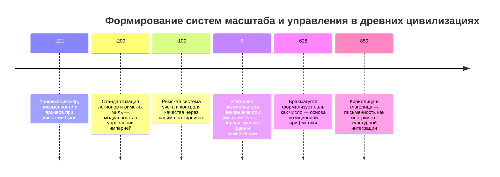
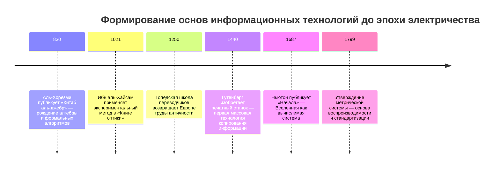

---
title: Ранние вычислительные устройства
---

# Ранние вычислительные устройства

  ДЛЯ НОВИЧКОВ
  НЕ ДЛЯ НОВИЧКОВ
  НЕ ОБЯЗАТЕЛЬНО

Всем

## Крайняя древность

### Первые технологии

Технологии поначалу были скромны. Это орудия труда, земледелия, колесо, кузнечное дело. С изобретением новых сплавов, осваивались новые возможности, но они являются достижениями металлургии, промышленности и военного ремесла. Война всегда была двигателем прогресса, ведь чем более продвинутыми инструментами она ведётся, тем выше шанс на победу. Но за войной и оружием стоит система, определяющая «как делать», «как хранить», «как распределять», «как обучать».

Инструменты позволили человеку влиять на окружающий мир, что можно трактовать как интерфейс между человеком и природой. Колесо - система передачи энергии и движения, прообраз механизации. А в ремеслах, вроде того же земледелия и металлургии, есть алгоритмы, системы планирования, учёта, хранения, что уже фактически прообраз систем. Поэтому базис IT - алгоритмы, системы и инструменты, был заложен ещё первобытным обществом. Звучит, вроде бы, смешно, но я не думаю, что первобытные люди были настолько глупы, как их считает современное общество. От того, что у вас есть смартфон и ноутбук, вы не будете более развитым - у вас просто более удобные инструменты и возможности, а не вы сами. Наши предки вряд ли были бы довольны потомками, снимающими короткие видео про «Балерина Капучино» или «Тралалело тралала…» и прочее в этом духе.

Жёстковато, но не стоит принижать наших предков, они не были глупыми. 

История информационных технологий начинается с момента, когда человек впервые осознал необходимость *фиксации состояния*, *передачи инструкции*, и *воспроизведения действия по образцу*. Эти три акта — фиксация, передача, воспроизведение — образуют ядро любой информационной системы, независимо от её материальной реализации. Археологические данные позволяют отнести их возникновение к эпохе верхнего палеолита — 40–10 тысяч лет до нашей эры.

---

### Вычисления и символизация

На стоянках в Европе (Ля-Ферраси, Франция) и Сибири (Мальта, Россия) найдены кости с насечками, сгруппированными по 5, 10 или 28 элементов. Эти отметки — *системы счисления*, причём уже с применением модульной арифметики: группировка по пятеркам отражает анатомический базис (пальцы одной руки), а цикл в 28–29 насечек совпадает с лунным месяцем. Такие «календарные палочки» служили инструментом предсказания: по ним отслеживали сезонные циклы миграции животных, время нереста рыб, периоды таяния льдов. Это — первая реализация *алгоритма*: последовательности операций, приводящей к прогнозу на основе наблюдаемых данных. Важно, что алгоритм здесь не индивидуален — он *передаваем*: насечки читаются без слов, их смысл сохраняется при передаче от одного поколения к другому. Это — прообраз *формального языка*: система символов, однозначно интерпретируемая в рамках сообщества. Носитель информации (кость, дерево, камень) становится *интерфейсом* между человеком и моделью мира.

Этот этап эволюции мышления получил в научной литературе название *прагматической символизации*. Символ (насечка) функционально связан с внешней реальностью через операцию подсчёта. Такое мышление принципиально отличается от мифологического, где знаки (тотемы, ритуальные узоры) отсылают к потустороннему, а не к измеримому. Прагматическая символизация — необходимое условие для возникновения любой технологии, включая цифровую: без веры в то, что состояние системы можно зафиксировать, а процесс — описать, невозможно построить даже самый простой автомат.

---

### Неолитическая революция

Следующий качественный скачок связан с переходом от кочевого образа жизни к оседлому земледелию — неолитической революцией (около 10 тысяч лет до н. э.). Оседлость порождает избыток — избыток продовольствия, имущества, населения. Избыток требует *управления*. Управление требует *учёта*. Учёт требует *стандартизации*. Именно в неолитических поселениях Ближнего Востока (Чатал-Хююк в Анатолии, Иерихон в Палестине) впервые появляются признаки системного контроля: складские помещения с разделёнными секциями, глиняные таблички с оттисками печатей, маркировочные глиняные шарики (bullae), внутри которых помещались мелкие предметы — счётные фишки.

Эти шарики решают задачу *аутентификации записи*. Представим: глава общины передаёт пастуху 10 овец. Чтобы зафиксировать факт передачи, внутрь глиняного шарика закладываются 10 фишек-конусов (каждая — одна овца), шарик запечатывается печатью. При возврате стада шарик вскрывается, фишки сравниваются с живыми животными. Если фишки = 10, — всё на месте. Это — первая реализация *контрольной суммы* и *неизменяемой записи*. Печать обеспечивает *целостность* данных: любая попытка вскрыть шарик оставляет след. Уже здесь присутствует вся логика блокчейна: неизменяемый блок (глина), хэш (оттиск печати), подтверждение транзакции (счёт фишек). Разница лишь в физической реализации.

---

### Письменность

Со временем возникает необходимость в *описании* содержимого без вскрытия шарика. На поверхности начинают делать оттиски фишек — внешние знаки, изображающие то, что внутри. Это — переход от трёхмерного носителя (фишки) к двумерному (оттиск на глине). Примерно в 3400 году до н. э. в Уруке (южная Месопотамия) происходит окончательный переход: оттиски перестают быть копией содержимого шарика, а становятся *самостоятельной записью*. Так рождается клинопись — первая в истории письменность. Её ранние тексты — это строго функциональные документы: «120 мер ячменя выдано 40 рабочим», «30 баранов сданы в храм Нанна». Это — первые *транзакции*, зафиксированные в *персистентном хранилище* (глиняная табличка). Возникает *лог*: запись фиксирует факт *изменения состояния* системы (уменьшение запасов, перемещение ресурсов).

Письменность в Месопотамии возникла как *инструмент административного контроля* в условиях роста масштаба. Город-государство Урук к 3000 году до н. э. насчитывал до 50 тысяч жителей — это превышало когнитивный предел для управления на основе личного знакомства (число Данбара ≈ 150). Управление стало невозможным без *внешнего протеза памяти* — письменности. Писцы, владевшие этой технологией, становятся элитой: они контролируют доступ к информации, интерпретируют записи, формируют отчёты. Это — первая профессия, основанная на работе с данными. Их подготовка требует лет обучения, стандартизированных учебных программ (шумерские «дома табличек»), иерархии знаний. Появляется *система образования*, ориентированная на освоение формального языка.

Параллельно развивается и аппаратура — в смысле *инструментов стандартизации*. Для учёта сыпучих тел (зерно, соль) и жидкостей (масло, пиво) требуются мерные сосуды. Археологи находят наборы глиняных сосудов, объёмы которых кратны друг другу: 1, 2, 4, 8, 16. Это — двоичная система мер, оптимальная для взвешивания без весов: нужно лишь последовательно пересыпать содержимое. В Египте применяется десятичная система, но с тем же принципом — иерархия единиц (единицы, десятки, сотни), каждая из которых представлена отдельным иероглифом. Это — прообраз *разрядной сетки* в позиционных системах. Египтяне не использовали позиционную запись (цифра «10» всегда один и тот же иероглиф, независимо от её места), но они уже разделяли *значение* и *место*: в числе 245 иероглифы для 2 сотен, 4 десятков и 5 единиц располагаются строго в порядке убывания. Это — первая реализация *лексикографического порядка*, необходимого для сортировки и поиска.

---

### Развитие наук

Геометрия в Древнем Египте — практическая дисциплина *землемерия* (отсюда греческое «геометрия» — земле-измерение). После каждого разлива Нила границы участков смывались, и их нужно было восстановить. Это требовало точных измерений, построения прямых углов (египетский треугольник 3:4:5), вычисления площадей. Знаменитый папирус Ахмеса (ок. 1650 г. до н. э.) содержит задачи типа: «Если у тебя участок в 10 сетат (мера площади), и ты должен отдать 1/10 урожая в виде налога, сколько зерна останется?» Здесь уже присутствует *моделирование*: реальный участок заменяется абстрактным числом, действия над ним — арифметическими операциями. Это — первая реализация *доменной модели*: описание предметной области с помощью формальных правил.

В Древней Греции происходит смещение акцента с *вычисления* на *доказательство*. Пифагорейцы вводят понятие *теоремы* — утверждения, истинность которого следует из логических посылок. Евклид в «Началах» строит всю геометрию на системе *аксиом* и *правил вывода*. Это — первая формальная система в истории. Её структура полностью соответствует современным требованиям к надёжным системам:  
— **Непротиворечивость**: из аксиом нельзя вывести два взаимоисключающих утверждения.  
— **Полнота** (в рамках системы): любое истинное утверждение может быть доказано.  
— **Независимость аксиом**: ни одна аксиома не выводится из других.  
Эта система — прообраз *спецификации*: описание того, *как должна вести себя система*, без указания *как её построить*. Программирование на современном уровне невозможно без такой абстракции: мы сначала описываем интерфейс (что делает функция), а потом реализуем его (как она работает).

Аристотель создаёт силлогистику — систему логического вывода. «Все люди смертны. Сократ — человек. Следовательно, Сократ смертен». Эта схема — прообраз *правила вывода* в экспертных системах и базах знаний. Важно, что правило не зависит от содержания: его можно применять к любым объектам, если они удовлетворяют предпосылкам. Это — первая реализация *полиморфизма*: один и тот же алгоритм работает с разными типами данных.

Древнегреческая механика, вопреки расхожему мнению, была не чисто теоретической. Архимед строил *практические устройства*: винт для подъёма воды, системы блоков для перемещения кораблей, «луч смерти» (зеркала для фокусировки солнечного света). Его работы содержат описание *механизмов обратной связи*: в системе водяных часов уровень жидкости в резервуаре регулируется поплавком, соединённым с клапаном — это прообраз *PID-регулятора*. Антикитерский механизм (I в. до н. э.) — это не «аномалия», а логическое завершение этой линии. Его внутренняя структура (30+ бронзовых шестерёнок) реализует астрономическую модель Гиппарха: положение Солнца, Луны и пяти планет вычисляется по эпициклам. Механизм имеет три шкалы: эклиптическую (для положения небесных тел), календарную (египетский солнечный календарь) и олимпийскую (для фиксации дат игр). Поворот одной ручки одновременно обновляет все три шкалы — это *синхронизация состояний* в распределённой системе. На задней панели — таблицы затмений: при вводе даты механизм указывает, будет ли затмение. Это — первая в истории *программируемая машина*: вход (дата) → обработка (механический алгоритм) → выход (предсказание). Отличие от современных компьютеров — в физической реализации, а не в логике.

---

### Инженерия

Римская империя вносит вклад в *инженерию масштаба*. Акведуки, дороги, фортификационные сооружения требуют управления ресурсами на континентальном уровне. Это порождает *систему учёта*:  
— **Модульность**: стандартные блоки (легионы по 4800–6000 человек, римские мили ≈ 1480 м).  
— **Иерархия**: чёткое разделение ролей (император → наместник → легат → центурион).  
— **Документооборот**: таблички с отчётами, карты (итинерарии), кадастры (земельные реестры).  
— **Контроль качества**: клейма на кирпичах, указывающие на производственную центурию.  
Это — первая реализация *управления по отклонениям*: отчёт о расходе материалов сравнивается с нормативом, выявляются расхождения, принимаются меры. Римское право формализует эту логику в юридических конструкциях: *casus* (фактическое обстоятельство) → *norma* (правовая норма) → *decisio* (решение). Это — прообраз *бизнес-правила*: если условие выполнено, то действие. В кодексе Юстиниана (VI в. н. э.) такие правила систематизированы в виде *дигест* — сборника прецедентов и толкований, что является аналогом *базы знаний*.

В то время как Средиземноморье развивало формальные системы, в Азии формировались альтернативные подходы. В Древнем Китае (III–II вв. до н. э.) при династии Цинь происходит унификация:  
— **Стандартизация мер и весов** (единый чи ≈ 23 см, единый цзинь ≈ 250 г).  
— **Унификация письменности**: иероглифы приведены к каноническому виду (малая печать).  
— **Централизованный архив**: все документы отправляются в столицу Сяньян.  
Это создаёт предпосылки для *бюрократической машины*, описанной позже Конфуцием: управление через иерархию должностей, а не через личную преданность. Экзамены для чиновников (введены при династии Хань, II в. до н. э.) — это первая система *оценки компетенций* по формализованным критериям (знание классиков, каллиграфия, способность составлять меморандумы). Это — прообраз *системы HR*: отбор, оценка, продвижение по объективным параметрам.

Индийский вклад уникален:  
— **Десятичная позиционная система** (уже в III в. до н. э. в надписях на храме в Насике).  
— **Цифра ноль** как полноценное число (не как «пустое место»), введённая Брахмагуптой в VII в. н. э.  
— **Алгебраическая символика**: обозначение неизвестного («йават-тават» — «столько-сколько»), операций сложения и вычитания.  
Позиционная запись — революция в эффективности вычислений. В непозиционной системе (римские цифры) умножение 123 × 45 требует разложения на слагаемые: (C+X+X+I+I+I) × (XL+V), что крайне трудоёмко. В позиционной системе применяется единый алгоритм умножения в столбик, независимо от величины чисел. Это — прообраз *машинного кода*: универсальный интерфейс, на котором работают любые программы. Ноль как число позволяет ввести отрицательные величины и оперировать с долгами — фундамент бухгалтерского учёта.

Почему в Северной Европе и на Руси не возникли письменность и сложные системы учёта? Расхожее объяснение — «отсталость» — научно несостоятельно. Реальная причина — **адаптивная специализация**. В условиях короткого вегетационного периода, низкой плотности населения и преобладания кочевого/полукочевого скотоводства выгоднее развивать *устные технологии передачи знаний*: эпосы, рунические надписи (не для бухгалтерии, а для магических формул), сложные системы родства. Рунические надписи (например, на камне из Йеллинге, Дания, IX в.) содержат не экономические данные, а претензии на власть: «Горм Старый поставил этот камень в память о своей жене Тире. Та, что сделала Данию». Это — запись *статуса*, а не *транзакции*. Такая система эффективна при низкой скорости изменений: знания передаются через ритуалы и личный пример, а не через письменные инструкции. Кириллица и глаголица, созданные в IX в., возникают не «вдруг», а как ответ на новую задачу — перевод священных текстов для славянских народов, вовлечённых в сферу влияния Византии. Письменность здесь — инструмент *культурной интеграции*, а не административного контроля.

---

### Средневековье и дальнейшее развитие

Религиозные системы играют двойственную роль. С одной стороны, монотеистические религии (иудаизм, христианство, ислам) создают *универсальные этические кодексы*, способные действовать на огромных территориях без централизованного управления — прообраз *распределённых консенсусных алгоритмов*. Талмуд, Коран и каноны Церкви — это базы правил, интерпретируемых локальными авторитетами, но сохраняющих общую структуру. С другой стороны, институционализированная Церковь в Европе (V–XV вв.) подавляет альтернативные источники авторитета — науку. Причина в *конкуренции систем легитимности*. Научный метод основан на сомнении, проверке, опровержении. Церковная доктрина — на авторитете Отцов Церкви и непреложности Откровения. Эти две системы несовместимы на операционном уровне: одна требует открытости гипотез, другая — закрытости догматов. Поэтому учёные (Галилей, Бруно) не «боролись с религией», а пытались изменить *архитектуру знания*: от иерархической (Папа → епископы → приходы) к сетевой (учёные ↔ научные общества ↔ публикации).

Исламский мир (VIII–XIV вв.) демонстрирует обратный сценарий. После перевода трудов Аристотеля, Птолемея и Диофанта в Багдадском «Доме мудрости» возникает *синтез*: греческая логика + индийская математика + персидская астрономия. Аль-Хорезми (IX в.) создаёт «Китаб аль-джебр ва-ль-мукабала» — первую книгу по алгебре, где описаны методы решения уравнений. Слово «алгоритм» происходит от латинизированного имени Аль-Хорезми (Algoritmi). Его методы — это *формальные процедуры*: последовательность шагов, гарантирующая решение для любого входа. Это — прямой предок современных алгоритмов сортировки и поиска. Ибн аль-Хайсам (XI в.) в «Книге оптики» применяет экспериментальный метод: гипотеза → построение прибора → измерение → вывод. Его работа с камерой-обскурой — прообраз *обработки сигналов*: свет проходит через отверстие, проецируется на плоскость, и его свойства (угол, интенсивность) анализируются.

Возрождение в Европе (XIV–XVII вв.) — результат *передачи знаний*. Через Сицилию (норманское королевство), Испанию (Толедская школа переводчиков) и крестоносцев возвращаются утраченные тексты: Аристотель в переводе Аверроэса, «Начала» Евклида, труды Архимеда. Одновременно происходит технологический прорыв — книгопечатание (Гутенберг, 1440-е). Печатный станок — это первая *массовая технология копирования информации*. До него копирование требовало месяцы труда переписчика, после — часов работы наборщика. Стоимость книги падает в 10–100 раз. Это создаёт условия для *демократизации знания*: учёные могут обмениваться идеями без посредничества монастырей, студенты получают доступ к учебникам. Формируется *республика учёных* — международное сообщество, связанное перепиской и публикациями. Это — прообраз *открытой науки* и *рецензирования*.

Ньютон в «Математических началах натуральной философии» (1687) создаёт модель мира как *вычислимой машины*: планеты движутся по законам, выведенным из наблюдений, и их траектории можно предсказать с любой точностью. Это — генерализация идеи Антикитерского механизма: Вселенная как аналоговый компьютер. Но Ньютон идёт дальше — он вводит *математический анализ* (флюксии), позволяющий работать с *непрерывными процессами* (скорость, ускорение). Это создаёт основу для *моделирования динамических систем* — от движения маятника до роста популяции. Лейбниц, независимо от Ньютона, разрабатывает исчисление, но с акцентом на *символическую логику*. Его мечта — *характеристика универсалис*: язык, в котором споры решаются вычислением («Посчитаем!»). Это — прямой прообраз *логического программирования* и *автоматического доказательства теорем*.

В XVII–XVIII вв. формируются институты, обеспечивающие устойчивость прогресса:  
— **Академии наук** (Лондонское Королевское общество, 1660; Парижская АН, 1666) — платформы для верификации результатов.  
— **Научные журналы** («Философские труды» Королевского общества, 1665) — системы постоянной публикации.  
— **Международная система мер** (дефиниции метра и килограмма, 1799) — основа для воспроизводимости экспериментов. 
 
Эти институты создают *инфраструктуру доверия*: любой учёный может повторить эксперимент, проверить расчёты, оспорить выводы. Это — фундамент *научного метода*, без которого невозможны ни современная инженерия, ни IT-индустрия. Баг в коде — это аналог ошибочного эксперимента: его находят, фиксируют, исправляют, и исправление становится частью общего знания.

Таким образом, «крайняя древность» в контексте IT — это фундамент. Все ключевые концепции современных систем были заложены задолго до появления электричества:  
— **Алгоритм**: палеолитические календари → шумерские учётные схемы → индийские методы вычислений.  
— **Данные**: глиняные таблички → пергаментные свитки → печатные книги.  
— **Интерфейс**: насечки на кости → клинопись → печатная буква.  
— **Система**: римская бюрократия → китайская экзаменационная система → академии наук.  
— **Абстракция**: египетская геометрия → греческая аксиоматика → лейбницевская символическая логика.  

История IT — это история постепенного *отделения логики от физики*. Сначала логика была вшита в материал (форма шарика-бюллы), затем вынесена на поверхность (оттиск), затем оформлена в символы (письменность), затем стандартизирована в правила (алгебра), и наконец, формализована в языки (программирование). Каждый этап — это повышение уровня абстракции, позволяющее решать задачи большей сложности без увеличения затрат на понимание. Современный разработчик, пишущий на Python, стоит на плечах писцов Урука, инженеров Архимеда и алгебраистов Аль-Хорезми — буквально: инструменты наследуют логику, отработанную за пять тысячелетий.

---