---
title: История языков программирования
tags: [beginner, advanced, notrequired, all]
description: Fortran, COBOL, Lisp, ALGOL, Pascal, C, C++, Java, JavaScript, PHP, Python, Ruby, C#, TypeScript, Rust и Kotlin.
---

# История языков программирования

  ДЛЯ НОВИЧКОВ
  НЕ ДЛЯ НОВИЧКОВ
  НЕ ОБЯЗАТЕЛЬНО

Всем

## Языки

### Как появились первые языки программирования?

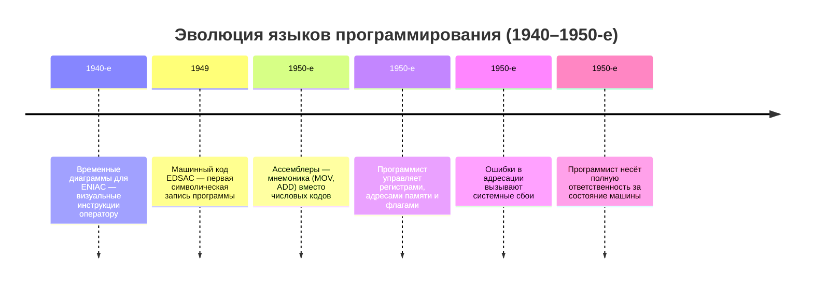

Язык программирования — это *математическая модель реальности*, встроенная в инструментарий разработчика. Каждый язык отражает определённую философию: как устроены данные, как протекают вычисления, где проходит граница между корректным и некорректным, кто несёт ответственность за ошибки — программист, компилятор или среда выполнения. История языков — это история постепенного переноса ответственности с человека на машину, сопровождаемая ростом уровня абстракции и снижением допустимой степени неопределённости.

Ранние языки (1940–1950-е) не были «языками» в современном понимании. Код для ENIAC записывался в виде *временных диаграмм* — графиков, показывающих, когда какие переключатели должны быть включены. Это была не символическая запись, а *визуальная инструкция для оператора*. Появление машинных кодов (1949, EDSAC) и ассемблеров (1950-е) добавило *мнемонику* (MOV, ADD), но суть осталась той же: каждая инструкция напрямую отображалась на команду процессора. Программист мыслил в терминах *регистров*, *адресов памяти*, *флагов состояния*. Ошибка в адресе приводила к записи в чужую область памяти — и краху всей системы. Такая модель предполагала *абсолютное знание состояния машины*: программист был одновременно инженером, математиком и оператором.

---

### Fortran

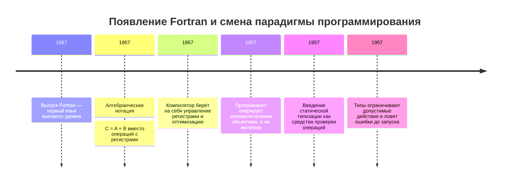

Fortran (1957) совершил прорыв, введя *алгебраическую нотацию*. Вместо «загрузить A в регистр R1, загрузить B в R2, сложить R1 и R2, сохранить в R3» можно было написать `C = A + B`. Компилятор сам решал, какие регистры использовать, как оптимизировать выражение. Это была *смена парадигмы мышления*: программист перестал думать о физических ресурсах и начал оперировать *математическими объектами*. Fortran также ввёл *статическую типизацию*: компилятор проверял, что к целому числу не применяется операция извлечения корня, а к массиву — не прибавляется скаляр. Типы здесь — не описание данных, а *ограничения на операции*, предотвращающие семантические ошибки на этапе компиляции. Эта идея, заложенная в 1950-х, остаётся фундаментом всех современных языков.

---

### COBOL

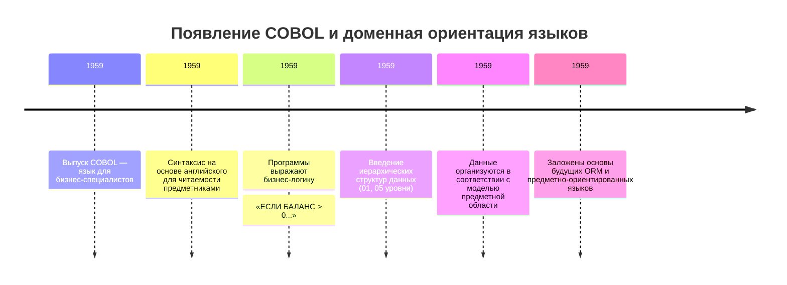

COBOL (1959) пошёл другим путём: он абстрагировался от *логики программирования*. Его синтаксис имитировал английский не для красоты, а для *вовлечения предметных специалистов*. Бухгалтер мог прочитать программу: «ЕСЛИ БАЛАНС БОЛЬШЕ НУЛЯ, ТО ВЫВЕСТИ СООБЩЕНИЕ „СЧЁТ АКТИВЕН“». Это был первый шаг к *доменной ориентации*: язык системы приближался к языку бизнес-процессов. COBOL ввёл *иерархические структуры данных* (01 КЛИЕНТ, 05 ИМЯ PIC X(30), 05 СЧЁТ PIC 9(10)), что позволяло естественно описывать документы. Здесь данные не просто хранятся — они *структурированы в соответствии с предметной областью*. Эта идея легла в основу объектно-реляционного отображения (ORM) и современных DSL (Domain-Specific Languages).

---

### Lisp

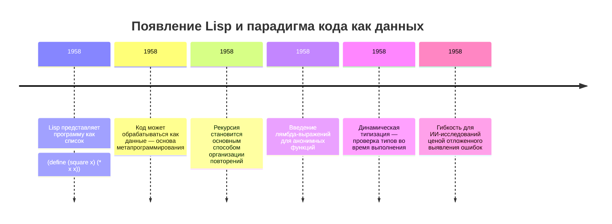

Lisp (1958) предложил радикально иную модель: *код как данные*. Программа на Lisp — это список в скобках: `(define (square x) (* x x))`. Сам этот список может быть обработан другой функцией — например, оптимизатором, который заменит `(* x x)` на `(expt x 2)`. Это позволило реализовать *метапрограммирование*: программы, которые пишут программы. Lisp ввёл *рекурсию* как основной метод итерации (вместо циклов), *лямбда-исчисление* для анонимных функций, и *динамическую типизацию* — проверка типов происходила во время выполнения, а не компиляции. Для исследований ИИ это было критично: алгоритмы часто оперировали с неизвестной заранее структурой данных (деревья решений, сети нейронов). Динамическая типизация давала *гибкость*, но ценой *непредсказуемости*: ошибка типа выявлялась только при выполнении конкретной ветки кода. Современные языки (Python, JavaScript) унаследовали эту дилемму.

---

### ALGOL

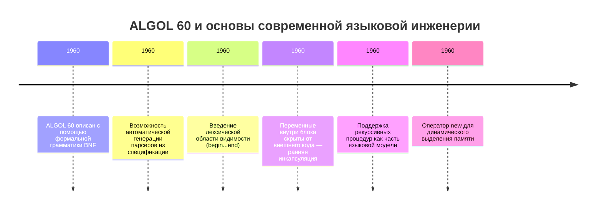

ALGOL 60 (1960) стал первым языком, описанным с помощью *формальной грамматики* (BNF — Бэкуса-Наура). Это позволяло однозначно определить, является ли текст корректной программой, и автоматически генерировать парсеры. ALGOL ввёл *лексическую область видимости*: переменная, объявленная внутри блока `begin...end`, недоступна снаружи. Это был прообраз *инкапсуляции* — сокрытия внутреннего состояния. ALGOL также поддерживал *рекурсивные процедуры* и *динамическое выделение памяти* (через `new`), что сделало его основой для языков системного программирования.

---

### Pascal

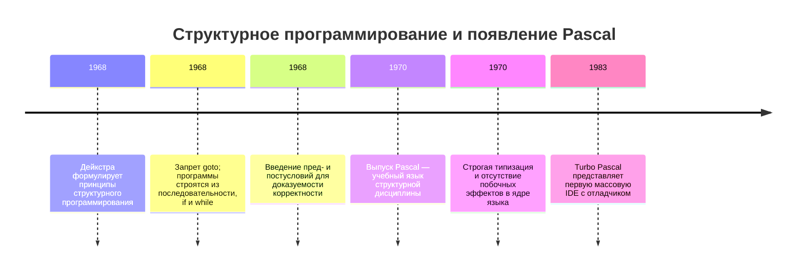

Появление структурного программирования (1968, Дейкстра) привело к кризису ассемблера и Fortran. Идея — запретить оператор `goto` и строить программы только из трёх конструкций: последовательность, ветвление (`if`), цикл (`while`). Это обеспечивало *доказуемость корректности*: для каждого блока можно было формально описать, какие условия истинны на входе и выходе (пред- и постусловия). Pascal (1970) стал учебным воплощением этой идеи: строгая типизация, отсутствие побочных эффектов, читаемый синтаксис. Pascal учил *дисциплине мышления*. Его компиляторы (Turbo Pascal, 1983) ввели *интегрированную среду разработки* (IDE) с мгновенной компиляцией и отладчиком — прообраз современных инструментов.

---

### C

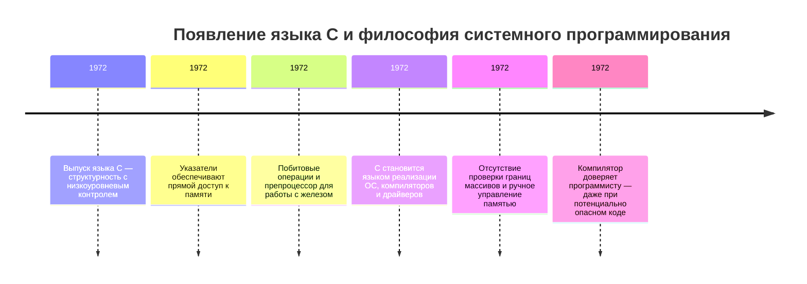

C (1972) ответил на ограничения Pascal: он сохранил структурность, но добавил *низкоуровневый контроль*. Указатели давали прямой доступ к памяти, побитовые операции — к регистрам, препроцессор — к условной компиляции. C был языком *описания систем*: на нём можно было писать компиляторы, ОС, драйверы. Его успех объясняется *балансом*: достаточно высокоуровневый для читаемости, достаточно низкоуровневый для эффективности. Но цена была высока: отсутствие проверки границ массивов, ручное управление памятью, неопределённое поведение при ошибках. C предполагал, что программист *всегда прав* — компилятор не мешает, даже если код опасен. Эта философия породила миллионы уязвимостей (buffer overflow, use-after-free), но обеспечила беспрецедентную производительность.

---

### C++

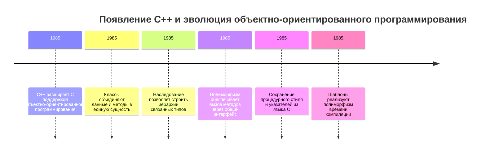

C++ (1985) добавил к C *объектно-ориентированное программирование* (ООП). Классы объединяли данные и методы, наследование позволяло строить иерархии типов, полиморфизм — вызывать методы через общий интерфейс. Но C++ не был «чистым» ООП-языком: он сохранял всё от C, включая указатели и глобальные функции. Это давало *гибкость*, но усложняло модель мышления: программист должен был выбирать между процедурным, ООП и шаблонным стилями. Шаблоны (templates) ввели *полиморфизм времени компиляции*: функция могла работать с любым типом, если он поддерживает нужные операции. Это — прообраз *концепций* в C++20 и *trait’ов* в Rust.

---

### Java и JavaScript

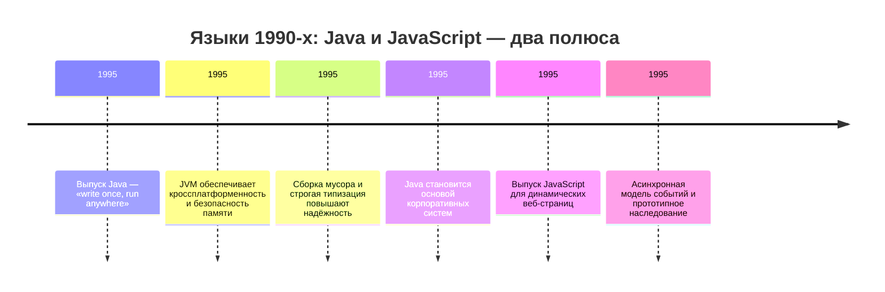

В 1990-х доминировали два противоположных подхода:  
— **Java** (1995): «write once, run anywhere». Виртуальная машина (JVM) обеспечивала *независимость от платформы*, сборка мусора — *безопасность памяти*, строгая типизация — *предсказуемость*. Java жертвовала производительностью ради надёжности: JIT-компилятор оптимизировал код во время выполнения, но старт приложения был медленным. Java стала языком *корпоративных систем*, где важнее стабильность, чем скорость.  
— **JavaScript** (1995): язык *динамических веб-страниц*. Созданный за 10 дней, он унаследовал синтаксис C, но семантику — от Scheme (лямбды, замыкания) и Self (прототипное наследование). JavaScript был *однопоточным*, с *асинхронной моделью событий* (event loop), что позволяло обрабатывать тысячи соединений на одном ядре. Его динамическая типизация и неявные приведения (`"5" + 3 = "53"`, `"5" - 3 = 2`) считались недостатками, но обеспечивали *гибкость* для быстрой разработки интерфейсов.  

---

### PHP

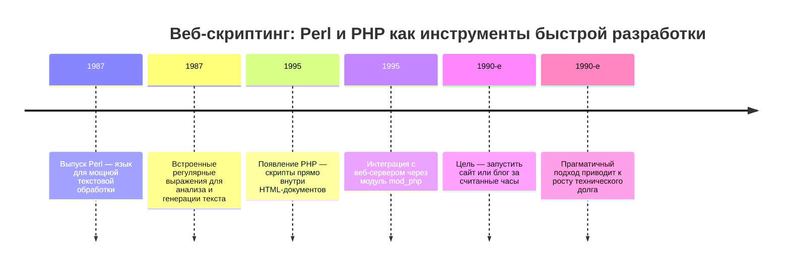

PHP (1995) и Perl (1987) решали задачу *веб-скриптинга*: генерация HTML на основе данных. Их сила — в *текстовой обработке* (регулярные выражения в Perl) и *интеграции с веб-сервером* (модуль mod_php). Они не стремились к элегантности — их цель была *практической*: запустить блог за час. Эта философия сделала их основой раннего веба, но привела к *техническому долгу*: код был трудно поддерживать при росте проекта.

---

### 2000-е

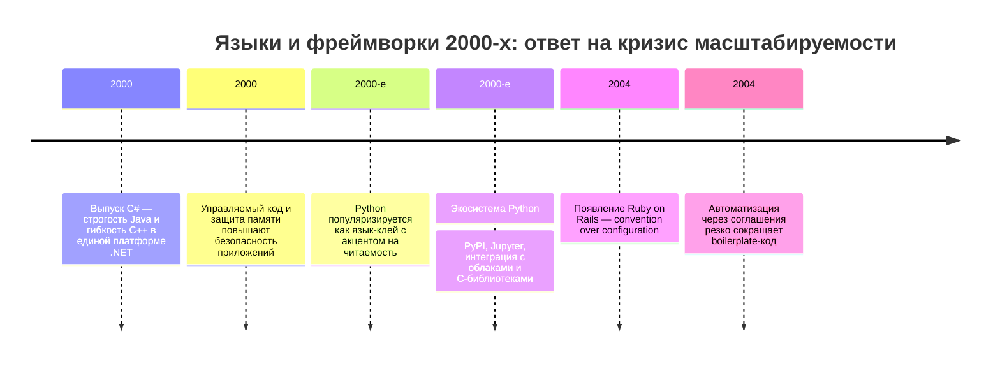

2000-е ознаменовались кризисом масштабируемости. Монолиты на Java и PHP не справлялись с нагрузкой соцсетей. Ответом стали:  
— **C#** (2000): Microsoft создала язык, совмещающий строгость Java с гибкостью C++. Делегаты (указатели на функции), LINQ (язык запросов внутри C#), async/await (асинхронное программирование) — всё это решало конкретные проблемы enterprise-разработки. Платформа .NET обеспечивала *безопасность*: управляемый код не мог напрямую обращаться к памяти, что снижало риски уязвимостей.  
— **Python** (1991, популяризирован в 2000-х): философия «читаемость имеет значение». Отступы вместо фигурных скобок, минимум ключевых слов, динамическая типизация — всё это ускоряло разработку. Python стал *языком-клейём*: он связывал компоненты, написанные на C/C++ (NumPy, TensorFlow), обеспечивая простой API для учёных и аналитиков. Его успех — в *экосистеме*: PyPI (репозиторий пакетов), Jupyter (интерактивные тетради), интеграция с облаками.  
— **Ruby on Rails** (2004): фреймворк, реализовавший принцип *convention over configuration*. Вместо настройки программист следовал соглашениям (например, имя таблицы во множественном числе), и фреймворк делал всё автоматически. Это резко сокращало boilerplate-код, но требовало *глубокого понимания конвенций*.  

---

### 2010-е и будущее

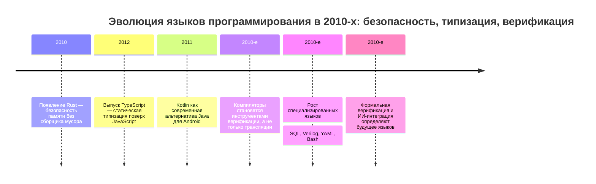

2010-е принесли осознание стоимости динамической типизации. Крупные проекты на JavaScript и Python страдали от *ошибок времени выполнения*, которые могли быть пойманы на этапе компиляции. Ответом стали:  
— **TypeScript** (2012): надмножество JavaScript со *статической типизацией*. Типы не влияют на runtime — они проверяются только в момент разработки и затем «стрипятся». Это дало безопасность без изменения экосистемы: существующий JS-код работал без изменений. TypeScript ввёл *вывод типов* (программист не пишет `: number`, компилятор сам определяет тип), *обобщённое программирование* (generics), и *тип-гарды* (проверка типа в runtime).  
— **Rust** (2010, стабильный релиз 2015): язык *системного программирования без компромиссов*. Он сохраняет производительность C, но гарантирует безопасность памяти через *систему владения* (ownership). Каждое значение имеет одного *владельца*; при передаче владения старый владелец теряет доступ. Заимствование (borrowing) позволяет временно использовать значение без передачи владения, но с ограничениями: нельзя иметь одновременно изменяемое и неизменяемое заимствование. Это проверяется *на этапе компиляции*, без runtime-накладных расходов. Rust предполагает, что *ошибки — это недостаток языка*, а не программиста: если код компилируется, он не может содержать data races или use-after-free.  

— **Kotlin** (2011): замена Java для Android. Он сохранил совместимость с JVM, но устранил досадные недостатки Java: проверяемые исключения, отсутствие null safety, многословность. Ключевая идея — *null safety*: тип `String` не может быть null, а `String?` — может. Компилятор требует проверки перед использованием nullable-типа, что исключает NullPointerException. Kotlin также ввёл *расширения функций* (добавление методов к существующим классам без наследования) и *корутины* (лёгкие потоки для асинхронного программирования).  

Типизация — центральный конфликт в эволюции языков. Спектр решений:  
— **Динамическая** (Python, JS): типы проверяются во время выполнения. Плюсы — гибкость, простота прототипирования. Минусы — ошибки выявляются поздно, IDE хуже подсказывает.  
— **Статическая с выводом** (TypeScript, Kotlin): компилятор сам определяет типы, но позволяет уточнять в сложных случаях. Баланс между безопасностью и удобством.  
— **Строгая статическая** (Java, C#): все типы объявляются явно. Максимальная предсказуемость, но много boilerplate.  
— **Зависимые типы** (Idris, Agda): тип может зависеть от значения (например, `Vector n` — вектор длины n). Это позволяет *формально доказывать корректность*: функция сортировки гарантированно возвращает отсортированный список. Цена — сложность и узкая применимость.  

Компиляторы эволюционировали от *трансляторов* к *инструментам верификации*. Современный компилятор Rust не просто генерирует код — он *доказывает отсутствие определённых классов ошибок*. Clang (C/C++) включает статический анализатор, находящий утечки памяти и гонки данных. Компиляторы для языков вроде Coq или Lean генерируют *формальные доказательства*, которые можно проверить независимо. Это смещает фокус с «написать рабочий код» на «написать доказуемо корректный код».

Языки также специализируются под домены:  
— **SQL** (1974): язык *декларативных запросов*. Программист описывает *что* нужно, а СУБД решает *как*. Это возможно благодаря *алгебре реляционных операций* (проекция, выборка, соединение), на которой основан оптимизатор запросов.  
— **Verilog/VHDL** (1980-е): языки *описания аппаратуры*. Код здесь описывает *логическую схему*, которая работает параллельно. `a <= b + c` означает «создать сумматор, входы — b и c, выход — a», а не «вычислить сумму сейчас».  
— **Bash/PowerShell**: языки *оркестрации*. Их цель — связать существующие утилиты (grep, awk, curl) в pipeline. Здесь важна *выразительность цепочек команд*.  
— **YAML/JSON**: *языки конфигурации*. Они описывают *состояние системы*, а не поведение. Их популярность растёт с распространением IaC (Infrastructure as Code).  

Будущее языков определяется тремя трендами:  
1. **Безопасность по умолчанию**: Rust показал, что можно совместить производительность и безопасность. Zig, Carbon — его наследники, стремящиеся к лучшей совместимости с C.  
2. **Интеграция с ИИ**: GitHub Copilot не заменяет программиста, но меняет процесс: вместо написания кода — *редактирование и верификация* сгенерированного. Языки будут включать *подсказки для ИИ* (например, аннотации типов в виде комментариев).  
3. **Верификация и доказательства**: для критически важных систем (авионика, медицина) недостаточно тестов — нужна *формальная верификация*. Языки вроде F*, Liquid Haskell добавляют *проверяемые инварианты* прямо в код: `function divide(a: number, b: number): number { assume b != 0; return a / b; }`.  

Язык программирования — это *договор между человеком и машиной* о том, что считается корректным. Ранние языки предполагали, что человек не ошибается. Современные — что ошибки неизбежны, и задача языка — сделать их видимыми до запуска. Эта эволюция отражает общую тенденцию IT: переход от индивидуального мастерства к системной надёжности. Программист будущего будет не писать алгоритмы, а *формулировать требования и гарантии*, которые машина превратит в исполняемый код.

---