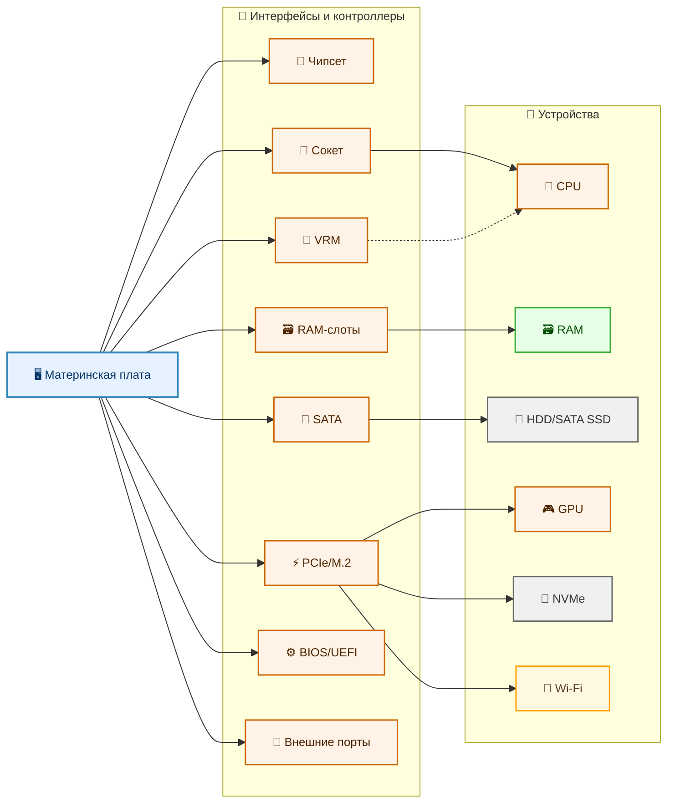
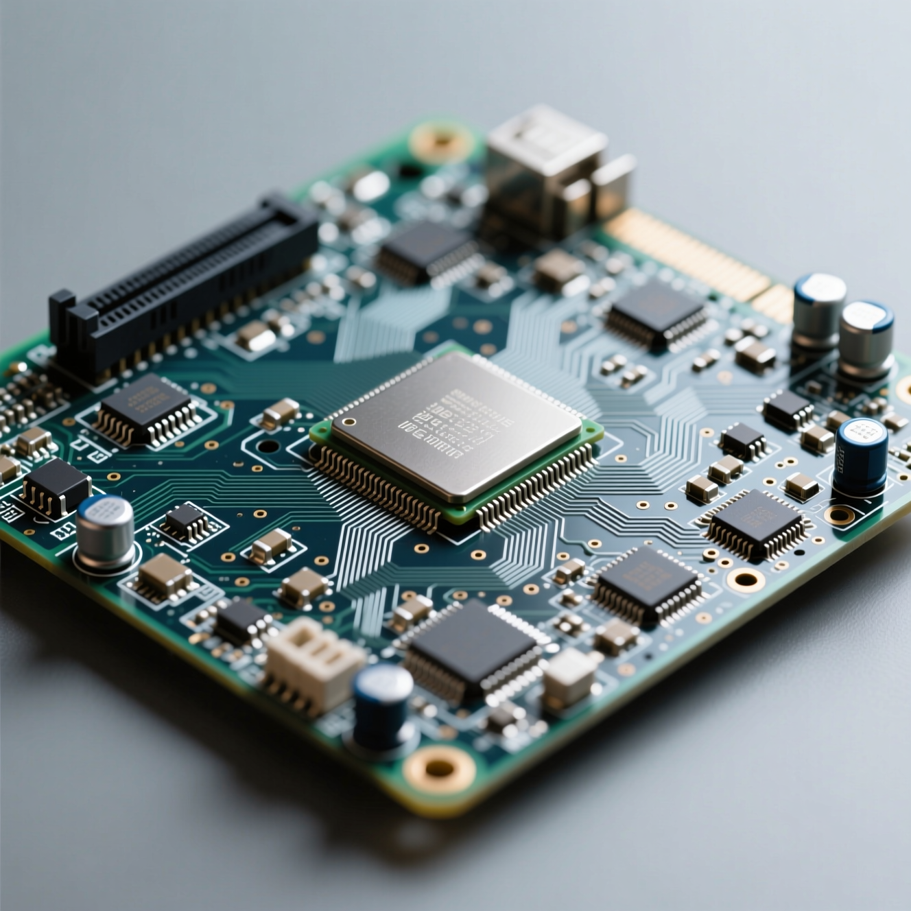
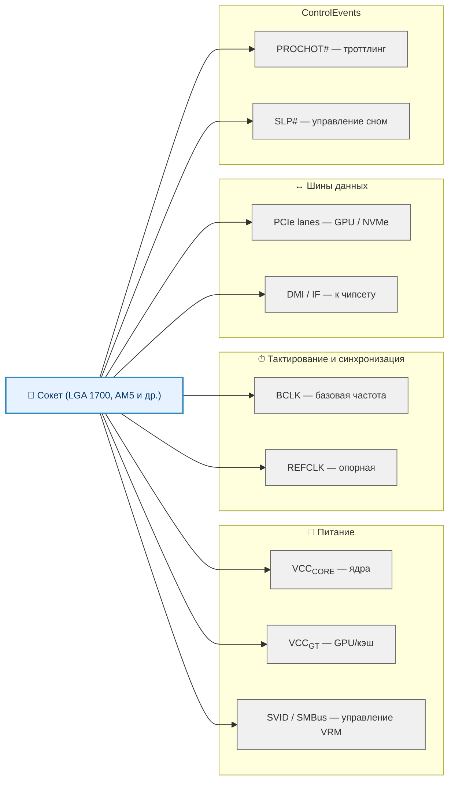
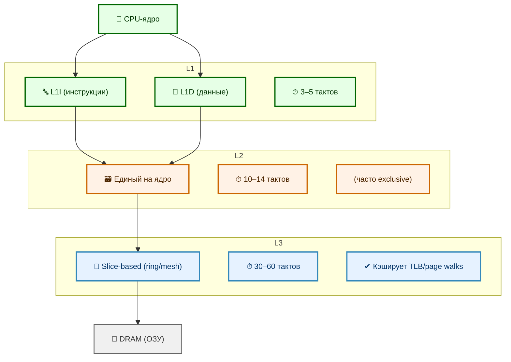

---
title: 1.08. Базовое железо
---

# 1.08. Базовое железо

  ОБЯЗАТЕЛЬНО
  ДЛЯ НОВИЧКОВ
  НЕ ДЛЯ НОВИЧКОВ
  В РАЗРАБОТКЕ

Инженеру

📖 Оглавление

1. [Базовое железо](#базовое-железо)  
2. [А теперь поехали погружаться](#а-теперь-поехали-погружаться)  
3. [Центральный процессор](#центральный-процессор)  
4. [Оперативная память](#оперативная-память)  

## Базовое железо

  
Важно

  Здесь мы рассмотрим всё в двух частях - лёгкой и тяжелой. Легкую - обязательно.

Самое важное – материнская плата, это и есть компьютер, главная печатная плата, которая соединяет все компоненты между собой, обеспечивает питание и управление устройствами.

Материнская плата — это как центральный вокзал большого города. Поезда (данные) прибывают и отправляются на разные направления: к процессору, к памяти, к диску, к монитору. Железнодорожные пути — это дорожки на плате. Диспетчерская вышка — чипсет. Без вокзала поезда не смогут ни прибыть, ни отправиться, даже если сами локомотивы и вагоны исправны.

Её ключевые компоненты:
- Чипсет (Chipset) – диспетчер данных между CPU, RAM и периферией;
- Сокет (Socket) – разъем для процессора;
- Слоты RAM (ОЗУ) – разъём для оперативной памяти;
- PCIe-слоты для видеокарт, NVMe-дисков, Wi-Fi адаптеров;
- M.2 – разъём для NVMe-дисков;
- SATA – разъём для HDD и SSD;
- VRM (Voltage Regulator Module) – преобразователь напряжения для CPU;
- BIOS/UEFI – мини-операционная система для настройки железа, разгона устройств, включения и отключения компонентов;
- USB, HDMI, DisplayPort, Ethernet и аудио (3.5mm) разъемы для периферии.

★ Процессор (ЦП, CPU):

- выполняет инструкции программ (именно он отвечает за вычисления, счеты, сравнения и прочее);
- тактовая частота обозначает количество операций в секунду;
- ядра – единицы «работников-вычислителей»;
- кэш-память – временное хранилище для быстрого доступа к данным.

★ Оперативная память (RAM, ОЗУ):

- выполняет роль временного хранилища для программ и данных;
- быстрее даже самого быстрого диска SSD;
- при выключении память стирается – потому память временная;
- объем памяти – характеристика, обозначающая максимальный размер временного хранилища;
- частота – количество операций в секунду.

То есть, всё подключается в материнскую плату.

Это, в принципе, база.

---

## А теперь поехали погружаться.

  
Важно

  Это тяжелая часть, посвящённая более глубокому погружению. Можете вернуться к этому разделу позже.

Компьютер — строго организованная иерархическая система, в которой каждый компонент выполняет строго определённую роль, а взаимодействие между ними регулируется аппаратными и логическими протоколами. Материнская плата (*motherboard*, *mainboard*) — это физическая и логическая основа такой системы. Она представляет собой многослойную печатную плату, на которой реализована *топология шин*, *схемы управления питанием*, *логика маршрутизации сигналов* и *интерфейсы сопряжения*. Без неё остальные компоненты остаются несвязанными «островами» — даже если физически подключить процессор к памяти напрямую, система не сможет инициировать загрузку, поскольку отсутствует управляющая логика инициализации, синхронизации и передачи данных.

Материнская плата — это *аппаратный эквивалент операционной системы*: она отвечает за жизненный цикл компьютера до момента передачи управления загрузчику. Её проектирование — компромисс между совместимостью, производительностью, расширяемостью и стоимостью. Архитектура платы определяет то, какие компоненты можно установить *сегодня*, и как система будет развиваться в ближайшие годы.

---

### 1. Чипсет

  
Важно

  Чипсет — это городской центр управления коммунальными службами. Он не управляет заводами (процессором) или складами (памятью), но следит за лифтами (USB), светофорами (SATA), системой отопления (вентиляторами) и почтой (Wi-Fi). Если в одном районе прорвало трубу, центр изолирует проблему, чтобы остальной город продолжал работать.

Чипсет — это интегральная схема (или набор схем), реализующая функции *южного* и *северного мостов* (в классической архитектуре) или, в современных системах, *Platform Controller Hub* (PCH) в связке с встроенным в процессор *Memory Controller Hub* (MCH). Термин «чипсет» устарел в буквальном смысле — в процессорах Intel начиная с архитектуры Sandy Bridge (2011) и AMD с Zen (2017) функции северного моста (в первую очередь, контроллер памяти и PCIe-контроллер первого уровня) перенесены внутрь CPU. Однако осталась потребность в *системном контроллере*, обеспечивающем взаимодействие с периферийными устройствами. 

В современных платформах чипсет — это именно PCH, который:

- реализует *низкоскоростные* и *среднескоростные* интерфейсы: SATA, USB 2.0/3.x, LPC (Low Pin Count), SPI (для BIOS/UEFI), аудио (HDA — High Definition Audio), Ethernet (часто через интегрированный PHY), а также управление вентиляторами и датчиками температуры;
- предоставляет *дополнительные линии PCIe* (обычно поколения ниже, чем у CPU: например, CPU даёт PCIe 5.0 x16 для видеокарты, а чипсет — PCIe 4.0 x4 для M.2 или сетевых адаптеров);
- выступает посредником в арбитраже доступа к шине: когда несколько устройств одновременно запрашивают передачу данных (например, SSD и Wi-Fi), чипсет разрешает конфликты, распределяя пропускную способность шины DMI (Direct Media Interface у Intel) или Infinity Fabric Link у AMD;
- обеспечивает *резервирование и изоляцию*: сбой в USB-контроллере не должен приводить к остановке работы CPU или памяти — чипсет физически и логически разделяет домены питания и сигнализации.

Важно понимать: чипсет — *интеллектуальный маршрутизатор данных*. Его пропускная способность (например, DMI 4.0 ×8 у Intel 700-й серии — ~16 ГБ/с) часто становится узким местом в системах с множеством высокоскоростных NVMe-дисков, подключённых через чипсет, а не напрямую к процессору.

---

### 2. Сокет процессора

Сокет — стандартизированный многоконтактный разъём*, обеспечивающий:

- механическую фиксацию CPU (обычно через поворотный рычаг — *retention mechanism*);
- электрическое соединение между контактами процессора и трассировкой платы (каждый контакт — отдельная линия сигнала, питания или земли);
- совместимость в рамках поколения (например, сокет LGA 1700 поддерживает процессоры Intel 12‑го, 13‑го и 14‑го поколений, но не 11‑го или 15‑го — из-за изменения расположения контактов и требований VRM).

Количество контактов (pin count) определяется сложностью интерфейса: для современных x86-процессоров оно превышает 1700 (LGA 1700 — 1700 контактов на плате, 1800+ на процессоре, т.к. часть контактов — «пустые» для механической стабильности). Каждая группа контактов отвечает за определённую функцию:
- линии питания ядер (VCCCORE) и кэша (VCCGT);
- линии тактового генератора (BCLK);
- линии PCIe (для связи с видеокартой и NVMe);
- линии DMI/Infinity Fabric (к чипсету);
- линии управления (PROCHOT#, SVID, SMBus для VRM).

Замена процессора возможна *только* при совпадении сокета и совместимости чипсета. Часто производители вводят искусственные ограничения: например, старые чипсеты Z690 формально могут поддерживать 14‑е поколение Intel, но требуют обновления микрокода UEFI, который может отсутствовать в BIOS у бюджетных плат. Таким образом, сокет — это *аппаратная граница поколений*.

---

### 3. Слоты оперативной памяти

Слоты для модулей ОЗУ (DIMM — Dual In-line Memory Module) реализуют *точку подключения к высокоскоростной шине памяти*, управляемой встроенным в CPU контроллером. Ключевые аспекты:

- **Топология**: в современных системах используется *T-топология* или *daisy-chain* (зависит от поколения DDR и производителя). При T-топологии сигнал от контроллера разветвляется к двум DIMM на канале — это позволяет гибче настраивать тайминги, но снижает максимальную частоту. Daisy-chain (последовательное соединение) даёт более предсказуемую сигнал-интегрити, но чувствительна к нагрузке от второго модуля.
- **Канальность**: двухканальный режим активируется при установке модулей в слоты одного цвета (обычно чётные/нечётные). Это удваивает пропускную способность шины памяти, но **не ускоряет однопоточные задачи** — ускорение проявляется только при параллельном доступе к памяти (например, в СУБД, видеокодировании, виртуализации).
- **Поддерживаемые типы**: DDR4 и DDR5 физически несовместимы (ключ на модуле смещён), электрически отличаются напряжением (1.2 В vs 1.1 В), частотой тактового сигнала (базовый CLK у DDR4 — до 200 МГц, у DDR5 — до 500 МГц), а также наличием встроенного PMIC (Power Management IC) на модуле DDR5 — он стабилизирует питание *локально*, что критично при высоких частотах.

Важно: объём слотов не означает, что все они могут использоваться одновременно на максимальной частоте. Например, при четырёх установленных DDR5-модулях частота может снизиться с 6000 МГц до 4800 МГц из-за увеличенной ёмкостной нагрузки на шину.

---

### 4. Слоты расширения

  
Важно

  PCIe — это магистраль с несколькими полосами. Видеокарта — грузовик, которому нужны все 16 полос. NVMe-диск — спортивный автомобиль, ему хватит 4 полос. M.2 — это не тип дороги, а форма въездного шлагбаума: он может вести либо на магистраль (PCIe), либо на местную улицу (SATA). SATA — это старая, но надёжная улица с ограничением скорости 600 МБ/с.

Современная материнская плата предоставляет несколько *физических форм-факторов* для подключения устройств хранения и расширения, но все они, в конечном счёте, используют *PCI Express* как транспортный протокол — за исключением SATA, который сохраняет собственную шину.

- **PCIe-слоты** (Peripheral Component Interconnect Express) — это *точки подключения к линиям PCIe*, выделенным либо процессором, либо чипсетом. Каждая линия (lane) — это дуплексный дифференциальный канал (отправка и приём по отдельным парам проводников). Ширина слота (x1, x4, x8, x16) обозначает *максимальное* количество линий, но *реальное* количество может быть ограничено: например, слот x16 может работать в режиме x8, если M.2-слот, подключённый к тем же линиям CPU, активен.  
  Версии PCIe (3.0, 4.0, 5.0) определяют *битрейт на линию*:  
  - PCIe 3.0: ~985 МБ/с на линию (x16 ≈ 15.75 ГБ/с)  
  - PCIe 4.0: ~1.97 ГБ/с на линию (x16 ≈ 31.5 ГБ/с)  
  - PCIe 5.0: ~3.94 ГБ/с на линию (x16 ≈ 63 ГБ/с)  
  Пропускная способность *всех* PCIe-устройств ограничена суммарной шириной линий CPU и PCH.

- **M.2** — это *форм-фактор*. Разъём M.2 может поддерживать:
  - PCIe ×4 (для NVMe-накопителей, до ~7 ГБ/с в PCIe 4.0);
  - SATA (до ~600 МБ/с);
  - USB, PCIe ×2, даже Wi-Fi (через спецификацию M.2 Key E или A+E).
  Ключи (B, M, B+M) определяют, какие сигналы доступны. Например, Key M — это PCIe ×4 + SATA, Key B — SATA + PCIe ×2. Некоторые M.2-слоты используют линии PCIe *от чипсета*, а не от CPU — это даёт совместимость, но потенциальную задержку и конкуренцию за DMI-шину.

- **SATA** (Serial ATA) — устаревающий, но всё ещё востребованный интерфейс, обеспечивающий до 6 Гбит/с (около 550 МБ/с после кодирования 8b/10b). Преимущества: низкая стоимость контроллера, проверенная надёжность, поддержка *hot-swap* (в серверных версиях), совместимость с HDD. Недостатки: последовательные команды (не параллельные, как NVMe), высокая задержка (до 6 мс у HDD), отсутствие масштабируемости (максимум 6 устройств на чипсет без расширителей).

---

### 5. VRM

Voltage Regulator Module (VRM) — это *многофазный импульсный преобразователь напряжения*, обеспечивающий стабильное и точно регулируемое питание процессора. Современные CPU потребляют до 350 Вт в пике (например, Intel Core i9-14900K), при этом напряжение ядра колеблется в диапазоне 0.8–1.4 В. 

  
Важно

  VRM — это система водоснабжения для микрогорода (процессора). Она берёт грубую воду из главной трубы (12 В от блока питания) и превращает её в чистую, стабильную, с точно заданным давлением (1 В ± 25 мВ). Если в городе внезапно включат тысячи душей (процессор загрузился на 100 %), система должна мгновенно поднять давление, не допустив перебоев.

VRM должен:

- преобразовывать 12 В от блока питания в ~1 В с точностью ±25 мВ;
- обеспечивать ток до 200+ А без просадок;
- динамически регулировать напряжение в микросекундном масштабе (в ответ на изменение нагрузки — *Loadline Calibration*);
- распределять нагрузку между фазами (например, 10+2+1 — 10 фаз для ядер, 2 для кэша, 1 для встроенной графики), чтобы избежать перегрева отдельных компонентов.

Ключевые компоненты VRM:
- **PWM-контроллер** — «мозг», управляющий скважностью импульсов и синхронизацией фаз;
- **драйверы MOSFET** — усиливают управляющий сигнал;
- **MOSFET-транзисторы** (обычно в паре *high-side* и *low-side*) — ключевые элементы коммутации;
- **дроссели (катушки индуктивности)** и **конденсаторы** — сглаживают пульсации.

Качество VRM напрямую влияет на стабильность разгона, температуру CPU и долговечность системы. Бюджетные платы могут использовать 4‑фазные VRM без радиаторов — при длительной нагрузке это приводит к троттлингу даже без изменения частоты CPU (т.н. *VRM throttling*).

---

### 6. BIOS/UEFI

  
Важно

  UEFI — это управляющий инженер, который приходит на завод до запуска основного производства. Он проверяет, все ли станки на месте, включает электричество, настраивает давление в трубах, проверяет чертежи. Только убедившись, что всё готово, он передаёт ключ от завода операционной системе — главному директору.

BIOS (Basic Input/Output System) — устаревший термин. Современные системы используют **UEFI** (Unified Extensible Firmware Interface) — стандартизированный интерфейс между аппаратным обеспечением и загрузчиком ОС. Его функции:

- **POST (Power-On Self-Test)** — диагностика базовых компонентов (CPU, RAM, видеокарта), инициализация контроллеров;
- **перечисление устройств** (enumeration) по шинам PCIe, USB, SATA — построение дерева устройств;
- **загрузка микрокода CPU** — обновление внутренней микропрограммы процессора до старта ОС (микрокод исправляет аппаратные баги);
- **настройка таймингов памяти** (XMP/EXPO), напряжений (VDD, VDDQ), частот (BCLK, множителей);
- **безопасная загрузка** (Secure Boot) — проверка цифровой подписи загрузчика;
- **режим совместимости** (CSM — Compatibility Support Module) — эмуляция BIOS для старых ОС.

UEFI — это полноценная 32‑ или 64‑битная среда с драйверами устройств, графическим интерфейсом, сетевым стеком (для UEFI-сетевой загрузки) и даже встроенными утилитами (например, Q-Flash у Gigabyte). Размер образа UEFI может превышать 64 МБ, хранится во флеш-памяти SPI (обычно 128–256 МБ), доступной для обновления по USB без ОС.

---

## Центральный процессор

Центральный процессор (Central Processing Unit, CPU) — это *специализированный конечный автомат, реализованный в кремнии*, предназначенный для последовательного (или псевдопараллельного) исполнения машинных инструкций. Его функция — трансляция абстрактных действий («сложить два числа», «перейти по адресу», «сохранить значение в память») в электрические сигналы, управляющие потоками данных между регистрами, кэшами и шинами. Архитектура CPU определяет энергоэффективность, масштабируемость и совместимость с программным стеком.

  
Важно

  Представьте повара на кухне. Он получает рецепт (программу), читает шаг за шагом (выборка инструкций), готовит ингредиенты (декодирование), смешивает их (выполнение), пробует на вкус (запись результата). Если один рецепт требует ждать, пока закипит вода, повар может начать готовить другой — так работает внеочередное исполнение.

---

### 1. Исполнительный конвейер

Современный CPU работает по принципу *конвейерной обработки* (pipelining), при котором выполнение одной инструкции разбивается на несколько стадий (stages), а новые инструкции подаются на вход конвейера до завершения предыдущих. Классическая 5‑ступенчатая модель RISC (`Fetch → Decode → Execute → Memory Access → Write-back`) в x86 реализована в значительно более сложной форме — до 14–19 стадий у Intel Core (например, Sunny Cove или Raptor Cove). Каждая стадия требует строгой синхронизации по тактовому сигналу; сбой на любой стадии (например, промах кэша на стадии Memory Access) приводит к *опустошению конвейера* (pipeline flush) и потере десятков тактов.

Ключевые подсистемы внутри CPU:

- **Front-end (блок выборки и декодирования)**  
  Отвечает за загрузку инструкций из памяти (обычно из L1I-кэша), их декодирование в *микрооперации* (μops — внутренний RISC-подобный формат Intel/AMD), а также *предсказание ветвлений* (branch prediction). Современные предикторы используют глобальные и локальные таблицы истории (Global History Buffer, Pattern History Table) и могут достигать точности >95 % — иначе каждый промах по условному переходу стоил бы 10–20 тактов задержки.

- **Out-of-Order Execution Engine (движок внеочередного исполнения)**  
  Позволяет выполнять инструкции по мере готовности операндов. Для этого используется:
  - *Reorder Buffer (ROB)* — буфер переупорядочения, хранящий μops до их фиксации;
  - *Reservation Station* — очередь готовых к исполнению μops;
  - *Register Alias Table (RAT)* — таблица переименования регистров, исключающая ложные зависимости (WAR/WAW hazards).  
  Например, если инструкция `ADD R1, R2, R3` ждёт загрузки `R2` из памяти, движок может выполнить последующую `MUL R4, R5, R6`, если `R5` и `R6` уже готовы. Это критически важно для насыщения исполнительных блоков.

- **Execution Units (исполнительные блоки)**  
  Набор специализированных ALU (арифметико-логических устройств):  
  - Integer ALU — для целочисленных операций (+, –, AND, OR, сдвиги);  
  - FP/SIMD Unit — для операций с плавающей точкой (FPU) и векторных инструкций (AVX‑512, AVX2);  
  - Load/Store Unit — управляет доступом к кэшам и шине памяти;  
  - Branch Unit — фиксирует результаты предсказаний ветвлений.  
  Современные CPU содержат 4–8 ALU на ядро, 2–4 FP-блока, что позволяет выполнять до 6–8 μops за такт при идеальных условиях.

- **Back-end (блок записи и синхронизации)**  
  Отвечает за *фиксацию* (retirement) результатов в архитектурные регистры в порядке программы, несмотря на внеочередное исполнение. Только на этой стадии изменения становятся видимыми для других инструкций и ядер.
  
---

### 2. Тактовая частота

  
Важно

  Тактовая частота — это количество ударов метронома в секунду. Один повар может делать два движения за удар, а другой — пять. Даже если метроном у обоих бьёт с одинаковой скоростью, второй повар приготовит блюдо быстрее. Частота задаёт ритм, но не определяет, сколько работы выполняется за один такт.

Тактовая частота (clock frequency) — это частота основного генератора, синхронизирующего работу логических ячеек CPU. Однако её значение **не пропорционально производительности** напрямую. Причины:

- **IPC (Instructions Per Cycle)** — среднее количество инструкций, выполняемых за такт. Два CPU с одинаковой частотой могут отличаться в 2 раза по IPC из-за различий в глубине конвейера, ширине исполнительных блоков, эффективности предсказания ветвлений. Например, архитектура ARM Cortex‑A78 имеет IPC на ~30 % выше, чем A76, при той же частоте.
- **Тепловые и энергетические ограничения**. Частота динамически регулируется подсистемой *DVFS* (Dynamic Voltage and Frequency Scaling): при росте нагрузки увеличивается напряжение и частота (boost), при перегреве — снижается (throttling). Пиковая частота (например, 5.8 ГГц у Intel Core i9‑14900K) достигается лишь на 1–2 ядрах на короткий интервал; в многопоточной нагрузке частота падает до 4.0–4.5 ГГц.
- **Взаимосвязь с напряжением**. Потребляемая мощность растёт пропорционально *V²·f* (напряжение в квадрате × частота). Повышение частоты на 10 % требует роста напряжения на ~5 %, что даёт рост мощности на ~21 % — нелинейность, ограничивающая масштабируемость.

Таким образом, частота — это *управляющий параметр*, а не *мера мощи*. Реальная производительность определяется комбинацией IPC, частоты, количества ядер и эффективности взаимодействия с памятью.

---

### 3. Многоядерность и гиперпоточность

Современные CPU содержат от 2 до 128+ ядер. Однако рост числа ядер **не гарантирует линейного роста производительности**. Ограничивающие факторы:

- **Параллелизуемость задачи (закон Амдала)**. Если 20 % кода последовательно, теоретический максимум ускорения при ∞ ядрах — 5×. Большинство настольных приложений (браузеры, редакторы) имеют параллельность 4–8×.
- **Общие ресурсы**: кэш последнего уровня (LLC), шина памяти, контроллер PCIe. При 16 ядрах конкуренция за LLC может увеличить latency доступа к данным на 40–60 % по сравнению с 4 ядрами.
- **Межъядерная синхронизация**: атомарные операции (CAS, LOCK), барьеры памяти (mfence), кэш-когерентность (MESI/MOESI-протоколы) создают задержки при интенсивном обмене данными.

**Hyper-Threading (SMT — Simultaneous Multithreading)** — технология, позволяющая одному физическому ядру выполнять 2 (редко — 4) потока инструкций одновременно. Это достигается за счёт:
- дублирования *архитектурных состояний* (регистров, ROB, RAT);
- совместного использования *исполнительных блоков*, кэшей и шин.

  
Важно

  Представьте кассира в супермаркете. У него один сканер, одна лента, но два клиента стоят рядом. Один клиент копается в кошельке — кассир временно переключается на второго, пробивает его товары, а потом возвращается к первому. Это и есть гиперпоточность: один «рабочий пункт» обслуживает два потока, чередуя их в паузах. Но если оба клиента одновременно подадут корзины — кассир не станет быстрее, он просто будет путаться.

Эффект: при не насыщенных исполнительных блоках (например, поток ждёт данных из памяти) второй поток может использовать простаивающие ALU. Прирост производительности — 15–30 % в многопоточных, нечувствительных к latency задачах (кодирование видео, рендеринг); в высокочастотных, latency-критичных сценариях (HFT, low-latency gaming) SMT может *снизить* производительность из-за конкуренции за ресурсы.

---

### 4. Иерархия кэш-памяти

Кэш-память — это высокоскоростная статическая память (SRAM), встроенная в кристалл CPU, предназначенная для сокращения latency доступа к данным по сравнению с DRAM (ОЗУ). Архитектура кэшей строится по принципу *вложенности* (inclusive/exclusive policies) и *локальности* (пространственной и временной).

Типичная иерархия у x86 (на примере Intel Core):

- **L1 (Level 1)**  
  - Разделяется на *L1I* (инструкции) и *L1D* (данные), по 32–48 КБ на ядро;  
  - Latency: 3–5 тактов;  
  - Ассоциативность: 8-way set associative;  
  - Физически находится в непосредственной близости от исполнительных блоков.

- **L2 (Level 2)**  
  - Единый кэш на ядро (512 КБ – 2 МБ);  
  - Latency: 10–14 тактов;  
  - Часто exclusive по отношению к L1 (данные в L2 отсутствуют в L1), что увеличивает эффективную ёмкость.

- **L3 (Level 3, Last-Level Cache, LLC)**  
  - Общий для всех ядер (16–128 МБ);  
  - Latency: 30–60 тактов (зависит от количества ядер и топологии кристалла);  
  - Реализован как *sliced cache*: каждый «кусок» физически привязан к определённому кластеру ядер (например, в Intel CCD — 8 ядер + 32 МБ L3), а доступ «чужому» slice’у идёт через межсоединение (ring bus или mesh).  
  - Используется для кэширования *страниц таблицы трансляции* (TLB misses → page walks → L3 cache hits).

Ключевой параметр — *miss rate* (частота промахов). Даже 1 % промахов в L3 приводит к обращению к DRAM с latency `~`100 нс (≈300 тактов при 3 ГГц), что в 50–100 раз медленнее L1. Таким образом, кэши — это *механизм смягчения асимметрии скоростей*: без них современные CPU простаивали бы `>90` % времени.

  
Важно

  Кэш-память — это система ящиков на рабочем столе повара:

	- L1 — карманы на фартуке: самые быстрые, но вмещают лишь пару ингредиентов;
	- L2 — полка над плитой: чуть дальше, но уже целая тарелка специй;
	- L3 — общий холодильник на кухне: до него идти дольше, но там хранятся все основные продукты.

	Если нужного ингредиента нет в кармане, повар проверяет полку, потом холодильник. Только если и там нет — идёт в кладовую (оперативная память).
	
	Кэш-промах — это как поиск ключей от машины. Вы проверяете карман (L1) — нет. Смотрите на полке у входа (L2) — тоже нет. Заглядываете в ящик тумбочки (L3) — опять нет. Тогда вы идёте в гараж (оперативная память), где ключи лежат в коробке с другими вещами. Поиск в гараже занимает 50 раз дольше, чем проверка кармана. Современные программы стараются «класть ключи всегда в карман», чтобы избежать таких походов.

---

### 5. Взаимодействие с внешним миром

CPU не существует изолированно. Его производительность лимитируется *скоростью обмена данными*:

- **Шина памяти (Memory Bus)**  
  Управляется встроенным *Memory Controller* (с 2003 г. у AMD, с 2008 г. у Intel). Современные контроллеры поддерживают двухканальный (dual-channel) и четырёхканальный (quad-channel) режимы, что удваивает/учетверяет пропускную способность. Однако latency остаётся высоким (~60–80 нс), и его нельзя «ускорить» частотой — только уменьшением физического расстояния (HBM, 3D-stacking).

- **PCIe-интерфейс**  
  CPU предоставляет «корневые» линии PCIe (обычно 16–24), напрямую подключённые к видеокарте и первому M.2-слоту. Эти линии обходят чипсет, что снижает latency и избавляет от конкуренции за DMI-шину. В серверных CPU (AMD EPYC, Intel Xeon Scalable) количество линий достигает 128 (PCIe 5.0), что позволяет строить системы с 8+ GPU без бутылочного горлышка.

- **Когерентность кэшей (Cache Coherence)**  
  При наличии нескольких CPU (multiprocessor) или NUMA-узлов (Non-Uniform Memory Access) требуется протокол, гарантирующий согласованность данных в кэшах. Используется *MESI* (Modified, Exclusive, Shared, Invalid) или его расширения (MOESI, MESIF). Например, при записи в ядре A данные в ядре B автоматически инвалидируются (Invalidate), либо передаются напрямую (Cache-to-Cache transfer), если поддерживаются. Это добавляет overhead, но критически важно для корректности.

---

## Оперативная память

Оперативная память (Random Access Memory, RAM) — это *энергозависимое полупроводниковое устройство хранения*, предназначенное для обеспечения процессора и его подсистем (например, встроенной графики) данными и инструкциями с минимальной задержкой. Несмотря на кажущуюся простоту функции — «временное хранилище» — RAM является центральным звеном в системе балансировки скорости, ёмкости и стоимости. Её архитектура определяет *latency-чувствительность* всей вычислительной системы.

  
Важно

  Оперативная память — это рабочий стол программиста. На нём лежат открытые файлы, черновики, заметки — всё, что нужно прямо сейчас. Когда компьютер выключается, стол очищается. Жёсткий диск — это шкаф рядом: там хранится всё, но доставать оттуда медленнее. Чем больше стол (объём RAM), тем больше задач можно выполнять одновременно без постоянного хождения к шкафу.

---

### 1. Физическая основа

Современная ОЗУ реализована на основе *динамической памяти с произвольным доступом* (DRAM — Dynamic RAM). В отличие от статической памяти (SRAM, используемой в кэшах), DRAM хранит бит информации в виде *электрического заряда на конденсаторе*, управляемого одним транзистором (1T1C-ячейка). Эта конструкция обеспечивает высокую плотность упаковки (до 16 Гбит на чип у DDR5), но вводит фундаментальное ограничение: **заряд конденсатора со временем утекает**.

Поэтому DRAM требует *периодического обновления* (refresh) — процесса, при котором контроллер памяти считывает заряд каждой строки (row) и записывает его обратно, восстанавливая уровень. Интервал обновления стандартизирован: JEDEC требует полного обновления всех строк за 64 мс. При частоте 3200 МГц это означает, что `~1` % тактов тратится на refresh-циклы — невидимая, но реальная «налоговая» нагрузка на пропускную способность.

  
Важно

  DRAM — как аквариум с рыбками, где вода постоянно испаряется. Каждые несколько секунд нужно доливать воду, чтобы рыбы не погибли. Контроллер памяти — это автоматический насос, который каждые 64 миллисекунды «доливает» заряд в каждую ячейку. Пока идёт доливка, новые запросы ждут в очереди. Это незаметно в обычной работе, но в высоконагруженных системах такие паузы складываются в реальную потерю производительности.

Структура банка памяти (bank) устроена иерархически:
- **Чип (die)** → объединяется в **ранг (rank)** (обычно 8 чипов для 64‑битной шины + 8 бит ECC);
- **Ранг** состоит из **банков (banks)** — независимых матриц;
- **Банк** — это двумерная матрица строк (rows) и столбцов (columns);
- **Строка** — группа ячеек, активируемая одновременно (page);
- **Столбец** — отдельный бит в строке.

Доступ к данным происходит по принципу *RAS → CAS* (Row Address Strobe → Column Address Strobe):
1. Активация строки (Activate) — открытие «страницы» в банке (latency: tRCD);
2. Чтение/запись столбца (Read/Write) — выбор данных внутри страницы (latency: tCAS);
3. Предзарядка (Precharge) — закрытие строки для последующей активации (latency: tRP).

Если следующий запрос адресован *той же строке*, этап 1 и 3 пропускается — это *page hit*, и latency падает в 2–3 раза. Именно поэтому современные аллокаторы памяти (например, jemalloc) стремятся к *пространственной локальности*: размещение связанных данных в пределах одной страницы DRAM.

---

### 2. DDR-интерфейс

  
Важно

  DDR работает как двухполосная дорога, где машины едут по обеим полосам одновременно — и по зелёному, и по красному сигналу светофора. Это позволяет удвоить поток машин без увеличения скорости каждой. Тайминги — это минимальное расстояние между машинами, чтобы не было аварий. Чем выше скорость, тем больше нужно дистанции, но общая пропускная способность всё равно растёт.

Современные модули ОЗУ используют интерфейс *DDR* (Double Data Rate) — передачу данных по обоим фронтам тактового сигнала (rising и falling edge). Это позволяет удвоить эффективную частоту без увеличения тактовой частоты шины. Например, DDR4‑3200 имеет базовую частоту 1600 МГц, но передаёт 3200 MT/s (MegaTransfers per second).

Ключевые поколения и их различия:

| Параметр          | DDR3               | DDR4                     | DDR5                         |
|-------------------|--------------------|--------------------------|------------------------------|
| Напряжение (VDD)  | 1.5 В (1.35 В LV) | 1.2 В                    | 1.1 В                        |
| Базовая частота   | до 1066 МГц        | до 1600 МГц              | до 5000 МГц (JEDEC)          |
| Эффективная частота | до 2133 МТ/с      | до 3200 МТ/с             | до 6400 МТ/с (и выше)        |
| Ширина шины       | 64 бит             | 64 бит                   | 64 бит (но разделена на 2×32)|
| Чипы на ранг      | 8                  | 8                        | 8 (но с x8/x16 организацией)|
| Архитектура банка | 8 банков           | 16 банков                | 32 банков (8 групп × 4)      |
| Управление питанием| Внешнее (на плате) | Внешнее                  | **PMIC на модуле** (12 В `→` 1.1 В) |

Особенности DDR5:
- **Двухканальный режим на уровне модуля**: каждый модуль DDR5 разделяет 64‑битную шину на два независимых 32‑битных канала (с отдельными командными шинами), что улучшает параллелизм и снижает нагрузку на контроллер.
- **On-Die ECC**: коррекция ошибок на уровне чипа (не путать с системным ECC), что повышает надёжность без потери производительности.
- **Adaptive Refresh Management (ARM)**: динамическая настройка частоты refresh в зависимости от температуры (при +85°C refresh учащается в 2 раза).

---

### 3. Тайминги

Тайминги (например, 16‑18‑18‑36) — *реальные задержки в тактах*, определяемые физическими свойствами DRAM. Расшифровка основных:
- **tCL (CAS Latency)** — задержка между командой чтения и появлением первых данных;
- **tRCD (RAS to CAS Delay)** — время между активацией строки и доступом к столбцу;
- **tRP (Row Precharge Time)** — время закрытия строки;
- **tRAS (Row Active Time)** — минимальное время, в течение которого строка должна оставаться открытой.

  
Совет

  Представьте два грузовика:

	- Первый едет медленно (60 км/ч), но возит по одной коробке каждые 15 секунд.
	- Второй мчится (120 км/ч), но загружает коробку только каждые 18 секунд.
	
	Хотя второй грузовик быстрее, его «задержка между отправками» чуть выше. Однако за час он доставит вдвое больше коробок — потому что скорость компенсирует паузу. Так работает память: высокая частота снижает абсолютную задержку, даже если тайминги в тактах растут.

Важно: при увеличении частоты тайминги в тактах растут, но их *абсолютное значение в наносекундах* может снижаться. Например:
- DDR4‑2133, tCL=15 `→` 15 / (2133/2) `≈` 14.07 нс  
- DDR4‑3600, tCL=18 `→` 18 / (3600/2) `≈` 10.00 нс  

Таким образом, более «высокие» тайминги при высокой частоте могут давать *меньшую latency*, чем низкие при низкой частоте. Оптимальное соотношение определяется *bandwidth-latency trade-off*: для игровых и интерактивных приложений важнее низкая latency, для HPC и СУБД — высокая пропускная способность.

---

### 4. Роль в системной архитектуре

RAM — это *активный участник управления памятью*. Современные ОС используют её в связке с MMU (Memory Management Unit) для реализации:
- **Виртуальной памяти**: отображение виртуальных адресов (48‑ или 57‑битных) в физические через многоуровневые таблицы страниц (page tables);
- **Copy-on-Write (CoW)**: при fork() дочерний процесс разделяет страницы с родителем до первой записи;
- **Memory-mapped I/O**: отображение файлов в адресное пространство процесса (mmap), что устраняет копирование через буферы ядра.

  
Важно

  NUMA — это как офисное здание с двумя крыльями. В каждом крыле свой принтер, своя кухня, свои сотрудники. Если сотрудник из левого крыла хочет распечатать документ, он идёт к своему принтеру — быстро. Но если он решит использовать принтер в правом крыле, ему придётся пройти через весь холл, подождать лифт, найти нужный этаж — это займёт вдвое больше времени. ОС старается назначать задачи «местным» ресурсам, чтобы не тратить время на «переходы между крыльями».

На многосокетных системах (серверы) возникает модель **NUMA** (Non-Uniform Memory Access): каждый CPU имеет *локальную* память (через свой контроллер) и *удалённую* (через межпроцессорное соединение — Infinity Fabric, UPI). Доступ к удалённой памяти может быть в 1.5–2.5 раза медленнее. ОС и приложения (например, PostgreSQL, SAP HANA) должны учитывать топологию NUMA при размещении потоков и данных.

---

### 5. Взаимодействие с CPU

Встроенный в CPU *Memory Controller* (IMC) — это ASIC, отвечающий за:
- преобразование логических запросов (load/store) в последовательность RAS/CAS-команд;
- арбитраж запросов от ядер, PCIe-устройств (DMA), встроенной графики;
- балансировку нагрузки между рангами и банками;
- поддержку режимов (single/dual/quad-channel), ECC, XMP/EXPO.

Пропускная способность (bandwidth) определяется по определённой формуле. Однако *реальная* пропускная способность в приложениях редко превышает 70–80 % от теоретической из-за:
- неоптимальных паттернов доступа (random vs sequential);
- bank conflicts (запросы к одному банку подряд);
- refresh overhead;
- задержек контроллера.

Критически важно: **latency памяти — основной лимитер производительности в latency-bound приложениях** (компиляторы, интерпретаторы, OLTP-базы данных). Уменьшение tCAS с 18 до 14 при той же частоте может дать прирост до 8 % в таких сценариях — без изменения IPC или тактовой частоты CPU.

---

### 6. Энергетика и надёжность

Оперативная память — второй по потреблению компонент после CPU и GPU. DDR5 снижает напряжение, но увеличивает количество чипов и частоту, поэтому суммарное потребление может быть сопоставимо с DDR4. В серверных системах используется:
- **ECC (Error-Correcting Code)** — 8 дополнительных бит на 64‑битное слово, позволяющие исправлять однобитовые ошибки и обнаруживать двухбитовые (SECDED — Single Error Correction, Double Error Detection);
- **Chipkill** — расширенная ECC, выдерживающая сбой целого чипа в ранге;
- **Memory Patrol Scrubbing** — фоновое сканирование памяти на ошибки.

В потребительских системах ECC обычно отсутствует, что делает их уязвимыми к *soft errors* (вызванным космическими лучами или альфа-частицами) — частота ~1 ошибка на 256 ГБ·год при уровне моря. Для критических приложений это недопустимо.

---