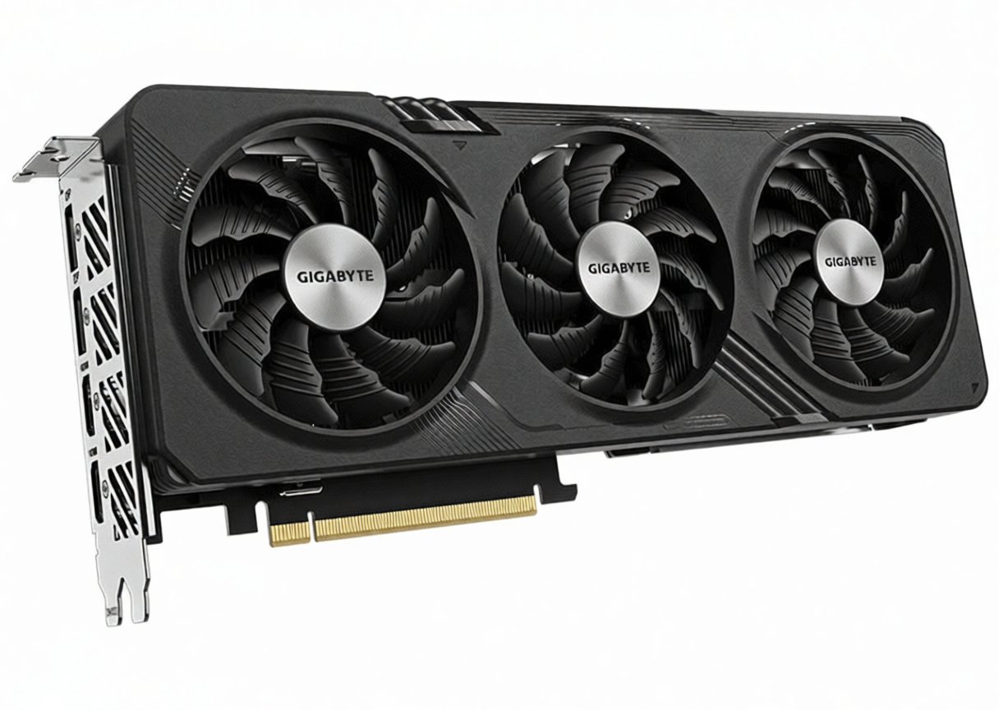
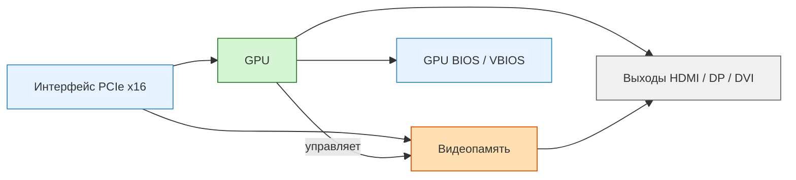

---
title: 1.08. Видеокарта
---

# 1.08. Видеокарта

<div class="article-tags">
  <span class="tag tag-required">ОБЯЗАТЕЛЬНО</span>
  <span class="tag tag-beginner">ДЛЯ НОВИЧКОВ</span>
  <span class="tag tag-advanced">НЕ ДЛЯ НОВИЧКОВ</span>
  <span class="tag tag-inprogress">В РАЗРАБОТКЕ</span>
</div>
<span class="complexity-badge">Инженеру</span>

## Что такое видеокарта?

**Видеокарта** (графический адаптер, графическая плата) представляет собой специализированное вычислительное устройство, предназначенное для ускорения обработки, генерации и вывода графической информации. 

Её основная задача — преобразование данных, поступающих от центрального процессора (CPU) или собственного программного интерфейса, в визуальные образы, отображаемые на экране монитора, проекторе или другом устройстве вывода. 

Так выглядит типичная современная видеокарта:



<div class="callout callout--tip">
  <div class="callout-title">Важно</div>
  Представьте, что центральный процессор (CPU) — это главный режиссёр театра, который принимает решения, координирует актёров и следит за общим ходом спектакля. Видеокарта (GPU) — это целая труппа актёров, одновременно исполняющих сотни ролей на сцене. Если CPU говорит: «Покажите закат над городом», GPU мгновенно рисует миллионы пикселей неба, облаков, зданий и отражений — каждый пиксель обрабатывается параллельно.
  
  Когда вы запускаете игру, редактор видео или нейросеть, именно видеокарта отвечает за то, чтобы изображение на экране обновлялось быстро и плавно. Без неё каждое движение курсора или прокрутка страницы были бы медленными, особенно при работе с графикой высокого разрешения.
</div>



Современная видеокарта — это полноценный вычислительный ускоритель, активно задействуемый в научных расчётах, машинном обучении, обработке видео, криптографии и других ресурсоёмких задачах, требующих массового параллелизма.

---

## Функциональная роль видеокарты

<div class="callout callout--tip">
  <div class="callout-title">Важно</div>
  В игре Minecraft с включёнными шейдерами видеокарта рассчитывает освещение, тени, блики на воде и отражения в реальном времени. Это невозможно сделать на CPU без сильного падения производительности.
  
  При обучении модели распознавания лиц нейросеть обрабатывает миллионы фотографий. Каждая операция умножения и сложения выполняется тысячами ядер GPU одновременно. На CPU такой расчёт занял бы дни, на GPU — часы.
</div>

**Центральный процессор** традиционно оптимизирован для последовательной обработки инструкций с высокой латентностью, но ограниченным количеством параллельных потоков. В отличие от него, видеокарта основана на архитектуре, ориентированной на массовый параллелизм. Это делает её чрезвычайно эффективной в задачах, где требуется выполнить одну и ту же операцию над большим объёмом данных — например, преобразование вершин трёхмерных моделей, наложение текстур, фильтрация пикселей, обучение нейросетей или декодирование видеопотока.

Видеокарта выполняет две ключевые роли:

	- **Графический ускоритель** — обрабатывает команды графических API (Direct3D, Vulkan, OpenGL, Metal) для построения и отображения изображений. Этот режим востребован в играх, CAD-приложениях, визуализации данных, мультимедийных редакторах.
	- **Вычислительный ускоритель** — исполняет общие вычислительные задачи через такие платформы, как CUDA (NVIDIA), ROCm (AMD) или OpenCL. В этом режиме видеокарта используется для численного моделирования, обучения моделей машинного обучения, анализа больших данных и других областей, где важна пропускная способность по операциям с плавающей запятой (FLOPS).
	
Использование видеокарты в этих ролях существенно разгружает центральный процессор, позволяя системе работать более эффективно и масштабируемо.

---

## Графический процессор (GPU)

<div class="callout callout--tip">
  <div class="callout-title">Важно</div>
  Современный игровой GPU содержит более 10 000 ядер. Для сравнения: даже самый мощный потребительский CPU имеет не более 64 ядер. GPU не заменяет CPU — он дополняет его там, где важна массовая обработка одинаковых данных.
  
  Если нужно применить фильтр к каждому пикселю изображения размером 4K (около 8 миллионов пикселей), GPU может обработать все пиксели почти одновременно. CPU сделал бы это последовательно, по частям.
</div>

**Графический процессор** (Graphics Processing Unit, GPU) — это центральный вычислительный элемент видеокарты. Подобно CPU, GPU содержит ядра, кэш-память, контроллеры и шины, но его архитектура принципиально отличается. GPU спроектирован для обработки тысяч потоков данных одновременно. Такой подход называется массовым параллелизмом (massive parallelism).

Современные GPU состоят из множества вычислительных блоков, объединённых в потоковые мультипроцессоры (Streaming Multiprocessors, SM — в терминологии NVIDIA) или вычислительные блоки (Compute Units — в архитектуре AMD). Каждый такой блок содержит десятки или сотни логических ядер, работающих синхронно над разными частями данных. Это позволяет GPU достигать вычислительной мощности, многократно превосходящей возможности даже высокопроизводительных CPU, при условии, что задача допускает параллельную обработку.

GPU управляет конвейером рендеринга, включающим этапы обработки вершин, сборки примитивов, растеризации и фрагментного шейдинга. В контексте универсальных вычислений GPU исполняет ядра (kernels) — функции, загружаемые в память устройства и запускаемые на тысячах потоков одновременно.

---

## Видеопамять (VRAM)

**Видеопамять** — это высокоскоростная память, физически интегрированная на печатной плате видеокарты и подключённая к GPU через широкую шину (часто 256-битную и более). В отличие от системной оперативной памяти (DRAM), видеопамять оптимизирована для высокой пропускной способности и низкой задержки при частом случайном доступе к большим объёмам данных.

<div class="callout callout--tip">
  <div class="callout-title">Важно</div>
  Пример объёма VRAM в реальных сценариях:

	4 ГБ VRAM достаточно для офисной работы и просмотра видео в Full HD.
	8–12 ГБ VRAM необходимо для игр в 1440p с высокими настройками.
	24 ГБ и более требуется для обучения современных нейросетей (например, Stable Diffusion XL или Llama 3).
	
	Видеопамять — это рабочий стол художника. Чем больше стол, тем больше красок, эскизов и инструментов можно разместить перед началом работы. Если стол мал, художнику придётся постоянно убирать и доставать материалы, что замедлит процесс.
</div>

Современные видеокарты используют типы памяти, такие как **GDDR6**, **GDDR6X** или **HBM2/3** (High Bandwidth Memory). GDDR6 — наиболее распространённый стандарт, обеспечивающий скорости передачи данных порядка 14–21 ГБ/с на контакт. HBM применяется в профессиональных и суперкомпьютерных решениях и характеризуется трёхмерной упаковкой чипов, что позволяет разместить память в непосредственной близости от GPU, минимизируя задержки и повышая энергоэффективность.

Видеопамять хранит:

- текстуры и буферы кадров (frame buffers);
- геометрические данные (вершины, индексы);
- буферы глубины (Z-buffer), трафарета (stencil buffer);
- промежуточные результаты вычислений при рендеринге или в общих вычислениях;
- веса и активации нейронных сетей в задачах машинного обучения.

Объём и пропускная способность видеопамяти напрямую влияют на производительность графического рендеринга и возможность обработки крупных наборов данных в вычислительных задачах. Например, обучение современных моделей машинного обучения может требовать десятков гигабайт видеопамяти, что недоступно на потребительских устройствах и достигается только при использовании профессиональных GPU или их кластеров.

---

### Интегрированные и дискретные видеокарты

В вычислительных системах применяются два основных типа графических решений:

- **Интегрированная графика** — GPU встроен в чип CPU или чипсет материнской платы. Она использует часть системной оперативной памяти (через шину CPU) и обладает ограниченной производительностью. Такие решения характерны для ноутбуков, офисных ПК и энергоэффективных платформ, где графическая нагрузка минимальна.
  
- **Дискретная видеокарта** — представляет собой независимое устройство с собственным GPU и видеопамятью, подключаемое к системе через интерфейс PCIe. Дискретные карты обеспечивают высокую производительность и необходимы для игр, профессиональной графики, машинного обучения и научных расчётов.

<div class="callout callout--tip">
  <div class="callout-title">Важно</div>
  Конкретные примеры устройств:

	- Интегрированная графика: Intel Iris Xe в ноутбуках Dell XPS 13, AMD Radeon Graphics в Ryzen 7 7730U.
	
	- Дискретная графика: NVIDIA GeForce RTX 4070, AMD Radeon RX 7800 XT.
	
	Если вы используете компьютер для просмотра YouTube, Zoom-звонков и работы в браузере — интегрированной графики достаточно. Если вы монтируете 4K-видео в DaVinci Resolve, играете в Cyberpunk 2077 или обучаете ИИ — нужна дискретная видеокарта.
</div>

---

### Энергопотребление и тепловыделение

Высокая параллельная производительность GPU достигается за счёт значительного энергопотребления и, как следствие, тепловыделения. Современные игровые и профессиональные видеокарты могут потреблять от 200 до 600 ватт и требуют сложных систем охлаждения — от массивных радиаторов с тепловыми трубками до жидкостных решений. Это накладывает ограничения на проектирование корпусов, блоков питания и систем кондиционирования в дата-центрах, где размещаются GPU-кластеры.

<div class="callout callout--tip">
  <div class="callout-title">Важно</div>
  Видеокарта NVIDIA RTX 4090 потребляет до 450 Вт — это сравнимо с мощностью микроволновой печи. Такая карта требует блока питания не менее 850 Вт и корпуса с хорошей вентиляцией. В то же время интегрированная графика в процессоре потребляет менее 15 Вт.
  
  В дата-центрах, где установлены сотни GPU, расходы на охлаждение могут превышать затраты на электричество. Поэтому компании разрабатывают жидкостное охлаждение и размещают серверы в холодных регионах (например, в Исландии или Финляндии).
</div>

---

### Программная модель взаимодействия с GPU

Для работы с видеокартой используются программные интерфейсы различного уровня:

- **Графические API** (DirectX, Vulkan, OpenGL, Metal) позволяют приложениям формировать и передавать команды рендеринга.
- **Вычислительные платформы** (CUDA, ROCm, OpenCL, SYCL) предоставляют средства для написания и загрузки вычислительных ядер.
- **Драйверы устройства** обеспечивают трансляцию высокоуровневых команд в машинные инструкции GPU, управление памятью, планирование задач и взаимодействие с операционной системой.

Эффективность использования видеокарты напрямую зависит от качества драйверов и корректности программной реализации: даже самый мощный GPU может демонстрировать низкую производительность при неоптимальной передаче данных или плохом распределении нагрузки между потоками.

```c
// Пример ядра (kernel) на CUDA-подобном синтаксисе
__global__ void apply_brightness(float* image, float factor) {
    int idx = blockIdx.x * blockDim.x + threadIdx.x;
    image[idx] = image[idx] * factor;
}
```

Эта функция увеличивает яркость каждого пикселя изображения. Она запускается одновременно на тысячах ядер GPU — каждый поток обрабатывает свой пиксель.

Когда вы открываете сайт с 3D-графикой на WebGL (например, Google Earth), браузер использует Vulkan или DirectX через драйвер видеокарты, чтобы отобразить карту без зависаний.

---

## Производители видеокарт

Рынок графических процессоров на протяжении последних трёх десятилетий формировался под влиянием трёх ключевых компаний: NVIDIA, AMD (включая унаследованное от ATI наследие) и Intel.

NVIDIA предлагает «всё в одном»: железо, драйверы, библиотеки, облачные сервисы. Это удобно, но привязывает пользователя к экосистеме.

AMD делает ставку на открытость: её драйверы работают в Linux без ограничений, а ROCm позволяет запускать ИИ-модели без лицензионных барьеров.

Intel стремится к совместимости: её GPU поддерживают те же стандарты, что и конкуренты, и встроены в большинство ноутбуков.

---

### NVIDIA

Компания **NVIDIA** была основана в 1993 году Дженсеном Хуаном, Крисом Маллосом и Кертисом Принсом с целью создания специализированных чипов для ускорения трёхмерной графики. Прорыв произошёл в 1999 году с выпуском **GeForce 256** — первого чипа, официально названного *графическим процессором* (GPU). NVIDIA последовательно делала ставку на производительность, инновации и вертикальную интеграцию: от аппаратных архитектур до собственных программных платформ.

В середине 2000-х NVIDIA осознала потенциал GPU в общих вычислениях. Это привело к созданию в 2006 году **CUDA** (*Compute Unified Device Architecture*) — первой массовой платформы для программирования GPU на языке, близком к C. CUDA изменила парадигму высокопроизводительных вычислений: вместо узкоспециализированных суперкомпьютеров исследователи и инженеры получили доступ к параллельным вычислениям через относительно недорогие потребительские GPU.

Сегодня NVIDIA — де-факто стандарт в машинном обучении, научных расчётах, автономных системах и профессиональной графике (линейка **Quadro/RTX**). Её стратегия заключается в построении **сквозной экосистемы**: аппаратные архитектуры (Turing, Ampere, Hopper), программные стеки (CUDA, cuDNN, TensorRT), облачные платформы (DGX, NVIDIA AI Enterprise) и даже собственные процессоры (Grace CPU для гибридных систем).

**Технологические особенности.**  
- **CUDA** — закрытая, но чрезвычайно развитая платформа, поддерживающая языки C/C++, Python, Fortran и интеграцию с основными фреймворками машинного обучения (TensorFlow, PyTorch). Большинство научных статей по машинному обучению до 2023 года содержали код, написанный под CUDA. Это сделало видеокарты NVIDIA обязательным оборудованием в лабораториях, университетах и стартапах.
- **Tensor Cores** — специализированные блоки для ускорения операций с матрицами низкой точности (FP16, INT8), критически важные для нейросетей.
- **RT Cores** — аппаратные ускорители трассировки лучей в реальном времени, внедрённые начиная с архитектуры Turing.
- **NVLink** — высокоскоростной интерфейс для соединения GPU между собой и с CPU, обеспечивающий пропускную способность, значительно превосходящую PCIe.

NVIDIA придерживается вертикально интегрированной модели: контролирует как «кремний», так и «софт». Это даёт ей преимущество в оптимизации, но создаёт зависимость пользователей от её экосистемы.

---

### AMD

**Advanced Micro Devices (AMD)** изначально была конкурентом Intel в сегменте центральных процессоров. В 2006 году компания приобрела канадского разработчика графических чипов **ATI Technologies**, что позволило ей войти в рынок дискретной графики. Первоначально AMD позиционировала GPU как часть гетерогенных вычислительных систем, где CPU и GPU работают в тесной связке (идея, названная **Heterogeneous System Architecture**, HSA).

В отличие от NVIDIA, AMD избрала путь **открытости**. В 2011 году была представлена платформа **OpenCL**-ориентированная модель вычислений, а в 2016 году — **ROCm** (*Radeon Open Compute*), открытая программная платформа для GPGPU, совместимая с Linux и поддерживающая основные фреймворки машинного обучения.

AMD делает ставку на ценовую доступность, совместимость со стандартами и гибкость. Её графические процессоры (линейка **Radeon**, профессиональные **Instinct**) широко используются в дата-центрах, особенно в тех случаях, где важна независимость от проприетарных экосистем.

**Технологические особенности.**  
- **RDNA** — современная архитектура GPU (RDNA 1/2/3), ориентированная на высокую энергоэффективность и игровую производительность.
- **CDNA** — архитектура для вычислительных задач (используется в серии Instinct), оптимизированная под параллельные вычисления и матричные операции.
- **Infinity Fabric** — внутренняя шина, обеспечивающая высокоскоростное соединение между CPU, GPU и памятью в гибридных системах (например, в процессорах Ryzen и EPYC).
- **ROCm** — открытая альтернатива CUDA, поддерживающая HIP (язык, позволяющий транслировать CUDA-код в совместимый с AMD формат). С помощью инструмента HIP разработчик может автоматически преобразовать код, написанный для CUDA, в версию, совместимую с GPU AMD. Это позволяет запускать популярные модели, такие как Llama или Whisper, на видеокартах Radeon.


---

### Intel

**Intel** долгое время доминировала в сегменте встроенной графики, интегрируя GPU в свои процессоры (Intel HD Graphics, Iris). Однако до 2020-х годов компания не предлагала конкурентоспособных *дискретных* видеокарт. Перелом произошёл с запуском проекта **Xe**, а в 2022 году — выпуском первой игровой дискретной карты **Intel Arc** на архитектуре **Alchemist**.

Стратегия Intel основана на трёх китах:  
1. **Масштаб** — использование собственных полупроводниковых мощностей (IDM 2.0) для массового производства.  
2. **Интеграция** — тесная связка GPU с CPU и другими компонентами (например, в гибридных процессорах Meteor Lake и Arrow Lake).  
3. **Открытость и стандарты** — поддержка Vulkan, DirectX 12 Ultimate, oneAPI (единая программная платформа для CPU, GPU, FPGA).

Intel нацелена на восстановление баланса на рынке: предложить альтернативу NVIDIA и AMD, особенно в сегментах entry-level и mid-range, а также в корпоративных и edge-вычислениях.

**Технологические особенности.**  
- **Архитектура Xe** — модульная, с подвариантами Xe-LP (встроенная графика), Xe-HPG (игровые GPU), Xe-HPC (суперкомпьютеры, например, в ускорителе Ponte Vecchio).
- **XeSS** — технология суперразрешения на основе машинного обучения, аналог DLSS от NVIDIA.
- **oneAPI** — кроссплатформенный набор инструментов и библиотек для гетерогенных вычислений, призванный заменить привязку к CUDA или ROCm. Разработчик пишет один алгоритм обработки изображений, а затем запускает его на CPU Intel Core, GPU Intel Arc и даже на FPGA — без изменения исходного кода. Это упрощает разработку для гибридных систем.
- **Наличие встроенного GPU в каждом современном процессоре** — делает Intel де-факто лидером по количеству развёрнутых графических ядер в мире.
