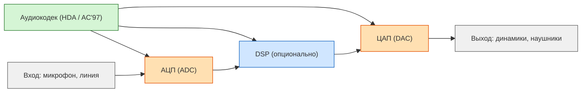
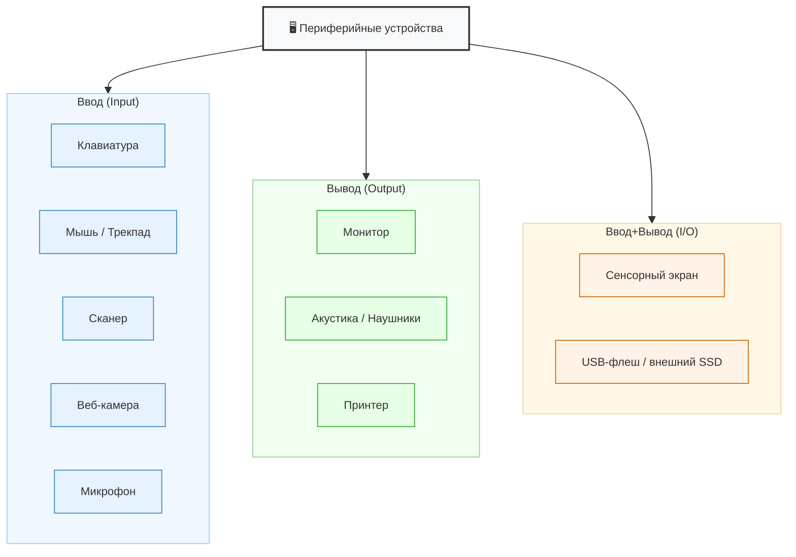
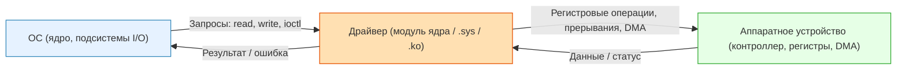
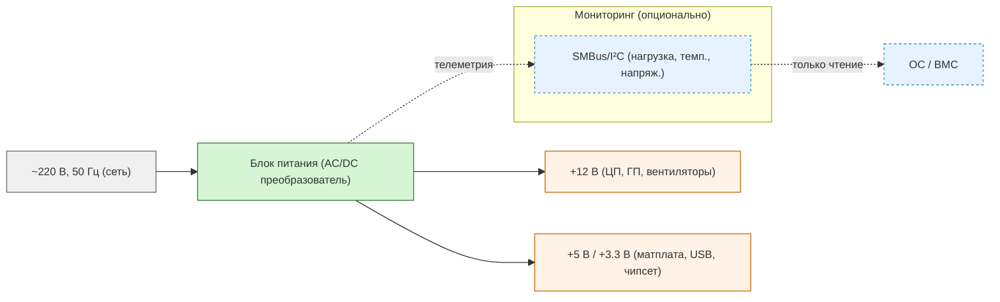

---
title: 1.08. Прочие устройства
---

# 1.08. Прочие устройства

<div class="article-tags">
  <span class="tag tag-required">ОБЯЗАТЕЛЬНО</span>
  <span class="tag tag-beginner">ДЛЯ НОВИЧКОВ</span>
  <span class="tag tag-inprogress">В РАЗРАБОТКЕ</span>
</div>
<span class="complexity-badge">Инженеру</span>

<details>
<summary>📖 Оглавление</summary>

1. [Прочие устройства](#прочие-устройства)  
   - [Звуковая карта](#звуковая-карта)  
   - [Сетевой адаптер](#сетевой-адаптер)  
   - [Периферийные устройства](#периферийные-устройства)  
   - [Драйверы устройств](#драйверы-устройств)  
   - [Блок питания](#блок-питания)

</details>

## Прочие устройства

В предыдущих главах уже обсуждались процессор, оперативная память, накопители и материнская плата — основные «внутренности» компьютера. Эта глава завершает картину, добавляя компоненты, без которых компьютер не сможет взаимодействовать с внешним миром: слышать, говорить, подключаться к сети, получать команды и выдавать результаты.

### Звуковая карта

**Звуковая карта** — это специализированный аппаратный модуль, отвечающий за обработку, синтез, ввод и вывод аудиосигналов. В ранних поколениях персональных компьютеров звуковая карта часто реализовывалась в виде отдельной платы расширения, устанавливаемой в слот расширения материнской платы. Современные решения, как правило, интегрированы непосредственно в чипсет материнской платы, образуя так называемый *аудиокодек*, обычно соответствующий стандарту Intel High Definition Audio.



Функционально звуковая карта выполняет несколько задач. Во-первых, она преобразует цифровой аудиопоток, формируемый операционной системой или приложениями, в аналоговый сигнал, пригодный для воспроизведения через акустические системы или наушники. Этот процесс называется *цифро-аналоговым преобразованием* (ЦАП). Во-вторых, при вводе аудиосигнала — например, с микрофона — карта осуществляет обратную операцию: *аналого-цифровое преобразование* (АЦП), переводя аналоговый сигнал в цифровую форму, пригодную для обработки программным обеспечением. В-третьих, в более сложных реализациях звуковая карта может содержать собственный цифровой сигнальный процессор (DSP), который разгружает центральный процессор от рутинных операций вроде пространственного звучания, эквализации или обработки многоканального аудио в форматах Dolby Digital или DTS.

<div class="callout callout--tip">
  <div class="callout-title">Важно</div>
  Когда вы слушаете музыку через наушники, ваш компьютер отправляет цифровой файл (например, MP3) в звуковую карту. Та преобразует его в аналоговый сигнал — плавные электрические колебания, которые заставляют мембраны наушников вибрировать и создавать звуковые волны. Если бы не было ЦАП, вы бы слышали только тишину — даже при идеальном файле.
</div>

Отсутствие звуковой карты делает невозможным как воспроизведение, так и запись звуковой информации. Хотя современные операционные системы могут эмулировать базовую аудиофункциональность программными средствами, реальное взаимодействие с физическими аудиоустройствами требует наличия соответствующего аппаратного интерфейса.

Встроенные аудиокодеки на материнских платах часто обозначаются как Realtek ALC892 или ALC1220. Эти чипы реализуют стандарт Intel HD Audio и поддерживают до 7.1-канального звука — достаточно для домашнего кинотеатра.

---

### Сетевой адаптер

**Сетевой адаптер** — это аппаратное устройство, обеспечивающее подключение вычислительной системы к локальной или глобальной компьютерной сети. Он реализует физический и канальный уровни сетевой модели OSI, обеспечивая передачу и приём данных по сетевому кабелю (в случае Ethernet) или по радиоканалу (в случае Wi-Fi).


Проводные сетевые адаптеры, как правило, используют стандарт IEEE 802.3 и подключаются к сети через разъём RJ-45. Беспроводные адаптеры соответствуют стандартам IEEE 802.11 (a/b/g/n/ac/ax) и взаимодействуют с точками доступа с использованием радиочастотных диапазонов 2,4 ГГц и 5 ГГц (а в новейших реализациях — и 6 ГГц). Современные сетевые адаптеры интегрированы в чипсет материнской платы, однако для специализированных задач (например, в серверах или рабочих станциях с повышенными требованиями к пропускной способности) используются отдельные платы расширения, поддерживающие технологии объединения каналов (link aggregation), аппаратное ускорение шифрования или виртуализации.

Сетевой адаптер имеет собственный уникальный идентификатор — MAC-адрес, присваиваемый на этапе производства и используемый для адресации на канальном уровне. Без сетевого адаптера физическое подключение к сети невозможно: даже если операционная система поддерживает сетевые протоколы, она не сможет ни отправлять, ни принимать сетевые пакеты без наличия соответствующего физического интерфейса.

<div class="callout callout--tip">
  <div class="callout-title">Важно</div>
   Представьте, что сетевой адаптер — это почтовое отделение вашего дома. MAC-адрес — это уникальный номер этого отделения (например, `00:1A:2B:3C:4D:5E`). Когда вы отправляете письмо (сетевой пакет) соседу в той же сети, оно сначала попадает в ваше «почтовое отделение» (адаптер), которое знает, куда его дальше передать. Без этого отделения письмо просто не выйдет за пределы дома.
</div>

> **Как посмотреть MAC-адрес**:  
> В Windows: откройте командную строку и введите  
> ```cmd
> ipconfig /all
> ```  
> В Linux/macOS:  
> ```bash
> ifconfig | grep ether
> ```  
> Вы увидите строку вроде `ether 00:1a:2b:3c:4d:5e` — это и есть MAC-адрес вашего сетевого адаптера.

Кстати, если не умеете пользоваться командной строкой - вернитесь сюда позднее.

---

### Периферийные устройства

Термин *периферия* используется для обозначения внешних устройств, подключаемых к вычислительной системе с целью ввода или вывода данных. В отличие от центральных компонентов — процессора, оперативной памяти, системной шины — периферийные устройства не участвуют напрямую в выполнении вычислительных операций, но обеспечивают взаимодействие пользователя с системой и расширение её функциональных возможностей.

<div class="callout callout--tip">
  <div class="callout-title">Важно</div>
  Компьютер — это мозг. Процессор думает, память хранит мысли. Но чтобы мозг мог общаться с миром, ему нужны органы чувств и речь.
  - **Клавиатура и мышь** — как глаза и руки: через них вы даёте команды.
  - **Монитор и колонки** — как голос и лицо: через них компьютер отвечает вам.
  
  Без периферии компьютер остаётся «запертым в себе» — он может считать всё, что угодно, но не сможет ни спросить, ни рассказать.
  
</div>

Большинство современных периферийных устройств используют интерфейс USB. Это позволяет подключать клавиатуру, флешку, принтер или камеру к одному и тому же разъёму. Операционная система распознаёт тип устройства по специальным меткам (Vendor ID и Product ID) и загружает нужный драйвер.



К устройствам ввода относятся:

- **Клавиатура** — для ввода текстовой и командной информации.
- **Мышь**, трекпад, графический планшет — для управления указателем на экране и передачи пространственных данных.
- **Сканеры** — для оцифровки бумажных документов и изображений.
- **Веб-камеры** — для захвата видеопотока.
- **Микрофоны** — для захвата аудиосигнала.

К устройствам вывода относятся:

- **Монитор** — для визуального отображения графической и текстовой информации.
- **Акустические системы и наушники** — для воспроизведения звука.
- **Принтеры** — для создания физических копий цифровых документов; делятся на струйные, лазерные, матричные и другие типы в зависимости от технологии печати.

Некоторые устройства обладают двойной функциональностью — например, сенсорный экран одновременно принимает данные (координаты касания) и отображает информацию. Также существуют устройства хранения (например, USB-флеш-накопители), которые формально относятся к периферии, но функционально ближе к внутренним накопителям.

Важнейшей характеристикой периферийных устройств является их зависимость от программного обеспечения: любое периферийное устройство требует наличия соответствующего драйвера для корректного взаимодействия с операционной системой.

---

### Драйверы устройств

Драйвер — это специализированная программа, обеспечивающая интерфейс между операционной системой и аппаратным устройством. Он абстрагирует физические особенности устройства, предоставляя операционной системе унифицированный программный интерфейс (API) для выполнения операций ввода-вывода. Без драйвера операционная система не может корректно интерпретировать сигналы, поступающие от устройства, и не способна управлять его функциями.

<div class="callout callout--tip">
  <div class="callout-title">Важно</div>
  Драйвер — это переводчик между двумя людьми, говорящими на разных языках.
  
  - Операционная система говорит: «Напечатай этот документ».
  - Принтер понимает только команды вида `ESC * r A 0x1F...`.
  
  Драйвер знает оба языка и превращает общую просьбу в точную последовательность команд, которую принтер выполнит без ошибок.
  
</div>



Современные операционные системы содержат обширные репозитории встроенных драйверов, покрывающих большинство стандартных устройств. При подключении нового оборудования система автоматически определяет его тип (по идентификаторам производителя и модели) и загружает подходящий драйвер либо из локального хранилища, либо — при наличии подключения к сети — из онлайн-каталога. Ранее драйверы поставлялись на физических носителях (CD/DVD), что требовало ручной установки до начала полноценной работы с устройством.

<div class="callout callout--tip">
  <div class="callout-title">**Что бывает при отсутствии драйвера**</div>
  - Устройство определяется как «Неизвестное устройство» в диспетчере устройств.  
  - Мышь может двигать курсор, но не реагировать на клики.  
  - Наушники подключены, но звук идёт только через динамики ноутбука.  
  
  Это не поломка — просто отсутствует «переводчик».
</div>

---

### Блок питания

Блок питания — это компонент, не выполняющий вычислительных или информационных функций, но являющийся необходимым условием функционирования всей системы. Он преобразует переменный ток из электрической сети (обычно 220 В при 50 Гц в бытовых условиях) в постоянный ток требуемых напряжений (например, +12 В, +5 В, +3,3 В), используемых компонентами компьютера. Энергия подаётся на материнскую плату, процессор, видеокарту, накопители и другие устройства через стандартизированные разъёмы.



Блок питания не требует драйвера, поскольку не взаимодействует с операционной системой напрямую. Однако в современных системах реализованы механизмы мониторинга и управления питанием (например, через интерфейс SMBus), что позволяет программному обеспечению отслеживать температуру, нагрузку и выходные параметры блока. Тем не менее, его работа остаётся полностью автономной от уровня операционной системы.

<div class="callout callout--tip">
  <div class="callout-title">**Почему важна мощность блока питания**</div>
  Каждый компонент потребляет определённое количество ватт:  
  - Процессор: 65–125 Вт  
  - Видеокарта: 150–350 Вт  
  - Накопители и вентиляторы: ~20–30 Вт  
  
  Если суммарное потребление превысит мощность блока питания, система либо не запустится, либо будет выключаться под нагрузкой (например, в играх). Всегда выбирайте блок питания с запасом мощности на 20–30%. Это обеспечивает стабильность и продлевает срок службы компонентов.
</div>
