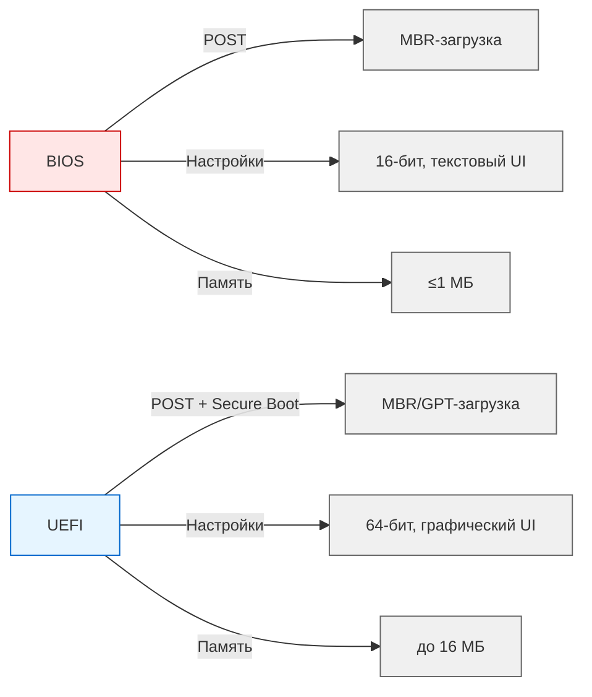
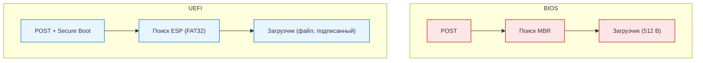
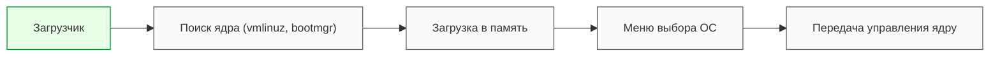

---
title: 1.08. Загрузчики
---

# 1.08. Загрузчики

  ОБЯЗАТЕЛЬНО
  ДЛЯ НОВИЧКОВ
  НЕ ДЛЯ НОВИЧКОВ
  В РАЗРАБОТКЕ

Инженеру

## Загрузчики

Каждый раз при включении компьютера запускается цепочка программ, которая превращает «мертвое» железо в живую вычислительную систему. Эта цепочка начинается с прошивки материнской платы и завершается загрузкой операционной системы. Центральное звено в этом процессе — **загрузчик**. Он служит мостом между аппаратным обеспечением и программным окружением, обеспечивая корректный старт ОС.

Процесс загрузки зависит от типа прошивки: **BIOS** или **UEFI**. Эти технологии определяют, как инициализируется оборудование, где искать загрузочные файлы и как передавать управление операционной системе.

### BIOS

★ **BIOS** (Basic Input/Output System) - первое ПО, запускаемое при включении компьютера - отвечает за инициализацию оборудования и загрузку операционной системы. 

При запуске, происходит POST (Power-On Self Test) - проверка работоспособности оборудования. Инициализация подразумевает настройку и активацию устройств. А загрузка операционной системы включает в себя поиск загрузочного устройства и передача управления загрузчику ОС. Пользователь имеет возможность настраивать всё это через интерфейс (например, порядок загрузки, частота процессора, напряжение). Пользователь может иметь несколько дисков с ОС, и если №1 выйдет из строя, загрузка будет с №2. BIOS хранится в микросхеме на материнской плате и занимает до 1 МБ. Однако, у BIOS ограниченная производительность (так как работает в 16-битном режиме реальной адресации процессора), поддержка загрузки только с MBR-дисков и нет поддержки современных функций.

### Этапы работы BIOS

1. **POST (Power-On Self Test)**  
   BIOS проверяет базовые компоненты: процессор, оперативную память, видеокарту, клавиатуру. Если обнаружена критическая ошибка, система может выдать звуковой сигнал или прекратить загрузку.

2. **Инициализация оборудования**  
   BIOS активирует контроллеры дисков, порты USB, сетевые адаптеры и другие устройства, необходимые для дальнейшей загрузки.

3. **Поиск загрузочного устройства**  
   Согласно заданному порядку (например: сначала SSD, затем USB), BIOS ищет устройство с загрузочной меткой.

4. **Чтение MBR**  
   На найденном устройстве BIOS читает первый сектор — **MBR** (Master Boot Record), размером ровно 512 байт. В нём содержится:
   - Код загрузчика (первичного, обычно 446 байт),
   - Таблица разделов (64 байта),
   - Метка окончания (0x55AA).

5. **Передача управления**  
   BIOS загружает код из MBR в оперативную память и передаёт ему управление. Этот код, в свою очередь, может загрузить более сложный загрузчик (например, GRUB Stage 1 → Stage 2).

### Ограничения BIOS

- Работает в **16-битном режиме реальной адресации**, что ограничивает доступ к памяти (максимум 1 МБ).
- Поддерживает только **MBR-разметку**, которая не позволяет использовать диски больше 2 ТБ.
- Не имеет встроенной защиты от неавторизованного ПО.
- Интерфейс — текстовый, без поддержки мыши.

---

### UEFI

★ **UEFI** (Unified Extensible Firmware Interface) - современный стандарт прошивки, который пришел на смену BIOS. Функции те же, но загрузка ОС может быть как с MBR, так и с GPT дисков, имеется графический интерфейс с поддержкой мыши, более гибкое управление оборудованием, модульность (определенные модули можно обновлять независимо) и Secure Boot - защита от загрузки неавторизованного или вредоносного ПО. UEFI занимает несколько мегабайт (16 МБ) и более производительна (работает в 64-битном режиме).

BIOS отличается от UEFI на уровне интерфейса прошивки:

### Преимущества UEFI

- **64-битная архитектура** — обеспечивает быстрый доступ к большим объёмам памяти.
- Поддержка **GPT** (GUID Partition Table) — позволяет использовать диски объёмом свыше 2 ТБ и создавать до 128 разделов.
- **Графический интерфейс** с поддержкой мыши и нескольких языков.
- **Модульная структура** — отдельные компоненты (драйверы, сервисы) можно обновлять независимо.
- **Secure Boot** — механизм проверки цифровой подписи загрузчика и ядра ОС, предотвращающий запуск вредоносного кода.
- Объём прошивки — до **16 МБ**, что даёт пространство для расширенных функций.

---

## Процесс загрузки: сравнение

### Загрузка через BIOS

1. Выполнение POST.
2. Поиск первого загрузочного устройства в списке.
3. Чтение MBR (512 байт).
4. Выполнение кода загрузчика из MBR.
5. Загрузчик находит вторую стадию (например, `grub.cfg`) и загружает ядро ОС.
6. Передача управления ядру.

Этот путь линейный, жёстко привязан к физической структуре диска и не допускает гибкой настройки.

### Загрузка через UEFI

1. Выполнение POST и инициализация устройств.
2. Активация Secure Boot (если включён).
3. Поиск ESP на всех подключённых дисках.
4. Чтение файла загрузчика из ESP (например, `bootx64.efi`).
5. Проверка цифровой подписи загрузчика (при Secure Boot).
6. Запуск загрузчика, который загружает ядро ОС.
7. Передача управления ядру.

Этот путь более гибкий, безопасный и ориентированный на файловую систему, а не на сектора.

---

### ESP

UEFI не читает «голые» сектора, как BIOS. Вместо этого она ищет специальный раздел — **ESP** (EFI System Partition). 

**ESP** (EFI System Partition) - специальный раздел на диске, используемый UEFI для хранения загрузочных файлов. Этот раздел форматируется в файловой системе FAT32 и содержит файлы загрузчиков, драйверы UEFI и конфигурационные файлы.

ESP — это фактически «загрузочный диск» для UEFI, оформленный как обычный каталог с файлами.

---

## Загрузчики операционных систем

После того как прошивка (BIOS или UEFI) передаёт управление, в дело вступает **загрузчик операционной системы**. Его задача — подготовить среду для запуска ядра.

### Основные функции загрузчика

- **Поиск ядра** — определение местоположения файла ядра (`vmlinuz` в Linux, `ntoskrnl.exe` в Windows).
- **Загрузка в память** — чтение ядра и связанных модулей (initramfs, драйверы) в оперативную память.
- **Настройка параметров запуска** — передача аргументов ядру (например, уровень журналирования, режим восстановления).
- **Меню выбора ОС** — при наличии нескольких систем (Linux + Windows) загрузчик предоставляет пользователю выбор.
- **Поддержка обновлений** — автоматическое обнаружение новых ядер и добавление их в меню.

★ **Загрузчик операционной системы** – это программа, которая отвечает за загрузку ОС после того, как BIOS или UEFI выполнили инициализацию оборудования. 

### Популярные загрузчики

- **GRUB (GNU GRand Unified Bootloader)**  
  Стандарт де-факто для большинства Linux-дистрибутивов. Поддерживает множество файловых систем, скриптовую логику, темы оформления и мультизагрузку.

- **Windows Boot Manager**  
  Интегрирован в архитектуру Windows. Работает с BCD (Boot Configuration Data) — базой данных в формате реестра, хранящей параметры загрузки.

- **rEFInd**, **systemd-boot**, **LILO**  
  Альтернативные решения, используемые в специализированных или минималистичных системах.

---
