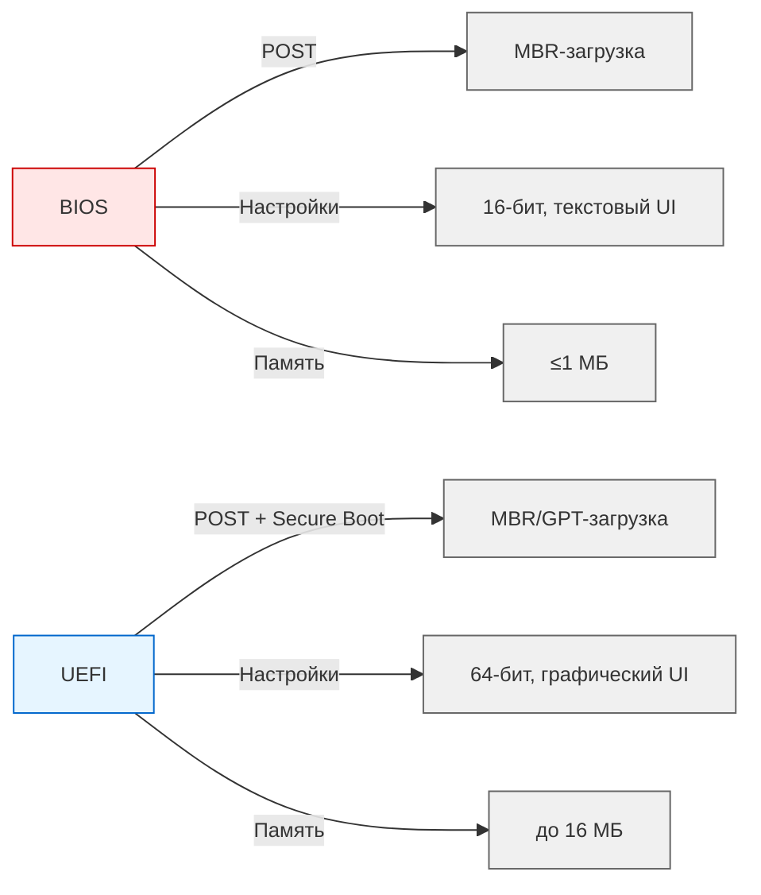
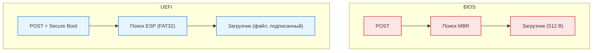
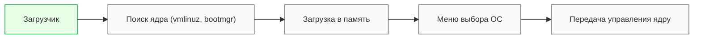

---
title: Загрузка операционной системы
---

# Загрузка операционной системы

<div class="article-tags">
  <span class="tag tag-required">ОБЯЗАТЕЛЬНО</span>
  <span class="tag tag-beginner">ДЛЯ НОВИЧКОВ</span>
  <span class="tag tag-advanced">НЕ ДЛЯ НОВИЧКОВ</span>
  <span class="tag tag-inprogress">В РАЗРАБОТКЕ</span>
</div>
<span class="complexity-badge">Инженеру</span>

## Загрузчики

Каждый раз при включении компьютера запускается цепочка программ, которая превращает «мертвое» железо в живую вычислительную систему. Эта цепочка начинается с прошивки материнской платы и завершается загрузкой операционной системы. Центральное звено в этом процессе — **загрузчик**. Он служит мостом между аппаратным обеспечением и программным окружением, обеспечивая корректный старт ОС.

Процесс загрузки зависит от типа прошивки: **BIOS** или **UEFI**. Эти технологии определяют, как инициализируется оборудование, где искать загрузочные файлы и как передавать управление операционной системе.

При включении компьютера с BIOS пользователь может увидеть текстовое окно вроде:
```
  American Megatrends BIOS v2.15
  Press DEL to enter SETUP
  Press F12 to select boot device
```

Это — интерфейс прошивки. Он не поддерживает мышь, а все действия выполняются клавишами. Даже если на диске установлен Windows или Linux, BIOS ничего не знает об этих системах — он лишь ищет «загрузочный флаг» на диске.

Интерфейс зависит от материнской платы, и помимо классических BIOS/UEFI стилей, визуально они могут быть специфическими для производителей, например, ASUS, Gigabyte, MSI. У них могут быть свои оболочки, упрощённые режимы, свои вариации горячих клавиш. Но в большинстве компьютеров, после нажатия на кнопку DEL до того, как загрузится операционная система, можно попасть в меню BIOS/UEFI.

А вот уже в самом меню можно проверить оборудование, компоненты, настроить параметры, и выбрать диск, с которого загружать операционную систему.

Таким образом, на диске лежат файлы ОС, вам нужно лишь указать диск, с которого загружать её. А затем, файлы выгрузятся в оперативную память и компьютер запустит систему - именно поэтому при включении, часть ОЗУ уже занята - как раз для работы операционки.

<div class="callout callout--tip">
  <div class="callout-title">Что происходит в памяти при старте</div>
  Представьте, что вы включаете компьютер с установленной Windows 11. 
  
  Прошивка находит на SSD раздел с загрузчиком `bootmgfw.efi`, загружает его в память по адресу, например, `0x100000`. 
  
  Затем загрузчик читает файл ядра `ntoskrnl.exe` и помещает его в другую область ОЗУ — скажем, начиная с `0x2000000`. 
  
  Одновременно в память загружается образ диспетчера конфигурации (`bootvid.dll`, `hal.dll` и другие компоненты). 
  
  К моменту, когда появляется экран входа, в оперативной памяти уже размещены сотни мегабайт системных данных, даже если вы ещё ничего не запускали.
  
  Этот процесс полностью автоматизирован. Пользователь не выбирает, куда грузить ядро или какой драйвер использовать — всё это определяет загрузчик на основе информации, хранящейся на диске. Именно поэтому важно, чтобы файловая система оставалась целой: повреждение даже одного критического файла (например, `vmlinuz` в Linux или `BCD` в Windows) может привести к остановке загрузки с сообщением вроде *«Operating System not found»* или *«GRUB rescue»*.
  
  Прошивка не анализирует содержимое файлов — она лишь передаёт управление первому исполняемому образу, соответствующему её архитектуре (`.efi` для UEFI, машинный код в MBR для BIOS). Всё остальное — задача загрузчика операционной системы.
</div>


---

## BIOS

★ **BIOS** (Basic Input/Output System) - первое ПО, запускаемое при включении компьютера - отвечает за инициализацию оборудования и загрузку операционной системы. 

При запуске, происходит POST (Power-On Self Test) - проверка работоспособности оборудования. Инициализация подразумевает настройку и активацию устройств. А загрузка операционной системы включает в себя поиск загрузочного устройства и передача управления загрузчику ОС. Пользователь имеет возможность настраивать всё это через интерфейс (например, порядок загрузки, частота процессора, напряжение). Пользователь может иметь несколько дисков с ОС, и если №1 выйдет из строя, загрузка будет с №2. BIOS хранится в микросхеме на материнской плате и занимает до 1 МБ. Однако, у BIOS ограниченная производительность (так как работает в 16-битном режиме реальной адресации процессора), поддержка загрузки только с MBR-дисков и нет поддержки современных функций.

---

### Этапы работы BIOS

1. **POST (Power-On Self Test)**  
   BIOS проверяет базовые компоненты: процессор, оперативную память, видеокарту, клавиатуру. Если обнаружена критическая ошибка, система может выдать звуковой сигнал или прекратить загрузку.

2. **Инициализация оборудования**  
   BIOS активирует контроллеры дисков, порты USB, сетевые адаптеры и другие устройства, необходимые для дальнейшей загрузки.

3. **Поиск загрузочного устройства**  
   Согласно заданному порядку (например: сначала SSD, затем USB), BIOS ищет устройство с загрузочной меткой.

4. **Чтение MBR**  
   На найденном устройстве BIOS читает первый сектор — **MBR** (Master Boot Record), размером ровно 512 байт. В нём содержится:
   - Код загрузчика (первичного, обычно 446 байт),
   - Таблица разделов (64 байта),
   - Метка окончания (0x55AA).

5. **Передача управления**  
   BIOS загружает код из MBR в оперативную память и передаёт ему управление. Этот код, в свою очередь, может загрузить более сложный загрузчик (например, GRUB Stage 1 → Stage 2).

<div class="callout callout--tip">
  <div class="callout-title">Пример структуры MBR в шестнадцатеричном виде</div>
  Типичный MBR начинается так (первые 16 байт):
  
  `00000000: eb48 904d 5344 4f53 352e 3000 0208 0100  .H.MSDOS5.0.....`
  
  Здесь `eb48` — это машинная команда для перехода к основному коду загрузчика, а строка `MSDOS5.0` — сигнатура файловой системы. Последние два байта всегда `55 AA` — это «магическое число», которое BIOS проверяет, чтобы убедиться: сектор действительно загрузочный.
</div>

---

### Ограничения BIOS

- Работает в **16-битном режиме реальной адресации**, что ограничивает доступ к памяти (максимум 1 МБ).
- Поддерживает только **MBR-разметку**, которая не позволяет использовать диски больше 2 ТБ.
- Не имеет встроенной защиты от неавторизованного ПО.
- Интерфейс — текстовый, без поддержки мыши.


---

## UEFI

★ **UEFI** (Unified Extensible Firmware Interface) - современный стандарт прошивки, который пришел на смену BIOS. Функции те же, но загрузка ОС может быть как с MBR, так и с GPT дисков, имеется графический интерфейс с поддержкой мыши, более гибкое управление оборудованием, модульность (определенные модули можно обновлять независимо) и Secure Boot - защита от загрузки неавторизованного или вредоносного ПО. UEFI занимает несколько мегабайт (16 МБ) и более производительна (работает в 64-битном режиме).

BIOS отличается от UEFI на уровне интерфейса прошивки:



### Преимущества UEFI

- **64-битная архитектура** — обеспечивает быстрый доступ к большим объёмам памяти.
- Поддержка **GPT** (GUID Partition Table) — позволяет использовать диски объёмом свыше 2 ТБ и создавать до 128 разделов.
- **Графический интерфейс** с поддержкой мыши и нескольких языков.
- **Модульная структура** — отдельные компоненты (драйверы, сервисы) можно обновлять независимо.
- **Secure Boot** — механизм проверки цифровой подписи загрузчика и ядра ОС, предотвращающий запуск вредоносного кода.
- Объём прошивки — до **16 МБ**, что даёт пространство для расширенных функций.

<div class="callout callout--tip">
  <div class="callout-title">Важно</div>
  Представьте, что вы пытаетесь установить Linux на ноутбук с Windows. Если Secure Boot включён, система откажет в загрузке, если образ Linux не содержит цифровую подпись, доверенную UEFI. Например, Ubuntu использует подписанный Microsoft’ом загрузчик `shim.efi`, который затем запускает GRUB. Без такой цепочки — отказ.
</div>

---

## Процесс загрузки: сравнение

### Загрузка через BIOS

1. Выполнение POST.
2. Поиск первого загрузочного устройства в списке.
3. Чтение MBR (512 байт).
4. Выполнение кода загрузчика из MBR.
5. Загрузчик находит вторую стадию (например, `grub.cfg`) и загружает ядро ОС.
6. Передача управления ядру.

Этот путь линейный, жёстко привязан к физической структуре диска и не допускает гибкой настройки.

### Загрузка через UEFI

1. Выполнение POST и инициализация устройств.
2. Активация Secure Boot (если включён).
3. Поиск ESP на всех подключённых дисках.
4. Чтение файла загрузчика из ESP (например, `bootx64.efi`).
5. Проверка цифровой подписи загрузчика (при Secure Boot).
6. Запуск загрузчика, который загружает ядро ОС.
7. Передача управления ядру.

Этот путь более гибкий, безопасный и ориентированный на файловую систему, а не на сектора.




---

### ESP

UEFI не читает «голые» сектора, как BIOS. Вместо этого она ищет специальный раздел — **ESP** (EFI System Partition). 

**ESP** (EFI System Partition) - специальный раздел на диске, используемый UEFI для хранения загрузочных файлов. Этот раздел форматируется в файловой системе FAT32 и содержит файлы загрузчиков, драйверы UEFI и конфигурационные файлы.

ESP — это фактически «загрузочный диск» для UEFI, оформленный как обычный каталог с файлами. После монтирования ESP (обычно как `/boot/efi` в Linux или диск `S:\` в Windows) можно увидеть такую структуру:

```
EFI/
├── BOOT/
│   └── bootx64.efi      ← универсальный загрузчик для x64
├── Microsoft/
│   └── Boot/
│       └── bootmgfw.efi ← загрузчик Windows
└── ubuntu/
    └── grubx64.efi      ← загрузчик Ubuntu
```

Каждая ОС размещает свои файлы в отдельной папке. UEFI читает эту структуру как обычную FAT32-файловую систему и выбирает, какой `.efi`-файл запустить.

---

## Загрузчики операционных систем

После того как прошивка (BIOS или UEFI) передаёт управление, в дело вступает **загрузчик операционной системы**. Его задача — подготовить среду для запуска ядра.

### Основные функции загрузчика

- **Поиск ядра** — определение местоположения файла ядра (`vmlinuz` в Linux, `ntoskrnl.exe` в Windows).
- **Загрузка в память** — чтение ядра и связанных модулей (initramfs, драйверы) в оперативную память.
- **Настройка параметров запуска** — передача аргументов ядру (например, уровень журналирования, режим восстановления).
- **Меню выбора ОС** — при наличии нескольких систем (Linux + Windows) загрузчик предоставляет пользователю выбор.
- **Поддержка обновлений** — автоматическое обнаружение новых ядер и добавление их в меню.

При наличии двух операционных систем пользователь видит текстовое меню вроде:
```
GNU GRUB version 2.06

* Ubuntu 24.04 LTS
  Advanced options for Ubuntu
  Windows Boot Manager (on /dev/nvme0n1p1)
```

★ **Загрузчик операционной системы** – это программа, которая отвечает за загрузку ОС после того, как BIOS или UEFI выполнили инициализацию оборудования. 




### Популярные загрузчики

- **GRUB (GNU GRand Unified Bootloader)**  
  Стандарт де-факто для большинства Linux-дистрибутивов. Поддерживает множество файловых систем, скриптовую логику, темы оформления и мультизагрузку.

- **Windows Boot Manager**  
  Интегрирован в архитектуру Windows. Работает с BCD (Boot Configuration Data) — базой данных в формате реестра, хранящей параметры загрузки.

- **rEFInd**, **systemd-boot**, **LILO**  
  Альтернативные решения, используемые в специализированных или минималистичных системах.

В Windows параметры загрузки хранятся не в текстовом файле, а в двоичной базе данных. Команда в PowerShell:

```
bcdedit /enum firmware
```

...покажет список загрузочных записей UEFI, например:

```
Firmware Application (101fffff...)
-------------------------------
identifier              {fwbootmgr}
description             Windows Boot Manager
path                    \EFI\Microsoft\Boot\bootmgfw.efi
```

Это позволяет Windows точно указывать, какой `.efi`-файл использовать при загрузке.

<div class="callout callout--tip">
  <div class="callout-title">Важно</div>
  Представьте, что компьютер — это театр. BIOS или UEFI — это электрик, который включает свет и проверяет, что сцена готова. Загрузчик операционной системы — это режиссёр, который вызывает актёров (ядро, драйверы), расставляет реквизит (параметры запуска) и даёт команду: «Начинаем спектакль!»
</div>

---
