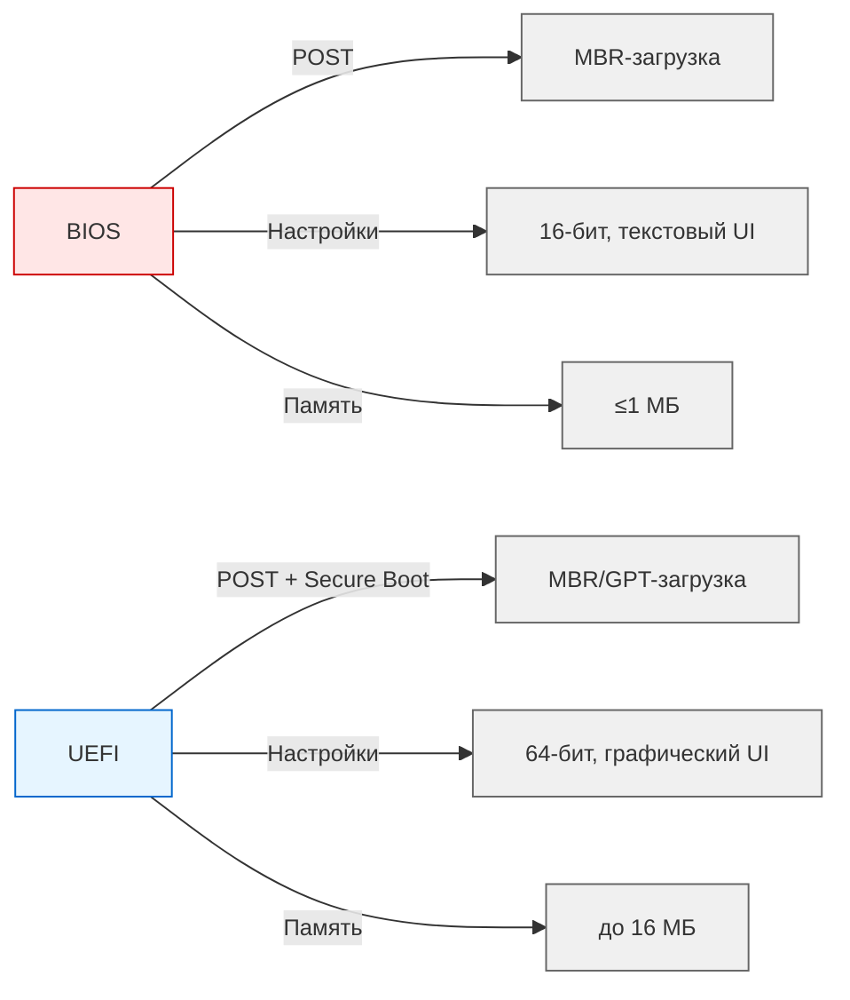
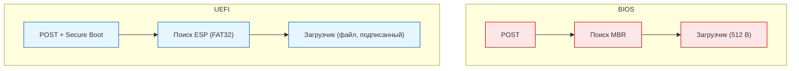
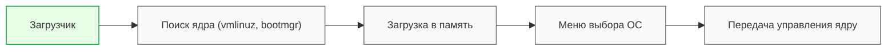

---
title: 1.08. Загрузчики
---

# 1.08. Загрузчики

  ОБЯЗАТЕЛЬНО
  ДЛЯ НОВИЧКОВ
  НЕ ДЛЯ НОВИЧКОВ
  В РАЗРАБОТКЕ

Инженеру

## Загрузчики

★ **BIOS** (Basic Input/Output System) - первое ПО, запускаемое при включении компьютера - отвечает за инициализацию оборудования и загрузку операционной системы. 

При запуске, происходит POST (Power-On Self Test) - проверка работоспособности оборудования. Инициализация подразумевает настройку и активацию устройств. А загрузка операционной системы включает в себя поиск загрузочного устройства и передача управления загрузчику ОС. Пользователь имеет возможность настраивать всё это через интерфейс (например, порядок загрузки, частота процессора, напряжение). Пользователь может иметь несколько дисков с ОС, и если №1 выйдет из строя, загрузка будет с №2. BIOS хранится в микросхеме на материнской плате и занимает до 1 МБ. Однако, у BIOS ограниченная производительность (так как работает в 16-битном режиме реальной адресации процессора), поддержка загрузки только с MBR-дисков и нет поддержки современных функций.

★ **UEFI** (Unified Extensible Firmware Interface) - современный стандарт прошивки, который пришел на смену BIOS. Функции те же, но загрузка ОС может быть как с MBR, так и с GPT дисков, имеется графический интерфейс с поддержкой мыши, более гибкое управление оборудованием, модульность (определенные модули можно обновлять независимо) и Secure Boot - защита от загрузки неавторизованного или вредоносного ПО. UEFI занимает несколько мегабайт (16 МБ) и более производительна (работает в 64-битном режиме).

BIOS отличается от UEFI на уровне интерфейса прошивки:

**Загрузка в BIOS:**

- BIOS выполняет POST;
- ищет загрузочное устройство по порядку;
- читает первый сектор устройства (MBR, 512 байт);
- передаёт управление загрузчику (например, GRUB в Linux или Windows Boot Manager), который загружает ОС.

**Загрузка в UEFI:**

- инициализация оборудования;
- поиск загрузочного раздела (ESP) на диске;
- загружает файл загрузчика;
- загрузчик проверяет цифровую подпись (если включен Secure Boot);
- передача управления ОС.

**ESP** (EFI System Partition) - специальный раздел на диске, используемый UEFI для хранения загрузочных файлов. Этот раздел форматируется в файловой системе FAT32 и содержит файлы загрузчиков, драйверы UEFI и конфигурационные файлы.

★ **Загрузчик операционной системы** – это программа, которая отвечает за загрузку ОС после того, как BIOS или UEFI выполнили инициализацию оборудования. 

Загрузчик выполняет:

- поиск ядра операционной системы (находит файлы, необходимые для запуска ОС, vmlinuz для Linux, bootmgr для Windows);
- загрузку ядра в память (передаёт управление ядру ОС);
- выбор операционной системы (в случае наличия нескольких ОС, предоставляет меню для выбора нужной ОС).

GRUB (GNU GRand Unified Bootloader) - один из самых популярных загрузчиков для Linux-систем. Он поддерживает загрузку разных ОС, в том числе Windows и macOS.

Windows Boot Manager - загрузчик, используемый ОС Windows. Он является частью архитектуры загрузки Windows и работает в тесной интеграции с этой ОС.
