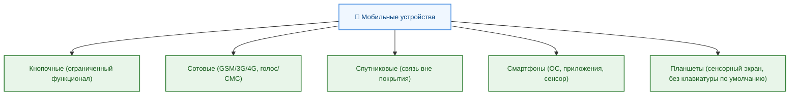

---
title: Мобильные устройства
tags: [beginner, advanced, required, all]
description: Обзор мобильных устройств, эволюция, архитектура, программное обеспечение и экосистема.
---

# Мобильные устройства

  ОБЯЗАТЕЛЬНО
  ДЛЯ НОВИЧКОВ
  НЕ ДЛЯ НОВИЧКОВ
  В РАЗРАБОТКЕ

Всем

## Мобильные устройства

В современной цифровой экосистеме мобильные устройства стали неотъемлемым инструментом как повседневной жизни, так и профессиональной деятельности. Смартфоны и планшеты — это полноценные вычислительные платформы, способные выполнять широкий спектр задач: от веб-серфинга и видеоконференций до разработки программного обеспечения и управления распределёнными системами. Чтобы осознанно использовать и развивать технологии, необходимо понимать происхождение этих устройств, их внутреннее устройство, программную и аппаратную архитектуру, а также ключевые функциональные компоненты.

Начнём с уточнения терминов, поскольку в быту часто смешиваются понятия *мобильный телефон*, *сотовый телефон*, *смартфон*, *коммуникатор* и *планшет*. Эти термины отражают этапы технологической эволюции и различаются как по функциональности, так и по архитектуре.

### Мобильный телефон и сотовый телефон

Термин *мобильный телефон* происходит от английского *mobile phone* и означает устройство, предназначенное для голосовой связи в условиях перемещения пользователя. Мобильность обеспечивается отсутствием привязки к физическому проводному соединению — связь осуществляется посредством радиосигналов. С технической точки зрения, мобильные телефоны бывают различных типов, в том числе спутниковые и радиотелефоны, но в повседневном употреблении под этим термином подразумевают именно *сотовые телефоны*.

  
Важно

  Например, радиотелефон дальнобойщика или спутниковый телефон моряка — это тоже мобильные телефоны, потому что они работают вне привязки к проводам. Но только устройства, подключённые к сотовой сети (например, ваш iPhone или Samsung Galaxy), называются сотовыми телефонами. Если вы звоните через Wi-Fi без SIM-карты, вы используете мобильное устройство, но не сотовую связь.

*Сотовый телефон* (от *cellular phone*) — это устройство, работающее в рамках *сотовой сети*: географическое пространство делится на ячейки (соты), каждая из которых обслуживается базовой станцией. Такая архитектура позволяет многократно использовать радиочастотный диапазон, обеспечивая масштабируемость и устойчивую связь даже при плотной застройке. Первые сотовые сети соответствовали стандарту первого поколения, или **1G** — аналоговым системам, таким как **AMPS** (США) и **NMT** (Скандинавия), а в СССР — **Алтай** и **Орбита**. Эти системы обеспечивали только голосовую связь, без шифрования и с низким качеством передачи.

Переход ко второму поколению (**2G**) ознаменовался внедрением цифровых стандартов — в первую очередь **GSM** (Global System for Mobile Communications), разработанного Европейским институтом стандартов электросвязи (ETSI). GSM стал доминирующим стандартом в большинстве стран мира благодаря открытой спецификации, высокой помехоустойчивости и возможности передачи коротких текстовых сообщений — **SMS** (Short Message Service). Именно с эпохи GSM началась массовая популяризация сотовой связи: устройства стали компактными, доступными, а аккумуляторы — долговечными.

Важно подчеркнуть: термин *сотовый телефон* в узком смысле подразумевает наличие радиомодуля, способного работать в стандартах GSM, UMTS (3G), LTE (4G) или NR (5G). Устройства, не имеющие такого модуля — например, планшеты без поддержки SIM-карт — формально не являются сотовыми, хотя часто используются в схожих сценариях.

### Эволюция

#### Кнопочные телефоны

Классические *кнопочные телефоны* — это устройства с физической клавиатурой, в большинстве случаев выполненной по принципу T9: цифровые клавиши с нанесёнными на них буквами латинского алфавита. Ввод текста требовал многократного нажатия одной клавиши для выбора нужной буквы. Такой подход был оптимален при ограниченных вычислительных ресурсах и минимальном объёме оперативной памяти.

Большинство кнопочных телефонов работали под управлением проприетарных операционных систем — например, **Nokia Series 30/40**, **Samsung Bada** (ранние версии), или встроенных RTOS-решений от производителей чипсетов (например, MediaTek или UNISOC). Они поддерживали базовые функции: звонки, SMS, MMS (Multimedia Messaging Service), монофонические или полифонические мелодии, в некоторых моделях — Java-приложения (MIDP/CLDC), ограниченный веб-браузер и примитивные игры (например, *Snake*).

  
Важно

  Представьте, что вы хотите написать слово «привет». На кнопке «7» находятся буквы «PQRS». Чтобы получить «P», нажмите один раз; чтобы получить «R» — три раза. Такая система требовала внимания и памяти, но позволяла набирать текст даже на устройстве с 12 кнопками.

Ключевой особенностью кнопочных устройств была энергоэффективность: время автономной работы могло достигать нескольких недель. Интерфейс строился вокруг навигационной клавиши («джойстик» или D-pad), функциональных клавиш и контекстного меню, отображаемого на монохромном или цветном LCD-дисплее с диагональю 1–2 дюйма и разрешением до 240×320 пикселей.

#### Коммуникаторы и КПК

На стыке 1990-х и 2000-х годов появились устройства, объединяющие функции телефона и карманного компьютера — так называемые *коммуникаторы* (от *communicator*). Они представляли собой гибрид: раскладную конструкцию с QWERTY-клавиатурой под экраном и полноценной операционной системой, чаще всего **Windows Mobile** или **Symbian OS**. Примеры — Nokia 9000 Communicator, HTC Touch Diamond, Samsung i8000 Omnia.

Коммуникаторы позволяли работать с документами (Word, Excel), электронной почтой (Exchange ActiveSync), календарём, контактами и даже базами данных. Они оснащались стилусом, поддерживали рукописный ввод и имели разъёмы для подключения внешних периферийных устройств (например, через CompactFlash или SDIO). Важно отличать их от *карманных персональных компьютеров* (**КПК**, или *PDA* — Personal Digital Assistant), которые изначально не имели встроенного сотового модуля. Классические КПК, такие как Palm Pilot или Apple Newton, использовались для управления задачами, заметками и контактами, а связь с внешним миром обеспечивалась через ИК-порт, Bluetooth или внешние модемы.

Среда разработки для таких устройств включала **Win32 API**, **.NET Compact Framework**, **Symbian C++**, а также кроссплатформенные решения вроде **Qt** или **Java ME**. Однако фрагментация платформ, сложность развёртывания приложений и отсутствие единой экосистемы сдерживали массовое распространение.

#### Появление смартфона

Термин *смартфон* (от *smart* — «умный» и *phone* — «телефон») стал широко употребляться после выхода iPhone в 2007 году, хотя первые устройства, формально удовлетворяющие определению, появились гораздо раньше. Например, IBM Simon (1994) сочетал телефон, календарь, блокнот и сенсорный экран; Nokia 9210 Communicator (2001) работал под управлением Symbian и имел полноценную файловую систему.

Однако именно iPhone определил *современное понимание смартфона*: устройство с сенсорным интерфейсом, многоядерным процессором, операционной системой общего назначения (iOS, основанной на Darwin/macOS), поддержкой мультимедиа, геолокации, мультитач-взаимодействия и, что принципиально важно — открытой экосистемой приложений (App Store, запущенный в 2008 году).

  
Важно

  До iPhone приложения устанавливались вручную: пользователь скачивал файл .jar или .sis, копировал его на карту памяти и запускал установку. После появления App Store стало достаточно нажать одну кнопку — и игра, навигатор или банковское приложение устанавливались автоматически, с проверкой безопасности и обновлениями «из коробки».

Таким образом, **смартфон** — это мобильное устройство, объединяющее функции сотового телефона, карманного компьютера, медиаплеера, фотокамеры, GPS-навигатора и множества других инструментов, управляемое операционной системой, поддерживающей установку стороннего программного обеспечения. ОС смартфона — полноценная многозадачная система с защитой памяти, виртуальной памятью, графическим стеком и набором системных сервисов (например, уведомления, фоновые задачи, push-сервисы).

### Планшеты

Планшет — это мобильное вычислительное устройство с сенсорным экраном диагональю от 7 до 14 дюймов, как правило, без физической клавиатуры и сотового модуля (хотя гибридные версии существуют). Первые планшетные ПК появились ещё в начале 2000-х — Microsoft Tablet PC на базе Windows XP Tablet Edition, но они не получили широкого распространения из-за высокой стоимости, низкой автономности и неудобного интерфейса (требовался стилус, отсутствовала поддержка мультитача).

Настоящий прорыв произошёл в 2010 году с выходом **Apple iPad**, построенного на той же аппаратной платформе, что и iPhone, и использующего ту же ОС (iOS). iPad продемонстрировал, что крупный сенсорный экран может быть эффективным интерфейсом для потребления контента, видеоконференций, рисования и даже лёгкой продуктивной работы. Вслед за Apple рынок заполнили Android-планшеты (Samsung Galaxy Tab, ASUS Transformer, Lenovo Yoga), а затем — Windows-планшеты с поддержкой полноценных настольных приложений (Microsoft Surface).

  
Важно

  Попробуйте представить, что вы рисуете пальцем на экране старого компьютера с Windows XP. Без поддержки мультитача каждое движение требует стилуса, как карандаша. iPad же позволил использовать палец так же естественно, как лист бумаги: увеличить фото щипком, пролистать книгу свайпом, выбрать цвет в приложении одним касанием.

Важно различать:
- **Планшеты на мобильных ОС** (iOS/iPadOS, Android) — оптимизированы под сенсорное управление, приложения скачиваются из магазинов, ограниченная поддержка периферии.
- **Гибридные устройства** (2-в-1, convertibles) — оснащены отсоединяемой клавиатурой или поворотным шарниром, работают под управлением Windows 10/11 или ChromeOS, могут запускать десктопные приложения и подключаться к внешним мониторам.
- **Электронные читалки и специализированные планшеты** (например, Kindle, Boox, reMarkable) — используют электронные чернила (E Ink), ориентированы на чтение и рукописный ввод, часто лишены цветного дисплея и высокой производительности.

Несмотря на визуальное сходство, планшеты отличаются от ноутбуков архитектурой: они почти всегда построены на системах на кристалле (SoC) с архитектурой ARM, тогда как ноутбуки традиционно используют x86/x64-процессоры (Intel/AMD), хотя граница стирается с появлением Apple Silicon и Snapdragon X Elite.

---

### Аппаратные компоненты мобильного устройства

Современный смартфон или планшет — это сложнейшая инженерная система, в которой десятки микросхем, датчиков и интерфейсов работают в синхронизированном режиме. Несмотря на компактные габариты, внутреннее устройство сопоставимо по сложности с настольным компьютером, но с акцентом на энергоэффективность, интеграцию и миниатюризацию.

#### Система на кристалле (SoC)

Сердце любого современного мобильного устройства — **система на кристалле** (**SoC**, *System on Chip*). В отличие от настольных ПК, где процессор, графический адаптер, контроллер памяти и чипсет разнесены по отдельным компонентам, в мобильных устройствах все ключевые блоки интегрированы в один кристалл кремния. Это позволяет сократить энергопотребление, уменьшить задержки при обмене данными и снизить физические размеры.

Типичная SoC включает:
- **Центральный процессор** (**CPU**) — обычно многоядерный, построенный по гетерогенной архитектуре **big.LITTLE** (ARM): высокопроизводительные ядра (например, Cortex-X4) для интенсивных задач и энергоэффективные ядра (Cortex-A520) для фоновых операций. Тактовые частоты варьируются от 1,2 ГГц (энергосберегающие) до 3,5 ГГц (производительные).
  
- **Графический процессор** (**GPU**) — отвечает за рендеринг интерфейса, 2D/3D-графики, видеоускорение и всё чаще — за вычисления в машинном обучении. Основные производители: **ARM Mali**, **Qualcomm Adreno**, **Apple GPU** (внутренняя разработка), **Imagination PowerVR** (ранее использовалась в Apple, теперь — в некоторых MediaTek и Loongson).

- **Нейропроцессор** (**NPU**, *Neural Processing Unit*) — специализированный блок ускорения операций с тензорами. Используется для распознавания лиц, обработки изображений в реальном времени (HDR+, ночной режим), голосовых ассистентов, перевода текста на лету и других задач ИИ. NPU работает на порядки энергоэффективнее, чем CPU/GPU при той же вычислительной мощности. Например, Apple Neural Engine (16 ядер в A17 Pro), Qualcomm Hexagon, MediaTek APU.

- **Сигнальный процессор изображения** (**ISP**, *Image Signal Processor*) — обрабатывает «сырые» данные с матрицы камеры: коррекция баланса белого, шумоподавление, объединение кадров (multi-frame processing), глубинный анализ для боке-эффекта, обработка RAW-данных. Современные ISP поддерживают одновременную работу с 4–6 камерами и запись 8K-видео.

- **Цифровой сигнальный процессор** (**DSP**) — оптимизирован для обработки аудио, модемных сигналов, сенсорных данных. Например, Qualcomm Hexagon DSP берёт на себя декодирование аудиокодеков (aptX, LDAC), обработку шумоподавления в микрофонах, анализ данных с гироскопа и акселерометра.

- **Контроллеры памяти и периферии** — встроенные интерфейсы для оперативной памяти (LPDDR5/5X), флеш-накопителей (UFS 3.1/4.0), дисплея (MIPI DSI), камер (MIPI CSI), USB, Bluetooth/Wi-Fi.

Важно: SoC не включает в себя оперативную память и постоянное хранилище — они выполняются в виде отдельных чипов, но размещаются в одном корпусе в конфигурации **PoP** (*Package on Package*): флеш-память сверху, SoC снизу, что экономит площадь на плате.

Основные производители SoC:
- **Qualcomm** — Snapdragon (серии 4, 6, 7, 8); доминирует на Android-рынке в Северной Америке и Азии.
- **Apple** — серия A (для iPhone/iPad) и M (для iPad Pro/Mac); полностью контролирует архитектуру от железа до ОС.
- **MediaTek** — Dimensity (5G), Helio (4G); активно завоёвывает долю рынка, особенно в бюджетном и среднем сегментах.
- **Samsung** — Exynos (внутреннее производство, используется в Galaxy в Европе/Азии).
- **Huawei** — Kirin (HiSilicon); ограничен санкциями, но возвращается с новыми чипами (Kirin 9000S, 9010).
- **Unisoc** — Tiger/Tangula; китайский производитель, ориентированный на ultra-budget сегмент.

  
Важно

  SoC можно сравнить с кухней ресторана:

	- CPU — шеф-повар, который решает, что готовить и в каком порядке;
	- GPU — кондитер, отвечающий за красивую подачу и десерты;
	- NPU — специалист по молекулярной кухне, быстро создающий сложные вкусовые сочетания;
	- ISP — фотограф блюд, который делает каждое блюдо аппетитным на фото.
	
	Всё это находится в одном помещении, чтобы не тратить время на передачу ингредиентов между комнатами.

---

#### Дисплей и сенсорный ввод

Экран — основной канал взаимодействия пользователя с устройством. Современные мобильные дисплеи — это многослойные структуры, сочетающие оптические, электронные и механические компоненты.

**Типы матриц:**
- **LCD** (*Liquid Crystal Display*) — жидкокристаллический дисплей с подсветкой (LED-панелью). Преимущества: низкая стоимость, стабильная цветопередача, отсутствие выгорания пикселей. Недостатки: ограниченная контрастность (из-за подсветки), большая толщина, худший уровень чёрного. Подтипы: IPS (широкие углы обзора), TFT (устаревший), LTPS (низкотемпературный поликремний — выше плотность пикселей).

- **OLED** (*Organic Light-Emitting Diode*) — каждый пиксель сам излучает свет. Преимущества: бесконечная контрастность (чёрный = выключенный пиксель), тонкость, гибкость (возможны изогнутые и складные экраны), высокая частота обновления. Недостатки: риск выгорания при статичном контенте, более высокое энергопотребление при отображении белого фона. Подтипы: AMOLED (активная матрица), Super AMOLED (сенсорный слой интегрирован в дисплей), LTPO (низкотемпературный поликремний + оксид — позволяет динамически менять частоту обновления от 1 Гц до 120 Гц).

  
Если интересна разница

  Включите чёрный фон на двух устройствах: одно с OLED, другое с LCD. На OLED экране чёрные участки будут полностью тёмными — пиксели просто выключены. На LCD вы увидите сероватый оттенок, потому что подсветка работает постоянно. Это особенно заметно при просмотре фильмов в темноте или использовании тёмных тем.

Диагональ экранов смартфонов варьируется от 5,5 до 7 дюймов, планшетов — от 8 до 14 дюймов. Плотность пикселей (**PPI**) обычно превышает 400, что обеспечивает эффект «retina» — отсутствие видимой зернистости при нормальном расстоянии просмотра.

**Сенсорный экран** (**тачскрин**) в подавляющем большинстве случаев реализован по **ёмкостной технологии**. Принцип работы: на поверхности стекла нанесена прозрачная проводящая сетка (обычно из оксида индия-олова, ITO), формирующая электростатическое поле. При касании пальца (являющегося проводником) поле искажается, и контроллер определяет координаты по изменению ёмкости в узлах сетки.

Ключевые особенности:
- Поддержка **мультитача** — одновременное распознавание до 10 точек касания (ограничено контроллером и ОС).
- **Жесты** (свайпы, пинчи, тапы) интерпретируются на уровне драйвера или фреймворка ОС (например, `GestureDetector` в Android, `UIGestureRecognizer` в iOS).
- **Сила нажатия** — в устройствах Apple до iPhone 11 использовался 3D Touch (механический датчик деформации); сейчас заменён на Haptic Touch — долгое нажатие + тактильная отдача.
- **Защитное стекло** — Gorilla Glass (Corning), Dragontrail (AGC), собственные разработки (например, Huawei Kunlun Glass). Обеспечивает устойчивость к царапинам и ударам.

В складных устройствах применяются **гибкие OLED-панели** с полимерной подложкой и сверхтонким защитным стеклом или композитной плёнкой (например, UTG — Ultra Thin Glass).

---

#### Камеры

Мобильные камеры прошли путь от VGA-сенсоров (0.3 Мп) до многообъективных систем с оптической стабилизацией, перископными линзами и вычислительной фотографией.

**Основные компоненты камеры:**
- **Сенсор** — матрица, преобразующая свет в электрический сигнал. Современные сенсоры используют технологию **BSI** (*Back-Side Illumination*), где проводящие слои расположены *под* фотодиодами, что увеличивает светочувствительность. Размер сенсора измеряется в дробях дюйма (например, 1/1.28"), но фактически — это условное обозначение; физический размер важнее: 1 дюйм ≈ 13.2×8.8 мм.
  
- **Объектив** — стеклянная или пластиковая линза с фиксированным фокусным расстоянием. В смартфонах чаще всего используется **автофокус с фазовым или контрастным детектированием** (PDAF/CDAF). Апертура (f/) указывает светосилу: f/1.8 — светлее, чем f/2.4.

- **Оптическая стабилизация** (**OIS**) — механическая система смещения сенсора или линзы для компенсации дрожания рук. Критически важна для ночной съёмки и видеозаписи.

- **Вспышка** — LED-модуль, иногда с двумя цветовыми температурами (тёплая/холодная) для точной настройки баланса белого.

**Типы камер в современном смартфоне:**
- **Основная** — широкий угол (24–28 мм эквивалента), высокое разрешение (50–200 Мп), крупный сенсор.
- **Ультраширокая** — угол обзора 110–120°, искажения по краям, часто с меньшим разрешением.
- **Телевик** — 2×, 3×, 5× и 10× оптическое приближение. Перископические модули (например, у Huawei и Samsung) позволяют разместить длиннофокусный объектив в тонком корпусе за счёт зеркального отражения.
- **Макро** — для съёмки на расстоянии 2–5 см (часто маркетинговая функция: низкое качество).
- **Датчик глубины** — ToF (Time-of-Flight) или монохромный сенсор для построения карты глубины (портретный режим).

**Фронтальная камера** расположена в области «чёлки» или «дырки» (punch-hole) и предназначена для видеосвязи и селфи. Современные решения включают автоскрытие при повороте, улучшенное шумоподавление для слабого освещения и режимы «красоты» (сглаживание кожи, коррекция формы лица).

Качество фотографии определяется не столько разрешением, сколько размером пикселя (обычно 0.8–2.4 мкм), оптикой, алгоритмами обработки и совместной работой ISP и NPU. Например, Google Pixel использует вычислительную фотографию (HDR+, Night Sight), чтобы получить превосходные снимки даже с маленьким сенсором.

  
Важно

  Когда вы делаете фото ночью на современный смартфон, он не просто делает один снимок. Он делает десятки кадров за доли секунды, выравнивает их, убирает шум, усиливает детали и объединяет в один яркий результат. Это как если бы художник нарисовал портрет, глядя на человека несколько секунд подряд, а не мгновенно.

---

#### Питание и аккумуляторы

Литий-ионные (**Li-Ion**) и литий-полимерные (**Li-Po**) аккумуляторы — стандарт де-факто. Отличие между ними техническое: Li-Po использует полимерный электролит, что позволяет делать гибкие и тонкие элементы (часто применяемые в современных смартфонах), тогда как классические Li-Ion — цилиндрические или призматические.

Ёмкость измеряется в **миллиампер-часах** (мА·ч) и варьируется:
- смартфоны: 4000–6000 мА·ч,
- планшеты: 7000–12000 мА·ч.

Но реальная автономность зависит от:
- энергоэффективности SoC,
- типа и яркости дисплея,
- интенсивности использования радиомодулей (5G потребляет на 20–30% больше, чем 4G),
- фоновых процессов.

Поддержка **быстрой зарядки** — стандарт: 18 Вт (USB PD), 30–65 Вт (проприетарные решения Samsung, Xiaomi, OPPO), до 240 Вт (в экспериментальных моделях). Обратите внимание: высокая мощность зарядки сокращает срок службы аккумулятора; многие устройства после 80% переходят на «щадящий» режим.

**Беспроводная зарядка** основана на магнитной индукции (Qi-стандарт) или резонансной индукции (для зарядки на расстоянии до 4 см). Apple добавила магнитное крепление (**MagSafe**) для точного позиционирования и аксессуаров.

---

#### Датчики

Современные устройства оснащены десятками датчиков, формирующих «цифровое чутьё»:

- **Акселерометр** — измеряет линейное ускорение по трём осям; используется для поворота экрана, шагомера, распознавания жестов.
- **Гироскоп** — угловая скорость; критичен для стабилизации видео, игр с поворотом устройства, дополненной реальности.
- **Магнитометр** — компас; вместе с гироскопом и акселерометром формирует 9-осевой IMU (инерциальный измерительный блок).
- **Датчик освещённости** — автоматическая регулировка яркости.
- **Датчик приближения** — отключает экран при разговоре (инфракрасный излучатель + приёмник).
- **Барометр** — измерение атмосферного давления; используется для определения высоты (этаж в здании) и прогноза погоды.
- **Термометр** — контроль температуры SoC и аккумулятора для предотвращения перегрева.
- **Датчик Холла** — обнаружение чехлов-книжек (магнит в крышке).
- **ToF-датчик** — время пролёта светового импульса; карта глубины для AR и портретной съёмки.

Эти данные агрегируются системными сервисами (например, Android Sensor Hub, Apple Motion Coprocessor) и предоставляются приложениям через унифицированные API.

---

### Коммуникационные интерфейсы

Любое мобильное устройство — это узел в глобальной сети взаимодействий. Связь обеспечивается совокупностью радиомодулей, каждый из которых отвечает за отдельный протокол. Эти модули могут быть интегрированы в SoC (например, modem в Qualcomm Snapdragon) или реализованы как отдельные чипы (редко в современных устройствах).

#### SIM-карта

**SIM** (*Subscriber Identity Module*) — это микроконтроллер со встроенной памятью и криптографическим сопроцессором, хранящий уникальные идентификаторы абонента:
- **IMSI** (*International Mobile Subscriber Identity*) — глобальный идентификатор, привязанный к оператору и стране;
- **Ki** — 128-битный секретный ключ, используемый для аутентификации в сети (никогда не покидает SIM);
- **ICCID** (*Integrated Circuit Card Identifier*) — серийный номер самой карты.

Физические форм-факторы эволюционировали от полноразмерной **SIM** (1FF, 85×54 мм) к **mini-SIM** (2FF), **micro-SIM** (3FF), **nano-SIM** (4FF, 12.3×8.8 мм). Сегодня практически все устройства используют nano-SIM.

Ключевое нововведение — **eSIM** (*embedded SIM*). Это перепрограммируемый чип, впаянный в плату. Пользователь может дистанционно загружать профили операторов (eSIM profile), переключаться между ними без физической замены. Поддержка eSIM стандартизирована GSMA и реализована в iOS 12.1+, Android 10+ (при наличии аппаратной поддержки). Особенно ценна для:
- устройств без слота под SIM (некоторые iPad, Wear OS-часы);
- международных путешественников — локальные тарифы без смены карты;
- IoT-устройств — массовое удалённое управление подключениями.

  
Важно

  Представьте, что вы летите в Турцию. Раньше нужно было искать местную SIM-карту в аэропорту, вынимать старую, вставлять новую и ждать активации. С eSIM вы заходите в приложение оператора, выбираете тариф, нажимаете «Активировать» — и интернет появляется через минуту. Физическая карта не нужна.

Развитие продолжается: **iSIM** (*integrated SIM*) — SIM-функциональность, встроенная непосредственно в SoC (например, в Qualcomm Snapdragon 8 Gen 2 и новее). Это снижает стоимость, занимаемое место и энергопотребление, открывая путь для миниатюрных сенсоров и медицинских имплантов.

#### Сотовые стандарты

Связь с базовой станцией осуществляется через эволюционирующую последовательность поколений:

- **2G (GSM / GPRS / EDGE)** — цифровая передача, шифрование (A5/1, A5/3), пакетная передача данных (GPRS: до 40 кбит/с, EDGE: до 384 кбит/с). До сих пор используется в удалённых регионах и для IoT (NB-IoT, EC-GSM-IoT).

- **3G (UMTS / HSPA)** — широкополосный CDMA (W-CDMA), скорость до 14 Мбит/с (HSPA+), поддержка видеозвонков. Постепенно выводится из эксплуатации (shutdown), так как менее эффективен по спектру, чем 4G/5G.

- **4G (LTE / LTE-Advanced / LTE-A Pro)** — полностью пакетная сеть (IP-ориентированная), OFDMA-модуляция, MIMO (множественные антенны). Теоретический максимум: 1 Гбит/с (LTE-A Pro с 8×8 MIMO, 256-QAM, 5xCA). Реальные скорости: 50–300 Мбит/с. Долгое время — основа мобильного интернета.

- **5G (NR — New Radio)** — новая парадигма:
  - **Диапазоны**:  
    - **Sub-6 GHz** (3.3–4.2 ГГц) — баланс покрытия и скорости (до 2 Гбит/с);  
    - **mmWave** (24–47 ГГц) — сверхвысокая пропускная способность (до 10 Гбит/с), но малый радиус действия (50–200 м), легко блокируется препятствиями.
  - **Режимы подключения**:  
    - **NSA** (*Non-Standalone*) — привязка к существующей 4G-сети (ядро EPC), ускоренный запуск;  
    - **SA** (*Standalone*) — полностью автономная 5G-сеть с ядром 5GC, поддержка URLLC и mMTC.
  - **Ключевые возможности**:  
    - **eMBB** (*enhanced Mobile Broadband*) — высокоскоростной интернет;  
    - **URLLC** (*Ultra-Reliable Low-Latency Communications*) — задержки `<`1 мс, для промышленного IoT, телехирургии;  
    - **mMTC** (*massive Machine-Type Communications*) — до 1 млн устройств на км², для «умного города».

Важно: смартфон может поддерживать 5G на уровне радиомодуля, но реальные скорости зависят от сети оператора, загрузки базовой станции и положения пользователя (ближе к вышке — выше скорость).

#### Беспроводные локальные интерфейсы

Помимо сотовой связи, устройства используют короткодействующие протоколы:

- **Wi-Fi** — стандарты IEEE 802.11:
  - **802.11n (Wi-Fi 4)** — MIMO, до 600 Мбит/с;
  - **802.11ac (Wi-Fi 5)** — только 5 ГГц, до 3.5 Гбит/с;
  - **802.11ax (Wi-Fi 6/6E)** — OFDMA, MU-MIMO, целевое время пробуждения (TWT) для энергосбережения; 6E добавляет 6 ГГц диапазон;
  - **802.11be (Wi-Fi 7)** — 320 МГц каналы, 4096-QAM, многозвенный MLO (Multi-Link Operation) — агрегация 2.4/5/6 ГГц для отказоустойчивости и скорости до 46 Гбит/с.

Современные SoC поддерживают Wi-Fi 6E и Bluetooth 5.3 одновременно на одном радиочипе (например, Qualcomm FastConnect).

- **Bluetooth** — стандарт короткодействующей связи (2.4 ГГц ISM-диапазон):
  - **Bluetooth Classic** — аудиопотоки (A2DP), передача файлов (OBEX);
  - **Bluetooth Low Energy (BLE)** — для IoT, фитнес-браслетов, маяков (iBeacon, Eddystone); энергопотребление в 10–100 раз ниже;
  - **LE Audio** (Bluetooth 5.2+) — новый кодек LC3, поддержка multicast (один источник → несколько приёмников), улучшенная синхронизация для слуховых аппаратов.

- **NFC** (*Near Field Communication*) — связь на расстоянии до 10 см, 13.56 МГц. Используется для:
  - бесконтактных платежей (Google Pay, Apple Pay — режим *card emulation*);
  - обмена данными (*Android Beam* — устарел, заменён на Nearby Share);
  - считывания меток (NFC-теги в билетах, умных плакатах).

- **UWB** (*Ultra-Wideband*) — импульсная радиосвязь с широкой полосой (500 МГц+), высокая точность определения расстояния (±2–5 см). Применяется в Apple AirTag (Precision Finding), цифровых ключах от автомобиля (CCC Digital Key), совместной навигации в помещениях.

- **ИК-порт** — устаревший интерфейс для управления бытовой техникой (TV, кондиционер); заменён на IP-управление (Wi-Fi IR-хабы) и приложения.

---

### Программная архитектура

Мобильные ОС — это многоуровневые системы с жёстким контролем ресурсов, безопасностью и жизненным циклом приложений.

#### Android

Разработан Google на основе ядра Linux (до 2023 — monolithic ядро 4.19/5.4; с Android 14 — частичный переход на *GKI* — Generic Kernel Image для унификации). Архитектурно состоит из уровней:

1. **Linux Kernel** — управление памятью, процессами, драйверами, безопасностью (SELinux), power management.
2. **Hardware Abstraction Layer (HAL)** — стандартные интерфейсы для камер, датчиков, Bluetooth (реализуются производителем).
3. **Native Libraries & Android Runtime (ART)** —  
   - библиотеки: `libcamera`, `libskia` (графика), `libstagefright` (медиа), `Bionic` (C-библиотека);  
   - **ART** — заменил Dalvik в Android 5.0; выполняет AOT/JIT-компиляцию приложений из байт-кода (DEX) в машинный код.
4. **Application Framework** — Java/Kotlin API: Activity, Service, BroadcastReceiver, ContentProvider, ViewModel, LiveData.
5. **Applications** — системные (Launcher, Dialer, Settings) и сторонние.

Особенности:
- **Sandboxing** — каждое приложение работает в отдельном процессе с уникальным UID, доступ к ресурсам строго регулируется разрешениями (runtime permissions с Android 6.0).
- **Project Mainline** — обновление ключевых компонентов (Security, Media, ART) через Google Play, без полного OTA-апдейта.
- **Treble** — разделение HAL и фреймворка: производитель обновляет ОС, не переписывая драйверы.
- **SafetyNet / Play Integrity** — механизм аттестации устройства для защиты от модификаций (root, custom recovery).

  
Важно

  Каждое приложение на Android живёт в своей «комнате»: мессенджер не может заглянуть в файлы банковского приложения, а игра — прочитать ваши контакты без разрешения. Даже если приложение заражено вирусом, оно не выйдет за пределы своей комнаты, пока пользователь сам не откроет дверь (например, предоставив разрешение). Поэтому будьте внимательны при выдаче разрешений.

Фрагментация — главная сложность: тысячи моделей, разные версии ОС, кастомные прошивки (MIUI, One UI, ColorOS). Это создаёт вызовы для разработчиков: необходимость тестирования на множестве конфигураций.

#### iOS и iPadOS

iOS — проприетарная ОС, основанная на ядре **XNU** (гибрид Mach и BSD), тесно связанная с аппаратурой Apple. iPadOS — ответвление iOS с расширенными интерфейсами для планшетов (многозадачность, внешние дисплеи, Apple Pencil).

Ключевые принципы:
- **Строгая изоляция приложений** — sandbox с отдельной файловой системой (`/var/mobile/Containers/`), запрет на прямое взаимодействие между приложениями без посредничества системных сервисов (Share Sheet, App Groups).
- **Code Signing** — любое приложение должно быть подписано сертификатом Apple; даже для разработки требуется provisioning profile.
- **Notarization** — серверная проверка на вредоносное ПО перед установкой вне App Store.
- **Secure Enclave** — отдельный копроцессор (в SoC) для хранения биометрических данных (Face ID/Touch ID), ключей шифрования (Data Protection).
- **App Store Review** — ручная и автоматическая модерация перед публикацией (кроме enterprise- и ad hoc-сборок).

  
Важно

  Когда вы разблокируете iPhone с Face ID, данные о вашем лице никогда не покидают устройство. Они хранятся в отдельном чипе — Secure Enclave — и используются только для внутренней проверки. Даже Apple не может получить доступ к этим данным, потому что они зашифрованы и привязаны к конкретному устройству.

Преимущества: единая экосистема, быстрые обновления (80% устройств на актуальной версии через 3 месяца), предсказуемое поведение. Недостатки: ограниченная кастомизация, зависимость от политик Apple.

#### Альтернативы и специализированные системы

- **HarmonyOS** (Huawei) — микроядерная архитектура, поддержка распределённых сценариев («Super Device»: телефон + планшет + ТВ как единый ресурс). Совместим с Android-приложениями через эмуляцию (AOSP-совместимость).
- **KaiOS** — для кнопочных телефонов; базируется на Firefox OS, поддерживает 4G, WhatsApp, Google Assistant.
- **Ubuntu Touch, Sailfish OS, postmarketOS** — нишевые решения на базе Linux, развиваются сообществом.

---

### Интерфейс и эргономика

Мобильный интерфейс принципиально отличается от десктопного:
- **Цель — минимизация усилий**: меньше кликов, предсказуемые жесты, контекстные действия.
- **Адаптивность**: интерфейс должен корректно отображаться на экранах от 5 до 14 дюймов, в альбомной и портретной ориентации.
- **Доступность**: поддержка VoiceOver (iOS), TalkBack (Android), увеличенного шрифта, цветокоррекции (для дальтоников), переключения управления (Switch Access).

**Принципы Material Design (Google)**:
- Иерархия через тени и анимации (elevation → depth);
- Цвет, типографика и форма — единая система (Color Tokens, Type Scale);
- Анимации как подсказка: плавные переходы, shared element transitions.

**Human Interface Guidelines (Apple)**:
- Прозрачность и глубина (blur, vibrancy);
- Прямое манипулирование — объекты реагируют на касание как физические;
- Последовательность: системные жесты (свайп вниз — поиск, вверх — Dock) везде одинаковы.

Критически важно **тестирование юзабилити** на реальных пользователях: тепловые карты касаний показывают, что зона досягаемости большого пальца ограничена нижней третью экрана — поэтому ключевые кнопки («назад», «домой», «отправить») размещаются снизу.

---

### Экосистемы и производители

Рынок мобильных устройств формируется стратегиями экосистемного захвата.

- **Apple** — вертикальная интеграция: SoC (A/M), ОС (iOS/iPadOS), сервисы (iCloud, Apple Music), аксессуары (AirPods, Watch). Преимущество — бесшовный опыт; недостаток — высокая цена и закрытость.

- **Samsung** — полный цикл: производство дисплеев (OLED), памяти (DRAM, NAND), чипов (Exynos), устройств. Экосистема Galaxy включает Watch, Buds, Tab, Book. Гибкость: Android + собственные сервисы (Samsung Pay, Knox Security).

- **Xiaomi / Oppo / Vivo** — «интернет-модель»: низкая наценка на железо, монетизация через ПО и сервисы (Mi Store, темы, облако). Активное использование SoC MediaTek в среднем сегменте.

- **Huawei** — переход от зависимости от Google к автономии: HarmonyOS, HMS (Huawei Mobile Services), Petal Search, AppGallery. Удар санкций стал катализатором технологического суверенитета.

- **Google** — эталонный Android (Pixel), демонстрация возможностей ОС, ИИ (Tensor SoC), чистая экосистема (Google Photos, Drive, Assistant).

- **Российские проекты** (Aurora OS, Orel, Baikal) — пока не представлены на массовом рынке, ориентированы на госсектор и безопасность.

---

### Производственный цикл

Создание смартфона или планшета — это глобальная кооперация, в которой участвуют десятки стран и сотни поставщиков. Процесс можно условно разделить на пять этапов.

#### 1. Проектирование архитектуры и разработка SoC

Разработка современной SoC занимает 24–36 месяцев и требует инвестиций в сотни миллионов долларов. Этапы:
- **Определение спецификаций** — целевой сегмент (флагман/средний/budget), производительность, энергопотребление, поддержка ИИ;
- **Проектирование блоков** — CPU/GPU/NPU/ISP создаются либо по лицензии ARM (Cortex, Mali), либо как собственные разработки (Apple CPU/GPU, Qualcomm Kryo/Adreno);
- **Синтез и верификация** — HDL-модели (Verilog/VHDL) тестируются на FPGA и симуляторах (Synopsys VCS, Cadence Xcelium);
- **Физическое проектирование** — размещение транзисторов, маршрутизация, анализ мощности и тепловыделения;
- **Tape-out** — передача GDSII-файлов на фабрику.

Ключевые фабрики (foundries):
- **TSMC** (Тайвань) — мировой лидер: 5 нм (N5), 4 нм (N4), 3 нм (N3E), 2 нм (ожидается в 2025). Производит чипы Apple A/M, Qualcomm Snapdragon, MediaTek Dimensity.
- **Samsung Foundry** (Южная Корея) — 4LPP, 3GAP, 2GAP; производит Exynos, часть Snapdragon, Tesla FSD.
- **SMIC** (Китай) — 7 нм (N+1/N+2), ограничена санкциями; производит Kirin 9000S.

Производство кристалла включает более 1000 операций: фотолитография (EUV-сканеры ASML), травление, осаждение, ионная имплантация, полировка. Выход годных кристаллов (yield) — критический параметр: при 3 нм yield может быть 60–70 %, при браке — многомиллионные убытки.

#### 2. Компоновка и сборка устройства

После тестирования кристаллов (wafer sort) и упаковки (packaging) начинается сборка устройства:
- **Печатная плата (PCB)** — многослойная (6–12 слоёв), из высокочастотного материала (Rogers, Isola); размещение SoC, памяти, RF-компонентов требует точного согласования импедансов.
- **Модули** — камеры (сборка линз и сенсора у Sunny Optical, Largan), дисплеи (Samsung Display), аккумуляторы (ATL, LG Chem), вибромоторы (haptic engine от AAC Technologies).
- **Сборка** — автоматизированные линии (Foxconn, Pegatron, Luxshare): SMT-монтаж, пайка волной/в печи, установка экрана, герметизация (IP68 — пыле- и влагозащита), калибровка датчиков.
- **Тестирование** — функциональное (звонки, Wi-Fi, GPS), стресс-тест (температурные циклы, падения), калибровка камеры (цвет, фокус), запись уникальных идентификаторов (IMEI, MAC).

Цикл от первого прототипа до массового производства — 12–18 месяцев. Важный элемент — **сертификация**:  
- **Радиочастотная совместимость** (FCC в США, CE в ЕС, ЕАС в ЕАЭС);  
- **Безопасность** (UL, IEC 62368);  
- **Экологические нормы** (RoHS — ограничение свинца, кадмия; REACH — химикаты).

#### 3. Логистика и дистрибуция

Готовые устройства отправляются в региональные центры:  
- **Китай** → Европа (морем, 30–40 дней) / США (воздухом, 3–5 дней);  
- **Вьетнам/Индия** — сборка для локальных рынков (налоговые льготы, «Make in India»).  

Управление запасами строится по принципу **just-in-time**, но пандемии и геополитика вынуждают создавать буферы. Например, Apple в 2023 году увеличила запасы компонентов на 30 % из-за рисков перебоев в Тайване.

---

### Экологические и этические аспекты

Мобильные устройства — один из самых ресурсоёмких сегментов электроники. Их жизненный цикл сопряжён с серьёзными экологическими и социальными вызовами.

#### Добыча сырья

Для производства одного смартфона требуется:
- **~70 кг полезных ископаемых** — медь (проводники), кобальт и литий (аккумуляторы), редкоземельные элементы (неодим в вибромоторе, диспрозий в камере), золото (контакты), олово (припой);
- **~220 л воды** — в основном на очистку кремния и охлаждение фабрик.

Проблемные регионы:
- **ДР Конго** — 70 % мирового кобальта; детский труд, опасные шахты;
- **Чили, Австралия** — литий; засухи из-за испарения в соляных озёрах;
- **Китай** — 60 % редкоземельных элементов; токсичные отходы при переработке.

Инициативы:
- **Responsible Minerals Initiative (RMI)** — аудит цепочек поставок;
- **Fairphone** — модульный смартфон с этичной сборкой, открытой BOM;
- **Apple Supplier Clean Energy Program** — 200+ поставщиков на 100 % ВИЭ.

#### Потребление и утилизация

Средний срок службы смартфона в развитых странах — **2,5–3 года**, несмотря на техническую возможность эксплуатации 5–7 лет. Причины преждевременной замены:
- **Аккумулятор** — потеря ёмкости до 80 % за 500 циклов;
- **Программное старение** — замедление после обновления ОС (контролируемое энергопотребление);
- **Модные тренды** — дизайн, новые функции (складной экран, 200 Мп камера).

Утилизация:
- **Сбор** — через ритейлеров (Apple Trade In), пункты приёма, госпрограммы;
- **Разборка** — ручная (драгметаллы) и автоматическая (дробление, магнитная/вихретоковая сепарация);
- **Переработка** — извлечение лития (гидрометаллургия), меди (плавка), золота (цианирование).

Эффективность переработки:
- **Алюминий, медь, сталь** — `>`95 %;
- **Литий, кобальт** — 30–50 % (технологии развиваются);
- **Редкоземельные элементы** — `<`1 % (из-за сложности разделения).

#### Право на ремонт (Right to Repair)

Движение, направленное на:
- Доступ к запчастям и инструментам (iFixit);
- Публикацию сервисных мануалов;
- Запрет «клейкой» сборки (Apple в 2021–2023 использовала термоклей вместо винтов в iPhone);
- Программное обеспечение для диагностики (Apple Self Service Repair).

ЕС принял директиву, обязывающую с 2025 года:
- Предоставлять запчасти 7 лет для смартфонов;
- Поддерживать ПО 5 лет;
- Указывать ремонтопригодность при продаже (от 1 до 10 баллов).

Apple и Samsung запустили программы самостоятельного ремонта, но с ограничениями: оригинальные запчасти с чипом аутентификации, сброс счётчиков износа только через официальные сервисы.

  
Важно

  Если вы замените экран iPhone самостоятельно, устройство может показать предупреждение: «Неизвестный дисплей». Это происходит потому, что оригинальные компоненты содержат микросхему, которая подтверждает подлинность. Без неё система считает, что экран может быть небезопасным — даже если он качественный и рабочий.

---

### Перспективные технологии и будущее мобильных устройств

Развитие не останавливается. Ниже — технологии, уже находящиеся в коммерческой стадии или готовые к внедрению в ближайшие 3–5 лет.

#### Складные и гибкие устройства

- **Книжка** (Galaxy Z Fold, Huawei Mate X) — экран снаружи и внутри; проблема: складка, износ плёнки;
- **Ракушка** (Galaxy Z Flip) — компактность в кармане, внешний экран для уведомлений;
- **Рулонные** (TCL rollable concept) — экран выдвигается из корпуса, увеличивая диагональ с 6.7 до 8 дюймов.

Технологии:
- **UTG** (Ultra-Thin Glass) — 30–50 мкм толщиной, покрытая полимером;
- **Waterdrop hinge** — механизм, уменьшающий радиус изгиба и зазор;
- **Самовосстанавливающиеся полимеры** — микротрещины «затягиваются» при нагреве.

Прогноз: к 2027 году рынок складных устройств достигнет 50 млн штук в год (IDC).

#### Дисплеи следующего поколения

- **MicroLED** — каждый пиксель — микроскопический светодиод; преимущества: яркость `>`2000 нит, срок службы `>`100 000 ч, отсутствие выгорания. Пока — только для дорогих телевизоров (Samsung The Wall); миниатюризация для смартфонов — вызов.
- **Подэкранные камеры** (UDC) — матрица с изменённой структурой пикселей над сенсором; качество селфи пока уступает прорезям.
- **Голографические дисплеи** — без очков, 3D-изображение в воздухе (Looking Glass Factory, Light Field Lab); требуют высокой вычислительной мощности.

#### Вычисления и искусственный интеллект

- **On-device AI** — обработка на NPU без отправки данных в облако:  
  - улучшение фото/видео в реальном времени;  
  - персонализация (рекомендации, перевод);  
  - приватность (данные не покидают устройство).
- **Federated Learning** — обучение модели на множестве устройств без обмена сырыми данными (Google Gboard, Apple Siri).
- **Large Language Models на устройстве** — 7-миллиардные модели (Llama 3, Gemma) с квантованием до 4 бит; требуют `>`8 ГБ ОЗУ и NPU `>`30 TOPS.

  
Важно

  Современные смартфоны могут переводить речь в текст прямо во время разговора — без интернета. Это возможно благодаря нейропроцессору, который выполняет распознавание речи локально. Например, вы записываете лекцию в метро, где нет связи, а через минуту получаете готовый текстовый конспект.

#### Новые формы взаимодействия

- **AR-очки** — расширение:  
  - Apple Vision Pro (2024) — spatial computing, eye/hand tracking;  
  - Ray-Ban Meta — лёгкие очки с камерой и ИИ-ассистентом.
- **Нейроинтерфейсы** — неинвазивные (EEG-шлемы NextMind, отменены) и инвазивные (Neuralink); пока — управление курсором, долгосрочно — прямое подключение к цифровым сервисам.
- **Гаптическая обратная связь** — Linear Resonant Actuators (LRA) и piezo-элементы для тактильных ощущений (Apple Taptic Engine).

#### Безопасность будущего

- **Post-Quantum Cryptography (PQC)** — алгоритмы, устойчивые к атакам квантовых компьютеров (CRYSTALS-Kyber, Falcon); NIST выбрал стандарты в 2022–2024; внедрение в TLS 1.3 и eSIM ожидается к 2026–2028.
- **Hardware Root of Trust** — TPM 2.0, Secure Element в SoC; обязательны для цифровых удостоверений и госуслуг.

---