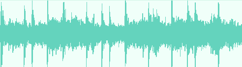

---
title: 1.09. Виды информации
---

# 1.09. Виды информации

  ОБЯЗАТЕЛЬНО
  ДЛЯ НОВИЧКОВ
  НЕ ДЛЯ НОВИЧКОВ
  В РАЗРАБОТКЕ

Всем

📖 Оглавление

1. [Виды информации](#виды-информации)  
2. [А теперь погрузимся](#а-теперь-погрузимся)  
   2.1. [Виды информации](#виды-информации-1)  
      2.1.1. [Текстовая информация](#текстовая-информация)  
      2.1.2. [Графическая информация](#графическая-информация)  
      2.1.3. [Аудиальная информация](#аудиальная-информация)  
      2.1.4. [Видеоинформация](#видеоинформация)  
      2.1.5. [Обобщающая характеристика](#обобщающая-характеристика)  
   2.2. [Немодальные формы информации](#немодальные-формы-информации)  
      2.2.1. [Тактильная (гаптическая) информация](#тактильная-гаптическая-информация)  
      2.2.2. [Обонятельная и гастрономическая информация](#обонятельная-и-гастрономическая-информация)  
      2.2.3. [Вестибулярная и проприоцептивная информация](#вестибулярная-и-проприоцептивная-информация)  
   2.3. [Метаинформация](#метаинформация)  
      2.3.1. [Уровни метаинформации](#уровни-метаинформации)  
      2.3.2. [Форматы представления метаинформации](#форматы-представления-метаинформации)  
      2.3.3. [Проблемы и вызовы](#проблемы-и-вызовы)  
   2.4. [Пересечение метаинформации и видов информации](#пересечение-метаинформации-и-видов-информации)  

## Виды информации

Важно отличать вид информации и тип данных.

★ Виды информации:
	- текст (набор символов в установленной кодировке);
	- графика (матрица пикселей с цветовыми кодами);
	- аудио (оцифрованные звуковые волны);
	- видео (кадры-графика с аудиодорожкой).

---

Это всё будут данные, для компьютера будет лишь набор байтов (ибо он общается лишь на язык сигналов), а для нас – информация:

|Данные|Информация|
|----------|-----------|
Резюме.docx, Файл в формате DOCX| Краткая профессиональная самооценка кандидата на какую-то вакансию, визитная карточка, содержащая информацию о профессиональных достоинствах, квалификации, трудовом опыте.
Cat.jpg, Изображение в формате JPG|	Фотография моего любимого кота породы мейн-кун, сидящего на кресле и смотрящего прямо в камеру величественным взглядом.
Linkin_Park_What_Ive_Done.mp3, Аудиофайл в формате MPEG3| Отличная песня «What I’ve Done» рок-группы Linkin Park, из альбома Minutes To Midnight.
Transformers.avi, Видеофайл в формате AVI|	Американский фантастический фильм «Трансформеры» 2007 года, режиссера Майкла Бэя, снятый по мотивам серии игрушек компании Hasbro.|

---

## А теперь погрузимся

### Виды информации

В рамках информационных технологий, а также в смежных дисциплинах — таких как теория информации, прикладная лингвистика, когнитивные науки и цифровая семиотика — термин *информация* часто употребляется в двух смыслах: как *субъективное содержание*, воспринимаемое человеком, и как *объект обработки*, представленный в вычислительной системе. Эти два аспекта не следует смешивать, поскольку они принадлежат разным онтологическим уровням.  

Компьютер, как физическая машина, оперирует исключительно *данными*: последовательностями битов, упорядоченных по строго определённым правилам хранения, передачи и интерпретации. Человек же оперирует *информацией*: осмысленным содержанием, которое получает в результате декодирования и интерпретации этих данных в рамках своего культурного, языкового и когнитивного контекста.  

Различие между *данными* и *информацией* можно проиллюстрировать следующим образом:  
> *Данные* — это структурированное представление, фиксированное в материальном носителе (например, последовательность байтов в файле на диске).  
> *Информация* — это семантическая нагрузка, которую человек извлекает из этих данных при условии, что он владеет соответствующим ключом интерпретации: знает язык, понимает формат, обладает контекстом и когнитивной способностью к синтезу смысла.

Это различие принципиально для корректного понимания архитектуры цифровых систем и не должно подменяться поверхностными формулировками вроде «информация — это данные, имеющие смысл». Такая фраза, хотя и интуитивно близка, методологически некорректна: смысл не «присутствует» в данных как их свойство, а *возникает* в процессе их интерпретации. Следовательно, вопрос о видах информации требует рассмотрения сколько природы семантического проявления данных — то есть того, *каким образом* и *в каких формах* информация может быть закодирована, передана и воспринята.

В этой связи выделяют **четыре базовых вида информации**, которые соответствуют основным модальностям человеческого восприятия и, соответственно, основным способам её кодирования в цифровой среде:  
1. **текстовая информация** — информация, представленная в виде упорядоченной последовательности знаков (символов), образующих единицы языка (фонемы, морфемы, слова, предложения);  
2. **графическая информация** — информация, представленная в виде пространственного распределения яркостей и цветов, воспринимаемого визуально как изображение;  
3. **аудиальная информация** — информация, представленная в виде временной последовательности звуковых колебаний, воспринимаемой слухом;  
4. **видеоинформация** — композитный вид, объединяющий синхронизированные последовательности графических кадров и аудиального сопровождения.

Все эти виды, несмотря на различия в восприятии и обработке, имеют общую черту: они реализуются через *цифровое кодирование аналоговых феноменов*. Иными словами, каждый из них — результат дискретизации, квантования и последующего представления в бинарной форме того, что в естественной среде существует как непрерывный физический процесс (речь, световые волны, звуковые волны). При этом сама *информация* сохраняется лишь в той мере, в какой кодирование не приводит к потере семантически значимых характеристик — то есть при условии адекватной разрешающей способности (разрешения, частоты дискретизации, глубины цвета и пр.) и правильного выбора методов сжатия.

Рассмотрим каждый из этих видов подробно, обращая особое внимание на то, как именно он реализуется в цифровой форме, какие стандарты и процессы лежат в его основе, и каким образом данные, соответствующие данному виду, трансформируются в информацию для пользователя.

---

#### Текстовая информация

Текстовая информация — наиболее древний и наиболее формализованный способ представления знаний. Её суть заключается в использовании *знаковой системы*, в которой дискретные элементы (символы) соответствуют фонетическим, морфологическим или синтаксическим единицам естественного или формального языка. В отличие от других видов, текст обладает высокой степенью абстракции: он кодирует через условные обозначения, организованные в иерархические структуры (буквы → слова → фразы → абзацы → документы).

Цифровое представление текста требует решения двух задач:  
— *кодирования символов*, то есть установления однозначного соответствия между графемой (например, латинской буквой `A`, кириллической `А`, иероглифом `山`) и числовым кодом;  
— *кодирования структуры*, то есть представления форматирования, разметки, семантических отношений между частями текста (заголовки, списки, цитаты и т.д.).

Первая задача решается с помощью **кодировок** — стандартов, определяющих отображение символов в последовательности битов. Исторически первыми были однобайтовые кодировки (ASCII, CP1251, KOI8-R), способные представить не более 256 символов. Их недостаток — принципиальная невозможность охватить все языки мира в едином пространстве. Решением стал стандарт **Unicode**, предлагающий единое логическое пространство кодовых точек (Code Points), где каждому символу любого известного письма присваивается уникальный номер (например, U+0410 — кириллическая *А*, U+3042 — японский хирагана `あ`). При этом для физического хранения Unicode-символов используются различные *форматы кодирования*: UTF-8 (переменной длины, совместимый с ASCII), UTF-16 (фиксированной или полуфиксированной длины), UTF-32 (фиксированной длины 4 байта).  

Вторая задача — представление структуры — решается на более высоком уровне: через языки разметки (HTML, XML, Markdown), бинарные форматы (DOCX, PDF), или программные структуры (DOM-деревья, AST-деревья). Здесь важно понимать, что сам по себе текстовый файл в UTF-8 — это *плоская последовательность байтов*, не содержащая информации о шрифтах, размерах, полях и пр. Такая метаинформация либо хранится отдельно (в заголовках, стилях, конфигурационных файлах), либо инкапсулируется в составных форматах (например, DOCX — это ZIP-архив, содержащий XML-файлы разметки, стилей, шрифтов и т.д.).

Ключевой особенностью текстовой информации является её *обрабатываемость*: благодаря дискретности и лингвистической структурированности, текст допускает эффективный поиск, анализ (NLP), синтаксический разбор, машинный перевод, генерацию. Это делает его основным носителем *явного знания* в цифровых системах — в отличие от графики или аудио, где знание часто остаётся *неявным* и требует извлечения через сложные алгоритмы (компьютерное зрение, распознавание речи).

---

#### Графическая информация

Графическая информация — это кодирование *пространственного распределения света*, воспринимаемого визуальной системой человека. В аналоговой форме это может быть светочувствительная плёнка, холст с красками, рисунок на бумаге. В цифровой — это *дискретная аппроксимация* непрерывного светового поля, осуществляемая путём разбиения изображения на элементарные участки — **пиксели** (picture elements).

Каждый пиксель характеризуется набором числовых параметров, задающих его визуальные свойства. Наиболее распространённые модели:

- **RGB** (Red, Green, Blue) — аддитивная модель, описывающая цвет как суперпозицию трёх основных цветов света. Каждый компонент обычно представляется 8-битным целым числом (0–255), что даёт 24-битный цвет (≈16,7 млн оттенков).  
- **RGBA** — расширение RGB с альфа-каналом (прозрачность).  
- **CMYK** — субтрактивная модель, используемая в полиграфии (Cyan, Magenta, Yellow, Key/Black).  
- **HSV/HSL** — цилиндрические модели (Hue, Saturation, Value/Lightness), удобные для интерактивного редактирования.

Сами пиксели организуются в **растровую матрицу** — двумерный массив фиксированного размера (например, 1920×1080). Эта матрица и составляет основу *растрового изображения*. Альтернативой является *векторное представление*, где изображение описывается аналитически: как совокупность геометрических примитивов (точек, линий, кривых Безье, фигур) с атрибутами (цвет, толщина, заливка). Векторные форматы (SVG, PDF, AI) масштабируемы без потери качества, но ограничены в передаче фотorealistic-контента.

**Графическое изображение как данные — это не «картинка», а описание состояния светочувствительного сенсора**. Например, RAW-файл с цифровой камеры содержит «сырые» показания матрицы (часто с фильтром Байера), требующие сложной постобработки (демозаикирования, баланса белого, гамма-коррекции). Только после этой обработки получается RGB-изображение, интерпретируемое как информация — скажем, *фотография кота породы мейн-кун*.

Сжатие графики делится на **без потерь** (PNG, GIF, TIFF LZW) и **с потерями** (JPEG, WebP, HEIC). Первое сохраняет все исходные данные, второе — устраняет психовизуально избыточную информацию (высокочастотные компоненты, малозначимые цветовые различия), что позволяет добиться высоких коэффициентов сжатия ценой необратимой деградации. Выбор метода зависит от природы контента: текст и логотипы — в PNG, фотографии — в JPEG.

Графическая информация, в отличие от текстовой, не обладает встроенной семантикой: пиксели сами по себе не «говорят», что на них изображено. Семантика возникает лишь при интерпретации — через распознавание объектов (CNN), извлечение текста (OCR), анализ сцен (computer vision). Таким образом, графика — это *потенциальный носитель информации*, реализуемый только в сочетании с когнитивной или вычислительной системой интерпретации.

---

#### Аудиальная информация

Аудиальная информация — это кодирование *временных колебаний давления в упругой среде*, воспринимаемых слуховой системой как звук. В аналоговой форме звук представляет собой непрерывную функцию амплитуды от времени `s(t)`. Для представления в цифровой системе эта функция подвергается **дискретизации** и **квантованию**, в соответствии с теоремой Котельникова–Шеннона: чтобы точно восстановить исходный сигнал, частота дискретизации `f_s` должна быть не менее чем вдвое выше максимальной частоты `f_{\max}` в спектре сигнала.

Типичные параметры цифрового аудио:

- **Частота дискретизации** (sampling rate):  
  — 8 кГц — телефонное качество (ограниченный диапазон 300–3400 Гц);  
  — 44,1 кГц — стандарт CD-аудио (диапазон до 22,05 кГц, покрывающий слышимый человеком спектр ~20 Гц–20 кГц);  
  — 48 кГц, 96 кГц, 192 кГц — профессиональная и студийная запись (обеспечивают «запас по частоте» для фильтрации и обработки).

- **Разрядность (глубина) квантования** (bit depth):  
  — 8 бит — 256 уровней амплитуды, заметный шум квантования;  
  — 16 бит — 65 536 уровней, динамический диапазон ~96 дБ (стандарт CD);  
  — 24 бит — 16,7 млн уровней, динамический диапазон ~144 дБ (используется при записи и мастеринге для минимизации накопления ошибок).

- **Количество каналов**:  
  — моно (1 канал), стерео (2 канала: L/R), объёмный звук (5.1, 7.1, Dolby Atmos — до 128 объектно-ориентированных аудиодорожек).

В результате этих преобразований непрерывный аналоговый сигнал превращается в последовательность числовых отсчётов — *сэмплов* — обычно представленных в виде целых (PCM, Pulse Code Modulation) или чисел с плавающей точкой (32-bit float в профессиональных DAW). Эта последовательность и составляет *аудиоданные*. Однако сами по себе сэмплы — это не «песня», не «речь», не «шум дождя». Это — временной ряд, лишенный семантики.

Семантика возникает только при интерпретации. Например, последовательность сэмплов в файле `Linkin_Park_What_Ive_Done.mp3` становится *информацией* — «рок-песней о раскаянии и искуплении» — лишь тогда, когда:  
— слушатель владеет английским языком (для понимания текста);  
— обладает культурным контекстом (знаком с жанром ню-метал, с творчеством Linkin Park);  
— способен к эмоциональной и когнитивной обработке музыкальных паттернов (ритм, тембр, динамика).  

Технически файл `.mp3` — это *сжатый поток данных*, полученный с помощью алгоритма MPEG-1/2 Audio Layer III, который использует **психоакустическую модель восприятия** для удаления компонентов, малозаметных или неслышимых для человека:  
— маскировка по времени (сильный звук «заглушает» слабый в течение ~50 мс до и после);  
— маскировка по частоте (сильный тон заглушает соседние частоты);  
— ограничение полосы пропускания (срез высоких частот при низких битрейтах).  

Таким образом, MP3 — это *потеряющая* (lossy) форма представления: данные уменьшаются в объёме за счёт удаления информации, *считаемой избыточной на уровне восприятия*. Однако важно подчеркнуть: *информация* не исчезает полностью — при достаточном битрейте (≥192 кбит/с) семантическое содержание (мелодия, слова, эмоциональный посыл) сохраняется. Это подтверждает, что *информация* — результат *удачной интерпретации* данных.

Альтернативой являются *без потерь* форматы: FLAC, ALAC, WAV (с PCM). Они сохраняют все исходные сэмплы, но не добавляют семантики — только полноту данных, необходимую для архивирования или последующей обработки.

Ключевая особенность аудиальной информации — её *временная локальность*: смысл возникает в динамике, через развитие во времени. Одиночный сэмпл бессмыслен; только последовательность, организованная в ритм, мелодию, фразу, становится носителем информации. Это делает аудио особенно чувствительным к искажениям, задержкам и джиттеру — в отличие от текста или статичной графики, где порядок символов или пикселей фиксирован и устойчив к временным сдвигам.

---

#### Видеоинформация

Видеоинформация — это комбинированный вид, объединяющий **графическую** и **аудиальную** информацию в единой временной шкале. Формально, видео — это *последовательность кадров*, каждый из которых представляет собой растровое изображение, сопровождаемое *аудиодорожкой*, синхронизированной по времени.

Однако в отличие от простого объединения изображения и звука, видео обладает собственной структурой и закономерностями, обусловленными *временной избыточностью* между кадрами. Например, при съёмке статичной сцены 99 % пикселей остаются неизменными от кадра к кадру. Это позволяет использовать **межкадровое сжатие** — ключевую технологию современных видеокодеков.

Основные понятия кодирования видео:

- **Кадр (frame)** — одно изображение в последовательности.  
- **Частота кадров (frame rate)** — количество кадров в секунду (fps):  
  — 24 fps — кинематографический стандарт;  
  — 25 fps — PAL (Европа, СНГ);  
  — 29.97/30 fps — NTSC (США, Япония);  
  — 50/60 fps — для плавного движения (спортивные трансляции, игры).  

- **Типы кадров**:  
  — **I-кадр** (Intra-coded) — сжат *внутри себя*, как отдельное изображение (аналог JPEG); служит точкой доступа;  
  — **P-кадр** (Predictive) — кодируется как разность относительно предыдущего I- или P-кадра;  
  — **B-кадр** (Bidirectional) — использует предсказание *как из прошлого, так и из будущего* (требует буферизации); обеспечивает наивысшую степень сжатия.

Цикл из I-кадра и последующих P/B-кадров называется **GOP** (Group of Pictures). GOP определяет баланс между степенью сжатия и возможностью случайного доступа (seek) — чем длиннее GOP, тем эффективнее сжатие, но тем сложнее начать воспроизведение с произвольного места.

Стандарты видеокодирования развиваются в стороне всё более сложных моделей предсказания:  
— MPEG-2 (DVD, цифровое ТВ);  
— H.264/AVC (широкое применение: YouTube, Blu-ray, видеоконференции);  
— H.265/HEVC (вдвое выше эффективность, чем H.264);  
— AV1 (открытый формат, разработанный Alliance for Open Media);  
— VVC (H.266), EVC — новые поколения, ориентированные на 4K/8K и VR.

Формат контейнера (например, `.avi`, `.mp4`, `.mkv`) — это *упаковка*, содержащая:  
— видеопоток (в кодированном виде: H.264, VP9 и т.д.);  
— один или несколько аудиопотоков (AAC, MP3, Opus);  
— метаданные (тайминги, язык, субтитры, геотеги);  
— иногда — дополнительные дорожки (субтитры в формате SRT/ASS, главы, альтернативные углы съёмки).

Важно разделять:  
— **кодек** — алгоритм *кодирования/декодирования* (H.264 — кодек);  
— **контейнер** — формат *хранения и синхронизации* потоков (.mp4 — контейнер, способный нести H.264 + AAC).

Теперь рассмотрим пример: файл `Transformers.avi`.  
Физически — это последовательность байтов, организованная по спецификации AVI (Audio Video Interleave), разработанной Microsoft в 1992 году. AVI использует RIFF-структуру (Resource Interchange File Format), где данные разбиты на *чанки*: `hdrl` (заголовок), `strl` (потоки), `movi` (медиаданные), `idx1` (индекс). Само видео, скорее всего, закодировано посредством кодека DivX или Xvid (MPEG-4 Part 2), аудио — в MP3 или AC3.

Но *информация* — «американский фантастический фильм „Трансформеры“ 2007 года…» — возникает только при декодировании и воспроизведении:  
— видеопоток → последовательность кадров → зрительная сцена (робот, превращающийся в грузовик);  
— аудиопоток → звуковой ряд (музыка Стива Джаблонски, фраза „Autobots, roll out!“);  
— синхронизация → ощущение целостного нарратива;  
— культурный контекст → узнавание персонажей (Оптимус Прайм, Мегатрон), понимание жанра (научная фантастика, боевик), интерпретация тем (война, преданность, трансформация).

Таким образом, видео — это *мультиканальный поток данных*, семантическая нагрузка которого реализуется только в процессе *интегративного восприятия*: зрительной, слуховой, эмоциональной и когнитивной системами одновременно. Это делает видео наиболее «плотным» по информационному содержанию видом — но и наиболее требовательным к ресурсам обработки, хранения и передачи.

---

#### Обобщающая характеристика

Вернёмся к таблице из тезиса, но теперь с учётом развёрнутого анализа:

| Данные | Информация |
|--------|------------|
| `Резюме.docx` — бинарный объект, соответствующий спецификации Office Open XML (ECMA-376): ZIP-архив, содержащий XML-файлы (`document.xml`, `styles.xml`, `settings.xml`), ресурсы (изображения, шрифты), отношения (relationships). Структура строго регламентирована, валидируется схемами XSD. | Краткая профессиональная самооценка… — семантический конструкт, возникающий у рекрутера при чтении документа. Требует владения языком, понимания профессиональной терминологии, способности к оценке компетенций по косвенным признакам (структура, стиль, конкретика формулировок). |
| `Cat.jpg` — поток байтов, соответствующий формату JPEG (ISO/IEC 10918-1): заголовки (SOI, APP0, DQT, SOF0, DHT, SOS), сжатые коэффициенты ДКП (дискретного косинусного преобразования), таблицы Хаффмана. Восстановление изображения требует обратного ДКП и построчного декодирования. | Фотография моего любимого кота… — личностно значимый образ, активирующий эмоциональные и мемориальные связи. Семантика включает визуальное распознавание (мейн-кун, кресло, взгляд), и *оценку* («величественный»), что выходит за рамки компьютерного зрения. |
| `Linkin_Park_What_Ive_Done.mp3` — поток MPEG-1/2 Layer III: заголовки фреймов, бит-поток с кодированными масками, коэффициентами MDCT, side information. Воспроизведение требует синтеза через обратное MDCT и применения оконных функций. | Отличная песня… — культурно-эмоциональный артефакт. «Отличная» — субъективная оценка, опирающаяся на музыкальный вкус, личный опыт, ассоциации. Информация включает и *значение*: текст как исповедь, музыка как выражение внутреннего конфликта. |
| `Transformers.avi` — RIFF-контейнер, содержащий видеопоток (MPEG-4 ASP), аудиопоток (AC3), индекс смещений. Воспроизведение требует синхронизации clock reference’ов, буферизации, декодирования кадровых типов. | Американский фантастический фильм… — нарративная структура, включающая сюжет, персонажей, визуальный стиль, идеи. Понимание требует знакомства с жанром, мифологией Transformers, кинематографическими конвенциями (монтаж, ракурсы, музыкальное сопровождение как эмоциональный акцент). |

Эти примеры демонстрируют:  
- *Данные* — объективны, измеримы, стандартизированы, воспроизводимы.  
- *Информация* — субъективна, контекстуальна, интерпретируема, зависима от получателя.

Компьютерная система, как таковая, *не производит информации*. Она только сохраняет, преобразует, передаёт данные. Информация возникает **на границе системы и пользователя** — в момент интерпретации. Это фундаментальный принцип, определяющий архитектуру всех цифровых сред: от файловых систем до ИИ. Даже самые продвинутые модели (LLM, diffusion models) генерируют *данные*, имитирующие статистические паттерны обучающих выборок; их превращение в информацию — задача человека.

---

### Немодальные формы информации

Термин *немодальные* здесь употребляется условно: речь идёт о формах информации, которые **не представлены в стандартных цифровых носителях как первичные данные**, либо представлены фрагментарно, либо требуют специализированных интерфейсов для кодирования и воспроизведения. Эти формы соответствуют дополнительным каналам человеческого восприятия, активно задействованным в естественной среде, но слабо интегрированным в повседневные ИТ-системы.

К таким каналам относятся:

#### 1. Тактильная (гаптическая) информация

Тактильная информация — это данные о механическом воздействии на кожу и мышечно-суставный аппарат: давление, вибрация, сдвиг, температура, текстура. В отличие от зрительного или слухового канала, тактильное восприятие *локально-дистантно*: оно требует физического контакта и чувствительно к пространственному градиенту (разнице давления на соседних рецепторах).

В цифровой среде тактильная информация реализуется через **гаптические устройства**:  
— вибромоторы в смартфонах и геймпадах (одночастотная вибрация — примитивная тактильная обратная связь);  
— линейные резонансные актуаторы (LRA) — позволяют формировать импульсы заданной формы и длительности;  
— *force-feedback* устройства (рули, джойстики) — создают сопротивление, имитирующее физическую силу;  
— тактильные дисплеи (например, для слепых) — массив микродвигателей, формирующих рельефные точки по стандарту Брайля или свободные тактильные изображения.

Однако ключевая проблема: **отсутствие универсального формата тактильного контента**. В отличие от RGB для изображений или PCM для звука, для гаптики нет стандартизированной модели представления «тактильного сигнала». Тактильные эффекты обычно задаются процедурно:  
— `vibrate(50ms, amplitude=0.7)`;  
— `apply_force(axis=X, value=-2.3N)`;  
— `render_texture('rough_stone', area=[x1,y1,x2,y2])`.

Ещё сложнее — кодирование *текстуры*. Попытки использовать спектральный анализ вибрационных паттернов (аналогично аудио) или параметризованные модели (трение, жёсткость, вязкость — как в модели *Dahl* или *LuGre*) остаются в области исследований. В 2023 году был предложен формат **OpenHaptics Description Language (OHDL)** — на основе JSON-описаний тактильных примитивов, но широкого внедрения он не получил.

Семантически тактильная информация часто *модулирует* другие виды:  
— вибрация при ошибке ввода текста усиливает восприятие «неправильности»;  
— сопротивление «виртуального упора» в CAD-интерфейсе помогает точнее позиционировать деталь;  
— имитация натяжения струны в VR-инструменте делает игру на гитаре более правдоподобной.

Тем не менее, **самостоятельная тактильная информация** (например, чтение текста на тактильном дисплее) остаётся узкоспециализированной — из-за низкой пропускной способности канала (человек распознаёт ~10–15 тактильных событий в секунду против ~30 кадров/с для зрения).

#### 2. Обонятельная и гастрономическая информация

Обоняние и вкус — хеморецепторные системы, реагирующие на концентрацию и структуру молекул в воздухе или растворе. В отличие от света или звука, химические сигналы представляют собой **дискретные молекулярные события**, что принципиально затрудняет их цифровое кодирование.

Существуют проекты «цифрового запаха» (*digital scent technology*):  
— **Scentee** (2013) — картридж с 10 ароматами, подключаемый к смартфону через аудиоразъём (управление — посредством звукового сигнала);  
— **oPhone** — устройство для передачи «ароматических MIDI-сообщений» («ноты запаха» — базовые компоненты: цветочный, древесный, цитрусовый и т.д.);  
— **Aroma Shooter** — 6-канальный распылитель с быстрым переключением.

Но ни один из них не достиг стандартизации. Причина — в самой природе обоняния:  
— у человека ~400 типов обонятельных рецепторов, но восприятие запаха нелинейно и зависит от концентрации, смеси, адаптации;  
— не существует «базиса запахов», аналогичного RGB. Попытки выделить 7–10 «первичных запахов» (эфирный, камфорный, мускусный и др.) не подтверждены нейрофизиологически;  
— запахи обладают сильной **ассоциативной и эмоциональной нагрузкой**, но слабой **дескриптивной способностью**: мы не можем «записать» запах словами так же точно, как изображение — пикселями.

Гастрономическая информация (вкус, послевкусие, консистенция, температура) ещё сложнее: она включает не только хеморецепцию (сладкое, солёное, кислое, горькое, умами), но и механорецепцию (хруст, вязкость), терморецепцию (горячее/холодное), хеместезис (острота перца, прохлада мяты). Ни один цифровой интерфейс не способен воспроизвести её в полноте. Исследования в области *гастроскопии* (например, проект **Virtual Cocktail** от NTT) используют электростимуляцию языка для имитации кислого или солёного — но это лишь грубая аппроксимация.

Таким образом, обонятельная и гастрономическая информация в цифровой среде остаются **потенциальными видами**, реализуемыми только в узких лабораторных или коммерческих нишах (VR-тренажёры для пожарных, симуляторы дегустации). Их данные — это управляющие сигналы для испарителей или электродов; информация — субъективное ощущение, возникающее при физическом контакте с веществом.

#### 3. Вестибулярная и проприоцептивная информация

Эти каналы обеспечивают восприятие положения тела в пространстве, ускорения, гравитации. В цифровых системах они моделируются косвенно:  
— через визуальное движение (симуляция полёта в VR);  
— через гаптику (вибрация при «ударе», наклон сиденья в симуляторе);  
— через инерциальные сенсоры (IMU в шлемах VR — для отслеживания ориентации головы).

Однако прямой код «вестибулярного сигнала» не существует: человеческий вестибулярный аппарат реагирует на угловые и линейные ускорения, которые нельзя передать по каналу связи без физического перемещения. Поэтому при несоответствии визуального и вестибулярного сигнала возникает **кинематоз** (motion sickness) — фундаментальное ограничение для полностью погружённых VR/AR-сред.

---

### Метаинформация

Метаинформация — это *информация о данных*, предназначенная для **управления их интерпретацией, обработкой, поиском и управлением жизненным циклом**. В отличие от основных видов, метаинформация не направлена на прямое восприятие пользователем; её потребитель — как правило, программное обеспечение (ОС, приложения, поисковые системы, архивы), либо человек-специалист (библиотекарь, архивист, инженер).

Ключевое свойство метаинформации — **опосредованность**: она не содержит семантики первичного контента, но *позволяет её извлечь*.

#### Уровни метаинформации

1. **Техническая метаинформация** — описывает структуру и параметры данных.  
   Примеры:  
   — в JPEG: `APP0`-сегмент c JFIF-заголовком (версия, плотность пикселей); `DQT` — таблицы квантования; `SOF0` — размер изображения, количество компонентов;  
   — в MP3: заголовок фрейма (версия MPEG, частота дискретизации, битрейт, режим стерео);  
   — в AVI: `strh`-чанк — тип потока (video/audio), кодек (`fccHandler`), частота кадров/сэмплов; `strf` — формат-специфичные данные (для видео — BITMAPINFOHEADER; для аудио — WAVEFORMATEX).

   Эта метаинформация *обязательна* для корректного декодирования. Без неё данные становятся «мёртвым грузом» — последовательностью байтов без ключа интерпретации.

2. **Дескриптивная метаинформация** — описывает *семантическое содержание*.  
   Примеры:  
   — **EXIF** (Exchangeable Image File Format) — дата/время съёмки, модель камеры, выдержка, диафрагма, GPS-координаты, ориентация;  
   — **ID3v2** — исполнитель, альбом, трек, жанр, текст песни, обложка альбома (встроенное изображение);  
   — **XMP** (Extensible Metadata Platform) — расширяемая XML-структура, встраиваемая в PDF, JPEG, TIFF; поддерживает Dublin Core, IPTC, права (Copyright), ключевые слова, история редактирования;  
   — **DOCX**: в `core.xml` — автор, создание/модификация, категория; в `app.xml` — количество страниц, слов, строк.

   Дескриптивная метаинформация повышает *поисковую релевантность* и *управляемость*: файл можно найти по «автору: Тимур» или «GPS: 55.75, 37.62», не открывая его.

3. **Административная метаинформация** — управляет жизненным циклом и доступом.  
   Примеры:  
   — права доступа (ACL в NTFS, POSIX-права в Unix);  
   — временные метки (ctime, mtime, atime);  
   — контрольные суммы (MD5, SHA-256 в архивах);  
   — цифровые подписи и сертификаты (в PDF/A, S/MIME);  
   — политики хранения (retention policy в ECM-системах: «удалить через 5 лет»).

4. **Структурная метаинформация** — описывает связи между частями составного объекта.  
   Примеры:  
   — в PDF: дерево страниц, иерархия закладок, связи в формах (AcroForm);  
   — в MPEG-TS: PID-метки, таблицы PAT/PMT для мультиплексирования потоков;  
   — в EPUB: `content.opf` — манифест ресурсов, spine (порядок чтения), метаданные.

#### Форматы представления метаинформации

— **Встроенные** (embedded): хранятся внутри основного файла (EXIF в JPEG, ID3 в MP3). Преимущество — атомарность; недостаток — зависимость от кодека/формата.  
— **Сопутствующие** (sidecar): отдельные файлы (`.xmp`, `.cue` для аудио-CD, `.srt` для субтитров). Гибкость: можно обновлять без перекодирования основного контента.  
— **Внешние** (external): базы данных, индексы (Windows Search Index, Spotlight в macOS, Elasticsearch). Масштабируемость, но риск рассогласования (файл переименован — индекс устарел).

#### Проблемы и вызовы

— **Фрагментация стандартов**: EXIF, IPTC, XMP частично дублируют поля («автор» есть везде, но с разными URN).  
— **Потеря при конвертации**: при сохранении JPEG → PNG EXIF теряется, если не скопирован явно.  
— **Приватность**: GPS-координаты в фото могут раскрыть местоположение; метаданные документа — внутреннюю структуру организации.  
— **Интероперабельность**: не все приложения читают XMP; некоторые редакторы «забывают» обновить дату модификации.

---

### Пересечение метаинформации и видов информации

Метаинформация сама может *принадлежать* определённому виду:  
— текстовые поля («название», «автор») — это *текстовая информация* о данных;  
— встроенная обложка альбома в MP3 — *графическая информация*;  
— анализ акустических отпечатков (audio fingerprinting) — извлечение *аудиоинформации* для идентификации трека.

Таким образом, метаинформация **надстраивается** над базовыми модальностями, создавая семантический каркас, без которого данные остаются «немыми».

---