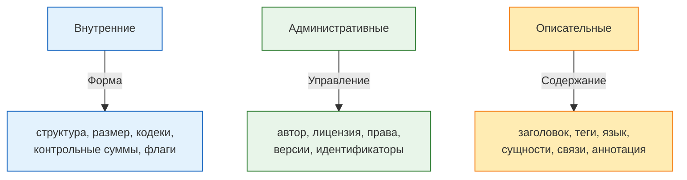

---
title: Метаданные
tags: [beginner, advanced, notrequired, analytic, developer, architector]
description: Классификация, понятие и примеры метаданных.
---

# Метаданные

  ОБЯЗАТЕЛЬНО
  ДЛЯ НОВИЧКОВ
  НЕ ДЛЯ НОВИЧКОВ
  В РАЗРАБОТКЕ

Разработчику
Аналитику
Архитектору

## Метаданные

**Метаданные** — это информация, которая описывает другие данные. Они выполняют функцию контекстуального сопровождения, позволяя понимать, находить, организовывать и управлять информационными объектами. Метаданные не заменяют основное содержание, но делают его доступным, структурированным и пригодным для автоматической обработки.

Термин происходит от греческого *meta* — «после», «за», «над», и в современном употреблении обозначает «уровень над», «уровень описания» или «второй слой». В IT-контексте метаданные выступают как инструмент повышения осмысленности данных, превращая их из массива символов в управляемый информационный актив.

### Сущность метаданных

Метаданные добавляют к данным внешнюю или встроенную атрибутивную информацию: кто создал, когда, каким способом, в каком формате, с какой целью, в каком состоянии. Такая информация делает данные пригодными для повторного использования, поиска, верификации и совместной работы.

Метаданные не являются самостоятельной информацией. Они служат опорой для работы с основными данными, выстраивая вокруг них каркас, который облегчает взаимодействие с человеком или системой. Представление метаданных как «этикеток на коробках» отражает их функцию: этикетка не содержит товара, но говорит о том, что внутри, в каких условиях хранится, кто упаковал и когда.

Метаданные могут быть как встроенными в сам файл или структуру данных, так и храниться отдельно — в каталогах, базах данных, индексах или внешних реестрах. В любом случае их задачей остаётся поддержка целостности, доступности и интерпретируемости информации.

Важно отметить, что граница между данными и метаданными условна. Заголовок документа, например, входит в текст, но одновременно используется как ключевой признак при индексации. В этом смысле метаданные — часть системы описания, а не просто надстройка.

---

### Три основных класса метаданных

В практике управления информацией выделяют три базовых класса метаданных, отличающихся направленностью и уровнем детализации:

#### Внутренние метаданные

**Внутренние метаданные** описывают техническую структуру и физические характеристики объекта. Они задают форму, а не содержание. К ним относятся:

- формат файла (JPEG, MP3, PDF/A-1b и др.);
- размер в байтах;
- разрешение изображения;
- длительность аудио- или видеозаписи;
- битрейт;
- кодеки;
- геометрические параметры (ширина, высота, соотношение сторон);
- контрольные суммы (CRC32, MD5, SHA-256);
- флаги состояния (архивный, скрытый, только для чтения);
- даты создания, модификации и последнего доступа.

Эти метаданные генерируются автоматически при создании, сохранении или конвертации файла. Операционные системы и программные средства опираются на них при отображении, сортировке и выполнении операций. Внутренние метаданные обеспечивают совместимость и стабильность работы с данными.

#### Административные метаданные

**Административные метаданные** поддерживают процессы управления жизненным циклом информации. Они фиксируют события, права и действия, связанные с объектом:

- автор и соавторы;
- редакторы и рецензенты;
- организация-владелец;
- лицензия (CC BY-SA 4.0, MIT, GPL и т. п.);
- права доступа и распределение ролей (ACL, RBAC);
- дата публикации, регистрации, архивирования;
- идентификаторы (DOI, ISBN, UUID, GUID);
- пути хранения и резервного копирования;
- журналы изменений (история версий, откаты);
- состояние обработки (черновик, утверждён, заблокирован, удалён).

Эти метаданные критичны для систем управления документами (DMS), систем электронного документооборота (СЭД), архивов и библиотечных каталогов. Они отвечают за аудит, соответствие требованиям и юридическую значимость информации.

#### Описательные метаданные

**Описательные метаданные** характеризуют содержательную суть объекта. Они делают данные пригодными для поиска и интерпретации:

- заголовок и подзаголовок;
- аннотация, краткое содержание;
- ключевые слова и теги;
- тематическая рубрикация;
- язык содержания;
- географическая привязка;
- именованные сущности (люди, организации, события);
- жанр, тип, категория;
- связи с другими объектами (ссылки, цитирования, зависимости);
- оценки, рейтинги, рецензии.

Эти метаданные используются в поисковых системах, цифровых библиотеках, рекомендательных алгоритмах. Их качество напрямую влияет на точность и релевантность поисковых результатов.

---

### Места встречи метаданных в повседневной практике

Метаданные присутствуют практически везде, где есть структурированная информация. Ниже перечислены типичные области их применения с пояснениями.

#### Фотографии и изображения

Фотофайлы, особенно в формате JPEG, TIFF и PNG, несут в себе внушительный объём метаданных. Наиболее известный стандарт — **EXIF** (Exchangeable Image File Format), разработанный Japan Electronic Industries Development Association (JEIDA) и позже принятый CIPA.

EXIF включает:

- параметры съёмки: выдержка, диафрагма, ISO;
- модель и производитель камеры;
- ориентация изображения;
- геолокация (GPS координаты);
- цветовой профиль;
- дата и время создания;
- информация о программной обработке (например, коррекция в Adobe Lightroom).

Помимо EXIF, в изображениях применяются:

- **IPTC** — стандарт Международного комитета по телеграфной прессе, ориентированный на новостные агентства: информация об авторе, источнике, копирайтах, заголовке, ключевых словах, описании сюжета;
- **XMP** (Extensible Metadata Platform) — гибкий XML-ориентированный формат от Adobe, позволяющий встраивать метаданные в файлы PDF, JPEG, TIFF, PSD и другие. XMP поддерживает наследуемые свойства, множественные значения и пространства имён, что делает его особенно удобным для профессиональных рабочих процессов;
- **ICC-профили** — технические метаданные о цветовых характеристиках устройства и файла, обеспечивающие цветовую согласованность при выводе.

Метаданные в изображениях легко просматриваются через средства операционной системы (например, свойства файла в Windows или `exiftool` в Linux), а также специализированные редакторы: Adobe Bridge, digiKam, GIMP, Pixelmator.

Редактирование и удаление метаданных возможно вручную через те же инструменты. Например, `exiftool -all= image.jpg` удалит все метаданные из фотографии. Это применяется при подготовке изображений к публикации для защиты конфиденциальности (удаление геотегов, модели камеры, пути на диске).

#### Аудиофайлы

Звуковые форматы используют несколько стандартов встраиваемых метаданных:

- **ID3** — стандарт для MP3-файлов. ID3v1 располагается в конце файла и вмещает базовые поля (исполнитель, альбом, трек, жанр, год). ID3v2 размещается в начале, поддерживает расширяемую структуру тегов, изображения обложек (APIC-фреймы), тексты песен, ссылки на лицензии, временные метки (lyrics sync);
- **APEv2** — альтернативный формат метаданных, первоначально разработанный для Monkey’s Audio (APE), но совместимый и с MP3. Он позволяет хранить несколько значений в одном поле (например, несколько исполнителей), а также бинарные данные;
- **Vorbis Comments** — метаданные в форматах Ogg Vorbis, FLAC, Opus. Это простой текстовый формат «ключ=значение», свободный от патентных ограничений. Поддерживает UTF-8, повторяющиеся ключи, произвольные имена полей (в пределах ASCII-совместимости).

Для просмотра и редактирования аудиометаданных используются утилиты:  
`mp3tag` (Windows), `Kid3` (кроссплатформенный), `ffmpeg` (через опции `-metadata`), `mutagen` (Python-библиотека).

Важная особенность: метаданные в аудиофайлах не влияют на воспроизведение звука, но определяют поведение медиаплееров — отображение названия трека, группировка по альбомам, создание плейлистов.

#### Видеофайлы

Видеоконтент поддерживает метаданные на нескольких уровнях:

- **Контейнерный уровень** (MP4, MKV, AVI, MOV): метаданные о программе кодирования, длительности, битрейте, языке дорожек, субтитрах, главах, авторских правах;
- **Уровень дорожек**: отдельные метаданные для видеопотока, аудиодорожек, субтитров — например, язык, роль (основная, комментарий, дескрипция для слабовидящих);
- **Уровень сцен**: в профессиональных форматах (MXF, QuickTime) возможны временные метки сцен, ключевых кадров, распознанных лиц, объектов.

Инструменты для работы: `MediaInfo`, `mkvpropedit`, `ffmpeg -i input.mp4 -map_metadata …`, `exiftool`.

#### Документы (Word, PDF, OpenDocument)

Текстовые документы содержат административные и описательные метаданные в служебных разделах:

- В Microsoft Word — в свойствах файла: автор, компания, ключевые слова, категории, комментарии редактора (следы совместной работы);
- В PDF — в XMP-пакете и в словаре информации о документе (Document Information Dictionary): заголовок, тема, автор, ключевые слова, создатель (программа), продукт (версия ПО), дата создания и модификации;
- В OpenDocument (ODT, ODS) — метаданные хранятся в XML-файлах внутри ZIP-архива (`meta.xml`), включая статистику (число слов, символов), историю версий, шаблоны.

Следует учитывать: многие офисные приложения по умолчанию сохраняют пользовательские идентификаторы, пути к файлам, имена компьютеров. При публикации документов рекомендуется проводить «очистку метаданных». В Word это делается через «Файл → Проверка документа», в PDF — через Adobe Acrobat Pro («Удалить скрытую информацию») или утилиты вроде `pdf-redact-tools`.

#### Веб-страницы и HTML

HTML-документ содержит два основных типа метаданных:

- **Структурные метаданные**, задаваемые элементами в `<head>`:
  - `<title>` — заголовок страницы, отображаемый в закладках и результатах поиска;
  - `<meta name="description" content="…">` — описание, используемое поисковыми системами как сниппет;
  - `<meta name="keywords" content="…">` — ключевые фразы (устаревший, но иногда анализируемый фактор);
  - `<meta charset="…">`, `<meta http-equiv="…">` — директивы обработки;
  - `<link rel="canonical" href="…">` — указание канонического URL;
  - `<meta name="viewport" content="…">` — инструкции для мобильных устройств;
- **Семантические метаданные**, встроенные через стандарты:
  - **Open Graph Protocol (OGP)** — набор `<meta property="og:…">`, используемый Facebook, Telegram, WhatsApp для генерации превью при шеринге;
  - **Schema.org** — микроразметка в форматах JSON-LD, RDFa, Microdata, позволяющая явно описывать сущности (продукт, событие, организация, персона) для поисковых систем;
  - **Dublin Core** — `<meta name="DC.title" content="…">` и др., используется в научных и библиотечных контекстах.

Эти метаданные не отображаются в основном теле страницы, но критичны для SEO, социального распространения и машинного понимания содержания.

#### Электронная почта

Каждое письмо состоит из двух частей: заголовка (headers) и тела (body). Заголовок целиком представляет собой набор метаданных:

- `From`, `To`, `Cc`, `Bcc`;
- `Subject`;
- `Date`;
- `Message-ID`;
- `In-Reply-To`, `References` — цепочка переписки;
- `MIME-Version`, `Content-Type`, `Content-Transfer-Encoding`;
- `X-Mailer`, `X-Originating-IP` — технические атрибуты клиента и сервера;
- `DKIM-Signature`, `SPF`, `DMARC` — метаданные проверки подлинности.

Эти данные проходят через множество узлов, и каждый сервер может добавлять свои теги (например, `Received: from … by …`). Анализ заголовков позволяет определить маршрут письма, выявить фишинг или спам, восстановить цепочку рассылки.

#### Программирование и разработки

В экосистеме разработки метаданные выполняют роль самоописания и документирования:

- В .NET сборках — **атрибуты** (`[Serializable]`, `[Obsolete]`, `[Description]`) и **рефлексия**: через `System.Reflection` можно получить имена типов, методов, параметров, их типы, модификаторы доступа, XML-комментарии (если включена генерация XML-документации);
- В Java — **аннотации** (`@Override`, `@Deprecated`, `@Documented`), Javadoc, манифест JAR-файла (`Main-Class`, `Implementation-Version`);
- В TypeScript — типы, интерфейсы, JSDoc-комментарии, `tsconfig.json` (настройки проекта как метаданные сборки);
- В Python — докстринги, `__annotations__`, `typing`, `pyproject.toml`, `__version__`, `__author__` (соглашение PEP 8);
- В REST API — метаданные в заголовках (`Content-Type`, `ETag`, `Last-Modified`), тело ответа может включать поле `meta`, содержащее пагинацию, права, тип коллекции.

Эти метаданные позволяют инструментам (IDE, линтерам, сборщикам, тестовым фреймворкам) работать с кодом как с описанным объектом, а не как с текстом.

#### Базы данных

Реляционные СУБД содержат системные каталоги (например, `information_schema` в PostgreSQL и MySQL), где хранятся метаданные:

- имена и типы таблиц, представлений, индексов;
- имена и типы столбцов;
- ограничения (`PRIMARY KEY`, `FOREIGN KEY`, `CHECK`, `UNIQUE`);
- права доступа;
- комментарии к объектам (в PostgreSQL — `COMMENT ON TABLE…`);
- статистика использования (для оптимизатора запросов).

В NoSQL-системах (MongoDB, Elasticsearch) метаданные представлены менее формализованно, но также присутствуют:  
- в MongoDB — коллекции `system.indexes`, `system.js`, информация о шардах;  
- в Elasticsearch — маппинг индекса (описание полей, типов, анализаторов), индексные шаблоны, алиасы.

Метаданные баз данных используются при миграциях, резервном копировании, визуализации схем, генерации ORM-моделей.

---

### Форматы метаданных

Метаданные сами по себе не обладают смыслом вне контекста структуры, в которой они выражены. Формат метаданных — это соглашение о том, какие атрибуты используются, как они именуются, как связаны друг с другом, какие допустимые значения принимают, и как кодируются. Формат обеспечивает единообразие интерпретации, обмен и совместимость между системами.

Формат метаданных — это не просто список полей, а **модель описания**, в которой определены:

- элементы (поля, теги, свойства);
- иерархия элементов (вложенность, зависимости);
- типы данных для значений (строка, дата, URI, целое число, перечисление);
- правила обязательности и повторяемости;
- пространства имён;
- механизм расширения;
- методы сериализации (XML, JSON, RDF, бинарные блоки).

Когда метаданные организованы в жёстко определённую иерархию с семантическими связями («является подклассом», «имеет часть», «связан с»), такую структуру называют **схемой метаданных**. Если схема включает не только классы и свойства, но и логические аксиомы (например, «если A — автор B, и B — часть C, то A — соавтор C»), она выходит на уровень **онтологии** — формального представления предметной области, пригодного для машинного вывода.

#### Стандарты и их разработчики

Большинство востребованных форматов метаданных создаются международными консорциумами, профессиональными ассоциациями и органами по стандартизации. Среди ключевых участников:

- **W3C** (World Wide Web Consortium) — разработчик RDF, OWL, Schema.org, SKOS, Dublin Core Terms;
- **ISO** (International Organization for Standardization) — автор ISO 15836 (Dublin Core), ISO 25577 (MODS), ISO 21127 (CIDOC CRM);
- **IETF** (Internet Engineering Task Force) — создатель RFC-документов, включая MIME, HTTP-заголовки, Open Graph (изначально Facebook, но опирается на IETF-стандарты);
- **NISO** (National Information Standards Organization) — куратор метаданных для научных публикаций (JATS, COUNTER);
- **CIPA**, **JEITA**, **IEEE** — участники создания EXIF, IPTC IIM, XMP.

Стандарты проходят длительный цикл разработки: от draft-версий и пилотных внедрений — к официальному признанию, а затем — к рефакторингу или замене (например, ID3v1 → ID3v2.3 → ID3v2.4; Dublin Core Simple → Qualified Dublin Core → DCMI Terms в RDF).

---

### Классификация форматов метаданных

Форматы можно упорядочить по нескольким признакам. Один из наиболее практических — **предметная область**, для которой формат предназначен.

#### Для общих ресурсов и веб-контента

- **Dublin Core (DC)** — один из самых ранних и широко внедрённых форматов. Первоначально включал 15 элементов (Title, Creator, Subject, Description, Publisher, Contributor, Date, Type, Format, Identifier, Source, Language, Relation, Coverage, Rights). Позже развился в **DCMI Metadata Terms** — расширенный набор свойств и классов, совместимый с RDF. Dublin Core используется в OAI-PMH, в метатегах HTML (`<meta name="DC.title">`), в электронных библиотеках, архивах, цифровых коллекциях.

- **Schema.org** — инициирован Google, Bing, Yahoo!, Yandex. Представляет собой согласованную словарную систему типов и свойств (Person, Organization, Article, Product, Event и др.), пригодную для разметки HTML с помощью JSON-LD, Microdata или RDFa. Schema.org не является форматом сам по себе, а служит словарём, который можно использовать внутри других форматов. Его главное достоинство — прямая поддержка поисковыми системами: корректная разметка влияет на появление расширенных сниппетов (звездные рейтинги, хлебные крошки, часы работы).

#### Для библиотечно-библиографического описания

- **MARC (Machine-Readable Cataloging)** — семейство форматов, разработанное Library of Congress (США). MARC 21 используется в англоязычных странах, UNIMARC — в Европе и Азии, RUSMARC — национальная адаптация для России. MARC описывает книги, статьи, аудиозаписи, карты и т. п. с высокой детализацией: индивидуальные поля для ISBN, ISSN, UDC, ББК, авторских примечаний, аналитических записей, серийных номеров. MARC представлен в виде бинарного или текстового потока с тегами, индикаторами и подполями (например, `245 10 $a Основы теории информации $b учебное пособие $c А. Н. Колмогоров`).

- **MODS (Metadata Object Description Schema)** — XML-схема, разработанная Library of Congress как упрощённая альтернатива MARC. MODS сохраняет выразительность MARC, но представлена в человекочитаемом виде, поддерживает иерархию и повторяемость элементов. Часто используется при обмене данными между библиотеками и цифровыми архивами.

- **MADS (Metadata Authority Description Schema)** — дополняет MODS, фокусируясь на описание лиц, организаций и тем (авторитетные списки).

#### Для архивных и музейных коллекций

- **EAD (Encoded Archival Description)** — стандарт XML-разметки описания архивных фондов и дел. Позволяет отражать иерархию (фонд → опись → дело → лист), даты, состав, ограничения доступа.

- **CDWA (Categories for the Description of Works of Art)** — разработан Getty Research Institute. Описывает художественные произведения, их создателей, техники, материалы, историю владения, выставки. Лег в основу онтологии **CIDOC CRM** (ISO 21127), ставшей *де-факто* стандартом для музеев.

#### Для медиа и цифрового контента

- **IPTC IIM (Information Interchange Model)** — бинарный блок в заголовке изображения (чаще всего JPEG), используемый новостными агентствами. Поддерживает поля: Caption/Abstract, Keywords, By-line (фотограф), Credit, Source, Copyright Notice. Устаревает в пользу XMP.

- **XMP (Extensible Metadata Platform)** — формат от Adobe, основанный на RDF/XML. Позволяет встраивать метаданные любого пространства имён (Dublin Core, IPTC Core, PLUS Licensing, Camera Settings) в один пакет. XMP может быть вложен в файл (JPEG, PDF, TIFF, PSD) или храниться отдельно в `.xmp`-файле. Поддерживает автоматическое наследование («дочерние» файлы наследуют метаданные родителя), историю изменений, цифровые подписи.

#### Для издательской и новостной продукции

- **ONIX (Online Information Exchange)** — XML-стандарт описания книг для электронной торговли. Включает информацию о формате, ценах, доступности, возрастных ограничениях, рекламных материалах, ISBN, связях с другими изданиями (переводы, переиздания).

- **PRISM (Publishing Requirements for Industry Standard Metadata)** — спецификация для периодики и цифровых публикаций. Расширяет Dublin Core, добавляя элементы: `prism:publicationName`, `prism:issueIdentifier`, `prism:copyright`, `prism:doi`.

- **NewsML-G2** — XML-стандарт, разработанный IPTC для обмена новостными материалами (тексты, фото, видео, графика). Описывает не только содержание, но и права, маршрут доставки, целевую аудиторию.

#### Для научных данных

- **DataCite Metadata Schema** — фокусируется на описании научных датасетов: авторы, дата публикации, методология, связанные публикации, лицензия, идентификатор DOI.

- **ISO 19115** — международный стандарт геопространственных метаданных. Описывает координатные системы, охват, качество данных, источники, обработку. Используется в GIS-системах.

- **CIF (Crystallographic Information File)** — текстовый формат для описания кристаллических структур: параметры ячейки, атомные координаты, симметрия.

---

### Протоколы и API для работы с метаданными

Метаданные редко существуют изолированно — они передаются, извлекаются, агрегируются и индексируются. Для этого разработаны специализированные протоколы.

#### OAI-PMH (Open Archives Initiative Protocol for Metadata Harvesting)

Простой HTTP-based протокол, позволяющий «собирать» (harvest) метаданные из удалённых репозиториев. Репозиторий выступает как *провайдер*, клиент — как *харвестер*. Поддерживает два формата: **Dublin Core** (обязательно) и произвольные дополнительные (MODS, EAD и др.). Используется цифровыми библиотеками (DSpace, Fedora, EPrints) для централизованного поиска по множеству хранилищ.

#### SPARQL

Язык запросов к RDF-хранилищам (triple stores). Позволяет не просто извлекать метаданные, но выполнять сложные логические операции: объединение по связям, фильтрация по классам, вывод на основе онтологий. SPARQL-эндпоинты предоставляют доступ к DBpedia, Wikidata, Europeana.

#### RESTful API с метаданными

Многие сервисы (GitHub API, CrossRef, DataCite, CrossRef) возвращают метаданные в JSON или XML. Например, запрос `GET https://api.crossref.org/works/10.1038/nature12373` вернёт полную библиографическую запись статьи в JSON, включая авторов, журнал, DOI, абстракт, лицензию.

В теле ответа часто присутствует объект `meta`, содержащий:
- общее число результатов;
- текущую страницу и размер страницы;
- ссылки на `first`, `prev`, `next`, `last`;
- права доступа текущего пользователя;
- версию API.

---

### Метафайлы и внешние реестры

Не все метаданные встраиваются в основной файл. Нередко они выносятся во внешние сущности — для гибкости, безопасности или масштабируемости.

#### Метафайлы

Метафайл — отдельный файл, сопровождающий основной ресурс и содержащий его описание. Примеры:

- `.sidecar`-файлы в фотографии: при обработке RAW-файлов (CR2, NEF, ARW) редакторы (Lightroom, Darktable) сохраняют настройки в `.xmp`-файле того же имени. Это сохраняет оригинальный RAW нетронутым;
- `.torrent` — метафайл для BitTorrent: содержит список файлов, их хеши, адреса трекеров, информацию о создателе;
- `.nfo` — текстовые файлы с описанием релиза (часто в демосцене и в торрентах);
- `.m3u8`, `.pls` — плейлисты, где каждый элемент — ссылка на медиафайл плюс метаданные (название, длительность).

Преимущество метафайлов — отделение описания от содержания, возможность версионного контроля только метаданных, совместимость с системами, не поддерживающими встроенные теги.

#### Внешние реестры и каталоги

Крупные организации используют централизованные хранилища метаданных:

- **Глобальные идентификаторы**: DOI (DataCite, CrossRef), Handle System, ARK — позволяют зарегистрировать ресурс и получить постоянную ссылку, разрешающуюся в текущий URL и метаданные;
- **Центральные каталоги**: WorldCat (OCLC) — объединённый каталог библиотек мира; Zenodo, Figshare — репозитории научных данных с DOI-регистрацией;
- **Корпоративные метахранилища**: Apache Atlas, Collibra, Alation — платформы управления метаданными в enterprise-средах. Они собирают метаданные из источников (БД, ETL-процессы, API), обеспечивают поиск, анализ влияния, управление терминологией (глоссарии), качество данных (data lineage, profiling).

Внешние реестры особенно важны при работе с распределёнными данными: они позволяют согласовать понятия (например, «Клиент» в CRM и «Плательщик» в биллинге — это один и тот же бизнес-объект) и отслеживать происхождение информации.

---

### Теги как упрощённая форма описательных метаданных

Тег — это ключевое слово или фраза, назначаемая объекту вручную или автоматически. Теги формируют **неиерархическую**, **повторяемую**, **многозначную** систему категоризации.

Характерные черты тегов:

- Отсутствие строгой таксономии (в отличие от рубрикаторов);
- Возможность множественной привязки (один объект — много тегов);
- Гибкость и скорость назначения;
- Риск дублирования (`web`, `Web`, `веб`, `интернет`);
- Эволюция во времени (теги могут уточняться, объединяться, удаляться).

Теги используются в:

- социальных сетях (хештеги в Twitter, Instagram);
- блог-платформах (WordPress, Medium);
- системах управления знаниями (Obsidian, Notion, Roam Research);
- медиатеках (iTunes, Plex);
- браузерных закладках.

Для повышения качества применяются практики:

- **Контролируемый словарь** — список разрешённых тегов (как в библиотечных предметных рубриках);
- **Синонимизация** — автоматическое объединение вариантов (`машинное обучение` → `ML`);
- **Вес тега** — отражение частоты или значимости (часто используется в облаках тегов);
- **Контекстные теги** — теги с префиксами (`lang:ru`, `status:draft`, `audience:junior`).

Теги — не замена полноценным метаданным, а инструмент быстрой навигации и фасетного поиска.

---

### Практические рекомендации по управлению метаданными

Эффективное обращение с метаданными требует системного подхода. Ниже — ключевые принципы, применимые в проектах любого масштаба.

#### 1. Определите цели использования

Перед выбором формата и глубины проработки стоит ответить на вопросы:

- Для чего нужны метаданные? (поиск, аудит, совместимость, SEO, машинная интерпретация)
- Кто будет их создавать? (автоматически система / вручную пользователи)
- Кто будет их потреблять? (люди / программы / поисковые роботы)
- Какие операции должны поддерживаться? (фильтрация, сортировка, экспорт, наследование)

Цели определяют, какие классы метаданных приоритетны и насколько формализованной должна быть структура.

#### 2. Используйте профили метаданных

Полные стандарты (MARC, CIDOC CRM) слишком объёмны для повседневного применения. На практике создаются **профили** — подмножества элементов, адаптированные под конкретный кейс. Например:

- Профиль Dublin Core для школьного архива: Title, Creator, Date, Subject (с контролируемым словарём из 20 тем), Audience («начальная школа», «средняя школа»);
- Профиль EXIF для фотоотчётов: Camera Model, DateTime, GPSLatitude, GPSLongitude, UserComment (обязательное поле для описания съёмки).

Профиль фиксируется в документе — требованиях или спецификации — и становится основой для контроля качества.

#### 3. Автоматизируйте генерацию

Ручной ввод метаданных — источник ошибок и неполноты. По возможности:

- Извлекайте внутренние метаданные при загрузке (размер, дата, хеш);
- Интегрируйте с системами авторизации (автор = текущий пользователь);
- Анализируйте содержание (NLP для извлечения ключевых слов, CV для распознавания лиц на фото);
- Используйте шаблоны (например, при создании документа по ГОСТ автоматически проставляется `DocumentType=Report`, `Standard=GOST 7.0.97-2016`).

#### 4. Обеспечьте согласованность

- Ведите глоссарий терминов (что значит «Дата публикации» — принятие к печати или выход в свет?);
- Назначайте ответственных за поддержку метаданных;
- Проводите аудиты (например, сканирование архива на наличие пустых `Description`);
- Используйте валидацию при импорте/сохранении (проверка формата даты, обязательных полей, допустимых значений).

#### 5. Планируйте эволюцию

Метаданные — не статичный атрибут. Добавляются новые поля, уточняются значения, меняются стандарты. Важно предусмотреть:

- Механизм миграции (например, скрипт преобразования ID3v1 → ID3v2);
- Поддержку нескольких версий формата;
- Обратную совместимость (новые системы должны читать старые метаданные);
- Документирование изменений.

---

