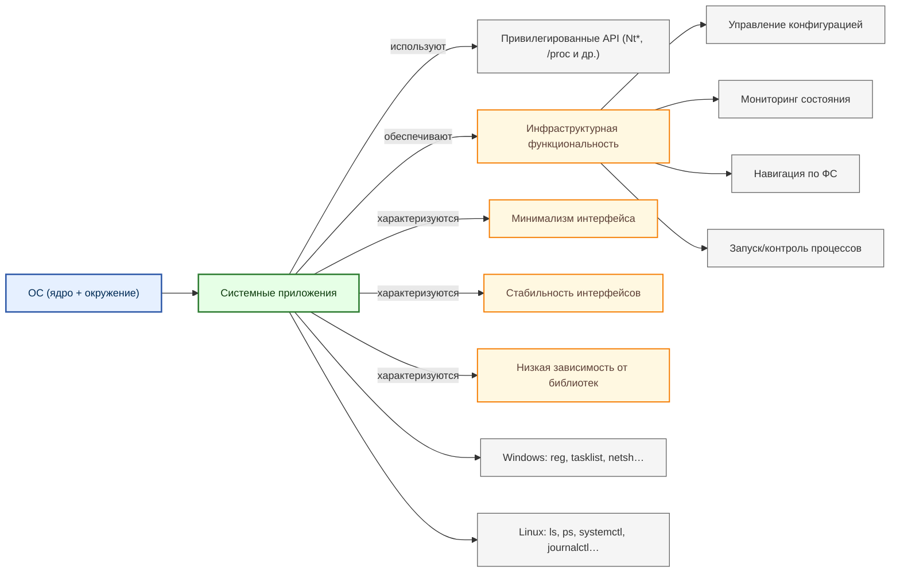

---
title: 1.11. Системные приложения
---

# 1.11. Системные приложения

<div class="article-tags">
  <span class="tag tag-beginner">ДЛЯ НОВИЧКОВ</span>
  <span class="tag tag-notrequired">НЕ ОБЯЗАТЕЛЬНО</span>
  <span class="tag tag-inprogress">В РАЗРАБОТКЕ</span>
</div>
<span class="complexity-badge">Всем</span>

В этой главе мы разберём основные категории программ, которые используются в повседневной работе за компьютером и смартфоном. Рассмотрим офисные приложения, браузеры, медиаплееры, мессенджеры и другие полезные инструменты.

<div class="callout callout--tip">
  <div class="callout-title">Внимание! Легкотня</div>
  Скорее всего, вы уже знакомы со всем, что здесь перечислено, и вряд ли подчеркнёте для себя что-то новое. Но если найдёте новинки – значит, читали не зря!
</div>


## Системные приложения

Системные приложения — это программные компоненты, поставляемые в составе операционной системы или её окружения, предназначенные для обеспечения взаимодействия пользователя с ядром ОС, аппаратными ресурсами и другими программами. В отличие от прикладного ПО (браузеры, офисные пакеты, игры), системные приложения **не решают прямых пользовательских задач**, а обеспечивают *инфраструктурную функциональность*: управление конфигурацией, мониторинг состояния, навигацию по файловой системе, редактирование конфигураций, запуск и контроль процессов.

Их ключевые особенности:

- **Тесная интеграция с ОС** — часто используют привилегированные API ядра (например, `NtQuerySystemInformation` в Windows или `/proc`-файловая система в Linux).
- **Низкая зависимость от сторонних библиотек** — минимизация внешних зависимостей для повышения надёжности и совместимости.
- **Минимализм интерфейса** — простота и предсказуемость ввода-вывода важнее «красивости».
- **Долговечность и стабильность** — интерфейсы таких приложений изменяются медленно, поскольку от них зависит работоспособность всего окружения.

Далее мы разберём наиболее типичные представители системных приложений в экосистемах Windows и Linux, углубляясь в их устройство, взаимодействие с ОС и роль в повседневной эксплуатации.



---

## Как работать с файловыми менеджерами

Прежде чем начать, важно уяснить:  
> **Файловый менеджер — это GUI-обёртка над `C:\` и `/home` и клиент для *пространства имён ОС*, которое включает как физические диски, так и виртуальные сущности: сеть, облако, архивы, устройства, настройки.**

Поэтому эффективное использование требует понимания:
- что *реально* происходит при «копировании»,
- как устроена адресация (пути, URI, CLSID),
- какие действия безопасны, а какие — потенциально разрушительны.

---

## 1. Проводник Windows (File Explorer)

### 1.1. Интерфейс

#### Структура окна

- **Лента (Ribbon)** — динамический интерфейс: вкладки меняются в зависимости от выбранного объекта.  
  → *Новичку:* Не бойтесь экспериментировать: Проводник подскажет, что можно сделать с выделенным файлом.  
  → *Профессионалу:* Отключите ленту (`Вид → Показать → Панель быстрого доступа`), если предпочитаете классическое меню (через `Alt`).

- **Панель навигации (слева)** — содержит:
  - **Быстрый доступ** — *виртуальная* папка, объединяющая часто используемые и недавние объекты (настраивается: `Параметры → Быстрый доступ`);
  - **Этот компьютер** — физические диски, CD/DVD, сетевые места;
  - **Сеть** — обнаруженные устройства (SMB, WS-Discovery);
  - **OneDrive / Облака** — если подключены;
  - **Библиотеки** (устаревшее, но ещё есть) — виртуальные коллекции (`Документы`, `Изображения`), агрегирующие папки из разных мест.

> **Критически важно**: «Быстрый доступ» и «Библиотеки» — это *не* реальные папки в файловой системе. Это *обёртки* (`shell:::{}` CLSID). Копирование *из* них в другое место — всегда копирует *оригинал*, а не «ярлык».

#### Адресная строка

По умолчанию она показывает «человекочитаемый путь»:  
`Этот компьютер > Диск C: > Пользователи > Тимур`.

Но если кликнуть в неё или нажать `Ctrl+L`:
- путь превращается в **реальный**: `C:\Users\Тимур`;
- вы можете вводить:
  - **Полные пути**: `\\server\share`, `C:\Windows\System32\drivers\etc`;
  - **Специальные идентификаторы**:
    - `shell:startup` → папка автозагрузки (`%APPDATA%\Microsoft\Windows\Start Menu\Programs\Startup`);
    - `shell:sendto` → контекстное меню «Отправить»;
    - `::{20D04FE0-3AEA-1069-A2D8-08002B30309D}` → «Этот компьютер» (CLSID);
  - **Команды**: `cmd`, `powershell` — откроют консоль *в текущей папке*.

→ *Совет:* Сохраните часто используемые команды (`shell:fonts`, `shell:cookies`) в «Быстрый доступ» — перетащите их туда.

---

### 1.2. Основные операции

#### Копирование и перемещение  

- **Локально (на одном диске)**:  
  - *Копирование* → `CopyFileExW()` → читает блоками, пишет, устанавливает атрибуты.  
  - *Перемещение* → `MoveFileExW()` → просто *переименовывает* запись в MFT (NTFS), если в пределах тома. Быстро, без копирования данных.  
  → Поэтому перемещение 100 ГБ на одном диске — мгновенно.

- **Между дисками / по сети**:  
  Перемещение = копирование + удаление оригинала.  
  → **Важно**: при отключении питания *во время* перемещения — файл может исчезнуть *полностью*. Для критичных данных — *копируйте, затем удаляйте вручную*.

- **Сетевые шары (SMB)**:  
  Проводник кэширует метаданные (через `Client Side Caching`, CSC), но не содержимое. При медленном канале — отключите «автоматическое восстановление» в свойствах шары.

#### Перетаскивание  

По умолчанию:
- ЛКМ — перемещение (если в пределах тома) или копирование (если между томами);
- ПКМ — выдаёт *меню выбора действия*: «Копировать», «Переместить», «Создать ярлык».

→ *Рекомендация:* Всегда используйте **ПКМ-перетаскивание**, если сомневаетесь. Это исключает ошибку.

#### Поиск  

- Индексируется не всё: только `Библиотеки`, `Пользователи`, и явно добавленные папки.  
- Чтобы искать *везде*: включите «Дополнительные параметры → Искать также и в неиндексируемых местах» (медленно, но точно).  
- Синтаксис:  
  `ext:.log` — только логи,  
  `datemodified:thisweek` — изменено на этой неделе,  
  `size:>100MB` — больше 100 МБ.

---

### 1.3. Безопасность и диагностика

#### «Открыть место расположения файла» 

ПКМ на файле → «Свойства» → «Ярлык» → «Расположение файла» — покажет *реальный* путь, даже если это ярлык или ссылка.

#### Проверка ссылок  

- **Symbolic link** и **Junction** выглядят как обычные папки.  
- Чтобы увидеть — включите:  
  `Вид → Параметры → Вид → Показывать скрытые файлы, папки и диски` + снимите «Скрывать защищённые…».  
- Или через PowerShell:  
  ```powershell
  Get-Item C:\link | Select-Object Mode, LinkType, Target
  ```

#### Восстановление доступа  

Если папка «недоступна»:
1. ПКМ → «Свойства» → «Безопасность» → «Дополнительно»;
2. «Изменить владельца» → поставьте себя;
3. «Заменить владельца во всех дочерних объектах»;
4. Вернитесь в «Безопасность» → «Изменить» → «Добавить» → дайте себе «Полный доступ»;
5. «Заменить все дочерние разрешения».

> **Предупреждение:** Это обход DACL. Делайте только для своих данных.

#### Отладка зависаний  

Если Проводник «подвис»:
- `Ctrl+Shift+Esc` → Диспетчер задач → «Подробности» → найдите `explorer.exe`;
- ПКМ → «Создать дамп памяти» — получите `.dmp`, который можно анализировать в WinDbg.

---

## 2. Файлы (Files, formerly Nautilus) в GNOME

### 2.1. Интерфейс: минимализм с глубиной

GNOME Files следует философии *«меньше — значит больше»*. Нет ленты, нет панелей инструментов — только:
- **Панель инструментов (сверху)** — поиск, меню, кнопки назад/вперёд;
- **Боковая панель (слева)** — «Избранное», «Другие места», «Метки»;
- **Главное окно** — содержимое текущей папки.

#### «Другие места» — вход в пространство имён
  
Это не просто «диски». Здесь:
- **Локальные диски** (`/dev/sda1`);
- **Сетевые ресурсы** (`smb://server/share`, `sftp://user@host`);
- **Архивы** — если открыть `.zip` или `.tar.gz`, они монтируются в GVfs как папка (`/run/user/1000/gvfs/archive:host=...`);
- **MTP-устройства** (телефоны) — через `gvfs-mtp`.

→ *Профессионалу:* Все пути вида `/run/user/1000/gvfs/...` — это FUSE-монтирования. Доступны и из терминала.

#### Адресная строка: `Ctrl+L` — переход в «режим пути»
  
По умолчанию показывает «хлебные крошки»:  
`Домашняя папка > Документы`.

Но `Ctrl+L` даёт:
- `file:///home/timur/Documents` — реальный URI;
- Возможность ввода `sftp://user@server`, `admin:///etc` (для редактирования от root через PolicyKit).

→ *Совет:* `admin://` — безопасная замена `sudo nautilus`, которая устарела из-за проблем с изоляцией.

---

### 2.2. Основные операции

#### Копирование и перемещение  

- Используется **асинхронный API GIO** (`g_file_copy_async()`), а не вызовы `cp`/`mv`.  
- Это даёт:
  - Отмену операции (`Esc`);
  - Прогресс-бар с оценкой времени;
  - Возможность «объединить папки» при конфликте имён.

- При копировании *по сети* (SMB/SFTP):
  - Данные идут через GVfs → `gvfsd-smb`/`gvfsd-sftp` — отдельные процессы;
  - Аутентификация кэшируется в `~/.config/libaccounts-glib/` и `~/.local/share/keyrings/`.

#### Перетаскивание 
 
- ЛКМ между дисками — *перемещение* (не копирование!);
- Чтобы *копировать* — удерживайте `Ctrl`;
- Чтобы *создать ссылку* — удерживайте `Ctrl+Shift`.

→ *Важно:* В отличие от Windows, в Linux «перемещение между дисками = копирование + удаление». Нет «атомарного rename» через разные ФС.

#### Поиск  

- Использует **Tracker** (демон индексации) — индексирует метаданные (не содержимое по умолчанию);
- Чтобы искать *везде* — нажмите `Ctrl+F`, введите запрос, затем внизу — «Поиск во всех местах» (медленно, через `find`).

#### Превью и метаданные 
 
- Превью изображений/видео — через `Totem` (GStreamer);
- Метаданные документов — через `libextractor` и `poppler`;
- Чтобы отключить (например, на слабом ПК):  
  `Настройки → Файлы → Превью файлов → Никогда`.

---

### 2.3. Интеграция с системой

#### Открытие в терминале
  
- `Ctrl+L` → введите путь → `Shift+Enter` — откроет **терминал в текущей папке** (если установлен `nautilus-open-terminal` или `gnome-terminal` с поддержкой D-Bus).  
- Или ПКМ → «Открыть в Терминале» (нужен пакет `gnome-terminal` ≥ 3.32).

#### Работа с архивами
  
- `.zip`, `.tar.gz` — открываются как папки (только просмотр);  
- Чтобы *извлечь* — ПКМ → «Извлечь сюда»;  
- Чтобы *добавить файл* — перетащите в окно архива (GVfs создаёт временный `.tmp`, затем пересобирает архив).

#### Метки (Tags)
  
- ПКМ на файле → «Добавить метку» → введите `#важно`, `#temp`;  
- Метки хранятся в `~/.local/share/gvfs-metadata/` (не в самих файлах!);  
- Поиск по метке: в поиске — `tag:важно`.

→ *Предупреждение:* Метки **не переносятся** при копировании на другой компьютер — это локальная БД.

---

## Краткое сравнение

| Действие | Windows (Проводник) | GNOME (Файлы) |
|---------|----------------------|----------------|
| **Перемещение между дисками** | = копирование + удаление | = копирование + удаление |
| **Создание ссылки** | ПКМ → «Создать → Ярлык» | Перетаскивание с `Ctrl+Shift` |
| **Доступ к системным папкам** | `shell:startup`, `C:\Windows` | `admin:///etc`, `/usr` (если права есть) |
| **Работа с облаком** | OneDrive (интеграция на уровне ядра) | WebDAV/SMB через GVfs (например, Nextcloud) |
| **Безопасное редактирование от root** | Запуск от администратора (опасно!) | `admin://` URI (PolicyKit, изолировано) |
| **Отмена операции** | Трудно (нет глобального undo) | Есть для копирования/перемещения (до закрытия окна) |

---

## Что делать, если «ничего не работает»?

### В Windows:

1. Перезапустите Проводник:  
   Диспетчер задач → `explorer.exe` → «Снять задачу» → «Файл → Выполнить новую задачу» → `explorer.exe`.
2. Сбросьте кэш значков:  
   Удалите `%LOCALAPPDATA%\IconCache.db`, перезапустите Проводник.
3. Проверьте расширения:  
   Запустите `explorer.exe /factory,{CEFF45EE-C862-41DE-AEE2-A022C81EDA92}` — «чистый» режим без расширений.

### В GNOME:

1. Перезапустите Files:  
   `Alt+F2` → `r` → Enter (перезапуск сеанса) или `killall nautilus`.
2. Сбросьте настройки:  
   ```bash
   dconf reset -f /org/gnome/nautilus/
   ```
3. Проверьте GVfs:  
   ```bash
   systemctl --user status gvfs-daemon
   journalctl --user -u gvfs-daemon -f
   ```

---

---

## Углублённо

## 1. Файловые менеджеры

### Windows: Проводник (explorer.exe)

#### Общее описание и роль  

Проводник — это полноценное **графическое shell-окружение**, объединяющее:
- файловый менеджер (просмотр и управление файловой системой),
- рабочий стол (desktop window),
- панель задач (taskbar),
- системный трей (notification area),
- меню «Пуск» (start menu).

Технически это единый процесс — `explorer.exe`, запускаемый при входе пользователя и завершаемый при выходе. Его архитектура основана на **модульной системе оболочек (shell extensions)** и **COM-интерфейсах**, что позволяет сторонним разработчикам расширять его функциональность (например, добавлять контекстное меню, колонки в список файлов, preview-обработчики).

#### Архитектурные слои

1. **User Shell (UI Layer)**  
   Отвечает за отрисовку интерфейса: окно, дерево папок, панель инструментов. Использует Win32 API + DirectComposition (в современных версиях) для рендеринга. Реализован как COM-объект `IShellBrowser`, `IShellView`, `IShellFolder`.

2. **Shell Namespace**  
   Абстрагирует *физические пути* (`C:\Users`) от *логических узлов* (`Компьютер`, `Сеть`, `Библиотеки`).  
   Например, `shell:::{20D04FE0-3AEA-1069-A2D8-08002B30309D}` — это CLSID *Мой компьютер*.  
   Это позволяет:
   - интегрировать нефайловые сущности (панель управления, «Этот компьютер», Bluetooth-устройства),
   - поддерживать виртуальные папки (например, `Recycle Bin` — корзина, которая физически распределена по `$Recycle.bin` на каждом диске),
   - обеспечивать единый API для обхода пространства имён через `IShellFolder::EnumObjects`.

3. **File System Interaction**  
   Для доступа к данным Проводник использует стандартные Win32-вызовы (`CreateFileW`, `FindFirstFileW`), но с учётом:
   - **Reparse Points** (точки повторного разбора) — механизм, лежащий в основе symbolic links, junction points и OneDrive-стилизованных папок;
   - **Offline Files** (CSC — Client Side Caching) — прозрачная синхронизация сетевых ресурсов;
   - **Property System** — метаданные файлов (автор, дата создания, теги) хранятся в NTFS-атрибутах, и в базе `propcache` (через `IPropertyStore`).

4. **Shell Extensions**  
   Механизм динамической загрузки DLL, реализующих интерфейсы:
   - `IContextMenu` — контекстное меню («Открыть», «Отправить»);
   - `IExtractIcon` — иконки файлов;
   - `IThumbnailProvider` — превью изображений/документов;
   - `IExplorerCommand` — кнопки в ленте.  
   Именно из-за расширений возможны замедления Проводника: одна «плохая» DLL может заблокировать UI-поток.

> **Примечание для новичков**: Когда вы «открываете папку», Проводник:
> - опрашивает файловую систему,
> - загружает иконки (возможно — из кэша),
> - запрашивает метаданные (через свойства),
> - вызывает расширения для генерации контекстного меню,
> - сортирует по умолчанию (обычно — по имени),
> - отображает в виде списка/сетки/деталей.  
> Всё это — *одна операция*, но за ней стоит десятки системных вызовов.

#### Безопасность и изоляция 
 
Начиная с Windows Vista, Проводник запускается в **среднем уровне целостности (Medium IL)**, даже если открыт от администратора. Повышенные привилегии требуются только для редактирования защищённых объектов (например, `C:\Windows\System32`). Это реализовано через **UIPI (User Interface Privilege Isolation)** — защиту от *shatter attacks*.

---

### Linux: файловые менеджеры (Nautilus, Dolphin, Thunar, PCManFM)

#### Общая модель
  
В отличие от Windows, в Linux **не существует единого «обязательного» файлового менеджера**. Выбор зависит от графической среды (desktop environment, DE):
- GNOME → **Nautilus** (ныне **Files**),
- KDE Plasma → **Dolphin**,
- XFCE → **Thunar**,
- LXDE/LXQT → **PCManFM**.

Однако все они опираются на общие принципы:

- **Модульность через D-Bus и Freedesktop.org-стандарты**  
  Например, `org.freedesktop.FileManager1` — стандартный D-Bus-интерфейс для вызова «Открыть папку» из любой программы.

- **Поддержка virtual filesystem через GVfs / KIO**  
  - В GNOME: **GVfs** (GNOME Virtual File System) — позволяет работать с `sftp://`, `smb://`, `google-drive://` как с локальными путями (`/run/user/1000/gvfs/sftp:host=server/`).
  - В KDE: **KIO** (KDE Input/Output) — аналогичная система, но интегрированная глубже в библиотеки Qt (`KIO::Job`, `KUrl`).

#### Пример: Nautilus (GNOME Files)

- Написан на C с использованием GTK и GIO (GLib Input/Output).
- Архитектура:
  - **Frontend (UI)** — представление в GTK (вид дерева, сетки, списка).
  - **Model** — `NautilusDirectory`, `NautilusFile`, инкапсулирующие состояние файлов.
  - **Backend** — `GFile` (GLib-абстракция), которая перенаправляет запросы через GVfs к конкретным *backends* (local, sftp, archive и т.д.).
- Поддержка *расширений* через **Nautilus Python Extensions** (`.so` или `.py`), но с меньшей глубиной интеграции, чем в Windows.

#### Пример: Dolphin (KDE)

- Использует Qt и KIO.
- Отличительные черты:
  - Два режима просмотра: *Information Panel* (панель с метаданными) и *Preview* (превью документа/изображения).
  - *Breadcrumb navigation bar* с поиском по мере ввода.
  - Поддержка *semantic search* через Baloo (индексация метаданных).
- Dolphin может работать и как *standalone*, и как *встроенный файловый виджет* в Konsole, Kate и других KDE-приложениях.

> **Для новичка**: Linux-файловые менеджеры — это «надстройка» над консольными утилитами (`ls`, `cp`, `mv`). Но они не вызывают их напрямую — вместо этого используют библиотечные API (`g_file_copy()`, `KIO::copy()`), что обеспечивает атомарность, отмену (`undo`), прогресс-бары и обработку ошибок «из коробки».

---

## 2. Текстовые редакторы

### Windows: Блокнот (notepad.exe)

#### Что это *не* делает 
 
Блокнот — один из самых часто недооцениваемых инструментов. Его сила — в *ограничениях*:
- Поддерживает **только plain text** (никаких стилей, шрифтов, таблиц);
- Использует **ANSI, UTF-8 (без BOM!) или UTF-16 LE** — и распознаёт кодировку автоматически (через алгоритм *encoding detection*, включающий проверку BOM и эвристики для UTF-8/16);
- Сохраняет **только \r\n (CRLF)** в Windows-режиме — но с 2018 года поддерживает Unix-переводы строк (`\n`).

#### Внутреннее устройство
  
- Написан на C++ с использованием Win32 API.
- Ядро — обычный `EDIT` control (из библиотеки `user32.dll`), но с кастомной обработкой:
  - Открытие больших файлов (`>`1 МБ) — загрузка порциями с отключением синтаксиса (в отличие от WordPad);
  - «Умное» сохранение: если в начале файла есть UTF-8 BOM (`EF BB BF`) — сохраняет в UTF-8 *с* BOM; если нет — в ANSI (CP1251 в русской локали) или UTF-8 *без* BOM (начиная с обновления 2018 г.).
- Нет плагинов, нет макросов — только API через `SendMessage` (например, `EM_GETLINE`).

> **Важно**: Блокнот — *не* редактор кода. Но именно его простота делает его идеальным для:
> - редактирования `.bat`, `.ini`, `.txt`, `.log` без «засорения» BOM’ами;
> - проверки, «сломана ли кодировка»;
> - быстрого создания временного файла.

---

### Linux: gedit, Kate, nano, vim (контекст системных задач)

#### gedit (GNOME)
  
- GTK-приложение, построенное на `GtkSourceView` — виджете с поддержкой:
  - подсветки синтаксиса (через `GtkSourceLanguage`),
  - складывания блоков кода (folding),
  - проверки орфографии (через Enchant),
  - плагинов (Python API: `Gedit.Plugin`).  
Примеры системных плагинов: *Draw Spaces* (показ пробелов/табов), *External Tools* (вызов `gcc`, `grep` из редактора).

#### Kate (KDE Advanced Text Editor)
  
- Мощнейший редактор, часто сравниваемый с Sublime Text:
  - Поддержка *проектов* (`.kateproject`),
  - встроенный терминал (через `KonsolePart`),
  - сессии (сохранение открытых вкладок),
  - LSP-поддержка (Language Server Protocol) — для автодополнения в C++, Python и др.  
Kate использует `KTextEditor` — унифицированный API редактирования, который также используется в KDevelop, Okular и других KDE-приложениях.

#### Консольные редакторы: `nano`, `vim`, `emacs`
  
Хотя формально *не* GUI-приложения, они — неотъемлемая часть системного софта Linux.

- **nano** — минималистичный, ориентированный на новичков: `^O` — сохранить, `^X` — выйти. Использует `ncurses` для рендеринга.
- **vim** — модальный редактор, работающий в режимах *normal*, *insert*, *visual*. Его сила — в *комбинаторике команд* (`d2w` = delete 2 words). Встроенный в ядро большинства дистрибутивов (`/usr/bin/vi` часто — symlink на `vim.tiny`).
- **emacs** — *операционная система в операционной системе*. Поддерживает почту, IRC, отладку, сборку проектов — через elisp-расширения.

> **Почему это системные приложения?**  
> Потому что:
> - они доступны даже без GUI (`Ctrl+Alt+F3` → консоль),
> - используются в скриптах (`EDITOR=nano crontab -e`),
> - редактируют конфиги (`/etc/fstab`, `~/.bashrc`), где ошибка = сбой загрузки.

---

## 3. Мониторинг и управление

### Windows: Диспетчер задач (Task Manager)

#### Эволюция 
 
- В Windows XP — простой список процессов (`taskmgr.exe`).
- В Windows 8+ — полностью переписан: отдельный процесс (`Taskmgr.exe`), модульный интерфейс («Процессы», «Производительность», «Запуск», и т.д.).

#### Как он получает данные?


1. **Процессы и потоки**  
   Через `NtQuerySystemInformation(SystemProcessInformation)` — вызов ядра NT, возвращающий структуру `SYSTEM_PROCESS_INFORMATION` со всеми полями: PID, имя образа, время CPU, handle count, working set size и др.

2. **Использование ресурсов**  
   - CPU: `NtQueryPerformanceCounter` + `KeQueryPerformanceCounter` (внутри ядра);  
   - Память: `GlobalMemoryStatusEx()` → физическая/виртуальная память; Working Set процесса — через `GetProcessMemoryInfo()`;
   - Диск/Сеть: через **ETW (Event Tracing for Windows)** и **PDH (Performance Data Helper)** — интерфейсы, собирающие данные от драйверов (стек TCP/IP, драйвер диска).

3. **Запуск приложений**  
   При клике «Запустить новую задачу» — вызов `CreateProcessW()` с проверкой политики (`AppLocker`, `WDAC`), если включена.

4. **Отладка «зависших» процессов**  
   При нажатии «Снять задачу» → `TerminateProcess()`. Если не работает — попытка через `NtTerminateProcess` с повышенными привилегиями.

#### Особенности безопасности  

- Запускается с **высоким уровнем целостности (High IL)**, если вызван из админ-контекста.
- Не показывает процессы других пользователей (по умолчанию), если не включить «Показать процессы от всех пользователей» (требует UAC-повышения).

---

### Linux: System Monitor (GNOME), KSysGuard (KDE), `htop`, `top`

#### Общая модель: `/proc` и `/sys` как API 
 
В Linux мониторинг строится на **виртуальных файловых системах**:

- `/proc/[pid]/` — каталог для каждого процесса:
  - `status` — базовая инфа (состояние, UID, память),
  - `stat` — детали (время CPU в user/kernel, приоритет),
  - `fd/` — открытые дескрипторы,
  - `maps` — отображённая память (библиотеки, стек, heap).

- `/proc/stat` — суммарная статистика CPU, диска, прерываний.  
  Например, строка `cpu  12345 123 4567 987654` — время в *user*, *nice*, *system*, *idle* тактах.

- `/sys/class/thermal/` — температура CPU/GPU.

#### Пример: `htop`

- Консольное приложение, использует `ncurses`.
- Алгоритм работы:
  1. Читает `/proc/loadavg` → загрузка системы (1/5/15 мин).
  2. Парсит `/proc/meminfo` → RAM/Swap.
  3. Для каждого PID из `/proc/` → извлекает `stat`, `status`, `cmdline`.
  4. Сортирует по CPU% = `(utime_delta + stime_delta) / elapsed_time`.
- Особенности:
  - Поддержка *дерева процессов* (`pstree`-подобно),
  - Возможность убить процесс прямо из интерфейса (`kill -TERM`),
  - Фильтрация по имени.

#### GUI-мониторы: GNOME System Monitor
  
- Использует `GTop` (GLib-обёртку над `/proc`), предоставляет:
  - графики CPU/RAM/Network в реальном времени,
  - список процессов с цветовой индикацией нагрузки,
  - информацию о дисках и ресурсах (через `udisks2`).

---

## 4. Настройка системы

### Windows

#### Панель управления (`control.exe`)
  
- Унаследована от Windows 95.  
- Представляет собой **фасад над апплетами (`.cpl`-файлами)** — COM-компонентами с интерфейсом `CPlApplet`.  
  Например, `desk.cpl` — настройки экрана, `sysdm.cpl` — свойства системы.  
- Апплеты загружаются динамически при открытии соответствующего раздела.

#### «Параметры» (`SystemSettings.exe`)
  
- Современный UWP-интерфейс (начиная с Windows 8).  
- Построен на XAML и WinRT.  
- Использует те же подсистемы, что и Панель управления, но через:
  - Windows Runtime API (`Windows.System`, `Windows.UI.Settings`),
  - PowerShell-конфигурационные модули (например, `Get-NetFirewallRule` для брандмауэра),
  - CSP (Configuration Service Providers) — механизм настройки через MDM (Mobile Device Management).

#### Почему два интерфейса?
  
Microsoft постепенно мигрирует функционал в «Параметры», но не все апплеты переведены (например, «Программы и компоненты» до сих пор в Панели). Это связано с:
- Требованиями к совместимости (старые `.cpl` работают везде),
- Разницей в API: Win32 vs WinRT.

---

### Linux: Settings (GNOME), System Settings (KDE)

#### GNOME Settings 
 
- Написан на C с использованием GTK.
- Каждый модуль — отдельный `lib`, загружаемый по demand:
  - `network-manager` — через D-Bus (`org.freedesktop.NetworkManager`),
  - `gnome-shell` — через `org.gnome.Shell.Extensions`,
  - `dconf` — хранилище настроек (`/org/gnome/desktop/...`).

#### KDE System Settings 
 
- Построен на KConfig (иерархия `.kcfg`-файлов + `kconfig_compiler`), что позволяет:
  - генерировать UI автоматически из XML-описания параметров,
  - поддерживать *профили* настроек,
  - валидировать ввод (min/max, регулярки).

#### Общее: `dconf` vs `gsettings` vs `kconfig`
  
| Система       | Назначение                      | Пример команды                     |
|---------------|----------------------------------|-------------------------------------|
| `dconf`       | Низкоуровневое хранилище (бинарное) | `dconf dump /org/gnome/`           |
| `gsettings`   | CLI для `dconf` с человекочитаемыми именами | `gsettings get org.gnome.desktop.interface gtk-theme` |
| `kwriteconfig5` | Запись в `~/.config/` в формате INI/JSON | `kwriteconfig5 --file kwinrc --group Windows --key BorderlessMaximizedWindows true` |

---